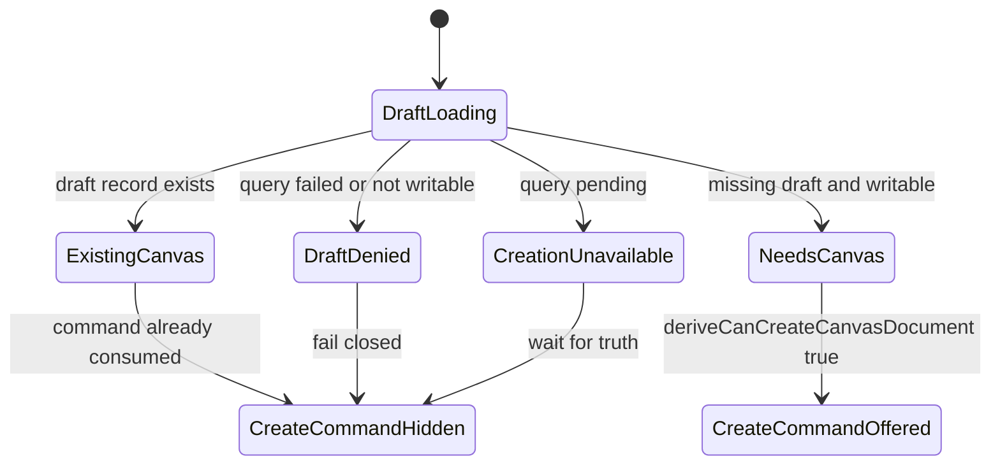
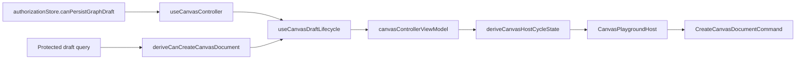

# Canvas First Canvas Creation Capability Component

## Owned Concern

This component owns the local policy that decides whether the Canvas route may
expose the first Canvas document creation command for the active workspace.

It also owns the semantic rule that draft persistence authority and graph edit
authority are separate capabilities. It does not own graph node or edge
mutation, template rendering, protected draft transport, command execution, or
shell navigation.

## Public API

| API                                           | Kind             | Responsibility                                                                             |
| --------------------------------------------- | ---------------- | ------------------------------------------------------------------------------------------ |
| `CanvasCreateCanvasDocumentAvailabilityInput` | parameter object | Carries protected draft read posture and write posture into the policy.                    |
| `deriveCanCreateCanvasDocument(input)`        | policy function  | Returns whether `CreateCanvasDocumentCommand` may be offered for a missing draft document. |
| `UserPermissions.canPersistGraphDraft`        | capability       | Carries server-projected draft persistence authority from session startup into Canvas.     |

## Invariants

- Availability follows protected draft persistence eligibility.
- Availability requires a missing authoritative draft record.
- Availability closes while draft truth is loading or failed.
- Availability closes when the workspace cannot persist graph draft changes.
- Availability must not inspect `canEditEdges`; graph/node/edge mutation begins
  only after a typed Canvas document exists.
- Protected route session projection must map `workspace:graph-draft:save` to
  `canPersistGraphDraft`; explicit `canEditEdges: false` must not remove draft
  persistence authority when the draft-save scope is granted.
- `useCanvasController` must pass `canPersistGraphDraft` into the authoring
  runtime. Passing `canEditEdges` as draft persistence transport is drift.
- The policy must remain pure and side-effect free.

## Transitions

## Component Flow

## Consumers

- `protectedRouteSessionContext.ts`
- `authorizationStore.ts`
- `useCanvasController.ts`
- `useCanvasAuthoringRuntime.ts`
- `useCanvasDraftLifecycle.ts`
- `canvasControllerViewModel.ts`
- `canvasRouteViewState.ts`
- `canvasShellPropsBuilder.tsx`
- `canvasShellLayoutBuilder.tsx`
- `canvasCenterSurfaceWorkbench.tsx`
- `canvasHostCycleState.ts`
- `CanvasPlaygroundHost.tsx`

## Drift To Prevent

- Reintroducing `canEditEdges` into first-canvas document creation
  availability.
- Reintroducing `canEditEdges` as the authoring-runtime draft persistence
  transport handoff.
- Copying protected draft query conditionals into route builders.
- Treating browser e2e proof as a replacement for local policy tests.
- Creating a second first-canvas command rail outside
  `CreateCanvasDocumentCommand`.

## Semantic Fitness Function

- Unit tests must prove that `workspace:graph-draft:save` projects to
  `canPersistGraphDraft` even when explicit graph edit permission is denied.
- Controller tests must prove that first-canvas creation can be available while
  graph handlers remain closed.
- Architecture tests must prove that the authoring runtime accepts
  `canPersistGraphDraftTransport` and that `useCanvasController` does not pass
  `canEditEdges` into the draft persistence seam.
