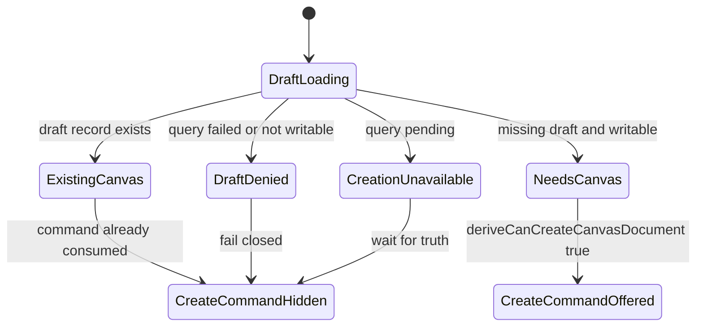

# Canvas First Canvas Creation Capability Component

## Owned Concern

This component owns the local policy that decides whether the Canvas route may
expose the first Canvas document creation command for the active workspace.

It does not own graph node or edge mutation, template rendering, protected draft
transport, command execution, or shell navigation.

## Public API

| API                                           | Kind             | Responsibility                                                                             |
| --------------------------------------------- | ---------------- | ------------------------------------------------------------------------------------------ |
| `CanvasCreateCanvasDocumentAvailabilityInput` | parameter object | Carries protected draft read posture and write posture into the policy.                    |
| `deriveCanCreateCanvasDocument(input)`        | policy function  | Returns whether `CreateCanvasDocumentCommand` may be offered for a missing draft document. |

## Invariants

- Availability follows protected draft persistence eligibility.
- Availability requires a missing authoritative draft record.
- Availability closes while draft truth is loading or failed.
- Availability closes when the workspace cannot persist graph draft changes.
- Availability must not inspect `canEditEdges`; graph/node/edge mutation begins
  only after a typed Canvas document exists.
- The policy must remain pure and side-effect free.

## Transitions

## Component Flow

```mermaid
flowchart LR
  Query["Protected draft query"]
  Policy["deriveCanCreateCanvasDocument"]
  Lifecycle["useCanvasDraftLifecycle"]
  Controller["canvasControllerViewModel"]
  HostCycle["deriveCanvasHostCycleState"]
  Host["CanvasPlaygroundHost"]
  Command["CreateCanvasDocumentCommand"]

  Query --> Policy
  Policy --> Lifecycle
  Lifecycle --> Controller
  Controller --> HostCycle
  HostCycle --> Host
  Host --> Command
```

## Consumers

- `useCanvasDraftLifecycle.ts`
- `canvasControllerViewModel.ts`
- `canvasRouteViewState.ts`
- `canvasShellPropsBuilder.tsx`
- `canvasShellLayoutBuilder.tsx`
- `canvasCenterSurfaceWorkbench.tsx`
- `canvasHostCycleState.ts`
- `CanvasPlaygroundHost.tsx`

## Drift To Prevent

- Reintroducing `canEditEdges` into first-canvas document creation
  availability.
- Copying protected draft query conditionals into route builders.
- Treating browser e2e proof as a replacement for local policy tests.
- Creating a second first-canvas command rail outside
  `CreateCanvasDocumentCommand`.
