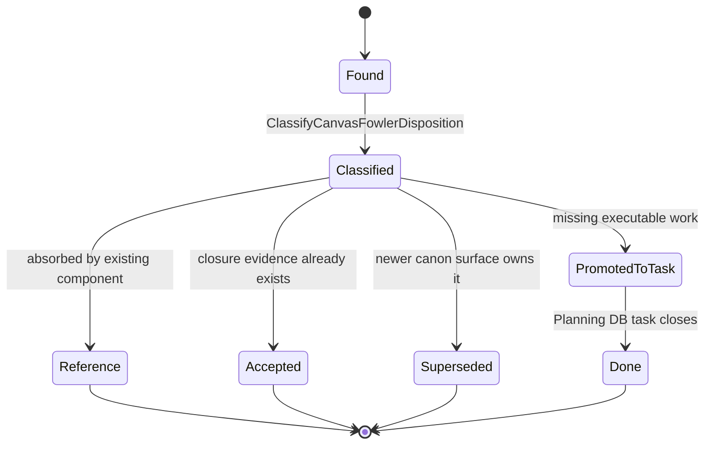
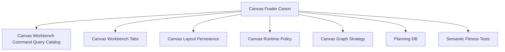

# Canvas Fowler Canon Component

> Owned concern: the Canvas Fowler canon component owns the disposition of
> Canvas Fowler proposals and reviews into explicit component ownership,
> Planning DB tasks, or reference evidence.

## Public API

- `RecordCanvasFowlerCanon(input)`: records a Canvas Fowler input as `closed`,
  `reference`, `accepted`, `superseded`, or `promoted-to-task`.
- `ClassifyCanvasFowlerDisposition(input)`: returns the canonical owner,
  affected component guide, proof expectation, and whether Planning DB work is
  required.
- `VerifyCanvasWorkbenchVisualPosture(input)`: test-only query for rendered
  Canvas workbench tab placement, readability, and route locality.

## Invariants

- A Canvas Fowler review or proposal must not become an execution queue unless
  Planning DB owns the task.
- Runtime Canvas behavior remains owned by the existing Canvas component guide
  family, not by this canon component.
- Shell navigation and Canvas-local workbench tabs remain separate read models.
- Browser visual proof remains a semantic fitness query, not product authority.
- Docs, user stories, review status, component guide links, and architecture
  tests must name the same owner and rail.

## Transitions

## Consumers

- Canvas maintainers use this component to decide whether a Fowler finding is
  already owned by TF-E2/F-15-era component work or needs a new task.
- Frontend maintainers use it to keep shell navigation, Canvas tabs, layout
  projection, and visual proof separated.
- Planning stewards use it to prevent mandatory proposals from becoming orphan
  queues.
- Browser proof reviewers use it to route Cypress claims through
  `VerifyCanvasWorkbenchVisualPosture`.

## Command And Query Rail

| Rail                                 | Type    | Owner                                 | Surface                                              |
| ------------------------------------ | ------- | ------------------------------------- | ---------------------------------------------------- |
| `RecordCanvasFowlerCanon`            | command | Canvas Fowler canon aggregate         | Planning DB task closure and review-board updates    |
| `ClassifyCanvasFowlerDisposition`    | query   | Canvas Fowler disposition read model  | Component guide, plan, and review status board       |
| `VerifyCanvasWorkbenchVisualPosture` | query   | Canvas workbench visual-posture model | Cypress/browser geometry and label-readability proof |

## Semantic Fitness Function

`tools/ci/canvas-fowler-canon.test.mjs` validates that the plan, component
guide, user stories, review-board disposition, graph index, and canonical
Fowler mechanization tokens exist together and use the same semantic rails.

It intentionally checks semantic ownership, not only barrel thinness or link
presence.

## Component Grouping

## Related Docs

- [Canvas Fowler Canon User Stories](./canvas-fowler-canon-user-stories.md)
- [Canvas Workbench Command Query Catalog](./canvas-workbench-command-query-catalog.md)
- [Canvas Workbench Tabs Component](./canvas-workbench-tabs-component.md)
- [Canvas Layout Persistence Component](./canvas-layout-persistence-component.md)
- [Canvas Fowler Canon Plan 2026-05-23](../../../../planning/proposals/mandatory/frontend-and-ux/canvas-fowler-canon-plan-20260523.md)
- [Canvas Fowler Canon Mailbox Analysis](../../../../../buzon/20260523-codex-fowler-canvas-workbench-canon.md)
