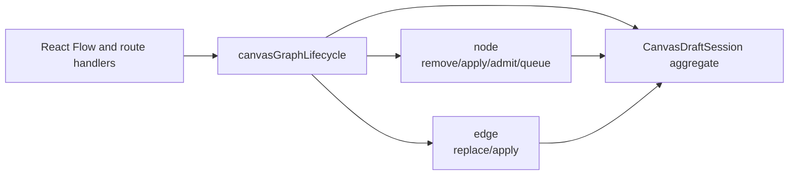
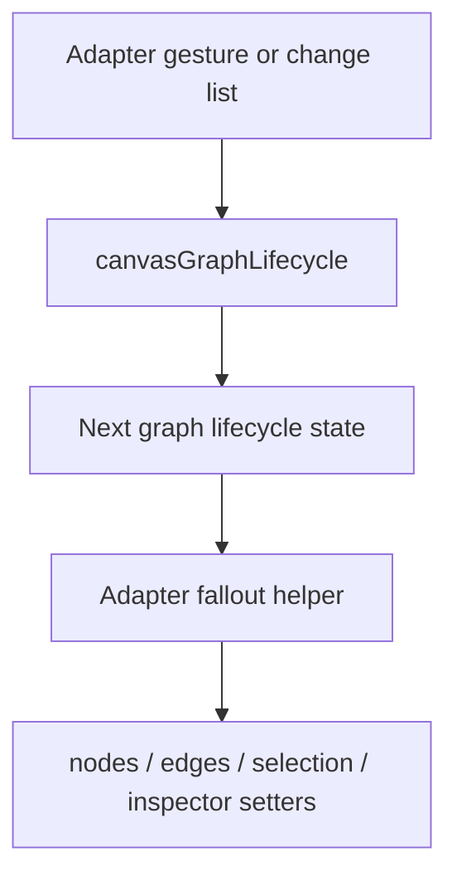
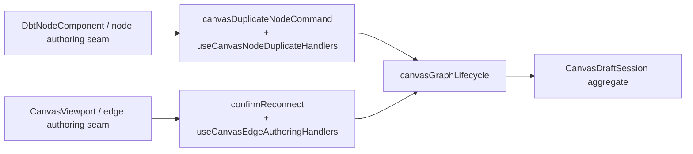
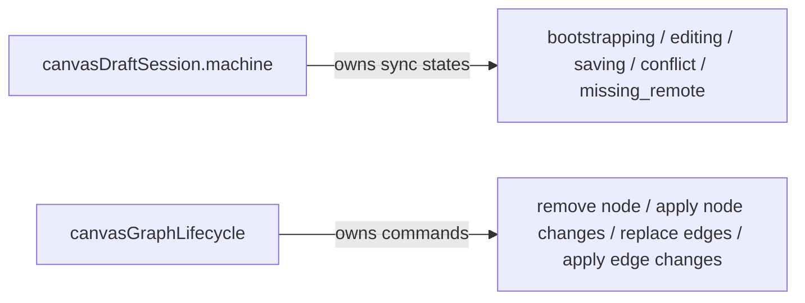

# Canvas Graph Lifecycle Component

## Purpose

Define the local component model for graph lifecycle semantics in the Canvas
route.

This page is intentionally narrower than the broader Canvas and Graph
architecture pack. It explains:

- what `canvasGraphLifecycle` is
- which files make up the component
- which API is public to other Canvas seams
- which invariants the component owns
- how the component relates to the draft aggregate and the React Flow adapters

## Governing Sources

- [Graph Frontend Architecture](./graph-frontend-architecture.md)
- [Canvas Controller Current To Target Architecture](./canvas-controller-current-to-target-architecture.md)
- [Canvas Draft Session Component](./canvas-draft-session-component.md)
- [Graph Sequences And State Machines](./graph-sequences-and-state-machines.md)
- [TF-E2 production node authoring and persistence plan](../../../../planning/proposals/mandatory/frontend-and-ux/tf-e2-production-node-authoring-and-persistence-plan-20260416.md)

## Component Reading Rule

Read the component in this order:

1. `canvasGraphLifecycle.ts`
   the public namespaced API entrypoint
2. `canvasGraphLifecycle.types.ts`
   graph lifecycle vocabulary and mutation-state shape
3. `canvasGraphLifecycle.node.ts`
   node mutation semantics
4. `canvasGraphLifecycle.edge.ts`
   edge mutation semantics
5. the fallout helper used by adapter seams
   UI-state application from already-computed semantic results

If a change does not fit one of those concerns, it probably belongs in another
Canvas seam instead of this component.

## Why This Component Exists

`canvasGraphLifecycle` is the semantic command surface for graph mutation inside
the Canvas bounded frontend authoring context.

It is the local truth for:

- node removal fallout
- node change application when graph mutation is semantic rather than purely
  visual
- visible-edge replacement from canonical edge truth
- edge change application into the draft working set
- explicit-node admission and import queueing

Adjacent command seams, not this component, own:

- duplicate-node identity generation through
  `canvasDuplicateNodeCommand.ts` and `useCanvasNodeDuplicateHandlers.ts`
- reconnect-edge validation over an existing edge identity through
  `confirmReconnect(...)` in `canvasConnectionAggregate.ts` and
  `useCanvasEdgeAuthoringHandlers.ts`

It is not responsible for:

- draft sync-state transitions
- repository or transport calls
- route bootstrapping
- shell publication
- React Flow event timing quirks
- duplicate-node naming or placement policy
- reconnect-edge proposal validation

## Public API

The public entrypoint is `canvasGraphLifecycle`.

It is a namespaced API, not a flat helper set. The component is read through
two explicit sub-surfaces:

- `canvasGraphLifecycle.node`
  node lifecycle semantics, including apply-change and remove behavior
- `canvasGraphLifecycle.edge`
  edge lifecycle semantics, including replace and apply-change behavior

This is a hard-cut shape. New call sites must use the namespaced API instead of
reintroducing flat helper imports.

## File Responsibilities

<!-- markdownlint-disable MD060 -->

| File                            | Owned concern                                       | Public to other modules |
| ------------------------------- | --------------------------------------------------- | ----------------------- |
| `canvasGraphLifecycle.ts`       | component entrypoint and namespaced API export      | yes                     |
| `canvasGraphLifecycle.types.ts` | mutation-state and lifecycle result vocabulary      | yes                     |
| `canvasGraphLifecycle.node.ts`  | node lifecycle semantics and node-change ownership  | node API only           |
| `canvasGraphLifecycle.edge.ts`  | edge lifecycle semantics and visible-edge ownership | edge API only           |

<!-- markdownlint-enable MD060 -->

## Topology

## Command Model

## Adjacent Command Topology

## Relationship To State Machines

Rule:

- sync lifecycle remains in `canvasDraftSession.machine`
- topology mutation remains in `canvasGraphLifecycle`
- do not collapse both concerns into one monolithic state machine

## Invariants

- `CanvasDraftSession` remains the authoritative route-local draft aggregate.
- `canvasGraphLifecycle` owns graph mutation semantics, not transport.
- React Flow nodes and edges remain projections or command inputs, not the
  source of semantic truth by themselves.
- node and edge adapters may translate events into lifecycle commands, but they
  must not recreate graph lifecycle policy independently.
- no flat compatibility surface should remain once the component exists.

## Consumers

- `useCanvasNodeChangeHandlers.ts`
- `useCanvasNodeRemovalHandlers.ts`
- `useCanvasNodeDropHandlers.ts`
- `useCanvasNodeDuplicateHandlers.ts`
- `useCanvasEdgeChangeHandlers.ts`
- `useCanvasEdgeAuthoringHandlers.ts`
- `useCanvasSourceImportHandlers.ts`

## Drift To Watch

- if selection or inspect semantics become shared domain commands, promote them
  into an adjacent lifecycle or route-command component instead of inflating the
  graph adapters
- if duplicate or reconnect policy gets pushed down into `DbtNodeComponent.tsx`
  or `CanvasViewport.tsx`, the passive-adapter boundary has regressed
- if sync-state transitions start appearing here, they belong back in
  `canvasDraftSession.machine`
- if flat helper exports reappear, the hard cut has regressed
