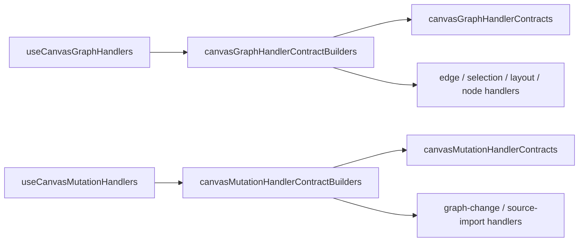
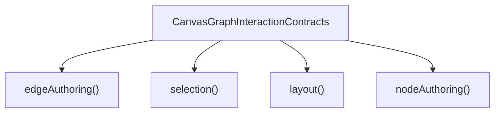
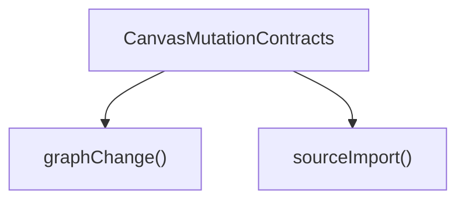

# Canvas Handler Contracts Component

## Purpose

Define the local component model for handler contracts and contract builders in
the Canvas route.

This page is intentionally narrower than the broader controller and graph
architecture pack. It explains:

- what the handler-contract component is
- which APIs are public
- which invariants it owns
- how broad route interaction seams are transformed into smaller handler seams
- which facades and handlers consume the component

## Governing sources

- [Canvas Controller Current To Target Architecture](./canvas-controller-current-to-target-architecture.md)
- [Canvas Component Map And Modernization Review](./canvas-component-map-and-modernization-review.md)
- [Canvas Graph Lifecycle Component](./canvas-graph-lifecycle-component.md)
- [TF-E2 Canvas Target Architecture Execution Plan 2026-04-17](../../../../planning/proposals/mandatory/frontend-and-ux/tf-e2-canvas-target-architecture-execution-plan-20260417.md)

## Component reading rule

Read the component in this order:

1. `canvasGraphHandlerContracts.ts`
   graph interaction vocabulary for handler seams
2. `canvasGraphHandlerContractBuilders.ts`
   graph contract-builder API
3. `canvasMutationHandlerContracts.ts`
   mutation vocabulary for handler seams
4. `canvasMutationHandlerContractBuilders.ts`
   mutation contract-builder API
5. `useCanvasGraphHandlers.ts` and `useCanvasMutationHandlers.ts`
   composition facades that consume the component

If a change does not fit one of those concerns, it probably belongs in the
controller, in `canvasGraphLifecycle`, or in a specific handler instead.

## Why this component exists

The Canvas route now uses grouped `state`, `effects`, and `policy` contracts to
avoid parent-shaped `Pick<>` inheritance across handler seams.

That creates a real local component:

- contracts define the semantic vocabulary for adapter seams
- builders map broad route interaction seams into smaller sub-handler contracts
- facades consume the namespaced API instead of rebuilding contract shapes
  inline

This component keeps adapter composition explicit without turning handlers into
another domain layer.

## Public API

The public component APIs are:

- `canvasGraphHandlerContractBuilders.edgeAuthoring(...)`
- `canvasGraphHandlerContractBuilders.selection(...)`
- `canvasGraphHandlerContractBuilders.layout(...)`
- `canvasGraphHandlerContractBuilders.nodeAuthoring(...)`
- `canvasMutationHandlerContractBuilders.graphChange(...)`
- `canvasMutationHandlerContractBuilders.sourceImport(...)`

The public contract vocabularies are:

- `CanvasGraphInteractionContracts`
- `CanvasEdgeAuthoringContracts`
- `CanvasSelectionContracts`
- `CanvasLayoutContracts`
- `CanvasNodeAuthoringContracts`
- `CanvasMutationContracts`
- `CanvasGraphChangeContracts`
- `CanvasSourceImportContracts`

## File responsibilities

<!-- markdownlint-disable MD060 -->

| File                                       | Owned concern                                                 | Public to other modules |
| ------------------------------------------ | ------------------------------------------------------------- | ----------------------- |
| `canvasGraphHandlerContracts.ts`           | semantic graph-interaction contract vocabulary                | yes                     |
| `canvasGraphHandlerContractBuilders.ts`    | namespaced mapping from broad graph seams to sub-contracts    | yes                     |
| `canvasMutationHandlerContracts.ts`        | semantic mutation contract vocabulary                         | yes                     |
| `canvasMutationHandlerContractBuilders.ts` | namespaced mapping from broad mutation seams to sub-contracts | yes                     |
| `useCanvasGraphHandlers.ts`                | graph facade that consumes graph contract builders            | consumer only           |
| `useCanvasMutationHandlers.ts`             | mutation facade that consumes mutation contract builders      | consumer only           |

<!-- markdownlint-enable MD060 -->

## Topology

## Contract transitions

This component does not own a domain state machine. Its transitions are
contract-shaping transitions.

### Graph transition model

### Mutation transition model

## Invariants

- Contracts use local semantic groupings: `state`, `effects`, and `policy`.
- Builders only map contracts. They do not own React hook state, toast policy,
  graph lifecycle semantics, or persistence logic.
- Handler facades consume namespaced builder APIs instead of rebuilding
  sub-contracts ad hoc.
- Parent-shaped `Pick<>` inheritance is not an accepted contract strategy for
  this slice.
- Graph semantics remain in `canvasGraphLifecycle`, not in this component.

## Consumers

- `useCanvasGraphHandlers.ts`
- `useCanvasMutationHandlers.ts`

Indirect consumers through those facades:

- `useCanvasEdgeAuthoringHandlers.ts`
- `useCanvasSelectionHandlers.ts`
- `useCanvasLayoutHandlers.ts`
- `useCanvasNodeAuthoringHandlers.ts`
- `useCanvasGraphChangeHandlers.ts`
- `useCanvasSourceImportHandlers.ts`

## Fitness functions

The canonical fitness checks for this component are:

- `canvasHandlerContracts.architecture.test.ts`
- `useCanvasGraphHandlers.architecture.test.ts`
- `useCanvasMutationHandlers.architecture.test.ts`

Those tests must keep proving:

- the builder APIs stay namespaced
- facades consume those namespaced APIs
- builders do not absorb hooks, toast, or graph lifecycle ownership

## Drift to watch

- if selection or inspect semantics become domain commands, they belong in an
  adjacent route-command component, not in the contract builders
- if builders begin importing lifecycle or persistence code, the component has
  absorbed the wrong concern
- if broad parent param bags return, the semantic contract hardening has
  regressed
