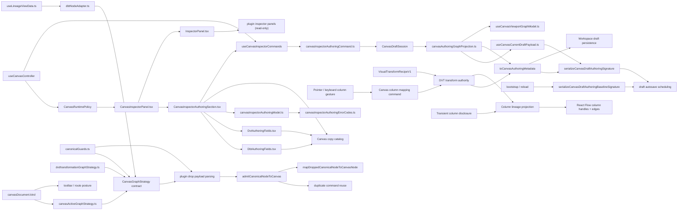
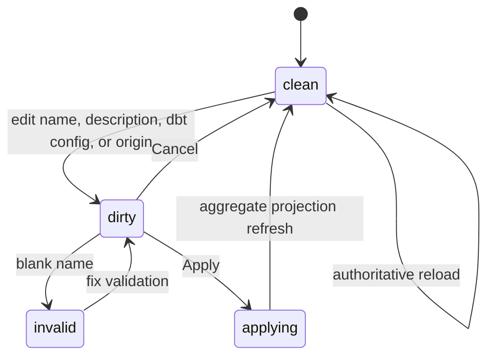
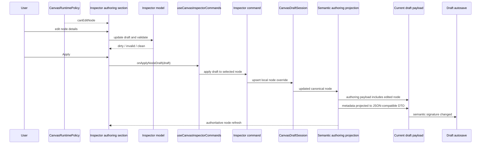

# Canvas Inspector Authoring Component

## Purpose

This document defines the route-owned Inspector authoring component for Canvas.

Use it for:

- governed node-detail editing in the Inspector
- governed dbt card configuration and model-origin selection
- recipe-backed column mapping and derived lineage projection on Canvas cards
- the local Inspector DTO, validation, dirty state, and apply/cancel posture
- the command seam that writes edited node details back into the draft
  aggregate

Do not use this page as the full `TF-E2` roadmap or as the generic plugin
inspector contract.

## Governing Sources

- [TF-E2 production node authoring and persistence plan 2026-04-16](../../../../planning/proposals/mandatory/frontend-and-ux/tf-e2-production-node-authoring-and-persistence-plan-20260416.md)
- [TF-E2 Canvas target architecture execution plan 2026-04-17](../../../../planning/proposals/mandatory/frontend-and-ux/tf-e2-canvas-target-architecture-execution-plan-20260417.md)
- [TF-E2 Inspector authoring and lifecycle closure plan 2026-04-25](../../../../planning/proposals/mandatory/frontend-and-ux/tf-e2-inspector-authoring-and-lifecycle-closure-plan-20260425.md)
- [Graph Canvas Runtime Model](./graph-canvas-runtime-model.md)
- [Canvas Controller Current To Target Architecture](./canvas-controller-current-to-target-architecture.md)
- [Canvas Component Map And Modernization Review](./canvas-component-map-and-modernization-review.md)

## Fowler Reading

| Fowler concept      | Owner in this slice                  | Why                                                                             |
| ------------------- | ------------------------------------ | ------------------------------------------------------------------------------- |
| DTO                 | `CanvasInspectorNodeDraft`           | one semantic editing contract for route-owned node details                      |
| Value Object        | `DbtNodeAuthoringMetadata`           | normalized dbt package, source, table, materialization, and origin state        |
| Value Object        | `DvtNodeAuthoringMetadata`           | normalized source, SQL transform, and sink config for DVT transformation nodes  |
| Value Object        | `VisualTransformRecipeV1`            | versioned visual output, input, operation, and filter intent                    |
| Policy Object       | `DvtTransformAuthoringAuthority`     | admits exactly one SQL or visual recipe authority per transform                 |
| Projection          | `CanvasColumnLineage`                | derives visible column handles and edges from recipe and dependency truth       |
| Application command | `CanvasColumnMapping`                | updates recipe inputs through the existing Graph Draft aggregate                |
| Policy Object       | `DbtSourceRelationshipSelection`     | dbt model origins must come from the visible connected dbt graph                |
| Policy Object       | `DbtTestTargetSelection`             | dbt test targets and columns must come from the visible connected model graph   |
| Projection          | `dbtTestRowsReadModel`               | reads canonical authored test metadata and legacy imported metadata for display |
| Domain policy       | `canvasInspectorAuthoringModel.ts`   | validation and normalization are explicit and pure                              |
| Presentation policy | Canvas i18n copy catalog             | visible labels and validation messages are resolved at render time              |
| Application command | `canvasInspectorAuthoringCommand.ts` | maps validated Inspector edits into aggregate mutation                          |
| Application seam    | `useCanvasInspectorCommands.ts`      | exposes one route-safe callback instead of leaking aggregate mutation up        |
| Runtime policy      | `CanvasRuntimePolicy`                | decides whether Inspector authoring is available for the active canvas          |
| Passive view        | `InspectorPanel.tsx`                 | still owns passive node details and plugin read-only panels                     |
| Route-owned view    | `CanvasInspectorPanel.tsx`           | composes the passive view with governed authoring UI                            |

The critical rule is that the generic `InspectorPanel` remains passive. The
write surface lives one level up in the route-owned wrapper.

## Public API

| API                                              | Responsibility                                                             |
| ------------------------------------------------ | -------------------------------------------------------------------------- |
| `CanvasInspectorNodeDraft`                       | semantic editing DTO for governed node details                             |
| `DbtNodeAuthoringMetadata`                       | route-owned dbt card configuration value object                            |
| `DvtNodeAuthoringMetadata`                       | route-owned DVT source, SQL transform, and sink configuration value object |
| `VisualTransformRecipeV1`                        | strict visual transformation recipe persisted as node metadata             |
| `DvtTransformAuthoringAuthority`                 | explicit and exclusive SQL-or-visual transform-authority policy            |
| `readDvtTransformAuthoringAuthority`             | fail-closed projection of current DVT transform authority                  |
| `applyDvtVisualTransformRecipe`                  | persist a validated visual recipe while removing editable SQL authority    |
| `convertDvtVisualTransformToSql`                 | atomically replace visual authority with nonblank generated SQL            |
| `DbtSourceRelationshipSelection`                 | policy result for selected dbt model origin                                |
| `CanvasInspectorAuthoringContract`               | route-owned contract: can edit and apply                                   |
| `createCanvasInspectorNodeDraft`                 | project a selected canonical node into the Inspector draft                 |
| `validateCanvasInspectorNodeDraft`               | validate the current Inspector draft                                       |
| `CanvasInspectorNodeDraftErrorCode`              | locale-neutral validation result code for Inspector authoring errors       |
| `formatCanvasInspectorNodeDraftError`            | resolve an Inspector validation code through Canvas copy                   |
| `applyCanvasInspectorNodeDraft`                  | normalize and project the edited fields back into a canonical node         |
| `applyCanvasInspectorNodeDraftToSession`         | write the edited node back into `CanvasDraftSession` via `upsertNode`      |
| `useCanvasInspectorCommands`                     | route-safe callback bridge from UI to aggregate                            |
| `CanvasInspectorPanel`                           | route-owned composition of passive Inspector plus authoring section        |
| `DbtAuthoringFields`                             | dbt plugin authoring controls and generated model SQL preview              |
| `DvtAuthoringFields`                             | DVT plugin authoring controls for sources, transforms, and sinks           |
| `MonacoCodeEditor`                               | shared lazy SQL editor used by the focused dbt and DVT authoring leaves    |
| `serializeCanvasDraftAuthoringSignature`         | semantic dirty-check signature for persisted authoring payloads            |
| `serializeCanvasDraftAuthoringBaselineSignature` | remote-draft baseline signature policy used by bootstrap and reload        |
| `toCanvasAuthoringMetadata`                      | JSON-compatible metadata DTO boundary for signatures and persistence       |
| `CanvasGraphStrategy`                            | plugin-neutral graph strategy contract used by Canvas application code     |
| `CanvasGraphAuthoringMode`                       | route-facing authoring kind resolved from the active canvas document       |
| `useLineageViewData`                             | Lineage read model over the DBT workspace snapshot                         |

## Invariants

- The writable surface is the route-owned Inspector only.
- Inspector editability is owned by `CanvasRuntimePolicy.commands`; it must
  not be derived directly from draft transport mutability or raw user
  permissions.
- Plugin-owned inspector panels remain read-only in this slice.
- Inspector authoring labels, helper text, option labels, placeholders, and
  validation messages must resolve through the Canvas copy catalog. The model
  returns locale-neutral error codes; components must not embed visible English
  copy as validation truth.
- DBT card configuration that changes execution semantics belongs to the
  route-owned Inspector DTO, not to plugin-owned passive panels.
- A DBT test target must be a connected DBT model, and its optional column must
  be declared by that selected model. Syntax validation alone is insufficient;
  changing the target must re-evaluate the existing column without rewriting it.
- The Node Workbench Tests projection must read authored DBT test truth from
  `metadata.dbtTest`. Flat test fields remain a read-only compatibility input
  for imported or historical nodes; they are not a second authoring contract.
- The route-owned Inspector may compose plugin-specific authoring field
  components, but generic Canvas readiness and validation must not impose
  plugin-only model-definition policy.
- DBT generated SQL preview is a plugin explanatory projection. It is not a
  generic Canvas execution requirement and must not become a required editable
  `dbt-model-sql` field in the core Inspector DTO.
- DVT transformation configuration that changes preview semantics belongs to
  the route-owned Inspector DTO and is applied to `metadata.config` or
  `metadata.sql`, not to plugin-owned passive panels.
- A DVT transform has exactly one authoring authority: legacy or explicit SQL,
  or a versioned visual recipe. A visual recipe and editable SQL must never be
  accepted together.
- Existing DVT SQL nodes without an authority envelope remain SQL-authoritative
  without a migration. Invalid or dual-authority envelopes fail closed.
- Visual recipes are the sole semantic source for later column-lineage
  projection. React Flow column edges are derived read models and must not be
  persisted as a second authority.
- Source cards expose output column ports, transform cards expose input and
  output ports, and sink cards expose input ports. Their stable IDs are
  presentation identities, not persisted graph-edge records.
- Pointer and keyboard column gestures must invoke the same mapping command.
  Automap is limited to unique exact-name columns with known compatible types.
- Collapsing or revealing more columns changes only transient viewport state;
  React Flow node internals are recalculated without changing recipe truth.
- Historical `config.selectedColumns` metadata is preserved as inert
  compatibility data; it is not editable and must not be interpreted as a
  visual recipe.
- The focused dbt model and DVT SQL transform presentation leaves reuse
  `MonacoCodeEditor`. Canvas shells and routes must not import Monaco directly,
  create a second SQL buffer, or move file persistence authority into the
  Inspector.
- DVT authoring exposes only fields consumed by current preview or persistence
  semantics. Historical unconsumed config is preserved when supported fields
  change, but it is not presented as editable product truth.
- DBT model origin selection must use connected dbt source or model nodes from
  the visible graph; it must not synthesize database catalog authority or
  hidden edges.
- The Inspector draft is local UI state; authoritative authoring truth remains
  `CanvasDraftSession`.
- Applying Inspector edits must mutate the same aggregate consumed by preview
  and run.
- Applying Inspector edits must change the semantic authoring signature used by
  autosave; structural signatures that ignore node details are not sufficient.
- Bootstrap and reload must use the same baseline signature policy as autosave,
  otherwise the route can oscillate between saved and dirty for the same
  semantic draft.
- Signature calculation must ignore layout-only node positions and canonicalize
  unordered edge semantics before comparing drafts.
- Plugin metadata that crosses authoring, duplicate, or signature boundaries
  must be projected through the same JSON-compatible metadata DTO. JSON-like
  values are preserved; circular references and non-serializable values are
  omitted before render-time signatures or persistence.
- Canvas application code must depend on the plugin-neutral
  `CanvasGraphStrategy` contract, not on a DBT adapter module.
- Canvas application code must read the active canvas kind from
  `canvasDocument.kind`; graph strategies must not own canvas-kind posture.
- Node authoring and duplicate commands must not consume transformation
  topology flags. Canvas authoring remains compositional; the
  `source -> sql_transform -> sink` topology is validated before planning and
  run by the transformation graph validation component.
- The transformation graph strategy is owned by the DVT plugin contribution,
  not by the DBT adapter.
- Lineage currently reads the DBT workspace graph snapshot and must resolve the
  DBT graph strategy explicitly. It must not inherit the Canvas authoring
  default, because the default may be the DVT transformation canvas.
- `CanvasDraftSession` keeps the remote record baseline only. Semantic saved
  signatures live in bootstrap/reload/autosave refs, not in a stale aggregate
  baseline field.
- Cancel resets local form state only.
- Reload or aggregate refresh resets the form to authoritative route truth.
- Persisted-node overrides must work even when the node already exists in the
  protected draft.
- The passive `InspectorPanel` must not start owning route mutation semantics.

## File Responsibilities

<!-- markdownlint-disable MD060 -->

| File                                         | Owns                                                                 | Must not own                                        |
| -------------------------------------------- | -------------------------------------------------------------------- | --------------------------------------------------- |
| `canvasInspectorAuthoring.types.ts`          | semantic DTO and route-owned authoring contract                      | React state or aggregate mutation                   |
| `canvasInspectorAuthoringErrorCodes.ts`      | locale-neutral authoring validation error code vocabulary            | presentation copy or validation logic               |
| `canvasInspectorAuthoringModel.ts`           | draft projection, validation, dirty-state comparison, normalization  | React hooks, services, or persistence               |
| `canvasCopyCatalog.authoring.ts`             | English fallback copy for Canvas authoring surfaces                  | node semantics or persisted names                   |
| `canvasCopyCatalog.authoring.es.ts`          | Spanish copy for Canvas authoring surfaces                           | node semantics or persisted names                   |
| `canvasCopyFormatting.ts`                    | copy-backed formatting for authoring errors and Canvas messages      | validation rules                                    |
| `canvasDbtAuthoringModel.ts`                 | dbt card metadata value object and origin-selection policy           | React hooks, services, or persistence               |
| `canvasDvtAuthoringModel.ts`                 | DVT source, SQL transform, and sink config value object              | React hooks, services, or persistence               |
| `canvasDvtTransformAuthoringAuthority.ts`    | exclusive SQL/visual authority and Graph Draft metadata projection   | React Flow edges, UI state, or SQL generation       |
| `canvasColumnMappingAuthoring.ts`            | mapping, remapping, removal, and deterministic automap commands      | React Flow geometry or a second mapping store       |
| `canvasColumnLineageProjection.ts`           | stable column handles and recipe-derived lineage edges               | recipe mutation or edge persistence                 |
| `CanvasColumnLineageEdge.tsx`                | accessible custom lineage-edge presentation and remove action        | semantic mapping ownership                          |
| `GraphNodeColumnSection.tsx`                 | role-correct ports, disclosure, and automap affordance               | recipe persistence or stage-edge admission          |
| `VisualTransformRecipe.v1.ts`                | strict recipe schema, value objects, and deterministic serializer    | UI state, graph geometry, or runtime execution      |
| `canvasInspectorAuthoringCommand.ts`         | aggregate mutation from validated Inspector draft                    | UI state or passive panel composition               |
| `useCanvasInspectorCommands.ts`              | route callback bridge into the aggregate                             | validation rules or persistence timing              |
| `CanvasInspectorAuthoringSection.tsx`        | route-owned edit orchestration and base node fields                  | plugin semantics or transport ownership             |
| `DbtAuthoringFields.tsx`                     | dbt plugin authoring fields and generated SQL preview                | generic Canvas readiness policy                     |
| `DvtAuthoringFields.tsx`                     | DVT source, SQL transform, and sink field rendering                  | dbt adapter mapping or graph strategy               |
| `DvtSqlTransformAuthoringSection.tsx`        | shared Monaco composition for DVT SQL authoring                      | column facts, direct Monaco imports, or persistence |
| `nodePropertiesReadModel.ts`                 | single canonical projection of read-only upstream column facts       | DVT authoring or persistence                        |
| `dbtTestRowsReadModel.ts`                    | DBT test rows from canonical metadata with legacy read compatibility | DBT test mutation or a second metadata contract     |
| `CanvasInspectorPanel.tsx`                   | route-owned composition wrapper                                      | validation rules or aggregate policy                |
| `components/InspectorPanel.tsx`              | passive details and plugin read-only panels                          | route mutation semantics                            |
| `canvasDraftAuthoring.ts`                    | authoring payload projection and semantic signature policy           | aggregate state machine ownership                   |
| `canvasAuthoringMetadata.ts`                 | deterministic JSON-compatible metadata DTO projection                | plugin-specific metadata semantics                  |
| `canvasDraftStructuralSignature.ts`          | fallback structural signature for draft baselines                    | semantic node or edge detail policy                 |
| `useCanvasDraftInitialBootstrap.ts`          | initial saved-signature assignment from shared baseline policy       | hook-local signature rules                          |
| `useCanvasDraftReloadHydration.ts`           | reload saved-signature assignment from shared baseline policy        | hook-local signature rules                          |
| `types/canonicalGuards.ts`                   | runtime guards for canonical graph primitives                        | Canvas route state or plugin mapping                |
| `plugins/graphStrategyContracts.ts`          | plugin-neutral graph strategy contract                               | DBT mapping implementation                          |
| `plugins/dvt/transformationGraphStrategy.ts` | DVT-owned transformation graph strategy and canonical guards         | DBT adapter mapping or Canvas posture               |
| `views/lineage/useLineageViewData.ts`        | DBT snapshot read model and explicit DBT strategy resolution         | Canvas authoring default ownership                  |

<!-- markdownlint-enable MD060 -->

## Topology

## Transitions

## Sequence

## Consumers

- `CanvasShell.tsx`
- `canvasShellPanelsBuilder.ts`
- `useCanvasController.ts`
- `useCanvasCurrentDraftPayload.ts`
- `useCanvasViewportGraphModel.ts`
- `LineageView.tsx`

## Fitness Functions

- [canvasInspectorAuthoringComponent.architecture.test.ts](../../../../../apps/web/src/app/views/canvas/canvasInspectorAuthoringComponent.architecture.test.ts)
- [CanvasInspectorPanel.test.tsx](../../../../../apps/web/src/app/views/canvas/CanvasInspectorPanel.test.tsx)
- [canvasInspectorAuthoringModel.test.ts](../../../../../apps/web/src/app/views/canvas/canvasInspectorAuthoringModel.test.ts)
- [canvasDbtAuthoringModel.test.ts](../../../../../apps/web/src/app/views/canvas/canvasDbtAuthoringModel.test.ts)
- [canvasDraftAuthoring.test.ts](../../../../../apps/web/src/app/views/canvas/canvasDraftAuthoring.test.ts)
- [canvasDvtTransformAuthoringAuthority.test.ts](../../../../../apps/web/src/app/views/canvas/canvasDvtTransformAuthoringAuthority.test.ts)
- [canvasColumnMappingAuthoring.test.ts](../../../../../apps/web/src/app/views/canvas/canvasColumnMappingAuthoring.test.ts)
- [canvasColumnLineageProjection.test.ts](../../../../../apps/web/src/app/views/canvas/canvasColumnLineageProjection.test.ts)
- [CanvasColumnLineageEdge.test.tsx](../../../../../apps/web/src/app/views/canvas/CanvasColumnLineageEdge.test.tsx)
- [GraphNodeColumnSection.test.tsx](../../../../../apps/web/src/app/plugins/graph/GraphNodeColumnSection.test.tsx)
- [canvasAuthoringProjection.architecture.test.ts](../../../../../apps/web/src/app/views/canvas/canvasAuthoringProjection.architecture.test.ts)
- [visual-transform-recipe.contract.test.ts](../../../../../packages/@dvt/contracts/test/visual-transform-recipe.contract.test.ts)
- [useCanvasController.activeDraftMutations.test.tsx](../../../../../apps/web/src/app/views/canvas/useCanvasController.activeDraftMutations.test.tsx)
- [canvasDuplicateNodeCommand.test.ts](../../../../../apps/web/src/app/views/canvas/canvasDuplicateNodeCommand.test.ts)
- [lineageGraphStrategyBoundary.architecture.test.ts](../../../../../apps/web/src/app/views/lineage/lineageGraphStrategyBoundary.architecture.test.ts)
- [LineageView.test.tsx](../../../../../apps/web/src/app/views/LineageView.test.tsx)

## Drift To Watch

- pushing write semantics down into `InspectorPanel.tsx`
- recomputing `canEditNode` from raw permissions, draft transport mutability,
  or workbench state instead of `CanvasRuntimePolicy`
- letting plugin panels mutate core route-owned node fields
- letting plugin panels mutate dbt execution config or origin selection
- requiring explicit dbt SQL from generic Canvas plan readiness or graph
  projection instead of from the dbt plugin's artifact projection
- moving DVT SQL transform validation into dbt authoring fields
- reintroducing editable DVT fields without a real preview or persistence
  consumer
- accepting visual recipe and editable SQL as simultaneous transform authority
- treating historical `config.selectedColumns` as visual recipe authority
- persisting React Flow column edges instead of deriving them from the recipe
- routing column-handle gestures through the stage-edge admission policy
- allowing automap to guess unknown, incompatible, or ambiguous columns
- importing Monaco directly into Canvas or creating a parallel SQL editor
- using the Inspector form as a second persistence model
- using a structural-only dirty signature that cannot see node name,
  description, metadata, or edge semantics
- duplicating bootstrap and reload baseline-signature policy across hooks
- letting edge array transport order create semantic dirty churn
- dropping local persisted-node overrides during semantic projection or reload
- reintroducing plugin metadata sanitization in ad hoc shallow clones
- importing `CanvasGraphStrategy` from a concrete plugin adapter instead of the
  neutral plugin contract
- deriving Canvas behavior from `graphStrategy.id` or strategy policy instead
  of the active canvas document
- moving viewport projection back into canonical admission commands
- reintroducing authoring-time topology flags into node drop or duplicate
  commands; topology validation belongs to plan/run readiness
- letting DBT own the DVT transformation graph strategy
- letting Lineage inherit the Canvas authoring default instead of explicitly
  resolving the DBT snapshot strategy
- adding a second saved-signature field back into `CanvasDraftSessionBaseline`
