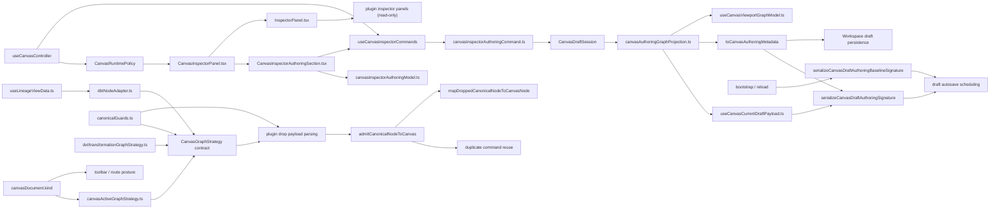
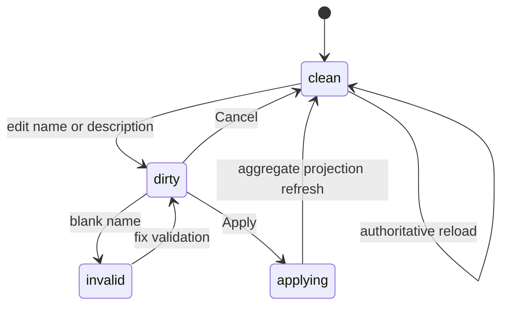
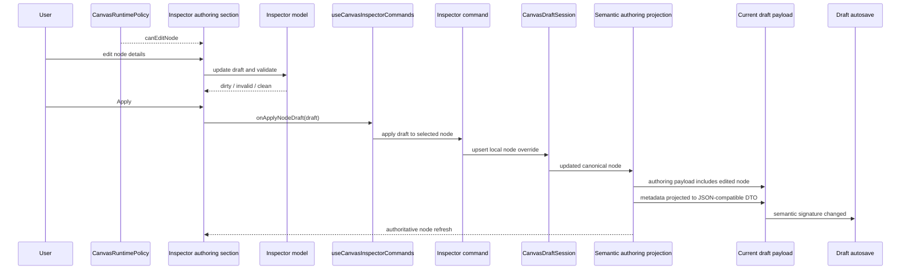

# Canvas Inspector Authoring Component

## Purpose

This document defines the route-owned Inspector authoring component for Canvas.

Use it for:

- governed node-detail editing in the Inspector
- the local Inspector DTO, validation, dirty state, and apply/cancel posture
- the command seam that writes edited node details back into the draft
  aggregate

Do not use this page as the full `TF-E2` roadmap or as the generic plugin
inspector contract.

## Governing Sources

- [TF-E2 production node authoring and persistence plan 2026-04-16](../../../../planning/proposals/mandatory/frontend-and-ux/tf-e2-production-node-authoring-and-persistence-plan-20260416.md)
- [TF-E2 Canvas target architecture execution plan 2026-04-17](../../../../planning/proposals/mandatory/frontend-and-ux/tf-e2-canvas-target-architecture-execution-plan-20260417.md)
- [TF-E2 Inspector authoring and lifecycle closure plan 2026-04-25](../../../../planning/proposals/mandatory/frontend-and-ux/tf-e2-inspector-authoring-and-lifecycle-closure-plan-20260425.md)
- [Graph Canvas Runtime Model](./graph-canvas-runtime-model.md)
- [Canvas Controller Current To Target Architecture](./canvas-controller-current-to-target-architecture.md)
- [Canvas Component Map And Modernization Review](./canvas-component-map-and-modernization-review.md)

## Fowler Reading

| Fowler concept      | Owner in this slice                  | Why                                                                      |
| ------------------- | ------------------------------------ | ------------------------------------------------------------------------ |
| DTO                 | `CanvasInspectorNodeDraft`           | one semantic editing contract for route-owned node details               |
| Domain policy       | `canvasInspectorAuthoringModel.ts`   | validation and normalization are explicit and pure                       |
| Application command | `canvasInspectorAuthoringCommand.ts` | maps validated Inspector edits into aggregate mutation                   |
| Application seam    | `useCanvasInspectorCommands.ts`      | exposes one route-safe callback instead of leaking aggregate mutation up |
| Runtime policy      | `CanvasRuntimePolicy`                | decides whether Inspector authoring is available for the active canvas   |
| Passive view        | `InspectorPanel.tsx`                 | still owns passive node details and plugin read-only panels              |
| Route-owned view    | `CanvasInspectorPanel.tsx`           | composes the passive view with governed authoring UI                     |

The critical rule is that the generic `InspectorPanel` remains passive. The
write surface lives one level up in the route-owned wrapper.

## Public API

| API                                              | Responsibility                                                         |
| ------------------------------------------------ | ---------------------------------------------------------------------- |
| `CanvasInspectorNodeDraft`                       | semantic editing DTO for governed node details                         |
| `CanvasInspectorAuthoringContract`               | route-owned contract: can edit and apply                               |
| `createCanvasInspectorNodeDraft`                 | project a selected canonical node into the Inspector draft             |
| `validateCanvasInspectorNodeDraft`               | validate the current Inspector draft                                   |
| `applyCanvasInspectorNodeDraft`                  | normalize and project the edited fields back into a canonical node     |
| `applyCanvasInspectorNodeDraftToSession`         | write the edited node back into `CanvasDraftSession` via `upsertNode`  |
| `useCanvasInspectorCommands`                     | route-safe callback bridge from UI to aggregate                        |
| `CanvasInspectorPanel`                           | route-owned composition of passive Inspector plus authoring section    |
| `serializeCanvasDraftAuthoringSignature`         | semantic dirty-check signature for persisted authoring payloads        |
| `serializeCanvasDraftAuthoringBaselineSignature` | remote-draft baseline signature policy used by bootstrap and reload    |
| `toCanvasAuthoringMetadata`                      | JSON-compatible metadata DTO boundary for signatures and persistence   |
| `CanvasGraphStrategy`                            | plugin-neutral graph strategy contract used by Canvas application code |
| `CanvasGraphAuthoringMode`                       | route-facing authoring kind resolved from the active canvas document   |
| `useLineageViewData`                             | Lineage read model over the DBT workspace snapshot                     |

## Invariants

- The writable surface is the route-owned Inspector only.
- Inspector editability is owned by `CanvasRuntimePolicy.commands`; it must
  not be derived directly from draft transport mutability or raw user
  permissions.
- Plugin-owned inspector panels remain read-only in this slice.
- The Inspector draft is local UI state; authoritative authoring truth remains
  `CanvasDraftSession`.
- Applying Inspector edits must mutate the same aggregate consumed by preview
  and run.
- Applying Inspector edits must change the semantic authoring signature used by
  autosave; structural signatures that ignore node details are not sufficient.
- Bootstrap and reload must use the same baseline signature policy as autosave,
  otherwise the route can oscillate between saved and dirty for the same
  semantic draft.
- Signature calculation must ignore layout-only node positions and canonicalize
  unordered edge semantics before comparing drafts.
- Plugin metadata that crosses authoring, duplicate, or signature boundaries
  must be projected through the same JSON-compatible metadata DTO. JSON-like
  values are preserved; circular references and non-serializable values are
  omitted before render-time signatures or persistence.
- Canvas application code must depend on the plugin-neutral
  `CanvasGraphStrategy` contract, not on a DBT adapter module.
- Canvas application code must read the active canvas kind from
  `canvasDocument.kind`; graph strategies must not own canvas-kind posture.
- Node authoring and duplicate commands must not consume transformation
  topology flags. Canvas authoring remains compositional; the
  `source -> sql_transform -> sink` topology is validated before planning and
  run by the transformation graph validation component.
- The transformation graph strategy is owned by the DVT plugin contribution,
  not by the DBT adapter.
- Lineage currently reads the DBT workspace graph snapshot and must resolve the
  DBT graph strategy explicitly. It must not inherit the Canvas authoring
  default, because the default may be the DVT transformation canvas.
- `CanvasDraftSession` keeps the remote record baseline only. Semantic saved
  signatures live in bootstrap/reload/autosave refs, not in a stale aggregate
  baseline field.
- Cancel resets local form state only.
- Reload or aggregate refresh resets the form to authoritative route truth.
- Persisted-node overrides must work even when the node already exists in the
  protected draft.
- The passive `InspectorPanel` must not start owning route mutation semantics.

## File Responsibilities

| File                                         | Owns                                                                | Must not own                           |
| -------------------------------------------- | ------------------------------------------------------------------- | -------------------------------------- |
| `canvasInspectorAuthoring.types.ts`          | semantic DTO and route-owned authoring contract                     | React state or aggregate mutation      |
| `canvasInspectorAuthoringModel.ts`           | draft projection, validation, dirty-state comparison, normalization | React hooks, services, or persistence  |
| `canvasInspectorAuthoringCommand.ts`         | aggregate mutation from validated Inspector draft                   | UI state or passive panel composition  |
| `useCanvasInspectorCommands.ts`              | route callback bridge into the aggregate                            | validation rules or persistence timing |
| `CanvasInspectorAuthoringSection.tsx`        | route-owned edit UI                                                 | plugin panels or transport ownership   |
| `CanvasInspectorPanel.tsx`                   | route-owned composition wrapper                                     | validation rules or aggregate policy   |
| `components/InspectorPanel.tsx`              | passive details and plugin read-only panels                         | route mutation semantics               |
| `canvasDraftAuthoring.ts`                    | authoring payload projection and semantic signature policy          | aggregate state machine ownership      |
| `canvasAuthoringMetadata.ts`                 | deterministic JSON-compatible metadata DTO projection               | plugin-specific metadata semantics     |
| `canvasDraftStructuralSignature.ts`          | fallback structural signature for draft baselines                   | semantic node or edge detail policy    |
| `useCanvasDraftInitialBootstrap.ts`          | initial saved-signature assignment from shared baseline policy      | hook-local signature rules             |
| `useCanvasDraftReloadHydration.ts`           | reload saved-signature assignment from shared baseline policy       | hook-local signature rules             |
| `types/canonicalGuards.ts`                   | runtime guards for canonical graph primitives                       | Canvas route state or plugin mapping   |
| `plugins/graphStrategyContracts.ts`          | plugin-neutral graph strategy contract                              | DBT mapping implementation             |
| `plugins/dvt/transformationGraphStrategy.ts` | DVT-owned transformation graph strategy and canonical guards        | DBT adapter mapping or Canvas posture  |
| `views/lineage/useLineageViewData.ts`        | DBT snapshot read model and explicit DBT strategy resolution        | Canvas authoring default ownership     |

## Topology

## Transitions

## Sequence

## Consumers

- `CanvasShell.tsx`
- `canvasShellPanelsBuilder.ts`
- `useCanvasController.ts`
- `useCanvasCurrentDraftPayload.ts`
- `useCanvasViewportGraphModel.ts`
- `LineageView.tsx`

## Fitness Functions

- [canvasInspectorAuthoringComponent.architecture.test.ts](../../../../../apps/web/src/app/views/canvas/canvasInspectorAuthoringComponent.architecture.test.ts)
- [CanvasInspectorPanel.test.tsx](../../../../../apps/web/src/app/views/canvas/CanvasInspectorPanel.test.tsx)
- [canvasInspectorAuthoringModel.test.ts](../../../../../apps/web/src/app/views/canvas/canvasInspectorAuthoringModel.test.ts)
- [canvasDraftAuthoring.test.ts](../../../../../apps/web/src/app/views/canvas/canvasDraftAuthoring.test.ts)
- [useCanvasController.activeDraftMutations.test.tsx](../../../../../apps/web/src/app/views/canvas/useCanvasController.activeDraftMutations.test.tsx)
- [canvasDuplicateNodeCommand.test.ts](../../../../../apps/web/src/app/views/canvas/canvasDuplicateNodeCommand.test.ts)
- [lineageGraphStrategyBoundary.architecture.test.ts](../../../../../apps/web/src/app/views/lineage/lineageGraphStrategyBoundary.architecture.test.ts)
- [LineageView.test.tsx](../../../../../apps/web/src/app/views/LineageView.test.tsx)

## Drift To Watch

- pushing write semantics down into `InspectorPanel.tsx`
- recomputing `canEditNode` from raw permissions, draft transport mutability,
  or workbench state instead of `CanvasRuntimePolicy`
- letting plugin panels mutate core route-owned node fields
- using the Inspector form as a second persistence model
- using a structural-only dirty signature that cannot see node name,
  description, metadata, or edge semantics
- duplicating bootstrap and reload baseline-signature policy across hooks
- letting edge array transport order create semantic dirty churn
- dropping local persisted-node overrides during semantic projection or reload
- reintroducing plugin metadata sanitization in ad hoc shallow clones
- importing `CanvasGraphStrategy` from a concrete plugin adapter instead of the
  neutral plugin contract
- deriving Canvas behavior from `graphStrategy.id` or strategy policy instead
  of the active canvas document
- moving viewport projection back into canonical admission commands
- reintroducing authoring-time topology flags into node drop or duplicate
  commands; topology validation belongs to plan/run readiness
- letting DBT own the DVT transformation graph strategy
- letting Lineage inherit the Canvas authoring default instead of explicitly
  resolving the DBT snapshot strategy
- adding a second saved-signature field back into `CanvasDraftSessionBaseline`
