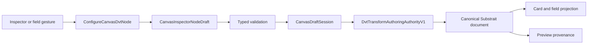

# Canvas Inspector Authoring Component

## Purpose

This component owns governed node-detail editing in the route-level Canvas Inspector. It
projects one local draft, validates it, and applies accepted changes through the existing
Canvas draft aggregate.

It does not make the passive plugin Inspector writable, persist React Flow presentation
state as semantic truth, or create a second transform authority.

## Governing Sources

- [Command/query rail governance](../../../command-query-rail-governance.md)
- [Canvas Workbench command/query catalog](./canvas-workbench-command-query-catalog.md)
- [Graph Canvas Runtime Model](./graph-canvas-runtime-model.md)
- [Semantic Transformation](../../../system/subsystems/semantic-transformation/index.md)
- [VTX1 authoring authority hard cut](../../../../planning/proposals/mandatory/frontend-and-ux/vtx2-web-vtx1-authoring-hardcut-plan-20260903.md)

## Command Rail

| Attribute        | Canonical value                                                 |
| ---------------- | --------------------------------------------------------------- |
| Command          | `ConfigureCanvasDvtNode`                                        |
| Bounded context  | Web Graph Canvas Workbench                                      |
| DDD owner        | `DvtNodeAuthoringMetadata`                                      |
| Application seam | `useCanvasInspectorCommands`                                    |
| Adapter surface  | route-owned Inspector and graph-column controls                 |
| Authority        | `DvtTransformAuthoringAuthorityV1` canonical Substrait envelope |
| Mutation target  | `CanvasDraftSession.workingSet.upsertNode`                      |

There is no separate SQL command, visual-recipe command, column-mapping store, or React Flow
edge authority for this intent.

The legacy `dbt:model` compatibility surface uses `ConfigureCanvasDbtNode` for supported
metadata and ordered output selection, then `GenerateDbtWorkspaceArtifacts` to project the
current graph definition into dbt SQL. Its Code tab is a read-only projection. Neither the
Inspector draft nor graph metadata accepts generated SQL as an implicit authoring authority.
Complete migration of that legacy node species onto the shared canonical Substrait Model /
Transform semantics is tracked separately by issue #2903.

## Public Contracts

| Contract                           | Responsibility                                         |
| ---------------------------------- | ------------------------------------------------------ |
| `CanvasInspectorNodeDraft`         | local semantic editing DTO                             |
| `DvtNodeAuthoringMetadata`         | source, canonical Transform, and sink authoring union  |
| `DvtTransformAuthoringAuthorityV1` | strict Substrait semantic-document envelope            |
| `CanvasColumnMappingSource`        | typed source field identity                            |
| `CanvasColumnMappingTarget`        | typed Transform output identity                        |
| `CanvasColumnMappingResult`        | applied draft or typed rejection                       |
| `CanvasColumnLineage`              | derived visible field handles and edges                |
| `DbtNodeAuthoringMetadata`         | legacy dbt compatibility metadata without writable SQL |
| `DbtModelArtifactProjection`       | generated read-only dbt SQL artifact                   |

An empty Transform is explicitly `uninitialized`. Its first admitted authoring action creates
one canonical Substrait projection or composition. Removed SQL/VTX1 metadata fails closed.
An imported Source may carry the same envelope for admitted operations while retaining its
Source kind, connection authority and physical provenance.

## Invariants

- Inspector editability comes from `CanvasRuntimePolicy.commands`.
- Apply and column gestures mutate the same `CanvasDraftSession` authority.
- A DVT Transform has zero authority while uninitialized and exactly one canonical Substrait
  semantic document after its first accepted mutation.
- A connection-backed Source may own that same semantic document; it never becomes a hidden or
  renamed Transform.
- Editable SQL, VTX1 recipes, SQL mirrors, and visual-to-SQL conversion are not supported
  authoring states.
- A graph-draft `dbt:model` never adopts `metadata.sql` or `metadata.config.sql`; legacy values
  are stripped when supported metadata is applied and ignored by artifact projection.
- Column order, output inclusion, functions, aliases, descriptions, and multi-input
  composition are mutations of the canonical semantic document.
- React Flow field edges are derived lineage projections. Deleting a projected field edge
  invokes the mapping command; it does not persist an independent edge model.
- Automap accepts only one unique exact-name match with a known compatible type.
- Projection editing admits one connected source. Multi-input semantics use explicit
  Substrait join or set composition.
- Unsupported semantic shapes and incompatible functions fail closed.
- Visible copy is resolved by the Canvas copy catalog, not embedded in strategies or domain
  policies.
- Layout, disclosure, hover cards, and workbench position remain presentation state.
- Generic Canvas readiness does not acquire dbt- or DVT-specific definition rules.

## Focused Responsibilities

| Module                                    | One reason to change                          |
| ----------------------------------------- | --------------------------------------------- |
| `canvasInspectorAuthoringModel.ts`        | Inspector draft projection and validation     |
| `canvasDvtAuthoringModel.ts`              | dispatch authoring by DVT node kind           |
| `canvasDvtSourceAuthoring.ts`             | source identity and connection authority      |
| `canvasDvtSourceSemanticAuthoring.ts`     | source semantic draft lifecycle               |
| `canvasDvtTransformAuthoring.ts`          | canonical Transform shape decode/encode       |
| `canvasDvtSinkAuthoring.ts`               | sink materialization and write policy         |
| `canvasDvtTransformAuthoringAuthority.ts` | strict authority envelope                     |
| `canvasColumnMappingModel.ts`             | typed mapping contracts and node-column reads |
| `canvasColumnProjectionAuthority.ts`      | canonical projection read/persistence         |
| `canvasColumnMappingAuthoring.ts`         | one field mapping or removal                  |
| `canvasColumnAutomap.ts`                  | deterministic compatible automapping          |
| `canvasColumnOutputAuthoring.ts`          | output inclusion and order                    |
| `canvasColumnLineageProjection.ts`        | field-handle and lineage read model           |
| `canvasDvtSubstraitFilter.ts`             | strict shared FilterRel mutation              |
| `DvtAuthoringFields.tsx`                  | route DVT authoring to focused views          |

## Flow

## Negative Behavior

The command rejects or fails closed for:

- removed SQL/VTX1 metadata;
- an unsupported DVT target or semantic shape;
- a source without a stage dependency;
- absent or ambiguous source fields;
- unknown or incompatible types during automap;
- functions outside the admitted provider capability profile;
- editing a complex expression as a simple passthrough;
- using one projection as a hidden multi-source composition;
- read-only runtime posture.

## Behavioral Evidence

- `canvasDvtTransformAuthoringAuthority.test.ts`
- `canvasColumnMappingAuthoring.test.ts`
- `canvasColumnLineageProjection.test.ts`
- `canvasColumnFunctionAuthoring.test.ts`
- `canvasAlgebraicComposition.test.ts`
- `canvasDvtSubstraitPilot.test.ts`
- `canvasDvtSubstraitFilter.test.ts`
- `DvtAuthoringFields.test.tsx`
- `canvas-source-filter-authoring.cy.ts`
- `dvt-transform-authoring-authority.contract.test.ts`

The architecture absence guard proves retired modules and public names are not reintroduced;
behavior tests prove accepted/rejected mutations and their persisted semantic result.

## Drift To Watch

- restoring editable SQL or a visual recipe as Transform authority;
- keeping a generated SQL mirror beside the semantic document;
- persisting presentation edges as mapping truth;
- guessing unknown or ambiguous automaps;
- embedding visible copy in policies or graph strategies;
- growing the dispatcher with source, Transform, or sink implementation detail;
- introducing a second command for the same authoring intent.
