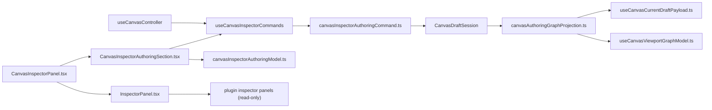
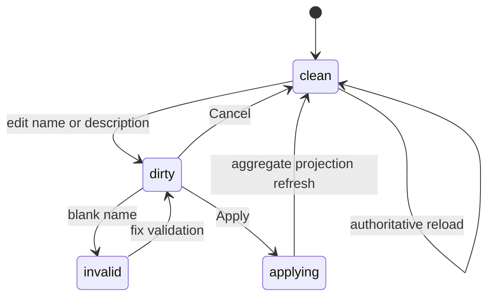
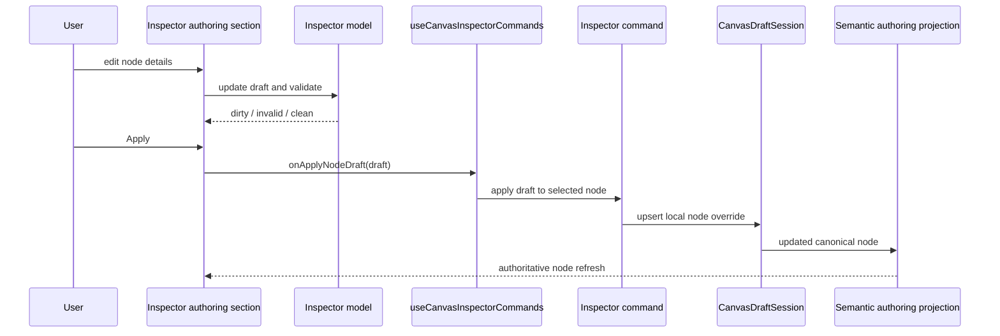

# Canvas Inspector Authoring Component

## Purpose

This document defines the route-owned Inspector authoring component for Canvas.

Use it for:

- governed node-detail editing in the Inspector
- the local Inspector DTO, validation, dirty state, and apply/cancel posture
- the command seam that writes edited node details back into the draft
  aggregate

Do not use this page as the full `TF-E2` roadmap or as the generic plugin
inspector contract.

## Governing Sources

- [TF-E2 production node authoring and persistence plan 2026-04-16](../../../../planning/proposals/mandatory/frontend-and-ux/tf-e2-production-node-authoring-and-persistence-plan-20260416.md)
- [TF-E2 Canvas target architecture execution plan 2026-04-17](../../../../planning/proposals/mandatory/frontend-and-ux/tf-e2-canvas-target-architecture-execution-plan-20260417.md)
- [TF-E2 Inspector authoring and lifecycle closure plan 2026-04-25](../../../../planning/proposals/mandatory/frontend-and-ux/tf-e2-inspector-authoring-and-lifecycle-closure-plan-20260425.md)
- [Graph Canvas Runtime Model](./graph-canvas-runtime-model.md)
- [Canvas Controller Current To Target Architecture](./canvas-controller-current-to-target-architecture.md)
- [Canvas Component Map And Modernization Review](./canvas-component-map-and-modernization-review.md)

## Fowler Reading

| Fowler concept      | Owner in this slice                  | Why                                                                      |
| ------------------- | ------------------------------------ | ------------------------------------------------------------------------ |
| DTO                 | `CanvasInspectorNodeDraft`           | one semantic editing contract for route-owned node details               |
| Domain policy       | `canvasInspectorAuthoringModel.ts`   | validation and normalization are explicit and pure                       |
| Application command | `canvasInspectorAuthoringCommand.ts` | maps validated Inspector edits into aggregate mutation                   |
| Application seam    | `useCanvasInspectorCommands.ts`      | exposes one route-safe callback instead of leaking aggregate mutation up |
| Passive view        | `InspectorPanel.tsx`                 | still owns passive node details and plugin read-only panels              |
| Route-owned view    | `CanvasInspectorPanel.tsx`           | composes the passive view with governed authoring UI                     |

The critical rule is that the generic `InspectorPanel` remains passive. The
write surface lives one level up in the route-owned wrapper.

## Public API

| API                                      | Responsibility                                                        |
| ---------------------------------------- | --------------------------------------------------------------------- |
| `CanvasInspectorNodeDraft`               | semantic editing DTO for governed node details                        |
| `CanvasInspectorAuthoringContract`       | route-owned contract: can edit and apply                              |
| `createCanvasInspectorNodeDraft`         | project a selected canonical node into the Inspector draft            |
| `validateCanvasInspectorNodeDraft`       | validate the current Inspector draft                                  |
| `applyCanvasInspectorNodeDraft`          | normalize and project the edited fields back into a canonical node    |
| `applyCanvasInspectorNodeDraftToSession` | write the edited node back into `CanvasDraftSession` via `upsertNode` |
| `useCanvasInspectorCommands`             | route-safe callback bridge from UI to aggregate                       |
| `CanvasInspectorPanel`                   | route-owned composition of passive Inspector plus authoring section   |

## Invariants

- The writable surface is the route-owned Inspector only.
- Plugin-owned inspector panels remain read-only in this slice.
- The Inspector draft is local UI state; authoritative authoring truth remains
  `CanvasDraftSession`.
- Applying Inspector edits must mutate the same aggregate consumed by preview
  and run.
- Cancel resets local form state only.
- Reload or aggregate refresh resets the form to authoritative route truth.
- Persisted-node overrides must work even when the node already exists in the
  protected draft.
- The passive `InspectorPanel` must not start owning route mutation semantics.

## File Responsibilities

| File                                  | Owns                                                                | Must not own                           |
| ------------------------------------- | ------------------------------------------------------------------- | -------------------------------------- |
| `canvasInspectorAuthoring.types.ts`   | semantic DTO and route-owned authoring contract                     | React state or aggregate mutation      |
| `canvasInspectorAuthoringModel.ts`    | draft projection, validation, dirty-state comparison, normalization | React hooks, services, or persistence  |
| `canvasInspectorAuthoringCommand.ts`  | aggregate mutation from validated Inspector draft                   | UI state or passive panel composition  |
| `useCanvasInspectorCommands.ts`       | route callback bridge into the aggregate                            | validation rules or persistence timing |
| `CanvasInspectorAuthoringSection.tsx` | route-owned edit UI                                                 | plugin panels or transport ownership   |
| `CanvasInspectorPanel.tsx`            | route-owned composition wrapper                                     | validation rules or aggregate policy   |
| `components/InspectorPanel.tsx`       | passive details and plugin read-only panels                         | route mutation semantics               |

## Topology

## Transitions

## Sequence

## Consumers

- `CanvasShell.tsx`
- `canvasShellPanelsBuilder.ts`
- `useCanvasController.ts`
- `useCanvasCurrentDraftPayload.ts`
- `useCanvasViewportGraphModel.ts`

## Fitness Functions

- [canvasInspectorAuthoringComponent.architecture.test.ts](../../../../../apps/web/src/app/views/canvas/canvasInspectorAuthoringComponent.architecture.test.ts)
- [CanvasInspectorPanel.test.tsx](../../../../../apps/web/src/app/views/canvas/CanvasInspectorPanel.test.tsx)
- [canvasInspectorAuthoringModel.test.ts](../../../../../apps/web/src/app/views/canvas/canvasInspectorAuthoringModel.test.ts)

## Drift To Watch

- pushing write semantics down into `InspectorPanel.tsx`
- letting plugin panels mutate core route-owned node fields
- using the Inspector form as a second persistence model
- dropping local persisted-node overrides during semantic projection or reload
