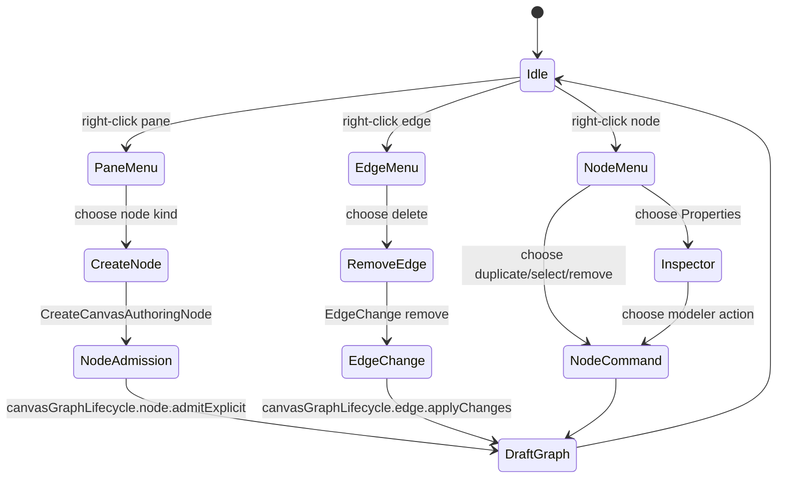
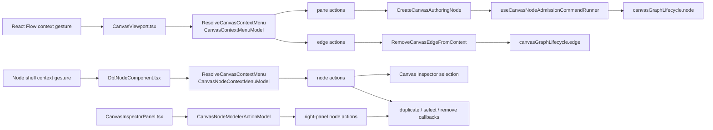

# Canvas Interaction Command Surface Component

## Purpose

This component owns the route-local contextual interaction contract for Canvas
graph targets.

It turns a user gesture on a graph background, edge, or node into an
intention-revealing command model without making React Flow, the browser context
menu, a node renderer, or a toolbar dropdown the source of graph meaning.

It does not own viewport state, node-shell rendering, node identity, graph
lifecycle mutation, or Inspector content. Those concerns stay in their owning
components; this component only normalizes target gestures into rail-backed
node action read models and routes selected actions to existing command seams.
The right Inspector may consume the same node action model for its local
modeler command strip, but the Inspector remains the owner of property content.

## Governing Sources

- `docs/architecture/command-query-rail-governance.md`
- `docs/architecture/fowler-opportunity-planning-governance.md`
- `docs/adr/ADR-0056-web-ui-authority-is-server-projected.md`
- `docs/adr/ADR-0058-warehouse-source-import-rails.md`
- `docs/adr/ADR-0059-canonical-node-identity.md`
- `docs/architecture/components/web/graph/canvas-graph-lifecycle-component.md`
- `docs/architecture/components/web/graph/canvas-workbench-command-query-catalog.md`

## Public API

Local public API:

```ts
type CanvasContextMenuTarget =
  | { kind: 'pane'; screenPosition: Point; flowPosition: Point }
  | { kind: 'edge'; edgeId: string; screenPosition: Point };

type CanvasNodeContextMenuModel = {
  target: { kind: 'node'; nodeId: string };
  actionGroups: CanvasNodeContextMenuActionGroup[];
};

type CanvasNodeModelerActionModel = {
  target: { kind: 'node'; nodeId: string };
  actionGroups: CanvasNodeModelerActionGroup[];
};

type CanvasContextMenuModel = {
  kind: 'pane' | 'edge';
  screenPosition: Point;
  flowPosition?: Point;
  edgeId?: string;
  createNodeActions: CanvasContextMenuCreateNodeAction[];
  edgeActions: CanvasContextMenuEdgeAction[];
};

function buildCanvasContextMenuModel(args): CanvasContextMenuModel;
function buildCanvasNodeContextMenuModel(args): CanvasNodeContextMenuModel;
function buildCanvasNodeModelerActionModel(args): CanvasNodeModelerActionModel;
function buildCanvasEdgeContextRemovalChange(edge): EdgeChange<Edge>;
```

Related command seams:

- `ResolveCanvasContextMenu` builds a read model for the visible contextual
  actions.
- `CreateCanvasAuthoringNode` admits a governed node kind into the draft graph.
- `RemoveCanvasEdgeFromContext` converts an edge gesture into the existing
  React Flow edge-change contract, which is then consumed by
  `canvasGraphLifecycle.edge`.
- Node-level actions use the same `ResolveCanvasContextMenu` rail, then dispatch
  to existing selection, duplicate, inspect, and remove-node callbacks supplied
  by the Canvas route.
- The Inspector modeler action strip reuses the node action model minus the
  current Properties action. It is not a new command/query rail and does not
  own role, status, or catalog vocabularies.

## File Responsibilities

- `canvasInteractionCommandSurface.ts`: pure pane/edge contextual menu read
  model and edge-removal change construction.
- `canvasNodeContextMenuModel.ts`: pure node-target contextual menu and
  Inspector modeler-action read models.
- `CanvasViewport.tsx`: React Flow pane/edge gesture adapter and menu renderer;
  it does not own contextual action policy.
- `DbtNodeComponent.tsx`: node-shell gesture adapter and menu renderer; it does
  not own contextual action policy or node identity semantics.
- `CanvasInspectorPanel.tsx`: right-panel consumer of the node modeler-action
  read model; it delegates command execution to route-supplied handlers and
  does not declare graph mutation policy.
- `canvasAuthoringNodeCommand.ts`: canonical authoring-node command, including
  optional caller-owned origin.
- `useCanvasAuthoringNodeCreationHandlers.ts`: node admission command execution
  and route fallout.
- `canvasGraphLifecycle.edge.ts`: edge-change semantic application into visible
  draft graph state.

## Invariants

- Background right-click opens app-owned contextual actions, not the browser
  default menu.
- Edge right-click opens an edge-specific menu; it does not show node creation
  actions.
- Node right-click opens node-specific actions; it does not show background
  creation or edge-removal actions.
- Node Properties/Open Inspector always remains available because it is a
  route-local read/selection action.
- Read-only or blocked mutation posture produces no mutating contextual action.
- Context-menu node creation uses the clicked flow position, not a hidden
  default slot.
- Toolbar and context-menu node creation share `CreateCanvasAuthoringNode`.
- Edge deletion reuses the existing edge-change lifecycle path instead of
  bypassing draft-session edge replacement.
- `canvasInteractionCommandSurface.ts` is pure: no React hooks, no React Flow
  rendering, and no direct draft mutation.
- `canvasNodeContextMenuModel.ts` is pure: no React hooks, no node rendering,
  and no direct draft mutation.
- The action model may reflect route-local selection state, such as
  execution-selection posture, but domain statuses, roles, node-kind catalogs,
  and authorization vocabularies must come from their owning canonical read
  models or plugin registrations rather than component literals.
- React Flow nodes and edges remain projection state; protected draft
  authority stays behind the existing graph lifecycle and draft session.
- Source connection authority remains server-projected through ADR-0058 rails;
  this component must not simulate source credentials.

## Transitions



## Component Flow



## Consumers

- `CanvasViewport.tsx` consumes the pure model and renders the menu.
- `DbtNodeComponent.tsx` consumes the node model and renders node-shell actions.
- `CanvasInspectorPanel.tsx` consumes the node modeler-action model through the
  route-owned Inspector authoring contract.
- `CanvasShellMainPanel.tsx` passes the active authoring catalog and graph
  command seam into the viewport.
- `CanvasToolbar.tsx` and `CanvasAddNodePalette.tsx` continue to use the same
  node creation command for toolbar insertion.
- `useCanvasEdgeChangeHandlers.ts` consumes edge removal as a normal
  `EdgeChange`.

## Fowler Reading

The previous posture mixed a working but hard-coded node-level context menu with
pure pane/edge read models. That is duplicate semantics plus boundary drift:
users could right-click each graph target and see app actions, but only
background and edge gestures were governed by a reusable contextual read model.

The applied pattern is Presentation Model plus Command Gateway. The component
builds a contextual read model, then routes selected actions to existing command
seams. It does not create a second graph aggregate.

## Drift To Prevent

- Do not put context-menu action decisions directly in `CanvasViewport.tsx`.
- Do not put node context-menu action decisions directly in
  `DbtNodeComponent.tsx`.
- Do not put node modeler action decisions directly in `CanvasInspectorPanel.tsx`;
  consume the shared node action model and route-owned handlers.
- Do not call draft-session mutation directly from a context-menu button.
- Do not create another node creation command for background clicks.
- Do not create another node properties command for the context menu; use the
  existing Inspector selection/opening behavior.
- Do not fabricate source connectivity in the context menu; source import
  remains behind `ListWarehouseConnections`, `ListWarehouseConnectionTables`,
  and `ImportWarehouseSources`.
- Do not let edge deletion bypass `canvasGraphLifecycle.edge`.

## Validation

- `apps/web/src/app/views/canvas/canvasInteractionCommandSurface.test.ts`
- `apps/web/src/app/components/canvas/canvasNodeContextMenuModel.test.ts`
- `apps/web/src/app/views/canvas/CanvasViewport.test.tsx`
- `apps/web/src/app/views/canvas/canvasInteractionCommandSurface.architecture.test.ts`
