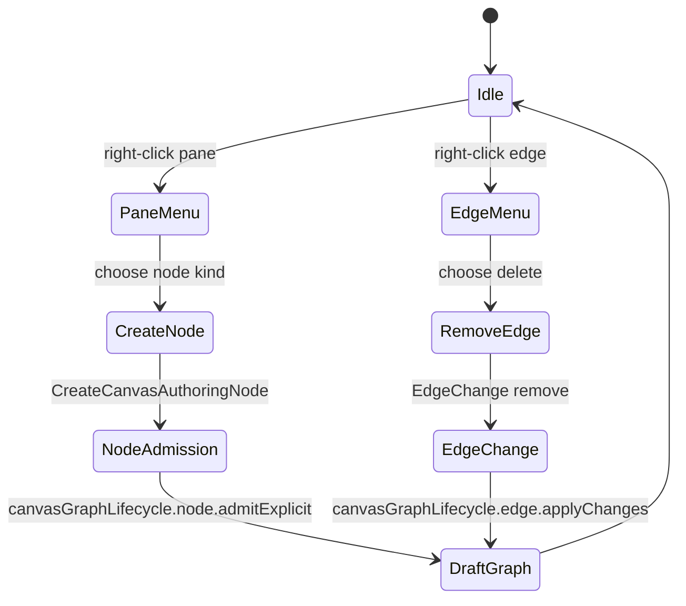
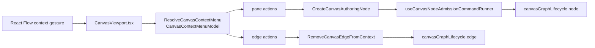

# Canvas Interaction Command Surface Component

## Purpose

This component owns route-local contextual interaction semantics for the Canvas
viewport.

It turns a user gesture on a graph background or edge into an intention-revealing
command model without making React Flow, the browser context menu, or a toolbar
dropdown the source of graph meaning.

## Governing Sources

- `docs/architecture/command-query-rail-governance.md`
- `docs/architecture/fowler-opportunity-planning-governance.md`
- `docs/adr/ADR-0056-web-ui-authority-is-server-projected.md`
- `docs/adr/ADR-0058-warehouse-source-import-rails.md`
- `docs/adr/ADR-0059-canonical-node-identity.md`
- `docs/architecture/components/web/graph/canvas-graph-lifecycle-component.md`
- `docs/architecture/components/web/graph/canvas-workbench-command-query-catalog.md`

## Public API

Local public API:

```ts
type CanvasContextMenuTarget =
  | { kind: 'pane'; screenPosition: Point; flowPosition: Point }
  | { kind: 'edge'; edgeId: string; screenPosition: Point };

type CanvasContextMenuModel = {
  kind: 'pane' | 'edge';
  screenPosition: Point;
  flowPosition?: Point;
  edgeId?: string;
  createNodeActions: CanvasContextMenuCreateNodeAction[];
  edgeActions: CanvasContextMenuEdgeAction[];
};

function buildCanvasContextMenuModel(args): CanvasContextMenuModel;
function buildCanvasEdgeContextRemovalChange(edge): EdgeChange<Edge>;
```

Related command seams:

- `ResolveCanvasContextMenu` builds a read model for the visible contextual
  actions.
- `CreateCanvasAuthoringNode` admits a governed node kind into the draft graph.
- `RemoveCanvasEdgeFromContext` converts an edge gesture into the existing
  React Flow edge-change contract, which is then consumed by
  `canvasGraphLifecycle.edge`.

## File Responsibilities

- `canvasInteractionCommandSurface.ts`: pure contextual menu read model and
  edge-removal change construction.
- `CanvasViewport.tsx`: React Flow gesture adapter and rendered contextual
  menu.
- `canvasAuthoringNodeCommand.ts`: canonical authoring-node command, including
  optional caller-owned origin.
- `useCanvasAuthoringNodeCreationHandlers.ts`: node admission command execution
  and route fallout.
- `canvasGraphLifecycle.edge.ts`: edge-change semantic application into visible
  draft graph state.

## Invariants

- Background right-click opens app-owned contextual actions, not the browser
  default menu.
- Edge right-click opens an edge-specific menu; it does not show node creation
  actions.
- Read-only or blocked mutation posture produces no mutating contextual action.
- Context-menu node creation uses the clicked flow position, not a hidden
  default slot.
- Toolbar and context-menu node creation share `CreateCanvasAuthoringNode`.
- Edge deletion reuses the existing edge-change lifecycle path instead of
  bypassing draft-session edge replacement.
- `canvasInteractionCommandSurface.ts` is pure: no React hooks, no React Flow
  rendering, and no direct draft mutation.
- React Flow nodes and edges remain projection state; protected draft
  authority stays behind the existing graph lifecycle and draft session.
- Source connection authority remains server-projected through ADR-0058 rails;
  this component must not simulate source credentials.

## Transitions



## Component Flow



## Consumers

- `CanvasViewport.tsx` consumes the pure model and renders the menu.
- `CanvasShellMainPanel.tsx` passes the active authoring catalog and graph
  command seam into the viewport.
- `CanvasToolbar.tsx` and `CanvasAddNodePalette.tsx` continue to use the same
  node creation command for toolbar insertion.
- `useCanvasEdgeChangeHandlers.ts` consumes edge removal as a normal
  `EdgeChange`.

## Fowler Reading

The previous posture mixed a working node-level context menu with missing
pane/edge behavior. That is duplicate semantics plus boundary drift: users
could right-click one graph object and get an app action, but right-clicking the
background delegated to the browser and right-clicking an edge had no graph
meaning.

The applied pattern is Presentation Model plus Command Gateway. The component
builds a contextual read model, then routes selected actions to existing command
seams. It does not create a second graph aggregate.

## Drift To Prevent

- Do not put context-menu action decisions directly in `CanvasViewport.tsx`.
- Do not call draft-session mutation directly from a context-menu button.
- Do not create another node creation command for background clicks.
- Do not fabricate source connectivity in the context menu; source import
  remains behind `ListWarehouseConnections`, `ListWarehouseConnectionTables`,
  and `ImportWarehouseSources`.
- Do not let edge deletion bypass `canvasGraphLifecycle.edge`.

## Validation

- `apps/web/src/app/views/canvas/canvasInteractionCommandSurface.test.ts`
- `apps/web/src/app/views/canvas/CanvasViewport.test.tsx`
- `apps/web/src/app/views/canvas/canvasInteractionCommandSurface.architecture.test.ts`
