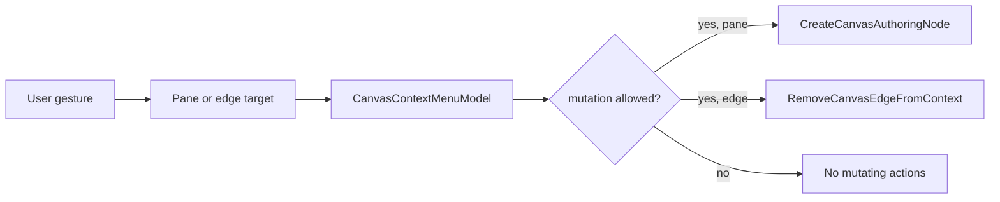

# Canvas Interaction Command Surface User Stories

## Stories

- `US-CANVAS-INTERACTION-001`: as a workflow author, I can right-click the
  Canvas background and create a node there. Acceptance: the browser menu is
  suppressed, app actions appear, and the new node uses the clicked point.
- `US-CANVAS-INTERACTION-002`: as a workflow author, I can right-click an edge
  and remove only that edge. Acceptance: the edge menu contains delete, and
  deletion flows through edge lifecycle changes.
- `US-CANVAS-INTERACTION-003`: as a read-only reviewer, I do not see mutating
  actions when the graph is not editable. Acceptance: context-menu models fail
  closed when mutation posture denies graph edits.
- `US-CANVAS-INTERACTION-004`: as a Canvas maintainer, I can reason about
  contextual actions without reading React Flow code. Acceptance:
  `CanvasContextMenuModel` owns target/action semantics and is unit tested.
- `US-CANVAS-INTERACTION-005`: as an architecture reviewer, I can detect drift
  mechanically. Acceptance: architecture tests check docs, rails, stories,
  mailbox analysis, and owned-concern modules.
- `US-CANVAS-INTERACTION-006`: as a workflow author, toolbar Insert and
  right-click creation produce the same node shape. Acceptance: both paths call
  `CreateCanvasAuthoringNode`; only the position source differs.
- `US-CANVAS-INTERACTION-007`: as a data engineer, context menus do not pretend
  to authenticate warehouse sources. Acceptance: source connectivity remains
  documented as ADR-0058 server-owned import rails.
- `US-CANVAS-INTERACTION-008`: as a QA reviewer, I can test contextual behavior
  without native browser menus. Acceptance: presentation tests call React Flow
  context callbacks and assert rendered app actions.

## Scenario Matrix

- Background create node: `ResolveCanvasContextMenu` ->
  `CreateCanvasAuthoringNode`; primary test: `CanvasViewport.test.tsx`.
- Edge delete: `ResolveCanvasContextMenu` -> `RemoveCanvasEdgeFromContext`;
  primary test: `CanvasViewport.test.tsx`.
- Read-only fail closed: `ResolveCanvasContextMenu`; primary test:
  `canvasInteractionCommandSurface.test.ts`.
- Clicked position retained: `CreateCanvasAuthoringNode`; primary test:
  `canvasAuthoringNodeCommand.test.ts`.
- Architecture drift guard: all rails above; primary test:
  `canvasInteractionCommandSurface.architecture.test.ts`.

