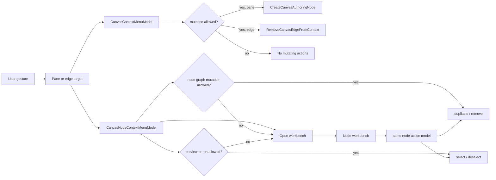

# Canvas Interaction Command Surface User Stories

## Stories

- `US-CANVAS-INTERACTION-001`: as a workflow author, I can right-click the
  Canvas background and create a node there. Acceptance: the browser menu is
  suppressed, app actions appear, and the new node uses the clicked point.
- `US-CANVAS-INTERACTION-002`: as a workflow author, I can right-click an edge
  and remove only that edge. Acceptance: the edge menu contains delete, and
  deletion flows through edge lifecycle changes.
- `US-CANVAS-INTERACTION-003`: as a read-only reviewer, I do not see graph
  mutation actions when the graph is not editable. Acceptance: context-menu
  models fail closed for duplicate, remove, and schema attachment when graph
  mutation posture denies graph edits.
- `US-CANVAS-INTERACTION-004`: as a Canvas maintainer, I can reason about
  contextual actions without reading React Flow code. Acceptance:
  `CanvasContextMenuModel` owns target/action semantics and is unit tested.
- `US-CANVAS-INTERACTION-005`: as an architecture reviewer, I can detect drift
  mechanically. Acceptance: architecture tests check docs, rails, stories,
  mailbox analysis, and owned-concern modules.
- `US-CANVAS-INTERACTION-006`: as a workflow author, toolbar Insert and
  right-click creation produce the same node shape. Acceptance: both paths call
  `CreateCanvasAuthoringNode`; only the position source differs.
- `US-CANVAS-INTERACTION-007`: as a data engineer, context menus do not pretend
  to authenticate warehouse sources. Acceptance: source connectivity remains
  documented as ADR-0058 server-owned import rails.
- `US-CANVAS-INTERACTION-008`: as a QA reviewer, I can test contextual behavior
  without native browser menus. Acceptance: presentation tests call React Flow
  context callbacks and assert rendered app actions.
- `US-CANVAS-INTERACTION-009`: as a workflow author, I can right-click a node
  and open its contextual workbench. Acceptance: the action uses the existing
  node inspection/opening behavior and does not create separate context-menu
  actions for Properties, Inputs / Outputs, Tests, SQL, Preview, Runs, or
  Lineage sections.
- `US-CANVAS-INTERACTION-010`: as a read-only reviewer, I can still inspect a
  node but I do not see duplicate, remove, or execution-selection actions.
  Acceptance: the node context-menu read model keeps inspect available, hides
  graph mutation actions when graph edits are denied, and hides execution
  selection when preview and run are denied.
- `US-CANVAS-INTERACTION-011`: as a data modeler, the node Properties panel
  presents available node facts in table-like sections. Acceptance: General,
  Columns, Keys, Indexes, Foreign Keys, Constraints, Comments, Code, and Summary
  sections render available facts or explicit empty states without fabricated
  records.
- `US-CANVAS-INTERACTION-012`: as a data modeler, I can run available node
  commands from the right Properties panel while inspecting a node. Acceptance:
  the panel action strip reuses the node command model, dispatches through
  route-owned handlers, keeps destructive actions unavailable when mutation is
  blocked, and does not embed role, status, or catalog vocabularies.

## Scenario Matrix

- Background create node: `ResolveCanvasContextMenu` ->
  `CreateCanvasAuthoringNode`; primary test: `CanvasViewport.test.tsx`.
- Edge delete: `ResolveCanvasContextMenu` -> `RemoveCanvasEdgeFromContext`;
  primary test: `CanvasViewport.test.tsx`.
- Read-only fail closed: `ResolveCanvasContextMenu`; primary test:
  `canvasInteractionCommandSurface.test.ts`.
- Clicked position retained: `CreateCanvasAuthoringNode`; primary test:
  `canvasAuthoringNodeCommand.test.ts`.
- Architecture drift guard: all rails above; primary test:
  `canvasInteractionCommandSurface.architecture.test.ts`.
- Node workbench: `ResolveCanvasContextMenu` -> node workbench opening and
  modeler-action strip; primary tests:
  `canvasNodeContextMenuModel.test.ts`, `canvasShellPanelsBuilder.test.ts`,
  `CanvasInspectorPanel.test.tsx`.

