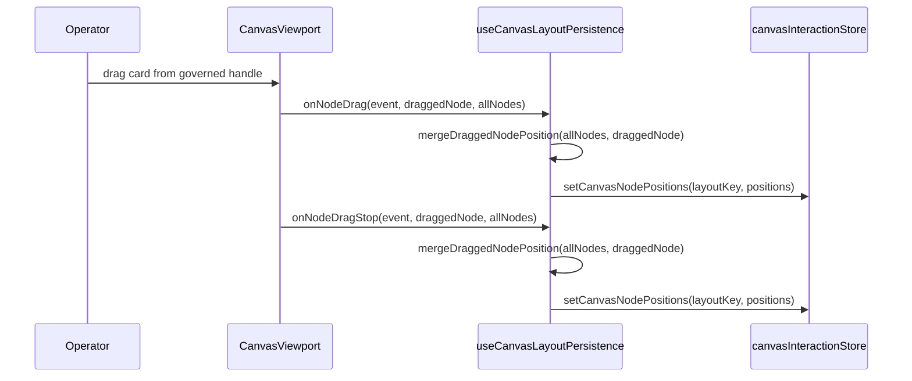
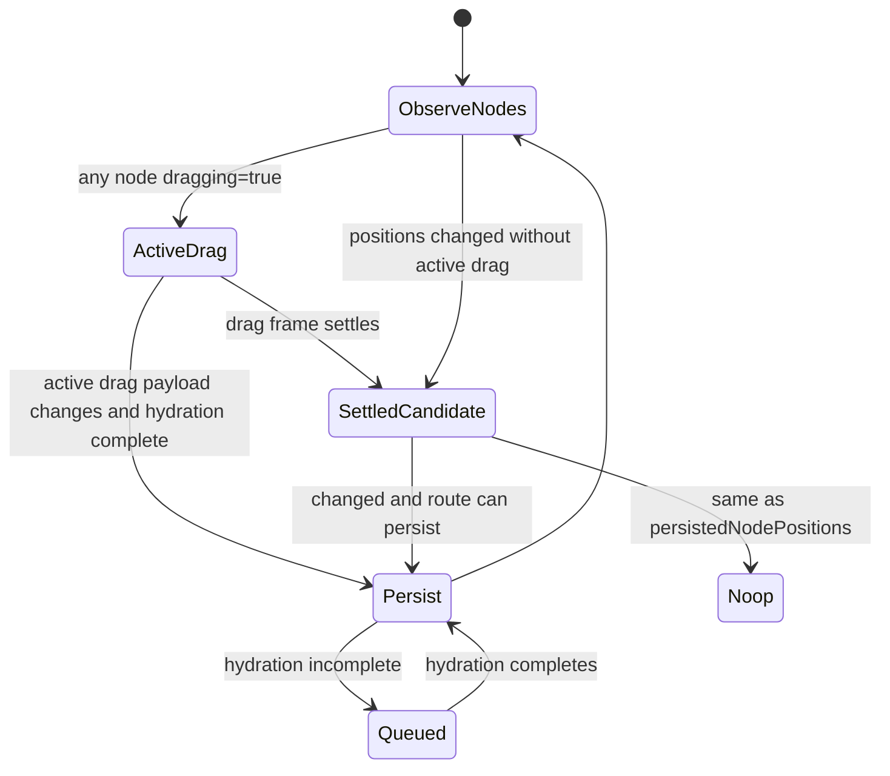
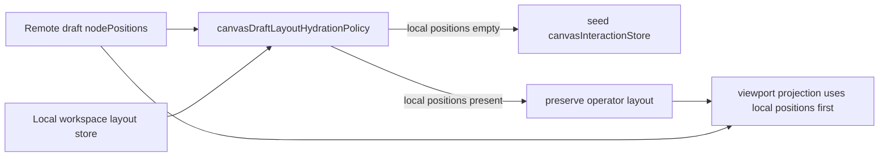

# Canvas Layout Persistence Component

## Purpose

This guide defines the local component that persists route-local Canvas layout
observations: viewport position and node coordinates. It does not own
authoritative graph draft state.

This distinction matters because Canvas has two truths:

- graph meaning and draft persistence belong to the protected authoring draft;
- viewport and card coordinates belong to route-local layout state.

## Public API

| API                                          | Owner                                 | Responsibility                                                                               |
| -------------------------------------------- | ------------------------------------- | -------------------------------------------------------------------------------------------- |
| `useCanvasLayoutPersistence(...)`            | `useCanvasLayoutPersistence.ts`       | Return node-position, node-drag, and viewport persistence handlers.                          |
| `handleNodePositionsSave`                    | `useCanvasLayoutPersistence.ts`       | Persist a complete node-position map for the active layout key.                              |
| `handleNodeDrag`                             | `useCanvasLayoutPersistence.ts`       | Persist active React Flow drag payloads once layout hydration is complete.                   |
| `handleNodeDragStop`                         | `useCanvasLayoutPersistence.ts`       | Persist the drag-stop event payload over stale React Flow arrays.                            |
| `handleViewportChange`                       | `useCanvasLayoutPersistence.ts`       | Persist viewport only after hydration and graph readiness.                                   |
| `shouldSeedCanvasLayoutFromRemoteDraft(...)` | `canvasDraftLayoutHydrationPolicy.ts` | Allow remote draft coordinates to seed local layout only when no local card positions exist. |
| `useCanvasViewportGraphModel(...)`           | `useCanvasViewportGraphModel.ts`      | Project canonical graph nodes into live React Flow viewport nodes.                           |
| `CanvasViewport` callbacks                   | `CanvasViewport.tsx`                  | Forward governed React Flow gesture callbacks only.                                          |

## Invariants

- Node-position persistence only runs after the route-local layout store has
  completed automatic hydration.
- Viewport persistence runs after layout hydration and after the graph query is
  no longer pending.
- Node-position observations captured before hydration are queued and flushed
  after hydration completes; they must not be dropped.
- Drag-stop persistence trusts the `draggedNode` event payload over the stale
  `allNodes` snapshot supplied by React Flow.
- Active drag frames may persist the current React Flow payload so live UI
  gestures do not depend on a later drag-stop frame.
- Settled live drag frames may persist observed viewport-model positions.
- Remote draft coordinates may seed route-local layout only when the active
  workspace layout has no locally persisted node positions.
- Bootstrap and reload must not overwrite operator-owned card positions after a
  browser refresh. The protected draft remains authoritative for graph meaning,
  but not for route-local card layout once the operator has persisted layout.
- The component must not import draft-authoring ports, API clients, or
  protected draft save functions.
- The controller must pass both `graphModel.nodes` and
  `store.persistedNodePositions`; layout persistence must not reconstruct graph
  truth itself.

## Transitions

### Drag persistence

### Settled live viewport persistence

### Remote draft layout seeding

## Consumers

Direct consumers:

- `useCanvasController.ts`
- `CanvasViewport.tsx`
- `useCanvasViewportGraphModel.ts`
- `canvasInteractionStore`

Indirect consumers:

- Canvas browser operability flows
- route-level persistence tests
- selected-closure live proof scripts

## Fowler Reading

| Pattern                       | Local expression                   | Maturity rule                                             |
| ----------------------------- | ---------------------------------- | --------------------------------------------------------- |
| Presentation Model            | viewport graph model               | Keep renderer coordinates separate from graph semantics.  |
| Application Controller seam   | `useCanvasLayoutPersistence()`     | Coordinate layout effects without owning draft authority. |
| Intention-Revealing Interface | `handleNodeDrag` payload merge     | Name active UI gesture persistence directly.              |
| Intention-Revealing Interface | `handleNodeDragStop` payload merge | Name the stale snapshot hazard directly.                  |
| Policy Object                 | hydration and equality guards      | Persist only when hydrated and materially changed.        |

## Negative Coverage

Primary tests:

- `apps/web/src/app/views/canvas/useCanvasController.persistence.test.tsx`
- `apps/web/src/app/views/canvas/useCanvasViewportGraphModel.test.tsx`
- `apps/web/src/app/views/canvas/CanvasViewport.test.tsx`
- `apps/web/src/app/views/canvas/canvasStartupAndDraftRecovery.architecture.test.ts`

The tests cover automatic store hydration, pre-hydration node-position queueing,
pending-query viewport denial, stale drag-stop payload replacement, active live
drag persistence, settled live drag persistence, remote-draft hydration not
overwriting local layout after refresh/reload, and semantic boundary rules.

## Drift To Watch

- Do not persist layout by calling the protected draft authoring port.
- Do not infer graph meaning from stored coordinates.
- Do not allow React Flow's stale `allNodes` array to overwrite the event
  payload for the dragged card.
- Do not let protected draft bootstrap or reload overwrite a workspace layout
  that already contains local card positions.
- Do not re-enable drag gestures outside `CanvasViewport` permission policy.
