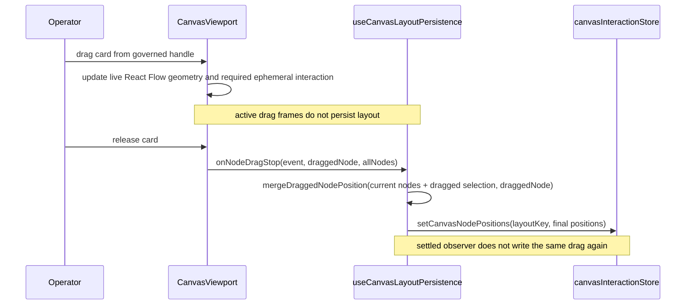
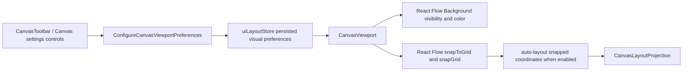
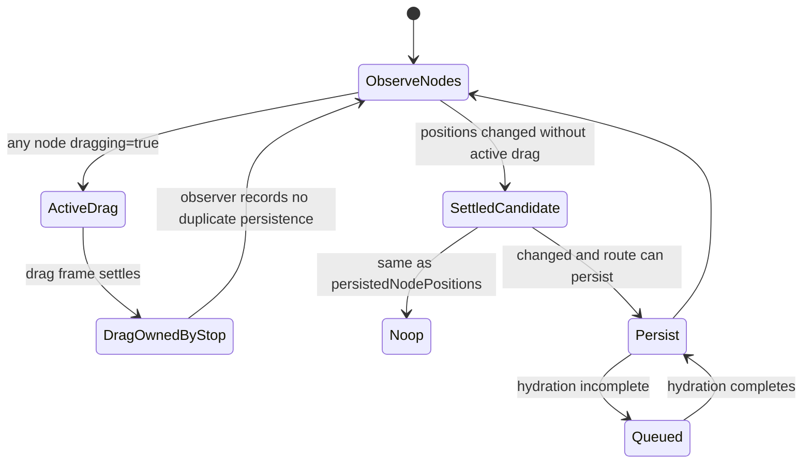
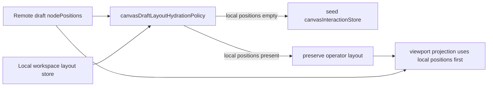

# Canvas Layout Persistence Component

## Purpose

This guide defines the local component that persists route-local Canvas layout
observations and viewport presentation preferences: viewport position, node
coordinates, grid visibility, grid color, and snap-to-grid behavior. It does not
own authoritative graph draft state.

This distinction matters because Canvas has two truths:

- graph meaning and draft persistence belong to the protected authoring draft;
- viewport and card coordinates belong to route-local layout state.

## Governing Sources

- `AGENTS.md`
- `docs/planning/status/governance-document-rule-inventory.md`
- `docs/guides/ai-work-protocol.md`
- `docs/architecture/command-query-rail-governance.md`
- `docs/architecture/fowler-opportunity-planning-governance.md`
- `docs/architecture/components/web/graph/canvas-workbench-command-query-catalog.md`
- `docs/architecture/components/web/graph/canvas-layout-persistence-user-stories.md`
- `buzon/20260504-codex-fowler-canvas-workbench-tabs-and-layout-analysis-and-remediation.md`

## Owned Concern

Owned concern: persist route-local Canvas viewport and coordinate projection
state without becoming protected draft authority.

Canonical local C&Q catalog:
`docs/architecture/components/web/graph/canvas-workbench-command-query-catalog.md`.

## Local Traceability

- C&Q catalog:
  `docs/architecture/components/web/graph/canvas-workbench-command-query-catalog.md`
- User stories:
  `docs/architecture/components/web/graph/canvas-layout-persistence-user-stories.md`
- Fowler mailbox:
  `buzon/20260504-codex-fowler-canvas-workbench-tabs-and-layout-analysis-and-remediation.md`

## Public API

| API                                          | Owner                                 | Responsibility                                                                               |
| -------------------------------------------- | ------------------------------------- | -------------------------------------------------------------------------------------------- |
| `useCanvasLayoutPersistence(...)`            | `useCanvasLayoutPersistence.ts`       | Return node-position, node-drag, and viewport persistence handlers.                          |
| `handleNodePositionsSave`                    | `useCanvasLayoutPersistence.ts`       | Persist a complete node-position map for the active layout key.                              |
| `handleNodeDrag`                             | `useCanvasLayoutPersistence.ts`       | Preserve the current viewport callback seam without persisting active drag frames.           |
| `handleNodeDragStop`                         | `useCanvasLayoutPersistence.ts`       | Persist the final drag-stop event payload over stale React Flow arrays.                      |
| `handleViewportChange`                       | `useCanvasLayoutPersistence.ts`       | Persist viewport only after hydration and graph readiness.                                   |
| `shouldSeedCanvasLayoutFromRemoteDraft(...)` | `canvasDraftLayoutHydrationPolicy.ts` | Allow remote draft coordinates to seed local layout only when no local card positions exist. |
| `useCanvasViewportGraphModel(...)`           | `useCanvasViewportGraphModel.ts`      | Project canonical graph nodes into live React Flow viewport nodes.                           |
| `CanvasViewport` callbacks                   | `CanvasViewport.tsx`                  | Forward governed React Flow gesture callbacks only.                                          |
| `setCanvasGridVisible(...)`                  | `uiLayoutStore.ts`                    | Persist whether the viewport grid is rendered.                                               |
| `setCanvasGridColor(...)`                    | `uiLayoutStore.ts`                    | Persist the grid line color as a normalized hex color.                                       |
| `setCanvasSnapToGrid(...)`                   | `uiLayoutStore.ts`                    | Persist whether React Flow drag and auto-layout coordinates snap to the grid.                |
| `ConfigureCanvasViewportPreferences`         | Canvas shell chrome command rail      | Apply grid and snap preferences without changing graph authority.                            |

## Invariants

- Node-position persistence only runs after the route-local layout store has
  completed automatic hydration.
- Viewport persistence runs after layout hydration and after the graph query is
  no longer pending.
- Node-position observations captured before hydration are queued and flushed
  after hydration completes; they must not be dropped.
- Drag-stop persistence trusts the `draggedNode` event payload over the stale
  viewport snapshot. React Flow supplies only the dragged selection in its final
  node-array payload; merge those final coordinates into the complete current
  viewport map so moving one selection preserves every other node position.
- Active drag frames are not layout durability boundaries and must not persist
  route-local node positions merely because the pointer moved.
- A settled observer frame following an active drag does not persist the drag a
  second time; `handleNodeDragStop` is the drag completion durability boundary.
- Settled coordinate changes that did not come from an active pointer drag may
  still persist through the viewport-model observer.
- Remote draft coordinates may seed route-local layout only when the active
  workspace layout has no locally persisted node positions.
- Bootstrap and reload must not overwrite operator-owned card positions after a
  browser refresh. The protected draft remains authoritative for graph meaning,
  but not for route-local card layout once the operator has persisted layout.
- The component must not import draft-authoring ports, API clients, or
  protected draft save functions.
- The controller must pass both `graphModel.nodes` and
  `store.persistedNodePositions`; layout persistence must not reconstruct graph
  truth itself.
- Grid preferences are workbench visual preferences. They must be persisted in
  `uiLayoutStore`, not in the protected draft and not in
  `canvasInteractionStore`.
- `CanvasViewport` may hide the React Flow background grid, but that must not
  disable node dragging, edge editing, or layout persistence.
- Snap-to-grid may adjust renderer coordinates produced by drag or auto-layout,
  but it must not modify canonical node identity, node kind, graph edges, or
  protected draft authority.
- Auto-layout must preserve React Flow node type, data, and gesture capability;
  layout is a coordinate projection, not a node replacement authority.

## Command And Query Rails

Canonical local catalog:
`docs/architecture/components/web/graph/canvas-workbench-command-query-catalog.md`.

| Rail                                 | Type    | DDD owner                                | Application surface                              | Negative coverage                                                       |
| ------------------------------------ | ------- | ---------------------------------------- | ------------------------------------------------ | ----------------------------------------------------------------------- |
| `PersistCanvasLayout`                | command | `CanvasLayoutProjection` value object    | `useCanvasLayoutPersistence(...)`                | pending query and pre-hydration persistence are blocked or queued       |
| `GetCanvasLayout`                    | query   | `CanvasLayoutProjection` value object    | `canvasInteractionStore` hydration               | local layout is not overwritten when protected draft coordinates reload |
| `ConfigureCanvasViewportPreferences` | command | `CanvasViewportPreferences` value object | `uiLayoutStore` and Canvas presentation surfaces | hidden grid keeps node creation and drag enabled                        |

`ConfigureCanvasViewportPreferences` is intentionally local to the Web Graph
bounded frontend context. It changes operator presentation preferences only.
Any backend draft write, graph mutation, or workspace-wide settings API for the
same intent would be a new rail and must be planned separately before code is
added.

## Transitions

### Drag persistence

### Viewport preference command

### Settled viewport observation

### Remote draft layout seeding

## Consumers

Direct consumers:

- `useCanvasController.ts`
- `CanvasViewport.tsx`
- `useCanvasViewportGraphModel.ts`
- `canvasInteractionStore`

Indirect consumers:

- Canvas browser operability flows
- route-level persistence tests
- selected-closure live proof scripts

## Fowler Reading

| Pattern                       | Local expression                   | Maturity rule                                             |
| ----------------------------- | ---------------------------------- | --------------------------------------------------------- |
| Presentation Model            | viewport graph model               | Keep renderer coordinates separate from graph semantics.  |
| Application Controller seam   | `useCanvasLayoutPersistence()`     | Coordinate layout effects without owning draft authority. |
| Intention-Revealing Interface | `handleNodeDragStop` payload merge | Name the stale snapshot hazard directly.                  |
| Policy Object                 | hydration and equality guards      | Persist only when hydrated and materially changed.        |
| Value Object                  | `CanvasViewportPreferences`        | Keep visual preferences separate from graph truth.        |
| Application Controller seam   | `CanvasToolbar` command callbacks  | Route visual commands without making toolbar own state.   |

## Negative Coverage

Primary tests:

- `apps/web/src/app/views/canvas/useCanvasController.persistence.test.tsx`
- `apps/web/src/app/views/canvas/useCanvasViewportGraphModel.layout.test.tsx`
- `apps/web/src/app/views/canvas/CanvasViewport.test.tsx`
- `apps/web/src/app/views/canvas/canvasDraftRecoveryBoundary.architecture.test.ts`

The tests cover automatic store hydration, pre-hydration node-position queueing,
pending-query viewport denial, stale drag-stop payload replacement, active drag
non-persistence, drag-stop-only drag completion persistence, non-drag settled
coordinate persistence, remote-draft hydration not overwriting local layout after
refresh/reload, grid preference persistence, grid background visibility/color,
snap-to-grid propagation, snapped auto-layout coordinates, and semantic boundary
rules.

## Drift To Watch

- Do not persist layout by calling the protected draft authoring port.
- Do not infer graph meaning from stored coordinates.
- Do not allow React Flow's stale `allNodes` array to overwrite the event
  payload for the dragged card.
- Do not reintroduce route-local layout persistence on active drag frames; the
  settled drag-stop gesture is the durability boundary.
- Do not let the settled viewport observer duplicate a drag-stop layout write.
- Do not let protected draft bootstrap or reload overwrite a workspace layout
  that already contains local card positions.
- Do not re-enable drag gestures outside `CanvasViewport` permission policy.
- Do not store grid visibility, grid color, or snap preferences in protected
  graph drafts.
  They are explicitly not in protected graph drafts.
- Do not let auto-layout replace node data/type fields or reintroduce
  handle-only dragging.
- Do not treat Canvas grid visibility, grid color, or snap-to-grid as draft
  semantics; they are route-local presentation preferences until a governed
  slice says otherwise.
- Do not let auto-layout become an edit-permission toggle. Layout may project
  positions, but graph editability remains owned by Canvas interaction policy.

## Backlog Signals

The following sanitized proposals are tracked in
`docs/planning/proposals/web-frontend-operability-backlog-20260430.md` and must
not live as scratch files under `apps/**`:

- new Canvas nodes should be placed inside the visible viewport;
- auto-layout should not make nodes immovable after it runs;
- Canvas should expose governed grid visibility and grid color preferences;
- Canvas should support optional snap-to-grid for node creation and dragging.

Future implementation must add command/query rails before code changes. Likely
rails are `ResolveCanvasNodeInitialPosition`, `ApplyCanvasLayout`,
`SetCanvasGridPresentation`, and `SetCanvasSnapToGridPreference`, all owned by
Canvas route-local presentation rather than protected draft persistence.
