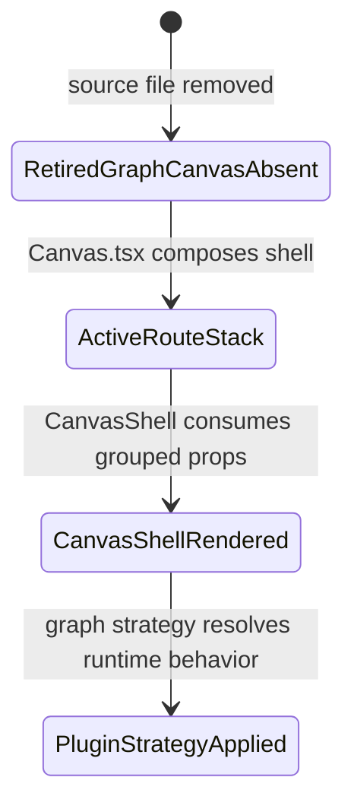
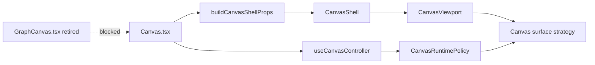

# Canvas Legacy Retirement Component

## Purpose

Define the local boundary that keeps the retired `GraphCanvas.tsx` path out of
the active Canvas route.

Owned concern: prove that Canvas graph authoring has one active route stack:
`Canvas.tsx`, `CanvasShell`, `useCanvasController`, and plugin graph strategy
registration.

This component does not own graph mutation semantics, protected draft
persistence, or plugin contribution registration.

## Governing Sources

- [Graph Frontend Architecture](./graph-frontend-architecture.md)
- [Canvas Route Composition Component](./canvas-route-composition-component.md)
- [Canvas Shell Component](./canvas-shell-component.md)
- [Canvas Workbench Command Query Catalog](./canvas-workbench-command-query-catalog.md)
- [F-12 Fowler mailbox analysis](../../../../../buzon/20260518-f12-fowler-canvas-legacy-retirement-analysis.md)

## Public API

| API                            | Owner                    | Responsibility                                    |
| ------------------------------ | ------------------------ | ------------------------------------------------- |
| `Canvas.tsx`                   | Canvas route composition | Route-level controller, shell, and modal handoff. |
| `CanvasShell`                  | Canvas shell             | Passive three-panel graph workbench rendering.    |
| `useCanvasController`          | Canvas route facade      | Route state, draft, runtime, and command facade.  |
| `CanvasViewport`               | Canvas graph viewport    | Renders the graph as the permanent work surface.  |
| `resolveCanvasSurfaceStrategy` | Canvas surface strategy  | Selects DBT/DVT graph placement behavior.         |

Retired API:

- `GraphCanvas.tsx` is not an active source file.
- `createGraphCanvasWorkbenchTab` is not an active API name.

## Invariants

- `apps/web/src/app/components/GraphCanvas.tsx` must not exist.
- Active Canvas route composition must go through `Canvas.tsx`.
- `Canvas.tsx` must delegate shell props to `buildCanvasShellProps`.
- `CanvasShell` must render the active graph surface from grouped shell
  contracts, not a parallel retired renderer.
- Active code must not reintroduce Graph as a route tab or legacy renderer.
- Active code must not reintroduce `createGraphCanvasWorkbenchTab`.
- Historical references under `docs/archive/**` are reference-only and do not
  reopen active architecture.

## Transitions

## Legacy Retirement Diagram

## Consumers

- `Canvas.tsx` consumes the active route-composition stack.
- `CanvasShell` consumes grouped shell props.
- `CanvasShell.architecture.test.tsx` validates that retired tab presenters stay
  out of the active shell.
- `canvasRoutePosturePriority.architecture.test.ts` validates retired-file
  absence.

## Scenario Coverage

- `US-CANVAS-LEGACY-001`: no active source file named `GraphCanvas.tsx`.
- `US-CANVAS-LEGACY-002`: graph remains the default Canvas surface, not a
  workbench tab.
- `US-CANVAS-LEGACY-003`: docs name the active stack and retired boundary.
- `US-CANVAS-LEGACY-004`: architecture tests fail if retired names return.
