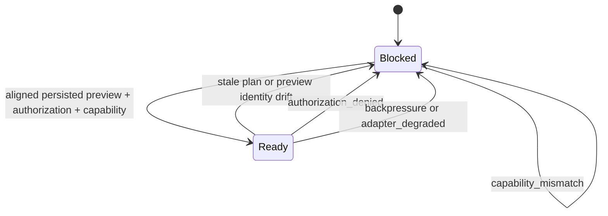
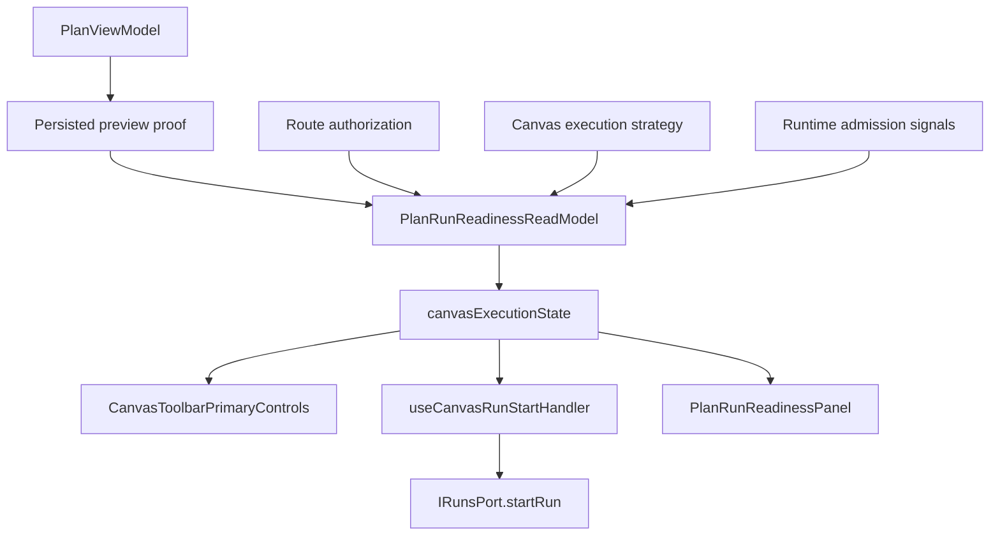
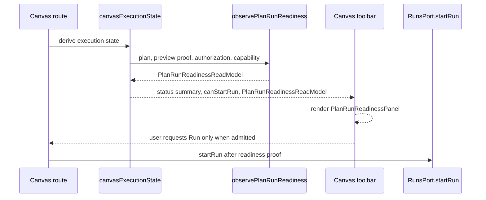

# Canvas Plan/Run Readiness Component

## Purpose

Canvas plan/run readiness owns the presentation read model for
`ObservePlanRunReadiness`. It decides whether the current Canvas route can show
plan/run controls as ready or blocked and why. It does not create plans, start
runs, own runtime identity, or replace planner/runtime contracts.

## Public API

| API                                         | Kind                   | Owned concern                                                                                                  |
| ------------------------------------------- | ---------------------- | -------------------------------------------------------------------------------------------------------------- |
| `observePlanRunReadiness(args)`             | query adapter          | Publishes the `PlanRunReadinessReadModel` from Canvas execution inputs.                                        |
| `PlanRunReadinessReadModel`                 | read model             | Carries `rail`, `status`, `blockers`, and `summary` for presentation consumers.                                |
| `PlanRunReadinessBlocker`                   | value vocabulary       | Names `plan_integrity`, `backpressure`, `capability_mismatch`, `adapter_degraded`, and `authorization_denied`. |
| `PlanRunReadinessPanel`                     | presentation component | Renders the read model status, blockers, and summary without owning blocker semantics.                         |
| `buildPlanStatusSummary(args)`              | compatibility adapter  | Returns the existing Canvas summary copy from the source-owned read model.                                     |
| `hasPersistedPreviewProof(plan)`            | policy helper          | Accepts only persisted preview proof aligned to the active plan reference.                                     |
| `hasPersistedPreviewIdentityMismatch(plan)` | policy helper          | Detects plan-record drift before run start.                                                                    |
| `resolvePlanRefForStartRun(plan)`           | value extractor        | Reads the plan reference used by `IRunsPort.startRun`.                                                         |

## Invariants

- `ObservePlanRunReadiness` is a query rail; it does not mutate route state.
- The toolbar renders readiness; it does not own blocker semantics.
- Run start is ready only when authorization admits runs, a current plan exists,
  planRef exists, persisted preview proof exists, the persisted proof matches
  the active plan, the visible graph is executable, and no runtime blocker is
  present.
- `plan_integrity` covers missing plan, stale plan, missing planRef,
  preview-identity mismatch, missing persisted preview proof, and a visible
  graph that can no longer execute.
- DVT transformation Canvas is authorable but `not_executable`. Its readiness
  is `capability_mismatch`; selection-for-execution, Preview, and Run remain
  unavailable until a governed replacement rail is implemented.
- `authorization_denied` covers route permission denial before any
  `IRunsPort.startRun` call.
- `capability_mismatch` covers canvas kinds or execution strategies that cannot
  preview or start a run.
- `backpressure` and `adapter_degraded` are runtime admission vocabulary slots;
  they are modeled now so future backend admission evidence can reuse the same
  read model instead of adding toolbar-local strings.
- The read model must preserve all blocker names even when the summary chooses
  one user-facing message.

## State Transitions

- `ready` moves to `blocked` when authorization is removed.
- `ready` moves to `blocked` when the active plan becomes stale or loses
  persisted preview proof.
- `ready` moves to `blocked` when the visible graph no longer satisfies the
  execution graph validation rules.
- `blocked` moves to `ready` after a current persisted preview aligns with the
  active plan reference and runtime blockers clear.
- `blocked` stays `blocked` when capability mismatch, backpressure, or adapter
  degradation remains present.
- Readiness changes do not accept F-27 alpha full while cadence and risk triage
  remain open.

## Consumers

| Consumer                           | Use                                                                                        |
| ---------------------------------- | ------------------------------------------------------------------------------------------ |
| `canvasExecutionState.ts`          | Builds Canvas execution state from graph validation, execution strategy, and readiness.    |
| `useCanvasExecutionActions.ts`     | Exposes `canStartRun`, `planRunReadiness`, and compatibility summary to route composition. |
| `CanvasToolbar.tsx`                | Renders the visible readiness panel while keeping blocker semantics in the read model.     |
| `CanvasToolbarPrimaryControls.tsx` | Renders workflow status and buttons without owning read-model semantics.                   |
| `useCanvasRunStartHandler.ts`      | Keeps run start fail-closed before calling `IRunsPort.startRun`.                           |
| F-27 route gate                    | Consumes plan/run readiness evidence for the internal alpha route matrix.                  |

## Architecture Diagram

## Sequence Diagram

## Evidence

- `apps/web/src/app/views/canvas/canvasPlanReadiness.test.ts`
- `apps/web/src/app/views/canvas/PlanRunReadinessPanel.test.tsx`
- `apps/web/src/app/views/canvas/useCanvasExecutionActions.runStartGuards.test.tsx`
- `apps/web/src/app/views/canvas/useCanvasExecutionActions.runStartSuccess.test.tsx`
- `apps/web/src/app/views/canvas/useCanvasExecutionActions.dbtPreviewRun.test.tsx`
- `apps/web/cypress/e2e/canvas/canvas-dbt-author-code-run-live.cy.ts`

## Extension Rules

- Add new blocker names only in `PlanRunReadinessBlocker` and this guide.
- Do not add blocker interpretation to toolbar components.
- Do not treat fixture or localStorage state as runtime admission truth.
- Backend admission states must map into the existing read model before UI copy
  changes.
