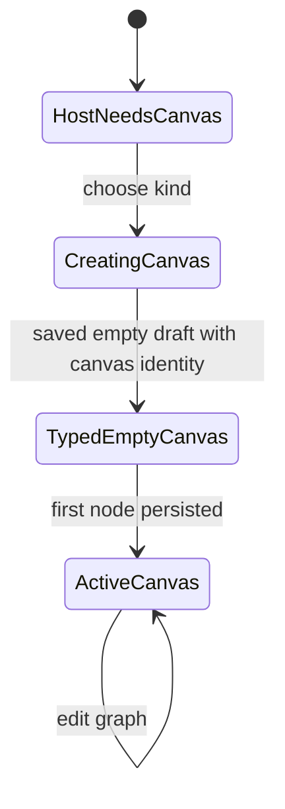
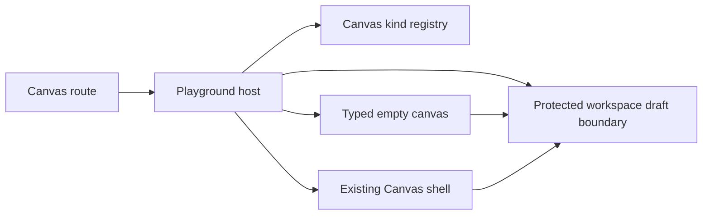
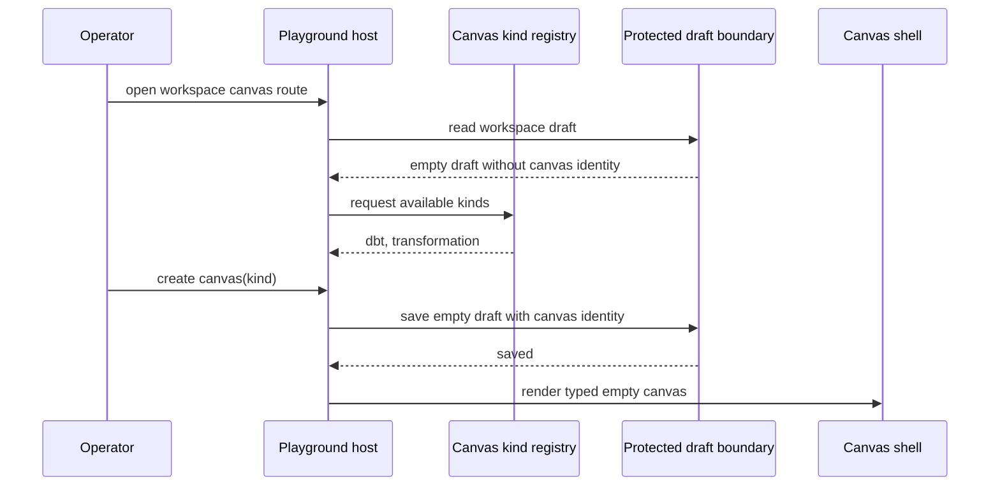

# Canvas Playground Host Component

## Purpose

This document defines the host layer that sits above the Canvas route.

Use it for:

- the `workspace -> playground -> canvas document` boundary
- the host-owned create-canvas flow
- the typed first-canvas posture for `dbt` and `transformation`

Do not use this page as the full `TF-E2` roadmap or as the draft aggregate
spec.

## Governing sources

- [TF-E2 Canvas Target Architecture Execution Plan 2026-04-17](../../../../planning/proposals/mandatory/frontend-and-ux/tf-e2-canvas-target-architecture-execution-plan-20260417.md)
- [TF-E2 project playground and multi-canvas host plan 2026-04-23](../../../../planning/proposals/mandatory/frontend-and-ux/tf-e2-project-playground-and-multi-canvas-host-plan-20260423.md)
- [TF-E2 Canvas Empty Authoring Entrypoint Design 2026-04-22](../../../../planning/proposals/mandatory/frontend-and-ux/tf-e2-canvas-empty-authoring-entrypoint-design-20260422.md)
- [Workspace authoring draft aggregate](../../../planner/workspace-authoring-draft-aggregate.md)
- [Canvas Route Composition Component](./canvas-route-composition-component.md)
- [Canvas Empty Authoring Entrypoint Component](./canvas-empty-authoring-entrypoint-component.md)
- [Canvas Shell Component](./canvas-shell-component.md)

## Fowler reading

| Fowler concept | Owner in this slice                | Why                                                                                 |
| -------------- | ---------------------------------- | ----------------------------------------------------------------------------------- |
| Facade         | playground host seam               | one route-safe host contract over create-canvas, active document, and kind registry |
| Registry       | canvas-kind registry               | host asks for typed canvas kinds without owning plugin semantics                    |
| View model     | host presentation model            | route JSX renders host posture without owning selection logic                       |
| Gateway        | protected workspace draft boundary | canvas document identity persists through the canonical draft contract              |

The host must not become a god component. It owns document hosting and kind
selection only. It does not own graph mutation semantics, preview logic, or
run authority.

## Scope for the current implementation slice

Current target is `TF-E2-K-A`, not the whole multi-canvas route.

That means:

- one persisted canvas document per workspace is acceptable for this hito
- the canvas document must carry an explicit `kind`
- the host must expose a real create-canvas flow before `Add first node`
- multi-canvas tab restoration remains a later slice

This is intentional. The current protected draft contract is still one draft
record per workspace. The host must not fake multiple authoritative canvases
before that boundary exists.

## Public API

| API                           | Responsibility                                                                        |
| ----------------------------- | ------------------------------------------------------------------------------------- |
| `CanvasKindRegistration`      | host-safe declaration of a canvas kind contributed by a plugin                        |
| `CanvasDocumentIdentity`      | current workspace canvas title and kind                                               |
| `CanvasPlaygroundHostState`   | host posture: create-first-canvas, typed-empty-canvas, active-canvas                  |
| `CreateCanvasDocumentCommand` | host-owned command that persists the first canvas identity through the draft boundary |

## Invariants

- Canvas remains a document inside the workspace, not route authority.
- The host owns create-canvas posture and current document identity.
- Plugin contributions own canvas kind semantics and node catalogs.
- The first canvas must round-trip through canonical draft persistence.
- The host must not invent local-only semantic success.
- The host may render one active canvas tab in this slice, but must not imply
  multi-canvas persistence that the backend does not yet support.

## Transitions

## Component ownership

## Sequence

## Consumers

- `Canvas.tsx`
- route-owned Canvas host builders and view-model seams
- empty authoring entrypoint
- plugin registry helpers exposing typed canvas kinds

## Non-goals

- multiple persisted canvas documents in one workspace
- shell-owned execution selection
- plugin-owned route authority
- hidden browser-only canvas metadata
