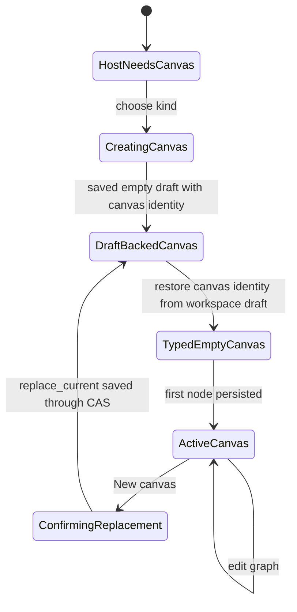
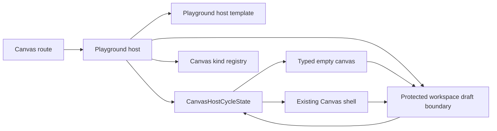
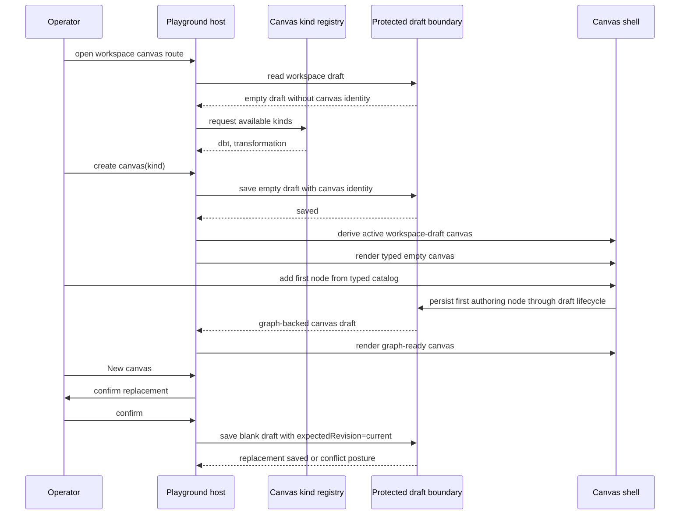
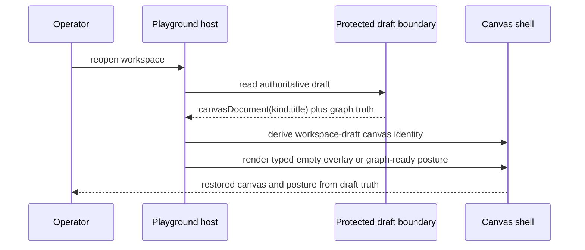

# Canvas Playground Host Component

## Purpose

This document defines the host layer that sits above the Canvas route.

Use it for:

- the `workspace -> playground -> canvas document` boundary
- the host-owned create-canvas flow
- the typed first-canvas posture for `dbt` and `transformation`

Do not use this page as the full `TF-E2` roadmap or as the draft aggregate
spec.

## Governing sources

- [TF-E2 Canvas Target Architecture Execution Plan 2026-04-17](../../../../planning/proposals/mandatory/frontend-and-ux/tf-e2-canvas-target-architecture-execution-plan-20260417.md)
- [TF-E2 project playground and multi-canvas host plan 2026-04-23](../../../../planning/proposals/mandatory/frontend-and-ux/tf-e2-project-playground-and-multi-canvas-host-plan-20260423.md)
- [TF-E2 Canvas Empty Authoring Entrypoint Design 2026-04-22](../../../../planning/proposals/mandatory/frontend-and-ux/tf-e2-canvas-empty-authoring-entrypoint-design-20260422.md)
- [Workspace authoring draft aggregate](../../../planner/workspace-authoring-draft-aggregate.md)
- [Canvas Route Composition Component](./canvas-route-composition-component.md)
- [Canvas Empty Authoring Entrypoint Component](./canvas-empty-authoring-entrypoint-component.md)
- [Canvas Shell Component](./canvas-shell-component.md)
- [Canvas Startup Template Selection Component](./canvas-startup-template-selection-component.md)

## Fowler reading

| Fowler concept | Owner in this slice                | Why                                                                                 |
| -------------- | ---------------------------------- | ----------------------------------------------------------------------------------- |
| Facade         | playground host seam               | one route-safe host contract over create-canvas, active document, and kind registry |
| Registry       | canvas-kind registry               | host asks for typed canvas kinds without owning plugin semantics                    |
| DTO            | `CanvasHostCycleState`             | one story-shaped cycle contract replaces broad transport-shaped setup bags          |
| View model     | host presentation model            | route JSX renders host posture without owning selection logic                       |
| Gateway        | protected workspace draft boundary | canvas document identity persists through the canonical draft contract              |

The host must not become a god component. It owns document hosting and kind
selection only. It does not own graph mutation semantics, preview logic, or
run authority.

## Scope for the current implementation slices

Current implemented target is `TF-E2-K-A` through `TF-E2-K-D`, not the whole
multi-canvas route.

That means:

- one persisted canvas document per workspace is acceptable for this hito
- the canvas document must carry an explicit `kind`
- the host must expose a real create-canvas flow before `Add first node`
- the host must expose explicit tab chrome for the authoritative draft-backed
  canvas
- the host must derive a stable host-cycle DTO before route and workbench tests
  widen again
- multi-canvas persistence remains a later slice

This is intentional. The current protected draft contract is still one draft
record per workspace. The host must not fake multiple authoritative canvases
before that boundary exists.

## Public API

- `CanvasKindRegistration`: host-safe declaration of a canvas kind contributed
  by a plugin.
- `CanvasDocumentIdentity`: current workspace canvas title and kind.
- `CanvasPlaygroundHostState`: host posture: create-first-canvas,
  typed-empty-canvas, active-canvas.
- `CanvasHostCycleState`: story-shaped host cycle DTO: needs-canvas,
  typed-empty, graph-ready.
- `CreateCanvasDocumentCommand`: host-owned command that persists first or
  explicitly replaced canvas identity through the draft boundary.
- `CanvasPlaygroundHostTemplate`: first-canvas host template that renders
  resolved copy and canvas-kind options without building commands.
- `WorkspaceScope`: active tenant, project, environment, and adapter context
  shown before the first canvas template choice.

## Invariants

- Canvas remains a document inside the workspace, not route authority.
- The host owns create-canvas posture and current document identity.
- Plugin contributions own canvas kind semantics and node catalogs.
- The first canvas must round-trip through canonical draft persistence.
- Replacement of an existing draft-backed canvas must use `replace_current`,
  operator confirmation, and the current draft revision as CAS guard.
- The graph canvas is the base work surface; the host must not expose a
  separate tab-state seam for graph/code/log/project modes.
- The host must not invent local-only semantic success.
- The host may render one active canvas document label in this slice, but must
  not imply multi-canvas persistence that the backend does not yet support.
- Host and workbench tests must consume `CanvasHostCycleState` rather than
  reconstructing wide transport-shaped scenario bags for every cycle.
- Route test-support for host cycles must live in a dedicated scenario module;
  `Canvas.test.controller.defaults.ts` stays for generic controller defaults,
  not cycle-specific story DTOs.
- Route-level host-cycle proofs must advance from `needs_canvas` to
  `typed_empty` and then `graph_ready` through stable cycle DTO seams rather
  than bespoke controller transport bags.
- Test-support fixtures must resolve first-node kinds from the registered
  catalog for the active canvas kind; `dbt` proofs must not borrow
  transformation-only fixtures.
- On reopen, the active canvas identity and typed posture must derive from the
  authoritative draft-backed `canvasDocument`; ambient controller mode must not
  override restore posture.
- Restored typed-empty posture renders the authoritative canvas shell directly;
  it must not cover the viewport with a passive onboarding overlay.
- First-canvas host HTML belongs in `CanvasPlaygroundHost.templates.tsx`.
  `CanvasPlaygroundHost.tsx` owns copy selection and create-canvas command
  construction.
- Host templates must not construct `CanvasCreateCanvasDocumentCommand` DTOs.
- First-canvas startup must show active workspace context before the template
  choices.
- User-facing first-canvas choices are canvas templates; route copy must not
  describe `dbt` or `Transformation` as project types.
- First-canvas template titles and descriptions must render through
  `CanvasTemplatePresentation` so registry labels and raw plugin copy do not
  leak as the primary startup taxonomy.

## Transitions

## Component ownership

## Sequence

## Authoritative restore

## Consumers

- `Canvas.tsx`
- route-owned Canvas host builders and view-model seams
- empty authoring entrypoint
- plugin registry helpers exposing typed canvas kinds

## Non-goals

- multiple persisted canvas documents in one workspace
- shell-owned execution selection
- plugin-owned route authority
- hidden browser-only canvas metadata
