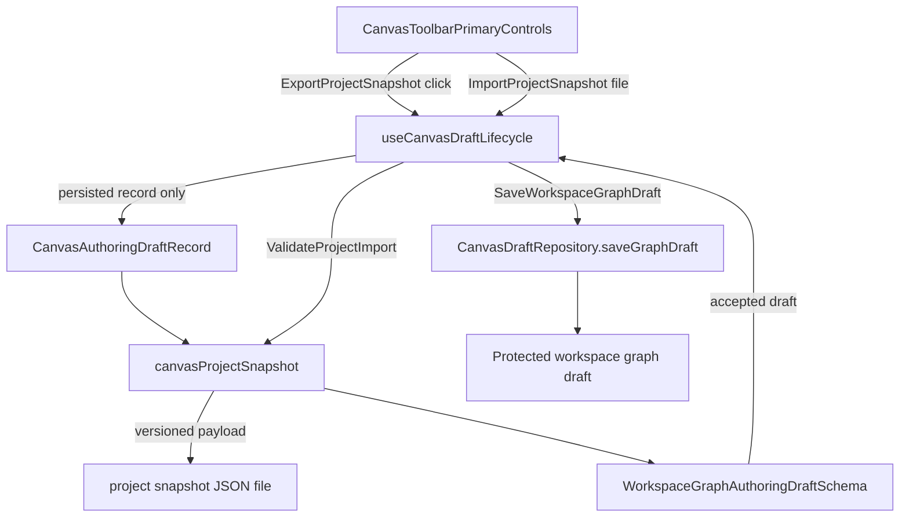
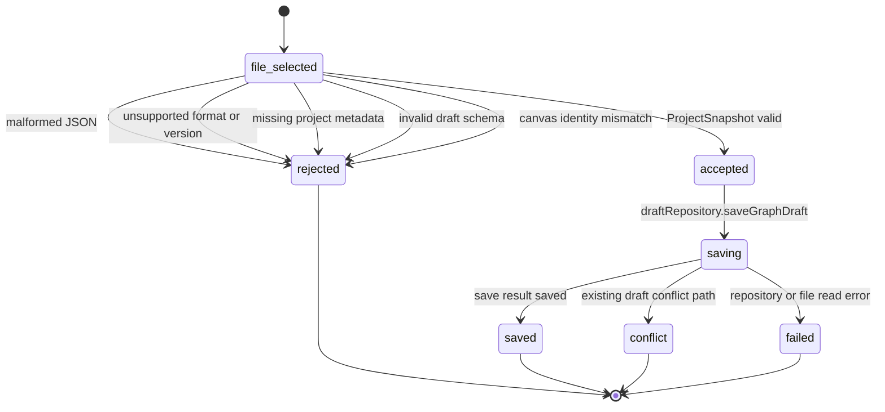
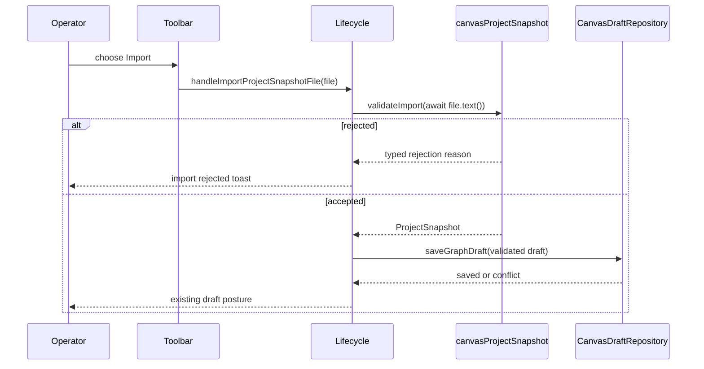

# Canvas Project Snapshot Component

## Purpose

Define the local Web Graph component that exports, validates, and imports a
Canvas project snapshot file without making the file a second graph authority.

The component is intentionally narrower than backend Project Assets. It is a
browser file handoff over the existing protected `WorkspaceGraphAuthoringDraft`
aggregate and the existing `SaveWorkspaceGraphDraft` command rail.

## Governing Sources

- [Canvas Workbench Command And Query Catalog](./canvas-workbench-command-query-catalog.md)
- [Canvas Authoring Draft Boundary Component](./canvas-authoring-draft-boundary-component.md)
- [Canvas Draft Session Component](./canvas-draft-session-component.md)
- [Canvas Project Snapshot User Stories](./canvas-project-snapshot-user-stories.md)
- [Stage 3 Project Snapshot Roundtrip Plan](../../../planning/proposals/mandatory/frontend-and-ux/canvas-workbench-stage-3-project-snapshot-roundtrip-plan-20260511.md)
- [Fowler mailbox analysis](../../../../../buzon/20260511-codex-fowler-canvas-project-snapshot-analysis-and-remediation.md)

## Component Reading Rule

Read the component in this order:

1. `canvasProjectSnapshot.ts`
   the semantic public API and value-object validation boundary
2. `useCanvasDraftLifecycle.ts`
   the application-controller consumer that bridges toolbar file commands to
   the existing draft repository
3. `CanvasToolbarPrimaryControls.tsx`
   the passive browser file-input surface
4. `canvasProjectSnapshot.test.ts`
   value-object and rejection proof
5. `canvasProjectSnapshot.architecture.test.ts`
   semantic component guard
6. `canvas-project-snapshot-roundtrip.cy.ts`
   browser round-trip and fail-closed import proof

If a change needs backend storage, stable long-term file compatibility, or
cross-adapter contract vocabulary, it belongs in a future Project Assets slice,
not in this component.

## Public API

The public component entrypoint is the namespaced `canvasProjectSnapshot` API:

- `canvasProjectSnapshot.format`
  current file format discriminator, currently `dvt.project-snapshot`
- `canvasProjectSnapshot.schemaVersion`
  current local schema version, currently `1`
- `canvasProjectSnapshot.buildFileName(canvasTitle)`
  normalizes a Canvas title into the downloadable snapshot filename
- `canvasProjectSnapshot.exportFile(input)`
  implements `ExportProjectSnapshot` by serializing a persisted draft record
  into a versioned file payload
- `canvasProjectSnapshot.validateImport(contents)`
  implements `ValidateProjectImport` by parsing and validating a candidate file
  before any save command can run

The public value vocabulary remains:

- `ProjectSnapshot`
- `ProjectSnapshotImportReadModel`
- `ProjectSnapshotImportValidation`
- `ProjectSnapshotImportRejectionReason`
- `ExportProjectSnapshotInput`
- `ExportProjectSnapshotResult`

Consumers should prefer the namespaced API for behavior and reserve the
individual exported types for compile-time vocabulary.

## File Responsibilities

<!-- markdownlint-disable MD060 -->

| File                                         | Owned concern                                                                    | Public to other modules |
| -------------------------------------------- | -------------------------------------------------------------------------------- | ----------------------- |
| `canvasProjectSnapshot.ts`                   | namespaced component API, file envelope, versioning, validation, filename policy | yes                     |
| `canvasProjectSnapshot.test.ts`              | value-object round-trip and rejection semantics                                  | test only               |
| `canvasProjectSnapshot.architecture.test.ts` | semantic docs/API/boundary architecture guard                                    | test only               |
| `useCanvasDraftLifecycle.ts`                 | application-controller bridge to existing draft save authority                   | existing lifecycle API  |
| `CanvasToolbarPrimaryControls.tsx`           | passive export/import controls and hidden file input                             | shell consumer only     |
| `canvas-project-snapshot-roundtrip.cy.ts`    | browser proof for export, rejected import, valid import, and reload              | Cypress only            |
| `canvas-project-snapshot-user-stories.md`    | operator scenario coverage                                                       | docs                    |
| `20260511-codex-fowler-...-remediation.md`   | branch-level Fowler analysis and remediation rationale                           | mailbox review          |

<!-- markdownlint-enable MD060 -->

## Component Flow

## Import State Machine

## Sequence

## Invariants

- Snapshot JSON is never graph authority until
  `canvasProjectSnapshot.validateImport` accepts it.
- Import must call `CanvasDraftRepository.saveGraphDraft`; it must not seed
  repository state, local route state, or Cypress state directly.
- Export reads a persisted `CanvasAuthoringDraftRecord`; it must not export a
  failed or unsaved local working set as if it were authoritative.
- `ProjectSnapshot.format` and `ProjectSnapshot.schemaVersion` must be present
  and checked before draft validation.
- The declared Canvas identity must match the draft payload identity.
- Project metadata is audit context for the file. Import writes into the
  current workspace through the existing draft rail.
- File-read errors, malformed JSON, unsupported versions, invalid drafts, and
  repository failures remain fail-closed.

## Transitions

<!-- markdownlint-disable MD060 -->

| Transition                                 | Rail                     | Result                                                                   |
| ------------------------------------------ | ------------------------ | ------------------------------------------------------------------------ |
| persisted draft to JSON file               | `ExportProjectSnapshot`  | versioned `ProjectSnapshot` download                                     |
| file text to rejected import read model    | `ValidateProjectImport`  | typed rejection and no save attempt                                      |
| file text to accepted import read model    | `ValidateProjectImport`  | normalized `ProjectSnapshot` with validated authoring draft              |
| accepted snapshot to protected draft save  | `ImportProjectSnapshot`  | `SaveWorkspaceGraphDraft` through `CanvasDraftRepository.saveGraphDraft` |
| repository saved/conflict/failure to route | existing draft lifecycle | existing saved, conflict, or failed posture                              |

<!-- markdownlint-enable MD060 -->

## Consumers

- `useCanvasDraftLifecycle.ts`
  owns command admission, toast fallout, and repository save orchestration.
- `CanvasToolbarPrimaryControls.tsx`
  raises export/import events and does not inspect snapshot internals.
- `CanvasToolbar.tsx`, `CanvasShellMainPanel.tsx`, and shell builders
  propagate command availability and callbacks only.
- `canvasProjectSnapshot.test.ts`
  proves value-object behavior and negative cases.
- `canvas-project-snapshot-roundtrip.cy.ts`
  proves the browser route uses the same rails end to end.

## Local Traceability

- Command/query rails:
  `ExportProjectSnapshot`, `ValidateProjectImport`, `ImportProjectSnapshot`,
  and existing `SaveWorkspaceGraphDraft`
- Component guide:
  `docs/architecture/components/web/graph/canvas-project-snapshot-component.md`
- User stories:
  `docs/architecture/components/web/graph/canvas-project-snapshot-user-stories.md`
- Mailbox:
  `buzon/20260511-codex-fowler-canvas-project-snapshot-analysis-and-remediation.md`
- Unit tests:
  `apps/web/src/app/views/canvas/canvasProjectSnapshot.test.ts`
- Architecture test:
  `apps/web/src/app/views/canvas/canvasProjectSnapshot.architecture.test.ts`
- Cypress proof:
  `apps/web/cypress/e2e/canvas/canvas-project-snapshot-roundtrip.cy.ts`

## Drift To Watch

- If more than one snapshot version must be supported, split version parsing
  from import validation instead of growing one conditional blob.
- If Project Assets becomes backend persistence, create new API contracts,
  storage adapters, and an ADR; do not extend this browser file component
  silently.
- If toolbar copy, Cypress selectors, or file names start carrying product
  semantics, move the semantics back into the component API and C&Q catalog.
- If import starts reconciling into a local draft session before validation,
  the component has lost its anti-corruption boundary.
