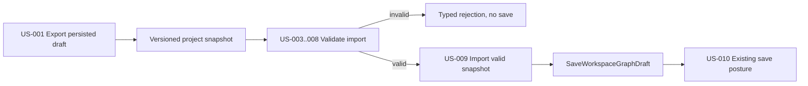
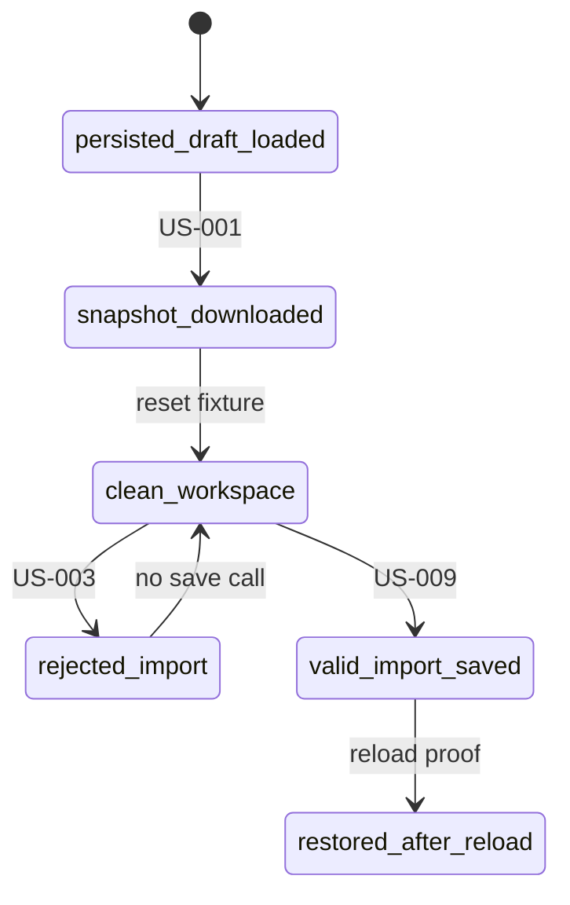

# Canvas Project Snapshot User Stories

## Purpose

Record the operator scenarios for Canvas project snapshot export/import and
tie each scenario to its command/query rail and proof surface.

The stories cover local browser file handoff only. They do not promise backend
Project Assets, multi-version compatibility, source-control import, or
cross-workspace restore semantics beyond the existing protected draft save
rail.

## User Stories

### US-CANVAS-PROJECT-SNAPSHOT-001 Export Persisted Draft

As an operator, I can export the current persisted Canvas draft to a project
snapshot JSON file so that I can carry the workspace draft through a local file.

Acceptance:

- export is available only when a persisted draft record is loaded
- the file contains `format`, `schemaVersion`, project metadata, Canvas
  identity, source revision metadata, and the authoring draft payload
- export uses `ExportProjectSnapshot`

### US-CANVAS-PROJECT-SNAPSHOT-002 Reject Missing Draft Export

As an operator, I cannot export a snapshot while the persisted draft is missing,
loading, failed, saving, or known failed locally.

Acceptance:

- no fake file is produced
- the route reports unavailable export posture
- the protected draft repository is not mutated

### US-CANVAS-PROJECT-SNAPSHOT-003 Reject Malformed JSON

As an operator, I get a clear rejection when the selected import file is not
valid JSON.

Acceptance:

- validation returns `malformed_json`
- `ImportProjectSnapshot` does not call `SaveWorkspaceGraphDraft`
- Cypress proves the rejected import does not increase draft-save calls

### US-CANVAS-PROJECT-SNAPSHOT-004 Reject Unsupported Format

As an operator, I cannot import a JSON object that is not a DVT project
snapshot.

Acceptance:

- validation returns `unsupported_format`
- no draft save is attempted

### US-CANVAS-PROJECT-SNAPSHOT-005 Reject Unsupported Version

As an operator, I cannot import a snapshot whose schema version is not supported
by this local component.

Acceptance:

- validation returns `unsupported_version`
- no compatibility migration is implied
- no draft save is attempted

### US-CANVAS-PROJECT-SNAPSHOT-006 Reject Missing Project Metadata

As an operator, I cannot import a snapshot that lacks tenant, project,
environment, or adapter audit metadata.

Acceptance:

- validation returns `missing_project_metadata`
- the route does not infer hidden metadata from the current URL

### US-CANVAS-PROJECT-SNAPSHOT-007 Reject Invalid Draft Payload

As an operator, I cannot import a snapshot whose draft payload does not match
the governed `WorkspaceGraphAuthoringDraft` schema.

Acceptance:

- validation returns `invalid_draft`
- malformed node, edge, position, or Canvas payloads remain outside the draft
  repository

### US-CANVAS-PROJECT-SNAPSHOT-008 Reject Canvas Identity Mismatch

As an operator, I cannot import a snapshot whose declared Canvas identity
disagrees with the embedded draft payload.

Acceptance:

- validation returns `canvas_identity_mismatch`
- the imported file cannot lie about the Canvas kind or title

### US-CANVAS-PROJECT-SNAPSHOT-009 Import Valid Snapshot

As an operator, I can import a valid project snapshot into the current workspace
draft so that the Canvas graph, positions, and Canvas title are restored after a
reload.

Acceptance:

- validation accepts the file
- import uses `ImportProjectSnapshot` and existing `SaveWorkspaceGraphDraft`
- the browser proof reloads and sees the restored node and Canvas title

### US-CANVAS-PROJECT-SNAPSHOT-010 Preserve Existing Save Failure Semantics

As an operator, I see the existing draft save conflict or failure posture when a
valid snapshot cannot be saved.

Acceptance:

- import does not create a parallel conflict model
- repository conflicts use the existing draft lifecycle conflict path
- repository failures use the existing failed save posture

## Scenario Matrix

| Story                          | Rail                      | Primary proof                                       | Negative proof                        |
| ------------------------------ | ------------------------- | --------------------------------------------------- | ------------------------------------- |
| US-CANVAS-PROJECT-SNAPSHOT-001 | `ExportProjectSnapshot`   | `canvasProjectSnapshot.test.ts`, Cypress export     | export unavailable when draft missing |
| US-CANVAS-PROJECT-SNAPSHOT-002 | `ExportProjectSnapshot`   | lifecycle command gating                            | no file for missing/failed draft      |
| US-CANVAS-PROJECT-SNAPSHOT-003 | `ValidateProjectImport`   | Cypress malformed import                            | no `saveGraphDraft` call              |
| US-CANVAS-PROJECT-SNAPSHOT-004 | `ValidateProjectImport`   | value-object rejection tests                        | `unsupported_format`                  |
| US-CANVAS-PROJECT-SNAPSHOT-005 | `ValidateProjectImport`   | value-object rejection tests                        | `unsupported_version`                 |
| US-CANVAS-PROJECT-SNAPSHOT-006 | `ValidateProjectImport`   | component invariant and future unit extension point | `missing_project_metadata`            |
| US-CANVAS-PROJECT-SNAPSHOT-007 | `ValidateProjectImport`   | value-object rejection tests                        | `invalid_draft`                       |
| US-CANVAS-PROJECT-SNAPSHOT-008 | `ValidateProjectImport`   | value-object rejection tests                        | `canvas_identity_mismatch`            |
| US-CANVAS-PROJECT-SNAPSHOT-009 | `ImportProjectSnapshot`   | Cypress valid import plus reload                    | import must use `saveGraphDraft`      |
| US-CANVAS-PROJECT-SNAPSHOT-010 | `SaveWorkspaceGraphDraft` | existing draft lifecycle conflict/failure tests     | no project-snapshot-specific conflict |

## Scenario Flow

## Test-State Model

## Out Of Scope Stories

- Backend project asset storage.
- Stable long-term snapshot compatibility across multiple versions.
- Multi-canvas project bundle export.
- Importing into a different tenant or project as an authorization bypass.
- Source-control import or external artifact registry integration.
