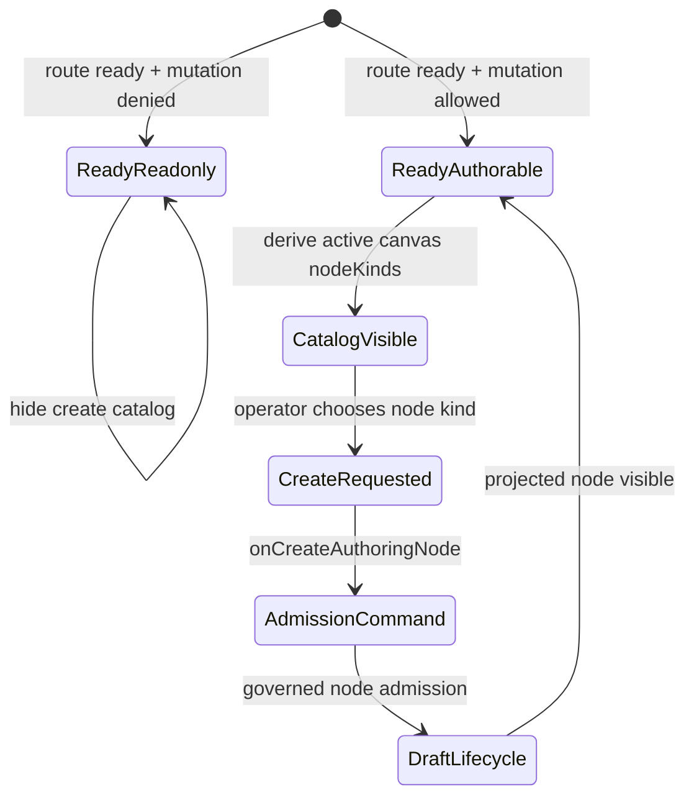
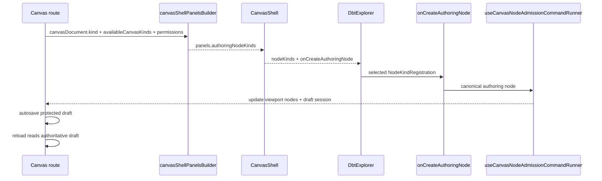

# Canvas Ready Node Authoring Entrypoint Component

## Purpose

This component owns the route-visible node creation entrypoint for a ready
Canvas document. It lets an operator add more governed nodes after the first
graph already exists.

It is intentionally a shell authoring affordance, not a new graph mutation
path. Creation still flows through the existing node admission command runner
and draft lifecycle.

## Governing Sources

- [Graph Frontend Architecture](./graph-frontend-architecture.md)
- [Canvas Shell Component](./canvas-shell-component.md)
- [Canvas Empty Authoring Entrypoint Component](./canvas-empty-authoring-entrypoint-component.md)
- [Canvas Authoring Runtime Component](./canvas-authoring-runtime-component.md)
- [Canvas Graph Lifecycle Component](./canvas-graph-lifecycle-component.md)

## Public API

The public API remains the shell contract:

```ts
type CanvasShellPanels = {
  explorerNodes: CanonicalNode[];
  authoringNodeKinds: readonly NodeKindRegistration[];
  // ...
};

type CanvasShellGraphCommands = {
  onCreateAuthoringNode: (registration: NodeKindRegistration) => void;
  // ...
};
```

Visible UI consumes that contract through:

- `CanvasShell.tsx`
- `DbtExplorer.tsx`

Contract derivation is owned by:

- `canvasShellPanelsBuilder.ts`
- `canvasShellPropsBuilder.tsx`

## Invariants

- Ready-canvas creation must use the active `canvasDocument.kind`.
- The visible creation catalog must come from the matching
  `CanvasKindRegistration.nodeKinds`.
- The Explorer rail must not call `getAllNodeKinds` or create a global catalog.
- Mutations denied by effective route permissions expose no create buttons.
- Clicking a create button must call `onCreateAuthoringNode(registration)`.
- Node admission remains owned by `useCanvasNodeAdmissionCommandRunner`.
- `DbtExplorer` may render creation affordances but must not mutate draft state.
- Existing project-node drag/drop remains a separate affordance.
- Authored node creation and removal must round-trip through protected draft
  save/read before being treated as durable across reloads.
- Failed draft saves must not be presented as durable authoring state after a
  route reload.

## Transitions



## Sequence



## Consumers

- `CanvasShell.tsx` wires shell panel data to the Explorer rail.
- `DbtExplorer.tsx` renders the active ready-canvas create buttons.
- `useCanvasAuthoringNodeCreationHandlers.ts` handles the command.
- `canvasShellPanelsBuilder.test.ts`, `CanvasShell.test.tsx`, and
  `DbtExplorer.test.tsx` prove behavior.
- `CanvasShell.architecture.test.tsx` proves semantic architecture.
- `canvas-ready-node-authoring.cy.ts` proves add, save, reload, remove,
  failed-save, and read-only user flows.

## Fowler Reading

The mature pattern here is an application-service command exposed through a
thin view. The view chooses from a governed catalog; the command runner owns
the mutation. Systems such as Dagster, NiFi, and dbt graph editors keep
palette/catalog selection distinct from graph admission and validation. This
slice now follows the same split for ready canvases.

## Drift Guards

- Do not reintroduce a second ready-canvas node list beside
  `CanvasKindRegistration.nodeKinds`.
- Do not let `DbtExplorer` write draft session state.
- Do not hide local node creation behind source import capability.
- Do not make ready-canvas creation available when `canEditEdges` is false.
- Do not route ready-canvas creation through drag/drop-only affordances.
- Do not count a local node as durable unless the protected draft save and
  subsequent authoritative read preserve it.
