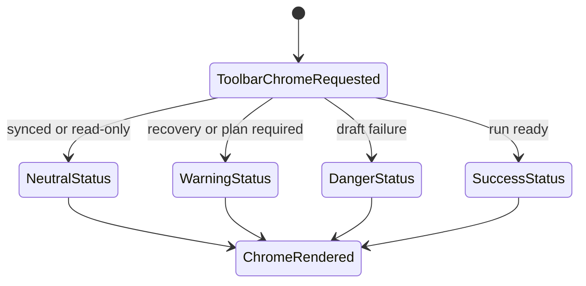
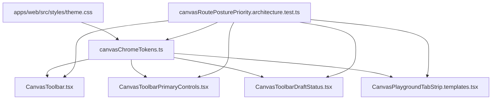

# Canvas Route Chrome Token Component

## Purpose

This component owns Canvas toolbar and tab-strip visual tokens. Canvas route
chrome can stay aligned with the operator-workbench visual system without
placing raw Tailwind color families in command controls or tab templates.

Owned concern: Canvas route chrome consumes named presentation tokens;
`theme.css` owns raw semantic values.

## Public API

| API                                    | Kind         | Contract                                                  |
| -------------------------------------- | ------------ | --------------------------------------------------------- |
| `canvasChromeClasses`                  | constant     | Shared toolbar, separator, button, dialog, and tab chrome |
| `canvasDraftStatusToneClasses`         | constant     | Draft save and recovery tone classes                      |
| `resolveCanvasDraftStatusClassName`    | query helper | Resolves `neutral`, `warning`, or `danger` draft tone     |
| `resolveCanvasWorkflowStatusClassName` | query helper | Resolves workflow status text tone for toolbar badges     |

## Invariants

1. Canvas toolbar and tab-strip presentation uses `canvasChromeTokens`.
2. Toolbar and tab-strip modules do not contain raw `slate-*`, `rose-*`,
   `amber-*`, `emerald-*`, `gray-*`, or `zinc-*` color classes.
3. The token component does not own Canvas command availability, graph
   mutation, draft persistence, React Flow configuration, or route policy.
4. Raw color values remain in `theme.css` or user-configurable Canvas palette
   code, not in route chrome components.

## Transitions

## Consumers

| Consumer                                 | Responsibility                                     |
| ---------------------------------------- | -------------------------------------------------- |
| `CanvasToolbar`                          | Uses toolbar and separator chrome                  |
| `CanvasToolbarPrimaryControls`           | Uses shared badge, separator, and command classes  |
| `CanvasToolbarDraftStatus`               | Resolves draft status tone through token helpers   |
| `CanvasPlaygroundTabStrip.templates.tsx` | Uses shared replacement and tab-kind token classes |

## Consumer Diagram

## Negative Rules

- Do not move Canvas command policy into `canvasChromeTokens`.
- Do not move React Flow node, edge, viewport, minimap, or grid palette
  semantics into this component.
- Do not create a second Canvas toolbar color map in a route template.
