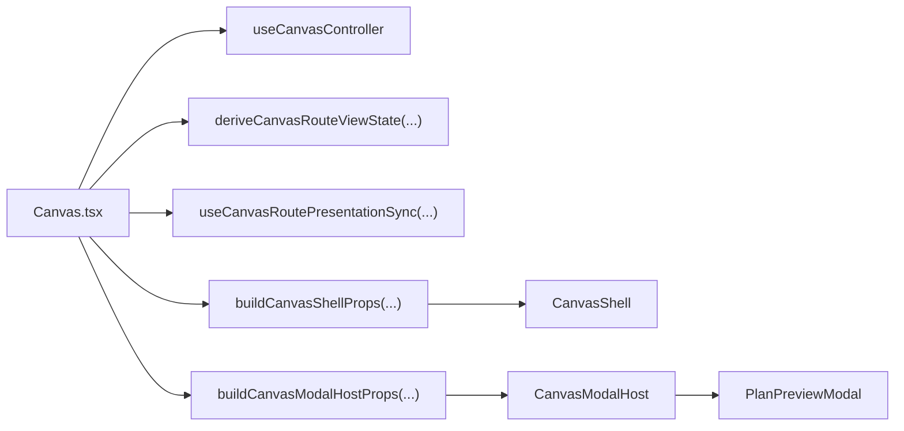
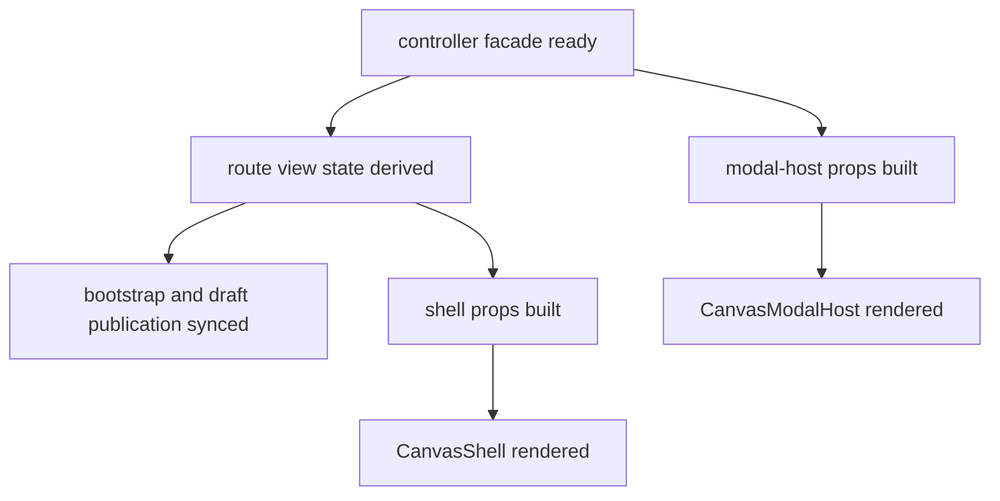

# Canvas Route Composition Component

## Purpose

Define the local component model for route-owned Canvas composition.

This component owns:

- controller-to-view adaptation at the route boundary
- shell contract assembly
- modal-host contract assembly
- route-publication synchronization

It does not own draft truth, graph mutation semantics, or route-visible
presentation semantics themselves.

## Governing Sources

- [Graph Frontend Architecture](./graph-frontend-architecture.md)
- [Canvas Component Map And Modernization Review](./canvas-component-map-and-modernization-review.md)
- [Canvas Controller Current To Target Architecture](./canvas-controller-current-to-target-architecture.md)
- [Canvas Route Presentation Component](./canvas-route-presentation-component.md)
- [Canvas Shell Component](./canvas-shell-component.md)
- [Canvas component governance follow-up review](../../../../planning/reviews/architecture-and-governance/20260422-canvas-component-governance-follow-up-review.md)
- [Graph Route Bootstrap Architecture](./graph-route-bootstrap-architecture.md)

## Reading Rule

Read the component in this order:

1. `Canvas.tsx`
   route composition and provider boundary
2. `useCanvasRoutePresentationSync.ts`
   route publication and draft-presentation synchronization
3. `canvasShellBuilder.types.ts`
   concern-scoped shell builder input vocabulary
4. `canvasShellPropsBuilder.tsx`
   route-owned orchestration into shell concern contracts
5. `canvasModalHost.types.ts`
   semantic modal-host contract
6. `canvasModalHostPropsBuilder.ts`
   route-owned modal adaptation seam
7. `CanvasModalHost.tsx`
   passive modal-host rendering over semantic props
8. `Canvas.architecture.test.tsx`,
   `CanvasModalHost.architecture.test.tsx`, and
   `canvasShellPropsBuilder.architecture.test.ts`
   semantic fitness functions for the route seam

If code in this area starts owning aggregate semantics or widget-local
heuristics, the component has regressed.

## Public API

The public route-composition API is:

- `buildCanvasShellProps(...)`
- `buildCanvasModalHostProps(...)`
- `useCanvasRoutePresentationSync(...)`
- `CanvasModalHost`
- `CanvasModalHostProps`
- `CanvasShellRouteComposerArgs`

The route component itself remains `Canvas.tsx`.

## File Responsibilities

<!-- markdownlint-disable MD060 -->

| File                                | Owned concern                                      | Public to other modules |
| ----------------------------------- | -------------------------------------------------- | ----------------------- |
| `Canvas.tsx`                        | route composition over the controller facade       | yes                     |
| `useCanvasRoutePresentationSync.ts` | route publication and presentation synchronization | adjacent route seam     |
| `canvasShellBuilder.types.ts`       | concern-scoped shell-builder input vocabulary      | local builder API       |
| `canvasShellPropsBuilder.tsx`       | route-owned shell contract orchestration           | yes                     |
| `canvasModalHost.types.ts`          | semantic modal-host vocabulary                     | yes                     |
| `canvasModalHostPropsBuilder.ts`    | route-owned modal-host contract adaptation         | adjacent route seam     |
| `CanvasModalHost.tsx`               | passive modal-host rendering                       | yes                     |

<!-- markdownlint-enable MD060 -->

## Current Topology After Hard Cut

## Transitions

The component owns route-composition transitions only:

## Invariants

- `Canvas.tsx` is the only route-level composition site for the Canvas route.
- `Canvas.tsx` may own orchestration, but it must not own inline shell or modal
  contract assembly once dedicated builders exist.
- `CanvasModalHost.tsx` must not import `useCanvasController` or consume
  controller-shaped props.
- The route composer may see the full controller facade and route view state;
  shell subbuilders must not.
- `canvasShellPropsBuilder.tsx` is allowed to adapt route-owned inputs into
  smaller concern contracts; the concern subbuilders are not allowed to widen
  those contracts again.
- Route publication remains an adjacent seam through
  `useCanvasRoutePresentationSync.ts`; it must not fold back into `Canvas.tsx`
  inline effects.

## Consumers

- `Canvas.tsx`
- `Canvas.architecture.test.tsx`
- `CanvasModalHost.architecture.test.tsx`
- `canvasShellPropsBuilder.architecture.test.ts`

## Fitness Functions

The canonical fitness checks for this component are:

- `Canvas.architecture.test.tsx`
- `CanvasModalHost.architecture.test.tsx`
- `canvasShellBuilder.types.architecture.test.ts`
- `canvasShellPropsBuilder.architecture.test.ts`
- `Canvas.routeStates.smoke.test.tsx`
- `Canvas.routeStates.first-canvas-policy.test.tsx`
- `Canvas.routeStates.host-cycle-persistence.test.tsx`
- `Canvas.routeStates.backend-recovery-priority.test.tsx`
- `Canvas.readOnlyStates.test.tsx`
- `@dvt/web` typecheck

## Drift To Watch

- if `CanvasModalHost.tsx` starts importing `useCanvasController`, the passive
  view boundary has regressed
- if shell subbuilders accept the full route-composer args bag again, semantic
  ownership has regressed
- if `Canvas.tsx` starts rebuilding modal or shell props inline, route
  composition has regressed
- if route publication moves back into inline `useEffect` logic inside
  `Canvas.tsx`, route composition and publication have drifted together again
