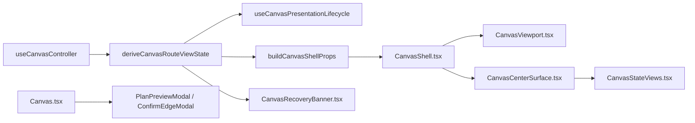
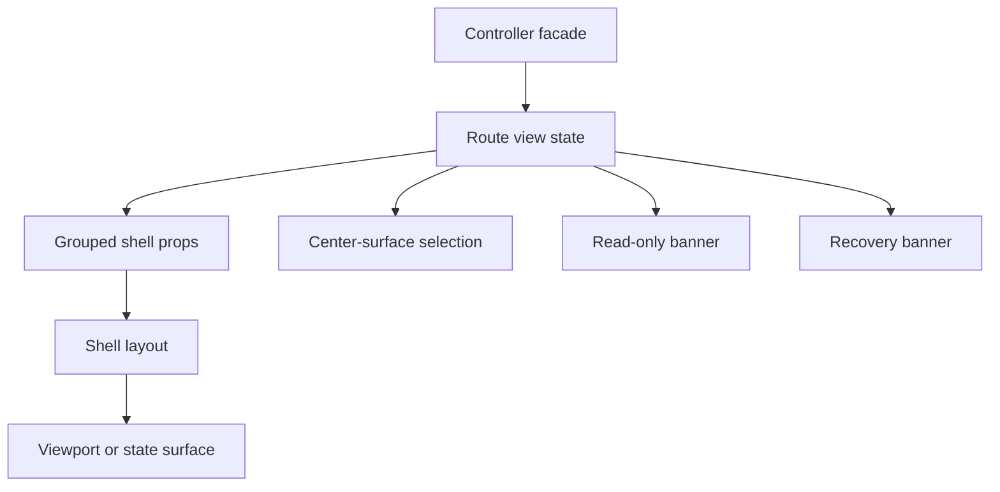

# Canvas Route Composition Component

## Purpose

Define the local component model for Canvas route composition and shell
presentation.

This page is intentionally narrower than the broader Canvas architecture pack.
It explains:

- what the route-composition component is
- which UI and shell-facing APIs are public
- how route posture becomes shell props and state surfaces
- which invariants and consumers the component owns

## Governing Sources

- [Graph Frontend Architecture](./graph-frontend-architecture.md)
- [Canvas Controller Current To Target Architecture](./canvas-controller-current-to-target-architecture.md)
- [Canvas Component Map And Modernization Review](./canvas-component-map-and-modernization-review.md)
- [Canvas component governance follow-up review](../../../../planning/reviews/architecture-and-governance/20260422-canvas-component-governance-follow-up-review.md)
- [Graph Route Bootstrap Architecture](./graph-route-bootstrap-architecture.md)

## Component Reading Rule

Read the component in this order:

1. `Canvas.tsx`
   the route entry, publication seam, and shell adaptation entrypoint
2. `canvasShell.types.ts`
   the grouped semantic prop contract for the shell
3. `CanvasShell.tsx`
   the workbench layout and local chrome composition seam
4. `CanvasCenterSurface.tsx`
   the center-surface route-state rendering seam
5. `CanvasStateViews.tsx`
   the route-owned state-surface primitives
6. `CanvasRecoveryBanner.tsx`
   the recovery banner seam
7. `CanvasViewport.tsx`
   the viewport adapter seam used by the shell

If a change does not fit one of those concerns, it probably belongs in the
controller facade, the authoring runtime, or another graph component instead.

## Why This Component Exists

`Canvas.tsx` is no longer just a route file. Together with the shell and state
surface modules, it forms one route-composition component with a stable local
contract:

- derive route posture once
- publish route bootstrap posture once
- translate route posture into grouped shell props
- render shell layout, state surfaces, recovery banner, viewport, and modals
  without absorbing persistence or semantic-authority logic

This component keeps route composition explicit while preventing the shell layer
from becoming another controller or repository.

## Public API

The public APIs of the component are:

- default export `Canvas`
- `CanvasShellProps` and the grouped shell prop types
- `renderCanvasCenterSurface(...)`
- `CanvasRecoveryBanner`
- default export `CanvasShell`
- default export `CanvasViewport`

This is a component pack with one route entrypoint and several subordinate
presentation APIs.

## File Responsibilities

<!-- markdownlint-disable MD060 -->

| File                       | Owned concern                                                              | Public to other modules |
| -------------------------- | -------------------------------------------------------------------------- | ----------------------- |
| `Canvas.tsx`               | route composition, route publication, shell adaptation, and modal mounting | yes                     |
| `canvasShell.types.ts`     | grouped semantic prop contracts for shell composition                      | yes                     |
| `CanvasShell.tsx`          | shell layout and route-local chrome composition                            | yes                     |
| `CanvasCenterSurface.tsx`  | render governed center-surface states from route posture                   | center-surface API only |
| `CanvasStateViews.tsx`     | render route-owned loading, empty, error, blocked, and read-only views     | state-view API only     |
| `CanvasRecoveryBanner.tsx` | render route-owned draft recovery banners from controller recovery state   | recovery API only       |
| `CanvasViewport.tsx`       | React Flow viewport mounting and gesture forwarding                        | viewport API only       |

<!-- markdownlint-enable MD060 -->

## Topology

## Composition Transition Model

This component does not own domain transitions. It owns presentation
transitions from route posture into route UI surfaces.

## Invariants

- route composition must not own repository or protected-boundary logic
- shell prop contracts stay grouped by semantics:
  `layout`, `panels`, `graph`, `graphCommands`, `chromeCommands`, and
  `toolbar`
- `CanvasCenterSurface.tsx` renders route posture and transport posture only;
  it does not query or infer authoring truth
- `CanvasRecoveryBanner.tsx` renders recovery posture only; it does not own
  recovery policy
- `CanvasViewport.tsx` forwards governed gesture callbacks; it does not own
  route startup or persistence truth
- modal mounting stays separate from shell layout composition

## Consumers

Direct consumers:

- `routes.ts`
- `Root.tsx`

Route-local consumers:

- `Canvas.tsx` consumes `CanvasShell`, `CanvasCenterSurface`, and
  `CanvasRecoveryBanner`
- `CanvasShell.tsx` consumes `CanvasViewport`

## Fitness Functions

The canonical fitness checks for this component are:

- `Canvas.architecture.test.tsx`
- `CanvasShell.architecture.test.tsx`
- `CanvasCenterSurface.architecture.test.ts`
- `Canvas.routeStates.test.tsx`
- `Canvas.readOnlyStates.test.tsx`

Those tests must keep proving:

- route composition delegates presentation seams instead of inlining them again
- the shell consumes grouped prop contracts instead of controller-shaped bags
- center-surface rendering stays route-state driven
- recovery presentation remains separate from shell composition

## Drift To Watch

- if `Canvas.tsx` starts importing service factories or repository helpers, the
  route component has regressed
- if `CanvasShell.tsx` starts consuming the controller directly, shell
  composition has lost its semantic contract
- if `CanvasCenterSurface.tsx` starts reconstructing graph state, presentation
  has absorbed the wrong concern
- if `CanvasViewport.tsx` starts inferring route availability from viewport
  state, the route-composition boundary has regressed
