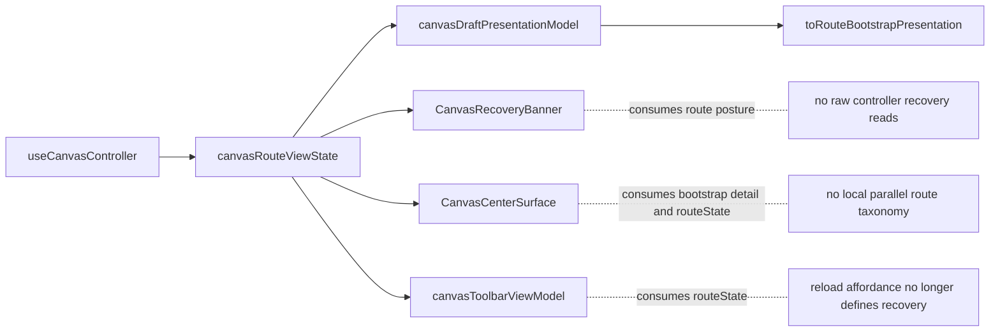
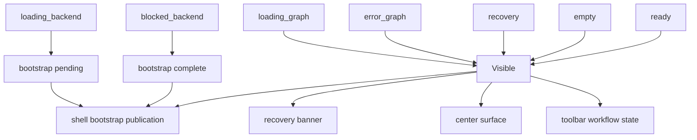

# Canvas Route Presentation Component

## Purpose

Define the local component model for route-visible Canvas posture.

This component owns the semantic projection that aligns:

- shell-facing bootstrap publication
- Canvas center-surface state
- recovery banner visibility and content
- toolbar workflow posture

It exists to remove parallel route-state interpretation and to keep one
canonical presentation truth for the Canvas route.

## Governing sources

- [Graph Route Bootstrap Architecture](./graph-route-bootstrap-architecture.md)
- [Canvas Component Map And Modernization Review](./canvas-component-map-and-modernization-review.md)
- [Canvas Controller Current To Target Architecture](./canvas-controller-current-to-target-architecture.md)
- [Graph Frontend Architecture](./graph-frontend-architecture.md)
- [TF-E2 Canvas Target Architecture Execution Plan 2026-04-17](../../../../planning/proposals/mandatory/frontend-and-ux/tf-e2-canvas-target-architecture-execution-plan-20260417.md)

## Reading rule

Read the component in this order:

1. `canvasDraftPresentationModel.ts`
   canonical route posture and bootstrap projection
2. `canvasRouteViewState.ts`
   route-facing aggregation for visible Canvas posture
3. `CanvasCenterSurface.tsx`
   center-surface rendering over canonical posture
4. `canvas-empty-authoring-entrypoint-component.md`
   empty Canvas authoring command, governed catalog, and lifecycle invariants
5. `CanvasRecoveryBanner.tsx`
   recovery-banner rendering over canonical posture
6. `canvasToolbarViewModel.ts`
   toolbar workflow posture over canonical route truth
7. `CanvasToolbarDraftStatus.tsx`
   draft-status rendering over route-approved affordances

If a change does not fit one of those concerns, it probably belongs in the
controller read model, the draft aggregate, or the route bootstrap stack
instead.

## Why this component exists

The Canvas route already had a route presentation model, but the visible
surfaces drifted in three ways before `TF-E2-F`:

- `CanvasRecoveryBanner.tsx` read raw controller recovery reason directly
- `CanvasCenterSurface.tsx` reinterpreted route posture locally
- `canvasToolbarViewModel.ts` inferred recovery from `showReloadAction`, which
  is an affordance flag rather than canonical route posture

`TF-E2-F` closed that semantic drift by making route presentation one explicit
local component with one authority model.

## Public API

The public component API is:

- `deriveCanvasDraftPresentationState(...)`
- `toRouteBootstrapPresentation(...)`
- `deriveCanvasRouteViewState(...)`

The public state vocabulary is:

- `CanvasRouteState`
- `CanvasDraftPresentationState`
- `CanvasRouteViewState`

Rendering adapters consume the component, but they do not own the semantic API.

## File responsibilities

<!-- markdownlint-disable MD060 -->

| File                               | Owned concern                                                | Public to other modules |
| ---------------------------------- | ------------------------------------------------------------ | ----------------------- |
| `canvasDraftPresentationModel.ts`  | canonical route posture and bootstrap semantics              | yes                     |
| `canvasRouteViewState.ts`          | route-facing aggregation over presentation and interaction   | yes                     |
| `CanvasCenterSurface.tsx`          | center-surface rendering from canonical route posture        | consumer only           |
| `canvasCenterSurfaceWorkbench.tsx` | workbench and empty-authoring rendering from route posture   | consumer only           |
| `canvasCenterSurfaceTransport.tsx` | draft transport failure rendering before workbench states    | consumer only           |
| `CanvasRecoveryBanner.tsx`         | recovery-banner rendering from canonical route posture       | consumer only           |
| `canvasToolbarViewModel.ts`        | toolbar workflow-status projection from route posture        | consumer only           |
| `CanvasToolbarDraftStatus.tsx`     | draft-status rendering from route-approved affordance policy | consumer only           |

<!-- markdownlint-enable MD060 -->

## Current topology after hard cut

## Transitions

This component does not own persistence or graph mutation transitions.

It owns visible route-presentation transitions only:

## Invariants

- Route-visible posture is decided once per render cycle.
- Banner, center surface, toolbar, and bootstrap publication must consume the
  same canonical route posture.
- `blocked_backend` disables unsafe Canvas interactions and publishes a
  completable shell bootstrap posture. Revealing the route is allowed because
  the first useful Canvas surface is the governed backend-blocked state, not an
  editable workbench.
- Affordances such as reload buttons are consequences of route posture, not
  authorities that define it.
- `CanvasRecoveryBanner.tsx` must not read raw controller recovery reason once
  the component hard cut is complete.
- `canvasToolbarViewModel.ts` must not infer recovery from
  `draftToolbarState.showReloadAction`.
- `CanvasCenterSurface.tsx` must not recreate a parallel route-state taxonomy.
- Transport-error rendering may stay as a higher-priority rendering concern,
  but it must still compose through the route-presentation component rather
  than through controller-local branching.

## Consumers

- `Canvas.tsx`
- `CanvasShell.tsx` through toolbar props and center-surface composition
- `usePublishedRouteBootstrap.ts` through `toRouteBootstrapPresentation(...)`
- `canvasDraftPresentationStore.ts`

## Fitness functions

The canonical fitness checks for this component are:

- `canvasDraftPresentationModel.test.ts`
- `canvasRouteViewState.architecture.test.ts`
- `CanvasRecoveryBanner.architecture.test.tsx`
- `CanvasCenterSurface.architecture.test.ts`
- `CanvasToolbar.test.tsx`
- `Canvas.routeStates.test.tsx`
- `Canvas.draftRecovery.test.tsx`

## Drift to watch

- if toolbar workflow posture starts using draft-affordance flags as semantic
  authority, the hard cut has regressed
- if banner or center-surface components read raw controller recovery state,
  route presentation has leaked backwards into adapters
- if route bootstrap detail is published from any source other than canonical
  route presentation, shell startup drift has returned
- if a future Cypress spec is added for route posture, it must exercise blocked,
  recovery, and ready transitions rather than only the preview-run happy path
