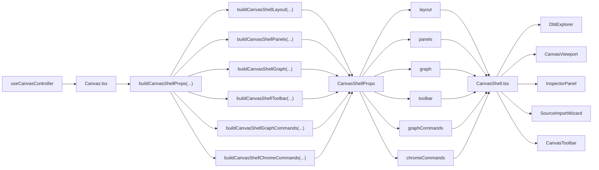
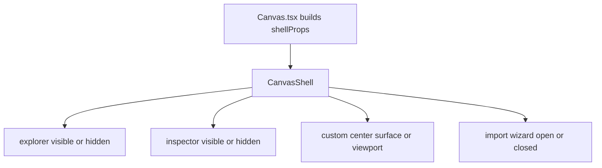

# Canvas Shell Component

## Purpose

Define the public component contract for the Canvas shell.

This component owns:

- three-panel workbench layout
- local chrome composition
- wiring of route-owned panels, viewport, and toolbar surfaces
- the semantic grouping of shell inputs by concern

It does not own draft truth, persistence, route posture derivation, or graph
mutation policy.

## Governing sources

- [Canvas Component Map And Modernization Review](./canvas-component-map-and-modernization-review.md)
- [Canvas Route Composition Component](./canvas-route-composition-component.md)
- [Canvas Route Presentation Component](./canvas-route-presentation-component.md)
- [Canvas Controller Current To Target Architecture](./canvas-controller-current-to-target-architecture.md)
- [Graph Route Bootstrap Architecture](./graph-route-bootstrap-architecture.md)

## Reading rule

Read the component in this order:

1. `canvasShell.types.ts`
   grouped public API and concern boundaries
2. `canvasShellBuilder.types.ts`
   concern-scoped builder inputs for route-owned shell assembly
3. `canvasShellLayoutBuilder.tsx`, `canvasShellPanelsBuilder.ts`,
   `canvasShellGraphBuilder.ts`, `canvasShellToolbarBuilder.ts`,
   `canvasShellGraphCommandsBuilder.ts`, and
   `canvasShellChromeCommandsBuilder.ts`
   concern-owned subbuilders for the grouped shell contract
4. `canvasShellPropsBuilder.tsx`
   orchestrator over the shell subbuilders
5. `canvas-route-composition-component.md`
   route-level explanation of how the shell builder fits with publication and
   modal hosting
6. `Canvas.tsx`
   route composition that delegates shell contract construction
7. `CanvasShell.tsx`
   layout and chrome composition over the grouped contract
8. `CanvasShell.test.tsx`
   behavior proofs for explorer, viewport, and import wiring

If a change introduces new top-level shell props directly in `Canvas.tsx`, the
component contract has likely regressed.

## Public API

The shell contract is public through these grouped objects:

- `CanvasShellLayout`
- `CanvasShellPanels`
- `CanvasShellGraph`
- `CanvasShellToolbar`
- `CanvasShellGraphCommands`
- `CanvasShellChromeCommands`
- `CanvasShellProps`
- `buildCanvasShellLayout(...)`
- `buildCanvasShellPanels(...)`
- `buildCanvasShellGraph(...)`
- `buildCanvasShellToolbar(...)`
- `buildCanvasShellGraphCommands(...)`
- `buildCanvasShellChromeCommands(...)`
- `buildCanvasShellProps(...)`

The canonical route builds one `CanvasShellProps` value and passes it to
`CanvasShell`.

## Contract rationale

The hard cut replaces an anemic prop bag with grouped semantic ownership:

<!-- markdownlint-disable MD013 MD060 -->

| Group            | Owned concern                                              | Must not absorb                           |
| ---------------- | ---------------------------------------------------------- | ----------------------------------------- |
| `layout`         | shell frame, panel visibility, center-surface slotting     | graph truth or toolbar policy             |
| `panels`         | explorer and inspector context, permissions, focus handoff | viewport wiring or toolbar workflow logic |
| `graph`          | React Flow projection inputs                               | route mutation commands                   |
| `toolbar`        | route-visible toolbar posture and workflow state           | viewport event handlers                   |
| `graphCommands`  | viewport and import interaction callbacks                  | shell chrome toggles                      |
| `chromeCommands` | shell-local chrome and toolbar command handlers            | React Flow primitive callbacks            |

<!-- markdownlint-enable MD013 MD060 -->

## File responsibilities

<!-- markdownlint-disable MD013 MD060 -->

| File                                  | Owned concern                                           | Public to other modules |
| ------------------------------------- | ------------------------------------------------------- | ----------------------- |
| `canvasShell.types.ts`                | grouped contract vocabulary                             | yes                     |
| `canvasShellBuilder.types.ts`         | concern-scoped input vocabulary for shell builder seams | local builder API       |
| `canvasShellLayoutBuilder.tsx`        | layout concern assembly                                 | local builder API       |
| `canvasShellPanelsBuilder.ts`         | panel concern assembly                                  | local builder API       |
| `canvasShellGraphBuilder.ts`          | graph concern assembly                                  | local builder API       |
| `canvasShellToolbarBuilder.ts`        | toolbar concern assembly                                | local builder API       |
| `canvasShellGraphCommandsBuilder.ts`  | viewport and import command assembly                    | local builder API       |
| `canvasShellChromeCommandsBuilder.ts` | shell chrome command assembly                           | local builder API       |
| `canvasShellPropsBuilder.tsx`         | route-owned shell contract orchestration                | yes                     |
| `useCanvasRoutePresentationSync.ts`   | route publication and bootstrap sync                    | adjacent route seam     |
| `CanvasModalHost.tsx`                 | route-owned modal hosting                               | adjacent route seam     |
| `Canvas.tsx`                          | route composition plus shell and modal handoff          | consumer only           |
| `CanvasShell.tsx`                     | three-panel shell layout and local chrome               | yes                     |
| `CanvasShell.test.tsx`                | runtime behavior proof for the shell contract           | test only               |

<!-- markdownlint-enable MD013 MD060 -->

## Current topology after hard cut

## Transitions

The shell does not own domain transitions. It owns only UI composition
transitions:

## Invariants

- `CanvasShell` consumes grouped concern objects, not a flat all-fields-at-top
  prop bag.
- `Canvas.tsx` is the only route-level composition site for `CanvasShell`.
- `Canvas.tsx` delegates shell contract assembly to `buildCanvasShellProps(...)`
  instead of building banner, center-surface, and command groups inline.
- shell subbuilders consume concern-scoped builder args, not the full
  route-composer bag.
- Toolbar posture must arrive through `toolbar`, not through locally inferred
  booleans inside `CanvasShell.tsx`.
- Viewport callbacks must arrive through `graphCommands`, not through mixed
  shell chrome command bags.
- Explorer and inspector visibility belong to `layout`; node and permission
  context belong to `panels`.
- `CanvasShell.tsx` may compose local UI state such as import dialog openness,
  but it must not become a persistence or route-state authority.
- `CanvasShell.tsx` must keep sizing and rail composition behind named local
  seams rather than nested inline ternary logic or one broad render body.

## Consumers

- `Canvas.tsx`
- `CanvasShell.tsx`
- `CanvasShell.test.tsx`

## Fitness functions

The canonical checks for this component are:

- `Canvas.architecture.test.tsx`
- `CanvasShell.architecture.test.tsx`
- `canvasShellBuilder.types.architecture.test.ts`
- `canvasShellPropsBuilder.architecture.test.ts`
- `canvasShell.types.architecture.test.ts`
- `CanvasShell.test.tsx`
- `@dvt/web` typecheck

## Drift to watch

- if `Canvas.tsx` starts passing dozens of top-level props again, semantic
  grouping has regressed
- if `Canvas.tsx` starts rebuilding the shell contract inline, the builder seam
  has regressed
- if `canvasShellPropsBuilder.tsx` starts assembling `layout`, `panels`,
  `graph`, `toolbar`, or command groups inline again, subbuilder ownership has
  regressed
- if shell subbuilders start accepting the full route-composer args bag again,
  semantic builder ownership has regressed
- if `CanvasShell.tsx` starts deriving toolbar or route posture locally, shell
  composition has leaked into presentation policy
- if viewport and chrome callbacks mix again inside one command bag, command
  ownership has drifted backwards
