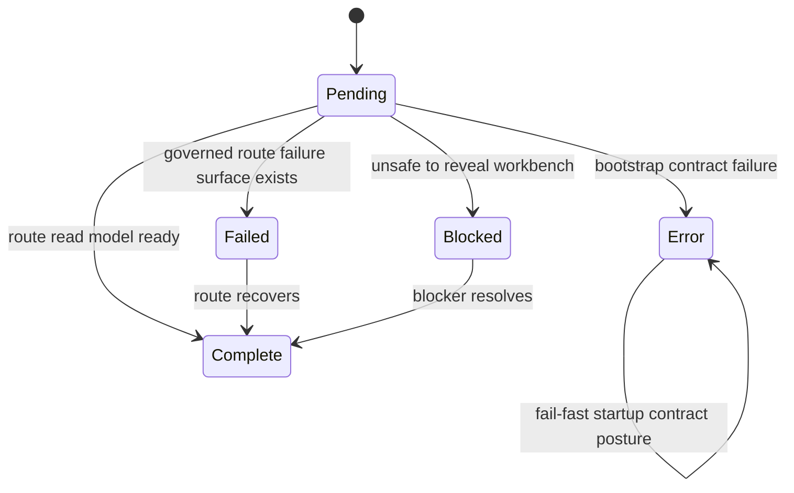
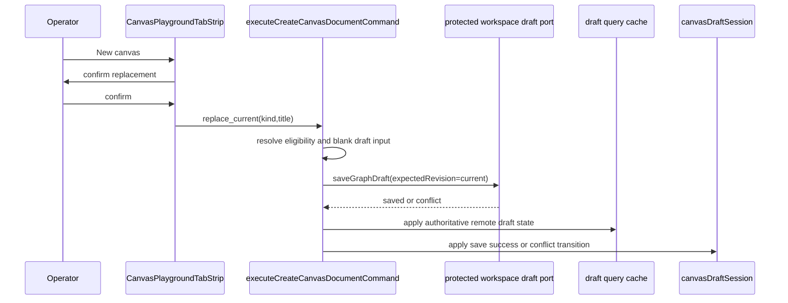
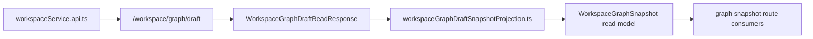
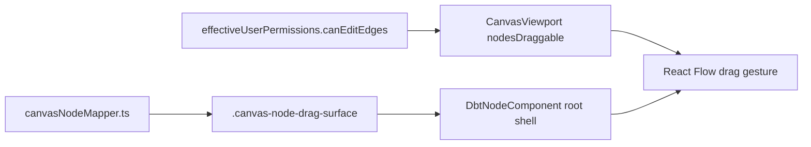
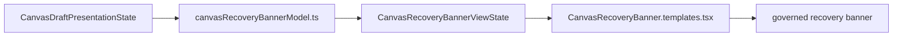
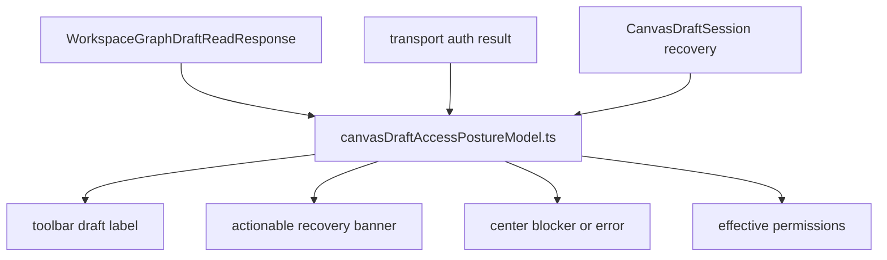
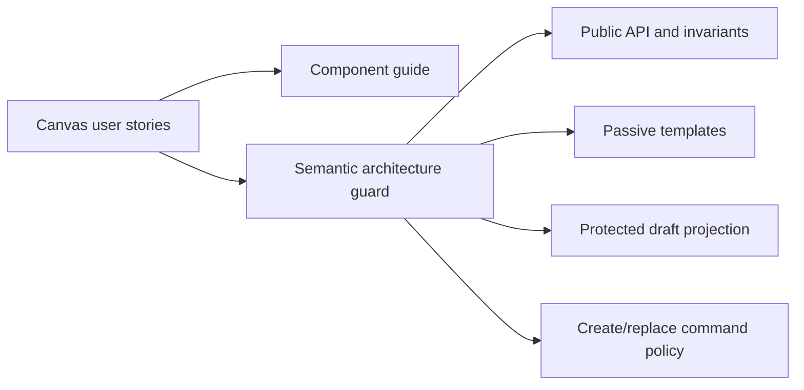

# Canvas Startup And Draft Recovery Component

## Purpose

This guide defines the local component that closes the branch work around route
startup, protected draft read-models, explicit canvas replacement, and node drag
gesture ownership.

Use this page when changing:

- route bootstrap posture for graph-adjacent routes
- workspace graph draft read-model projection
- host-owned create or replace canvas commands
- React Flow node drag handle wiring
- scenario coverage for Canvas startup and draft recovery

Do not use it as the multi-canvas architecture. The current model still has one
authoritative workspace draft canvas document per workspace scope.

The phrase "failed route posture" in this guide means a route-local failure
whose first visible surface is already governed and safe to reveal.

User-story coverage lives in
[Canvas Startup And Draft Recovery User Stories](./canvas-startup-and-draft-recovery-user-stories.md).

Local supporting guides for the current operability slice:

- [API Client Auth Component](../api-client-auth-component.md)
- [Canvas Layout Persistence Component](./canvas-layout-persistence-component.md)
- [Canvas Draft Access Posture Component](./canvas-draft-access-posture-component.md)

`CanvasDraftAccessPosture` entries in this active guide are planned for
`TF-E2-M-B` until
[Canvas Draft Access Posture Component](./canvas-draft-access-posture-component.md)
changes from `Proposed` to `Active`.

## Public API

| API                                                   | Owner                                        | Responsibility                                                                    |
| ----------------------------------------------------- | -------------------------------------------- | --------------------------------------------------------------------------------- |
| `createFailedRouteBootstrapPresentation(detail)`      | `routeBootstrapContract.ts`                  | Publish controlled route-local failures that reveal only governed route surfaces. |
| `WORKSPACE_GRAPH_DRAFT_ENDPOINT`                      | `workspaceGraphDraftHttp.ts`                 | Single protected draft HTTP endpoint for draft reads and saves.                   |
| `buildWorkspaceGraphDraftEndpoint(scope)`             | `workspaceGraphDraftHttp.ts`                 | Attach tenant, project, and environment scope to protected draft reads.           |
| `projectWorkspaceGraphDraftReadResponseSnapshot(...)` | `workspaceGraphDraftSnapshotProjection.ts`   | Project protected authoring truth into the DBT-shaped graph snapshot read model.  |
| `CanvasCreateCanvasDocumentCommand`                   | `canvasDraftLifecycle.types.ts`              | Carry `create_first` or `replace_current` canvas-document intent.                 |
| `executeCreateCanvasDocumentCommand(...)`             | `canvasCreateCanvasDocumentCommand.ts`       | Persist first or explicitly replaced canvas documents through CAS draft saves.    |
| `resolveCreateCanvasDocumentCommandEligibility(...)`  | `canvasCreateCanvasDocumentCommandPolicy.ts` | Decide CAS eligibility for first-create and replace-current commands.             |
| `buildBlankCanvasDocumentDraftInput(...)`             | `canvasCreateCanvasDocumentCommandPolicy.ts` | Build the authoritative empty draft save request.                                 |
| `applyCanvasDocumentSaveSuccess(...)`                 | `canvasCreateCanvasDocumentSaveResult.ts`    | Apply saved draft truth to cache, session, and save status.                       |
| `applyCanvasDocumentSaveConflict(...)`                | `canvasCreateCanvasDocumentSaveResult.ts`    | Apply conflict draft truth to cache, session, and save status.                    |
| `CanvasPlaygroundTabStrip`                            | `CanvasPlaygroundTabStrip.tsx`               | Mount the host tab-strip presentation boundary.                                   |
| `useCanvasPlaygroundTabStripPresenter(...)`           | `useCanvasPlaygroundTabStripPresenter.ts`    | Coordinate authoritative host tabs and confirmed replacement callbacks.           |
| `resolveCanvasReplacementActionState(...)`            | `canvasPlaygroundTabStripModel.ts`           | Resolve locale-backed replacement labels, permission state, and active kind.      |
| `CanvasReplacementActionViewState`                    | `canvasPlaygroundTabStripModel.ts`           | Carry only replacement labels and enablement that templates render.               |
| `CanvasPlaygroundTabStripTemplate`                    | `CanvasPlaygroundTabStrip.templates.tsx`     | Render tab-strip HTML from resolved view state without command policy.            |
| `CanvasPlaygroundHostTemplate`                        | `CanvasPlaygroundHost.templates.tsx`         | Render first-canvas host HTML without constructing draft command DTOs.            |
| `resolveCanvasRecoveryBannerViewState(...)`           | `canvasRecoveryBannerModel.ts`               | Resolve route recovery reason into renderable banner state and copy.              |
| `CanvasRecoveryBannerTemplate`                        | `CanvasRecoveryBanner.templates.tsx`         | Render recovery banner HTML from resolved view state only.                        |
| `deriveCanvasDraftAuthTransportPosture(...)`          | `canvasDraftAuthTransportPosture.ts`         | Planned: normalize final draft auth errors for Canvas posture.                    |
| `CanvasDraftAccessPosture`                            | `canvasDraftAccessPostureModel.ts`           | Planned: resolve protected draft access into one posture.                         |
| `deriveCanvasDraftAccessPosture(...)`                 | `canvasDraftAccessPostureModel.ts`           | Planned: project draft read outcomes into one route-visible posture model.        |
| `CANVAS_NODE_DRAG_HANDLE_SELECTOR`                    | `canvasNodeMapper.ts`                        | Name the React Flow drag handle shared by mapped nodes and rendered node shell.   |

## Invariants

- `failed` route bootstrap posture is controlled and non-blocking only when the
  route can render a governed failure or recovery surface.
- `error` route bootstrap posture remains reserved for startup contract
  failures where the workbench must not reveal.
- API-mode `WorkspaceGraphSnapshot` reads must go through
  `/workspace/graph/draft` and projection. They must not call a separate
  `/workspace/graph` authority endpoint.
- `create_first` must fail closed when an authoritative draft record already
  exists.
- `replace_current` must fail closed when there is no authoritative draft
  record to replace.
- `replace_current` must save an empty draft through the protected draft port
  with the current revision as `expectedRevision`.
- Create and replacement eligibility must remain behind named semantic helpers;
  route code must not reintroduce anonymous compound conditionals for CAS
  policy.
- `executeCreateCanvasDocumentCommand(...)` must remain an application
  orchestrator. CAS eligibility belongs in
  `canvasCreateCanvasDocumentCommandPolicy.ts`; cache/session effects belong in
  `canvasCreateCanvasDocumentSaveResult.ts`.
- DBT node-type projection must remain a declarative rule table plus a matcher,
  not a growing sequence of branch-local `if` checks.
- Canonical-to-viewport node projection must accept named argument objects for
  projection options; positional argument lists must not hide layout,
  column-lineage, overlay, or persisted-position semantics.
- `workspaceGraphDraftProjection.ts` must project protected authoring truth
  into route-facing draft and canonical semantic graph models only. DBT-shaped
  snapshot rules belong in `workspaceGraphDraftSnapshotProjection.ts`.
- `CanvasPlaygroundTabStrip.tsx` must remain a thin React mount for the
  tab-strip presentation boundary. Detailed HTML belongs in
  `CanvasPlaygroundTabStrip.templates.tsx`; presenter callbacks belong in
  `useCanvasPlaygroundTabStripPresenter.ts`; replacement permission, copy, and
  command decisions belong in `canvasPlaygroundTabStripModel.ts`.
- Tab-strip templates must receive already-resolved copy and state. They must
  not import locale catalogs or construct `replace_current` command DTOs.
- The tab-strip presenter must resolve copy through `resolveCanvasViewCopy(...)`
  so rendered labels stay locale-backed instead of using hardcoded or static
  English strings.
- Tab-strip templates must depend on `CanvasReplacementActionViewState`, not on
  command-selection state such as `activeCanvasKind`.
- `CanvasPlaygroundHost.tsx` must own first-canvas command construction; its
  template renders host HTML from copy and kind registrations only.
- Recovery-banner state must be resolved by `canvasRecoveryBannerModel.ts`.
  `CanvasRecoveryBanner.templates.tsx` must not import route presentation state
  or Canvas copy catalogs.
- Draft access posture must be resolved once by
  `canvasDraftAccessPostureModel.ts`. Toolbar labels, recovery banner state,
  center-surface draft blockers, interaction gating, and route bootstrap must
  consume that posture instead of re-deriving `forbidden`, `read_only`, format,
  or recovery conditions locally.
- Draft auth transport posture must be resolved by
  `canvasDraftAuthTransportPosture.ts` from final protected draft query errors;
  Canvas route modules must not import API token refresh helpers.
- Draft access posture must feed runtime command admission before graph edit,
  draft save, plan, or run controls become enabled.
- Draft access recovery actions must be resolved before JSX template rendering.
  Recovery templates render callbacks and labels only.
- The toolbar synced label must be emitted only when the posture is writable and
  no recovery, access-denial, read-only, format, or pending state is active.
- The tab-strip replacement action must stay disabled when effective route
  permissions deny graph editing.
- Node drag remains permission-gated by `CanvasViewport`; the drag handle only
  names the gesture surface when dragging is already allowed.
- `DbtNodeComponent.tsx` renders node shell and plugin decorations only; it must
  not own graph mutation policy or draft persistence.

## Transitions

### Startup posture

### Draft replacement

### Protected snapshot projection

### Drag handle ownership

### Recovery banner presentation

### Draft access posture

## Consumers

Direct consumers:

- `Root.tsx`
- graph-adjacent route bootstrap modules
- `workspaceService.api.ts`
- `workspaceGraphDraftAuthoring.api.ts`
- `canvasDraftRepository.ts`
- `canvasCreateCanvasDocumentCommand.ts`
- `CanvasPlaygroundHost.tsx`
- `CanvasPlaygroundTabStrip.tsx`
- `CanvasRecoveryBanner.tsx`
- `CanvasViewport.tsx`
- `DbtNodeComponent.tsx`

Indirect consumers:

- Canvas route state tests and bootstrap flow tests
- `WorkspaceGraphSnapshot` route readers
- route shell composition
- plugin-rendered Canvas nodes through the DVT node shell

## User-Story Traceability

The component owns the Canvas scenarios below. Branch-adjacent engine,
traceability, and adapter scenarios are recorded in the Fowler mailbox review
because they belong to separate component owners.

| Story group          | Local stories                                                     | Governing invariant                                                            |
| -------------------- | ----------------------------------------------------------------- | ------------------------------------------------------------------------------ |
| Startup gate         | `US-CANVAS-BOOTSTRAP-001` through `US-CANVAS-BOOTSTRAP-004`       | Route posture decides whether the shell reveals a governed surface.            |
| Protected auth       | `US-CANVAS-AUTH-001` through `US-CANVAS-AUTH-002`                 | API transport refreshes stale local auth before route recovery is shown.       |
| Protected draft      | `US-CANVAS-DRAFT-001` through `US-CANVAS-DRAFT-006`               | Canvas reads and writes the protected draft authority with explicit CAS rules. |
| Draft access posture | `US-CANVAS-DRAFT-007` through `US-CANVAS-DRAFT-011`               | Canvas distinguishes session, scope, read-only, format, and recovery states.   |
| Layout persistence   | `US-CANVAS-LAYOUT-001` through `US-CANVAS-LAYOUT-003`             | Viewport coordinates remain route-local and separate from draft authority.     |
| Presentation         | `US-CANVAS-PRESENTATION-001` through `US-CANVAS-PRESENTATION-003` | JSX templates render resolved view state and do not own command policy.        |
| Architecture guard   | `US-CANVAS-ARCH-001`                                              | Tests validate semantic promises and documentation traceability.               |

## Fowler reading

| Pattern                       | Local expression                             | Maturity rule                                      |
| ----------------------------- | -------------------------------------------- | -------------------------------------------------- |
| Application Controller        | route bootstrap presentation factories       | separate route operability from process startup    |
| Gateway                       | `workspaceGraphDraftHttp.ts`                 | one protected endpoint and scope vocabulary        |
| Projection Layer              | `workspaceGraphDraftProjection.ts`           | canonical route semantics stay separate            |
| Projection Layer              | `workspaceGraphDraftSnapshotProjection.ts`   | DBT-shaped snapshots stay adapter/read-model local |
| Command                       | `CanvasCreateCanvasDocumentCommand`          | destructive recovery is explicit and guarded       |
| Policy Object                 | `canvasCreateCanvasDocumentCommandPolicy.ts` | create/replace CAS rules are testable without UI   |
| Domain Event Handler          | `canvasCreateCanvasDocumentSaveResult.ts`    | save outcomes update session state in one place    |
| Decision Table                | `DBT_NODE_TYPE_RULES`                        | projection policy is data-driven and extensible    |
| Passive View                  | `CanvasPlaygroundTabStrip`                   | mount host state without owning presenter policy   |
| Presentation Model            | `useCanvasPlaygroundTabStripPresenter`       | coordinate callbacks without rendering HTML        |
| Presentation Template         | `CanvasPlaygroundTabStripTemplate`           | keep JSX separate from replacement policy          |
| Presentation Model            | `CanvasReplacementActionViewState`           | expose only renderable action state to templates   |
| Presentation Template         | `CanvasPlaygroundHostTemplate`               | render host selection HTML without command DTOs    |
| Presentation Model            | `CanvasRecoveryBannerViewState`              | reduce recovery reasons to renderable state        |
| Presentation Template         | `CanvasRecoveryBannerTemplate`               | render recovery HTML without route state imports   |
| Presentation Model            | `CanvasDraftAccessPosture`                   | keep draft access truth in one posture object      |
| Policy Object                 | `isCanvasDraftPostureMutationBlocked`        | gate unsafe mutations from one semantic policy     |
| Separated Domain Model        | `canvasPlaygroundTabStripModel.ts`           | test command and i18n state without React          |
| Intention Revealing Interface | `CANVAS_NODE_DRAG_HANDLE_SELECTOR`           | gesture ownership is named and testable            |
| Parameter Object              | `MapCanonicalNodeToCanvasNodeArgs`           | viewport projection options are named at callsite  |
| Extract Component             | `CanvasReplacementAction`                    | destructive action UI is isolated and testable     |

## Negative coverage

The local architecture guard is:

- `apps/web/src/app/views/canvas/canvasStartupAndDraftRecovery.architecture.test.ts`
- `apps/web/src/app/services/workspace/workspaceGraphDraftFixtureBoundaries.architecture.test.ts`

It validates semantics, not only barrel thinness:

- `failed` posture can complete bootstrap;
- protected draft endpoint and scoped URL are canonical;
- workspace graph draft test fixtures are split by authoring, protected
  protocol, and expected projection concerns;
- replacement requires `replace_current` and uses current revision CAS;
- replacement eligibility, draft input construction, save success, and save
  conflict are held behind named semantic helpers outside the command
  orchestrator;
- DBT node-type projection lives in `workspaceGraphDraftSnapshotProjection.ts`
  and uses `DBT_NODE_TYPE_RULES` plus a matcher instead of hidden branch
  chains;
- canonical-node viewport projection uses `MapCanonicalNodeToCanvasNodeArgs`
  instead of a positional argument train;
- host tab rendering and replacement action rendering stay behind template
  functions, while replacement copy and command state stay in
  `canvasPlaygroundTabStripModel.ts`;
- replacement templates consume `CanvasReplacementActionViewState`, not
  command-selection state;
- `CanvasPlaygroundTabStrip.tsx` does not re-own `AlertDialog`, `TabsTrigger`,
  React state hooks, or `replace_current` command construction;
- `useCanvasPlaygroundTabStripPresenter.ts` coordinates tab-strip callbacks
  without rendering JSX;
- `CanvasPlaygroundTabStrip.templates.tsx` does not import Canvas copy catalogs
  or command DTO literals;
- `CanvasPlaygroundHost.tsx` builds create-canvas commands while
  `CanvasPlaygroundHost.templates.tsx` owns host HTML;
- `CanvasRecoveryBanner.tsx` delegates recovery state resolution and renders
  through `CanvasRecoveryBanner.templates.tsx`;
- tab strip confirmation stays tied to edit permission;
- mapped and dropped nodes carry the explicit drag handle;
- branch-owned modules keep owned-concern docblocks;
- protected-runtime auth refresh stays inside the API client component;
- Canvas layout persistence does not import draft-authoring ports;
- this guide and the Fowler mailbox remain present and aligned.

## Drift to watch

- Do not show draft-denial recovery for an expired local token before the API
  client has attempted a bounded refresh.
- Do not persist Canvas layout by writing the protected graph draft.
- Do not add a second graph snapshot endpoint as a startup workaround.
- Do not let `failed` route posture absorb startup contract errors.
- Do not add local storage or database cleanup as a replacement path.
- Do not enable node drag by CSS class while `CanvasViewport` denies mutation.
- Do not present the replacement button as multi-canvas creation until the
  backend has a multi-canvas aggregate.
