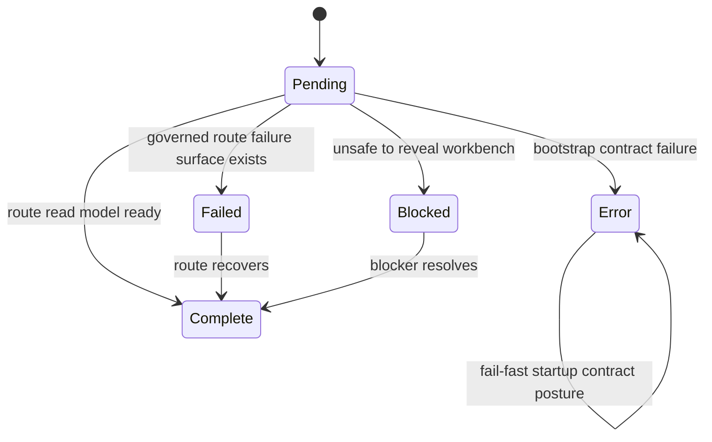
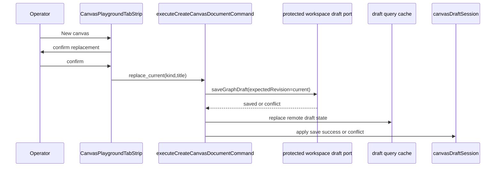
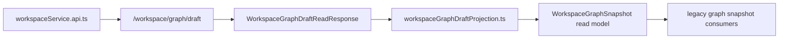
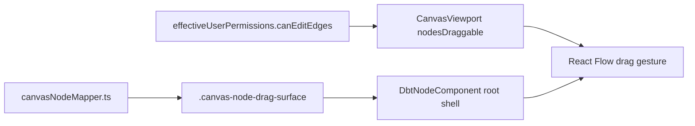

# Canvas Startup And Draft Recovery Component

## Purpose

This guide defines the local component that closes the branch work around route
startup, protected draft read-models, explicit canvas replacement, and node drag
gesture ownership.

Use this page when changing:

- route bootstrap posture for graph-adjacent routes
- workspace graph draft read-model projection
- host-owned create or replace canvas commands
- React Flow node drag handle wiring

Do not use it as the multi-canvas architecture. The current model still has one
authoritative workspace draft canvas document per workspace scope.

The phrase "failed route posture" in this guide means a route-local failure
whose first visible surface is already governed and safe to reveal.

## Public API

| API                                                   | Owner                                    | Responsibility                                                                    |
| ----------------------------------------------------- | ---------------------------------------- | --------------------------------------------------------------------------------- |
| `createFailedRouteBootstrapPresentation(detail)`      | `routeBootstrapContract.ts`              | Publish controlled route-local failures that may reveal a governed route surface. |
| `WORKSPACE_GRAPH_DRAFT_ENDPOINT`                      | `workspaceGraphDraftHttp.ts`             | Single protected draft HTTP endpoint for draft reads and saves.                   |
| `buildWorkspaceGraphDraftEndpoint(scope)`             | `workspaceGraphDraftHttp.ts`             | Attach tenant, project, and environment scope to protected draft reads.           |
| `projectWorkspaceGraphDraftReadResponseSnapshot(...)` | `workspaceGraphDraftProjection.ts`       | Project protected authoring truth into the legacy graph snapshot read model.      |
| `CanvasCreateCanvasDocumentCommand`                   | `canvasDraftLifecycle.types.ts`          | Carry `create_first` or `replace_current` canvas-document intent.                 |
| `executeCreateCanvasDocumentCommand(...)`             | `canvasCreateCanvasDocumentCommand.ts`   | Persist first or explicitly replaced canvas documents through CAS draft saves.    |
| `CanvasPlaygroundTabStrip`                            | `CanvasPlaygroundTabStrip.tsx`           | Coordinate authoritative host tabs and confirmed replacement action state.        |
| `resolveCanvasReplacementActionState(...)`            | `canvasPlaygroundTabStripModel.ts`       | Resolve locale-backed replacement labels, permission state, and active kind.      |
| `CanvasPlaygroundTabStripTemplate`                    | `CanvasPlaygroundTabStrip.templates.tsx` | Render tab-strip HTML from resolved view state without command policy.            |
| `CANVAS_NODE_DRAG_HANDLE_SELECTOR`                    | `canvasNodeMapper.ts`                    | Name the React Flow drag handle shared by mapped nodes and rendered node shell.   |

## Invariants

- `failed` route bootstrap posture is controlled and non-blocking only when the
  route can render a governed failure or recovery surface.
- `error` route bootstrap posture remains reserved for startup contract
  failures where the workbench must not reveal.
- API-mode `WorkspaceGraphSnapshot` reads must go through
  `/workspace/graph/draft` and projection. They must not call a separate
  `/workspace/graph` authority endpoint.
- `create_first` must fail closed when an authoritative draft record already
  exists.
- `replace_current` must fail closed when there is no authoritative draft
  record to replace.
- `replace_current` must save an empty draft through the protected draft port
  with the current revision as `expectedRevision`.
- Create and replacement eligibility must remain behind named semantic helpers;
  route code must not reintroduce anonymous compound conditionals for CAS
  policy.
- DBT node-type projection must remain a declarative rule table plus a matcher,
  not a growing sequence of branch-local `if` checks.
- Canonical-to-viewport node projection must accept named argument objects for
  projection options; positional argument lists must not hide layout,
  column-lineage, overlay, or persisted-position semantics.
- `CanvasPlaygroundTabStrip.tsx` must coordinate host tab state only. Detailed
  HTML belongs in `CanvasPlaygroundTabStrip.templates.tsx`, and replacement
  permission/copy/command decisions belong in `canvasPlaygroundTabStripModel.ts`.
- Tab-strip templates must receive already-resolved copy and state. They must
  not import locale catalogs or construct `replace_current` command DTOs.
- The tab-strip replacement action must stay disabled when effective route
  permissions deny graph editing.
- Node drag remains permission-gated by `CanvasViewport`; the drag handle only
  names the gesture surface when dragging is already allowed.
- `DbtNodeComponent.tsx` may render node shell and plugin decorations, but it
  must not own graph mutation policy or draft persistence.

## Transitions

### Startup posture

### Draft replacement

### Protected snapshot projection

### Drag handle ownership

## Consumers

Direct consumers:

- `Root.tsx`
- graph-adjacent route bootstrap modules
- `workspaceService.api.ts`
- `workspaceGraphDraftAuthoring.api.ts`
- `canvasDraftRepository.ts`
- `canvasCreateCanvasDocumentCommand.ts`
- `CanvasPlaygroundTabStrip.tsx`
- `CanvasViewport.tsx`
- `DbtNodeComponent.tsx`

Indirect consumers:

- Canvas route state tests and bootstrap flow tests
- legacy `WorkspaceGraphSnapshot` readers
- route shell composition
- plugin-rendered Canvas nodes through the DVT node shell

## Fowler reading

| Pattern                       | Local expression                       | Maturity rule                                     |
| ----------------------------- | -------------------------------------- | ------------------------------------------------- |
| Application Controller        | route bootstrap presentation factories | separate route operability from process startup   |
| Gateway                       | `workspaceGraphDraftHttp.ts`           | one protected endpoint and scope vocabulary       |
| Anti-corruption Layer         | `workspaceGraphDraftProjection.ts`     | compatibility read models do not regain authority |
| Command                       | `CanvasCreateCanvasDocumentCommand`    | destructive recovery is explicit and guarded      |
| Decision Table                | `DBT_NODE_TYPE_RULES`                  | projection policy is data-driven and extensible   |
| Passive View                  | `CanvasPlaygroundTabStrip`             | render host state without owning draft DTOs       |
| Presentation Template         | `CanvasPlaygroundTabStripTemplate`     | keep JSX separate from replacement policy         |
| Separated Domain Model        | `canvasPlaygroundTabStripModel.ts`     | test command and i18n state without React         |
| Intention Revealing Interface | `CANVAS_NODE_DRAG_HANDLE_SELECTOR`     | gesture ownership is named and testable           |
| Parameter Object              | `MapCanonicalNodeToCanvasNodeArgs`     | viewport projection options are named at callsite |
| Extract Component             | `CanvasReplacementAction`              | destructive action UI is isolated and testable    |

## Negative coverage

The local architecture guard is:

- `apps/web/src/app/views/canvas/canvasStartupAndDraftRecovery.architecture.test.ts`

It validates semantics, not only barrel thinness:

- `failed` posture can complete bootstrap;
- protected draft endpoint and scoped URL are canonical;
- replacement requires `replace_current` and uses current revision CAS;
- replacement eligibility, draft input construction, save success, and save
  conflict are held behind named semantic helpers;
- DBT node-type projection uses `DBT_NODE_TYPE_RULES` plus a matcher instead of
  hidden branch chains;
- canonical-node viewport projection uses `MapCanonicalNodeToCanvasNodeArgs`
  instead of a positional argument train;
- host tab rendering and replacement action rendering stay behind template
  functions, while replacement copy and command state stay in
  `canvasPlaygroundTabStripModel.ts`;
- `CanvasPlaygroundTabStrip.tsx` does not re-own `AlertDialog`, `TabsTrigger`,
  or `replace_current` command construction;
- `CanvasPlaygroundTabStrip.templates.tsx` does not import Canvas copy catalogs
  or command DTO literals;
- tab strip confirmation stays tied to edit permission;
- mapped and dropped nodes carry the explicit drag handle;
- branch-owned modules keep owned-concern docblocks;
- this guide and the Fowler mailbox remain present and aligned.

## Drift to watch

- Do not add a second graph snapshot endpoint as a startup workaround.
- Do not let `failed` route posture absorb startup contract errors.
- Do not add local storage or database cleanup as a replacement path.
- Do not enable node drag by CSS class while `CanvasViewport` denies mutation.
- Do not present the replacement button as multi-canvas creation until the
  backend has a multi-canvas aggregate.
