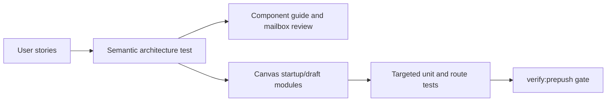

# Canvas Startup And Draft Recovery User Stories

## Purpose

This document captures the user-facing and architecture-facing scenarios
covered by the Canvas startup and draft-recovery component after the static
analysis follow-up branch.

It complements the component guide:

- [Canvas Startup And Draft Recovery Component](./canvas-startup-and-draft-recovery-component.md)

## User Stories

### US-CANVAS-BOOTSTRAP-001: reveal a governed route failure

As an operator opening Canvas, I want the startup gate to complete when Canvas
can render a governed route-local failure, so I see the real recovery surface
instead of a startup card that hides the app.

Acceptance criteria:

- Given the route publishes `failed`, when the bootstrap gate evaluates route
  readiness, then it completes only when the failure is governed.
- Given the route publishes `error`, when the bootstrap gate evaluates startup,
  then it keeps the startup failure posture.
- Given the route can render a blocker, then the shell does not reveal unsafe
  editing controls.

### US-CANVAS-BOOTSTRAP-002: keep health failures visible but non-blocking when safe

As an operator, I want platform health failures to be visible without freezing
Canvas when the route has a safe first surface, so I understand the problem and
can still inspect recovery state.

Acceptance criteria:

- Health transport failures publish failed health detail.
- The shell completes when the active route publishes a governed failure or
  blocker.
- The route owns backend-readiness interaction safety.

### US-CANVAS-BOOTSTRAP-003: load runtime capabilities before unsafe work

As an operator, I want runtime capabilities to settle before Canvas enables
actions, so unavailable features cannot be invoked by accident.

Acceptance criteria:

- Capabilities can be pending, ready, or fallback.
- Fallback capability state is visible.
- Canvas action enablement is derived from route and capability posture, not
  from template-level checks.

### US-CANVAS-BOOTSTRAP-004: preserve localized bootstrap and route copy

As a Spanish-language operator, I want startup and recovery text to resolve
from locale catalogs, so the UI does not mix hardcoded English with Spanish
route state.

Acceptance criteria:

- Bootstrap publishers use command factories and copy catalogs.
- Canvas presenters resolve copy before rendering templates.
- Passive templates do not import copy catalogs.

### US-CANVAS-AUTH-001: refresh an expired local protected-runtime token

As an operator using a long-lived local Canvas session, I want protected draft
requests to use a fresh local dev-stack token, so the app does not present a
false draft-denied state after an overnight token expiry.

Acceptance criteria:

- The frontend omits an expired configured bearer token when no refresh URL is
  available.
- When `VITE_API_BEARER_TOKEN_REFRESH_URL` exists, the API auth component
  requests a fresh token before a protected runtime call.
- Canvas route code does not decode JWTs or call the refresh endpoint directly.

### US-CANVAS-AUTH-002: retry one safe protected request after 401

As an operator whose local token expires between request preparation and API
handling, I want the transport to refresh and retry once, so a recoverable
auth race does not block Canvas startup.

Acceptance criteria:

- `createApiClient()` retries one `401` only when a refresh URL is available.
- Retry is limited to absent or string-backed request bodies.
- The retried request keeps session headers and normalized transport error
  handling.

### US-CANVAS-DRAFT-001: read the protected workspace draft

As an operator opening Canvas, I want the route to read the protected workspace
draft, so Canvas reflects the authoritative draft state.

Acceptance criteria:

- API-mode graph reads use `/workspace/graph/draft`.
- Tenant, project, and environment are always present in the scoped endpoint.
- The route does not call a second graph authority endpoint.

### US-CANVAS-DRAFT-002: project semantic graph truth before viewport rendering

As a developer extending Canvas, I want protected draft data projected into a
canonical semantic graph before DBT-shaped read models or React Flow nodes are
created, so the domain meaning is not coupled to one renderer.

Acceptance criteria:

- `workspaceGraphDraftProjection.ts` owns route-facing draft and canonical
  graph projection.
- `workspaceGraphDraftSnapshotProjection.ts` owns DBT-shaped snapshot output.
- DBT node-type mapping remains a rule table plus matcher.

### US-CANVAS-DRAFT-003: create the first canvas only when no draft exists

As an operator in an empty workspace, I want to create the first Canvas
document only when no authoritative draft exists, so I do not erase work that
already exists remotely.

Acceptance criteria:

- `create_first` fails closed when a draft record exists.
- The command policy owns create-first eligibility.
- The host constructs the create command; templates only render choices.

### US-CANVAS-DRAFT-004: replace the current canvas explicitly

As an operator, I want replacement of the current Canvas to require an explicit
confirmation, so destructive recovery cannot happen by selecting a tab.

Acceptance criteria:

- Replacement uses command mode `replace_current`.
- Replacement stays disabled when effective permissions deny editing.
- The tab-strip presenter dispatches the command only after confirmation.

### US-CANVAS-DRAFT-005: preserve CAS safety during replacement

As an operator, I want replacement to use the current draft revision, so remote
changes are not overwritten silently.

Acceptance criteria:

- `replace_current` fails closed when there is no remote draft.
- Replacement saves a blank draft with `expectedRevision` from the current
  record.
- Save conflict applies remote truth to cache and session state.

### US-CANVAS-DRAFT-006: keep recovery state visible after drift or conflict

As an operator, I want stale, missing, denied, or malformed draft states to
render as governed recovery surfaces, so Canvas explains why editing is not
available.

Acceptance criteria:

- Recovery banner state is resolved in `canvasRecoveryBannerModel.ts`.
- Recovery HTML is rendered in `CanvasRecoveryBanner.templates.tsx`.
- Recovery templates do not import route presentation state or copy catalogs.

### US-CANVAS-DRAFT-007: distinguish missing session from forbidden scope

As an operator, I want Canvas to distinguish an expired or missing session from
a real forbidden workspace scope, so I know whether to refresh session state or
change permissions.

Acceptance criteria:

- A protected draft read with capability reason `unauthenticated` renders a
  session-required posture.
- A protected draft read with capability reason `workspace_scope_denied` or
  `tenant_mismatch` renders a forbidden-scope posture.
- The toolbar does not render the synced label in either posture.
- Graph edit, plan, and run actions are disabled in both postures.
- The recovery action for session denial is not the same as the action for
  forbidden scope.

### US-CANVAS-DRAFT-008: keep read-only draft access inspectable

As a reviewer with read-only draft access, I want the Canvas graph to stay
inspectable while writes are blocked, so I can review graph content without
being offered unsafe mutation controls.

Acceptance criteria:

- Draft capability mode `read_only` does not render a forbidden center-surface
  error.
- The viewport remains visible when a graph can be projected.
- Graph edits, plan, and run start remain disabled for read-only posture.
- The toolbar says read-only rather than synced.
- Read-only copy comes from Canvas copy catalogs.

### US-CANVAS-DRAFT-009: keep governed format failures separate from auth denial

As an operator, I want stored draft format failures to render as contract
problems, so I do not retry session or permission flows for corrupt or
unsupported data.

Acceptance criteria:

- Unsupported schema and corrupt payload render format
  failure posture.
- Format failure does not render session-required or forbidden-scope copy.
- Format failure disables unsafe mutations.
- Format failure remains a center-surface error rather than a reload-only
  recovery banner.

### US-CANVAS-DRAFT-010: resolve toolbar, banner, permissions, and bootstrap from one posture

As an architect, I want draft access posture to be resolved once, so route
surfaces cannot drift into contradictory states.

Acceptance criteria:

- `canvasDraftAccessPostureModel.ts` owns the posture discriminator.
- `canvasDraftAuthTransportPosture.ts` owns normalized final `401` transport
  input and does not inspect API tokens or refresh configuration.
- Toolbar label, recovery banner state, center-surface transport state, and
  mutation gating consume `CanvasDraftAccessPosture`.
- Runtime command admission for graph edit, draft save, plan, and run consumes
  `CanvasDraftAccessPosture`.
- Recovery action callbacks are resolved outside JSX templates.
- Route components do not decode JWTs or call token refresh endpoints.
- Architecture tests reject duplicated local `forbidden` and `read_only`
  branches outside the posture model.

### US-CANVAS-DRAFT-011: prove denial and read-only posture in Cypress

As a product owner, I want browser tests for denied and read-only draft posture,
so the user-visible product behavior is protected beyond unit tests.

Acceptance criteria:

- Cypress proves session-required draft denial hides synced copy and disables
  unsafe actions.
- Cypress proves forbidden-scope draft denial hides synced copy and gives a
  scope-oriented recovery action.
- Cypress proves read-only draft access keeps inspection visible and disables
  mutation controls.
- Cypress does not rely on uncontrolled token expiry timing.

### US-CANVAS-FIRST-AUTHORING-001: create the first shared Canvas live

As an operator in a clean workspace, I want to create the first shared Canvas
through the live protected route, so Canvas becomes useful without seed data or
hidden setup.

Acceptance criteria:

- A protected empty draft renders the typed create-canvas entrypoint.
- The canvas surface renders no seeded project nodes before creation.
- The single offered Canvas entry sends `CreateCanvas` through the existing
  command path using the internal `transformation` runtime registration.
- The empty Canvas is saved with `SaveWorkspaceGraphDraft`.
- The first node is created from `dvt:transform` and resolves to
  `dvt-transform-1` / `Transform 1`.
- Cypress proves the flow without intercepting draft read or write endpoints.
- Cypress fails fast when the test-owned live workspace already contains a
  draft instead of overwriting that draft directly.

### US-CANVAS-FIRST-AUTHORING-002: reject a retired Canvas kind

As an operator opening a persisted document with a retired Canvas kind, I want
the route to fail closed, so unsupported topology is never silently treated as
the shared Canvas runtime.

Acceptance criteria:

- A persisted `dbt` Canvas kind has no runtime registration.
- The route reports the unsupported kind and disables unsafe commands.
- No alias converts the retired kind into `transformation`.
- dbt authority and provenance may survive as profile data without selecting a
  second Canvas runtime.

### US-CANVAS-FIRST-AUTHORING-003: add the first node after authoritative save

As an operator, I want the first node action to become available only after the
first canvas has been saved, so node creation cannot race an unsaved document.

Acceptance criteria:

- `CreateCanvasNode` stays disabled while first-canvas save is pending.
- `CreateCanvasNode` requires writable `CanvasDraftAccessPosture`.
- The created node is persisted through `SaveWorkspaceGraphDraft`.
- Reloaded protected draft truth contains the created node.

### US-CANVAS-FIRST-AUTHORING-004: persist first-node drag from the node card

As an operator moving the first node, I want Canvas to persist the dropped
coordinate when I grab the node card itself, so the product matches the natural
graph-editing gesture.

Acceptance criteria:

- Dragging from the node card body counts as first-authoring proof.
- Dragging uses the drag-stop payload coordinate.
- The whole node card is the React Flow drag surface when mutation is allowed.
- `PersistCanvasLayout` writes only route-local layout projection data.
- `GetCanvasLayout` restores the coordinate after reload.

### US-CANVAS-FIRST-AUTHORING-005: restore the first authored canvas after reload

As an operator, I want the first authored canvas and first node to reload in
the same place, so I can trust Canvas persistence before preview or run work.

Acceptance criteria:

- Hard reload performs a live `GetWorkspaceGraphDraft` query.
- Cypress does not intercept draft read or write endpoints.
- Cypress does not issue `PUT /workspace/graph/draft` before the UI
  `CreateCanvas` path runs.
- The restored route shows the created canvas and node.
- The restored node uses the route-local persisted coordinate.
- The proof is complete only when authoritative draft and layout restore agree.

### US-CANVAS-FIRST-AUTHORING-006: block first authoring when draft access is unsafe

As an operator without writable draft access, I want first-authoring actions to
be unavailable, so Canvas does not imply that edits can be saved.

Acceptance criteria:

- Read-only, unauthenticated, forbidden-scope, pending, and format-error
  postures disable first-canvas and first-node commands.
- The route displays the governed recovery posture from
  `CanvasDraftAccessPosture`.
- No first-authoring proof state can be complete while draft posture is not
  writable.

### US-CANVAS-FIRST-AUTHORING-007: create Canvas inside the active workspace

As an operator in an empty workspace, I want Canvas to show the active
workspace before I create the shared Canvas, so I understand where the document
will be created.

Acceptance criteria:

- The shell shows Project and Environment; the first-canvas host does not repeat
  raw scope IDs or the runtime adapter.
- The startup copy presents one Canvas creation choice.
- The host renders one Start canvas action, without a Canvas type or template.
- Starting Canvas dispatches `CreateCanvasDocumentCommand` through
  the existing protected draft command rail.
- The passive host template does not import copy catalogs or command DTOs.
- No new workspace or project selector is introduced in this route slice.

### US-CANVAS-LAYOUT-001: persist drag-stop payload coordinates

As an operator moving a Canvas card, I want the dropped coordinate to persist,
so the card does not snap back after React Flow supplies a stale node array.

Acceptance criteria:

- `handleNodeDragStop` merges the `draggedNode` event payload over `allNodes`.
- The persisted map contains every visible node position.
- The persistence path writes route-local layout state, not protected draft
  graph state.

### US-CANVAS-LAYOUT-002: persist settled live drag positions

As an operator completing a drag gesture, I want Canvas to persist the settled
live viewport position, so the layout survives re-render and route reload.

Acceptance criteria:

- Active drag frames do not write persisted positions.
- A settled observed drag frame writes changed node positions.
- Equal persisted positions are not rewritten.

### US-CANVAS-LAYOUT-003: block layout writes before route readiness

As a maintainer, I want Canvas layout persistence disabled before hydration and
graph-query readiness, so bootstrap and stale graph state cannot overwrite the
operator layout.

Acceptance criteria:

- Node positions are not persisted while graph query is pending.
- Viewport state is not persisted while graph query is pending.
- Hydration state gates layout persistence.

### US-CANVAS-PRESENTATION-001: keep first-canvas HTML passive

As a frontend maintainer, I want first-canvas HTML in a passive template, so
command construction stays testable outside JSX.

Acceptance criteria:

- `CanvasPlaygroundHost.tsx` owns command construction.
- `CanvasPlaygroundHost.templates.tsx` renders choices from copy and kind
  registrations.
- The template does not import command DTO types.

### US-CANVAS-PRESENTATION-002: keep graph-first shell HTML passive

As a frontend maintainer, I want graph-first shell HTML to render only resolved
view state, so replacement policy, i18n, and command dispatch do not recombine
in route templates.

Acceptance criteria:

- `CanvasShell.tsx` remains the graph-first shell mount.
- shell builders coordinate command wiring and resolved copy outside templates.
- shell presentation does not reintroduce fixed route-mode tabs.

### US-CANVAS-PRESENTATION-003: keep node drag gesture ownership explicit

As an operator, I want Canvas cards to drag from the whole node body while ports
keep their own connection behavior, so moving a node does not depend on a tiny
grip target.

Acceptance criteria:

- Mapped and dropped nodes omit a React Flow `dragHandle` selector.
- `GraphNodeRenderer.tsx` does not render a separate grip-only drag handle.
- Drag enablement remains governed by `CanvasViewport` permissions.

### US-CANVAS-ARCH-001: validate semantics, not only barrels

As an architect, I want an architecture test that validates route posture,
protected endpoint, CAS policy, passive templates, i18n boundaries, owned
concerns, and documentation traceability, so the branch promises remain
enforced.

Acceptance criteria:

- Architecture tests read the local component guide and this story document.
- Tests check semantic strings such as `/workspace/graph/draft`,
  `replace_current`, and `dragSourceNodeFromCardBody`.
- Tests reject retired-route shims and duplicated authority paths.

### US-CANVAS-ARCH-002: keep workspace draft test fixtures bounded

As a frontend maintainer, I want workspace graph draft fixtures split by
authoring shape, protected protocol envelope, and expected projection output,
so tests do not depend on a broad helper module that mixes unrelated concerns.

Acceptance criteria:

- Authoring draft tests import authoring fixtures.
- Protected read/save tests import protocol envelope fixtures.
- Projection tests import expected projection fixtures.
- Endpoint assertions import the production workspace graph draft HTTP
  boundary.

## Scenario Coverage Matrix

| Story                         | Scenario                                        | Primary implementation                                                         | Primary tests                                                                                                                                                   |
| ----------------------------- | ----------------------------------------------- | ------------------------------------------------------------------------------ | --------------------------------------------------------------------------------------------------------------------------------------------------------------- |
| US-CANVAS-BOOTSTRAP-001       | Governed route failure can reveal route surface | `routeBootstrapContract.ts`                                                    | `canvasStartupBootstrapPublication.architecture.test.ts`, `Root.bootstrapFlow.test.tsx`                                                                         |
| US-CANVAS-BOOTSTRAP-002       | Health failure is visible and route-safe        | `appBootstrapPresentation.ts`, `Root.tsx`                                      | `appBootstrapPresentation.test.ts`, `Root.bootstrapFlow.test.tsx`                                                                                               |
| US-CANVAS-BOOTSTRAP-003       | Capabilities settle before unsafe actions       | `Root.tsx`, capability query policy                                            | `Root.bootstrapFlow.test.tsx`, `queryKeyPolicy.architecture.test.ts`                                                                                            |
| US-CANVAS-BOOTSTRAP-004       | Locale-backed startup and route copy            | `appBootstrapCopy.ts`, `copy/*`                                                | `appBootstrapCommands.test.ts`, `copy.test.ts`                                                                                                                  |
| US-CANVAS-AUTH-001            | Refresh expired local protected token           | `apiAuthConfig.ts`, `scripts/run-dev-stack.auth.cjs`                           | `createApiClient.test.ts`, `run-dev-stack.auth.test.cjs`                                                                                                        |
| US-CANVAS-AUTH-002            | Retry one safe protected request after `401`    | `createApiClient.ts`                                                           | `createApiClient.test.ts`, `canvasDraftRecoveryBoundary.architecture.test.ts`                                                                                   |
| US-CANVAS-DRAFT-001           | Protected draft endpoint                        | `workspaceGraphDraftHttp.ts`                                                   | `canvasStartupBootstrapPublication.architecture.test.ts`                                                                                                        |
| US-CANVAS-DRAFT-002           | Semantic and DBT snapshot projection split      | `workspaceGraphDraftProjection.ts`, `workspaceGraphDraftSnapshotProjection.ts` | `workspaceGraphDraftSnapshotProjection.test.ts`                                                                                                                 |
| US-CANVAS-DRAFT-003           | Create first Canvas only when empty             | `canvasCreateCanvasDocumentCommandPolicy.ts`                                   | `canvasCreateCanvasDocumentCommand.test.ts`                                                                                                                     |
| US-CANVAS-DRAFT-004           | Confirmed replacement command                   | `canvasCreateCanvasDocumentCommand.ts`                                         | `canvasCreateCanvasDocumentCommand.test.ts`                                                                                                                     |
| US-CANVAS-DRAFT-005           | CAS-protected replacement                       | `canvasCreateCanvasDocumentCommandPolicy.ts`                                   | `canvasCreateCanvasDocumentCommand.test.ts`                                                                                                                     |
| US-CANVAS-DRAFT-006           | Recovery banner surfaces                        | `canvasRecoveryBannerModel.ts`, `CanvasRecoveryBanner.templates.tsx`           | `canvasDraftRecoveryBoundary.architecture.test.ts`                                                                                                              |
| US-CANVAS-DRAFT-007           | Session denial versus forbidden scope           | `canvasDraftAccessPostureModel.ts`                                             | `canvasDraftAccessPostureModel.test.ts`, Cypress draft access posture spec                                                                                      |
| US-CANVAS-DRAFT-008           | Read-only draft inspection posture              | `canvasDraftAccessPostureModel.ts`, `canvasRouteInteractionState.ts`           | `canvasDraftAccessPostureModel.test.ts`, read-only route tests, Cypress spec                                                                                    |
| US-CANVAS-DRAFT-009           | Format failures stay separate                   | `canvasDraftAccessPostureModel.ts`, `canvasDraftTransportErrorState.ts`        | `canvasDraftAccessPostureModel.test.ts`, architecture guard                                                                                                     |
| US-CANVAS-DRAFT-010           | Single posture controls route surfaces          | auth posture, route state, authoring state, toolbar, banner models             | auth posture test, authoring state test, architecture guard                                                                                                     |
| US-CANVAS-DRAFT-011           | Browser proof for denied and read-only posture  | Cypress draft access spec                                                      | Cypress draft access posture spec                                                                                                                               |
| US-CANVAS-FIRST-AUTHORING-001 | Live shared first Canvas                        | `canvasFirstAuthoringLiveProof.ts`, `canvasCreateCanvasDocumentCommand.ts`     | proof test, create-canvas command test, Cypress live first-authoring spec                                                                                       |
| US-CANVAS-FIRST-AUTHORING-002 | Retired Canvas kind fails closed                | `canvasActiveGraphStrategy.ts`, `canvasRouteInteractionState.ts`               | graph-strategy test, route interaction test, route presentation test                                                                                            |
| US-CANVAS-FIRST-AUTHORING-003 | First node after authoritative save             | `useCanvasController.ts`, `useCanvasNodeAuthoringHandlers.ts`                  | controller core test, first-authoring proof test                                                                                                                |
| US-CANVAS-FIRST-AUTHORING-004 | First-node card-body layout persistence         | `canvasNodeMapper.ts`, `GraphNodeRenderer.tsx`, layout persistence             | layout tests, viewport drag-surface test, Cypress live first-authoring spec                                                                                     |
| US-CANVAS-FIRST-AUTHORING-005 | Reload restores first authored canvas           | protected draft query and layout projection                                    | controller persistence test, viewport graph model test, Cypress live proof                                                                                      |
| US-CANVAS-FIRST-AUTHORING-006 | Unsafe draft access blocks first authoring      | `CanvasDraftAccessPosture`, first-authoring proof model                        | draft access posture tests, first-authoring proof negative tests                                                                                                |
| US-CANVAS-FIRST-AUTHORING-007 | Canvas creation inside active workspace         | `CanvasPlaygroundHost`, `CanvasPlaygroundHost.templates.tsx`                   | `CanvasPlaygroundHost.test.tsx`, `CanvasPlaygroundHost.architecture.test.tsx`                                                                                   |
| US-CANVAS-LAYOUT-001          | Drag-stop payload coordinates persist           | `useCanvasLayoutPersistence.ts`                                                | `useCanvasController.persistence.test.tsx`                                                                                                                      |
| US-CANVAS-LAYOUT-002          | Settled live drag positions persist             | `useCanvasLayoutPersistence.ts`, `useCanvasViewportGraphModel.ts`              | `useCanvasController.persistence.test.tsx`, `useCanvasViewportGraphModel.layout.test.tsx`                                                                       |
| US-CANVAS-LAYOUT-003          | Pending route state blocks layout writes        | `useCanvasLayoutPersistence.ts`                                                | `useCanvasController.persistence.test.tsx`                                                                                                                      |
| US-CANVAS-PRESENTATION-001    | Passive host template                           | `CanvasPlaygroundHost.templates.tsx`                                           | `canvasDraftRecoveryBoundary.architecture.test.ts`                                                                                                              |
| US-CANVAS-PRESENTATION-002    | Passive graph-first shell                       | `CanvasShell.tsx`, shell builders                                              | `CanvasShell.architecture.test.tsx`, `canvasRoutePosturePriority.architecture.test.ts`                                                                          |
| US-CANVAS-PRESENTATION-003    | Drag surface is explicit                        | `canvasNodeMapper.ts`, `GraphNodeRenderer.tsx`                                 | `canvasStartupBootstrapPublication.architecture.test.ts`                                                                                                        |
| US-CANVAS-ARCH-001            | Semantic architecture guard                     | split Canvas architecture tests                                                | `canvasStartupBootstrapPublication.architecture.test.ts`, `canvasDraftRecoveryBoundary.architecture.test.ts`, `canvasRoutePosturePriority.architecture.test.ts` |
| US-CANVAS-ARCH-002            | Fixture boundaries                              | `workspaceGraphDraftFixtureBoundaries.architecture.test.ts`                    | `workspaceGraphDraftFixtureBoundaries.architecture.test.ts`                                                                                                     |

## TDD Traceability

Red case for this follow-up:

- the architecture guard expected the branch-level Fowler review and
  user-story guide;
- the files did not exist;
- the targeted test failed with `ENOENT`.

Green case for this follow-up:

- add the review and stories;
- link the stories from the component guide;
- rerun the architecture guard and broader validation.

Red case for the 2026-04-29 Canvas operability auth/layout follow-up:

- the architecture guard expected local auth and layout component guides plus
  a new Fowler mailbox review;
- those files did not exist;
- `apiAuthConfig.ts` and new layout/lifecycle participants did not yet satisfy
  the short owned-concern docblock guard.

Green case for the 2026-04-29 Canvas operability auth/layout follow-up:

- add the auth and layout component guides;
- add the mailbox review;
- normalize owned-concern docblocks;
- split layout persistence into named local persistence roles;
- rerun the architecture guard and targeted behavior tests.

Red case for `TF-E2-M-C` first-authoring mechanization:

- `node scripts/check-feature-mechanization.cjs --feature TF-E2-M-C` reported
  that no feature mechanization manifest existed;
- no local component guide named the first-authoring proof API, invariants,
  transitions, or consumers;
- the story catalog did not cover first-Canvas creation, first-node creation,
  drag-surface persistence, reload restore, and unsafe posture denial as one
  feature lane.

Green case for `TF-E2-M-C` planning:

- add the feature mechanization manifest and package script;
- add the first-authoring live proof component guide;
- add the user stories and scenario matrix rows;
- regenerate governed docs and run the feature mechanization checks.

Red case for `F-15-E` startup template selection:

- the first-canvas host test expected active workspace context and template
  titles from `CanvasTemplatePresentation`;
- the architecture guard expected the new component guide, mailbox review,
  user story, and semantic copy checks;
- the route still rendered registry labels and no workspace context.

Green case for `F-15-E` startup template selection:

- carry `WorkspaceScope` from the controller view model to the host template;
- render active workspace context and canvas template copy;
- keep command construction host-owned and template HTML passive;
- run the focused host tests, Canvas lane, docs sync, feature mechanization,
  and pre-push validation.

## Branch-Adjacent Scenario Notes

The same branch also hardened nearby non-Canvas scenarios:

- run execution context admission uses a named request object so engine policy
  callers cannot swap positional values;
- traceability compiled-code-ref extraction uses named payload candidates so
  lineage mapping order is visible;
- Temporal adapter activity setup uses named setup options so tests communicate
  intent.

Those scenarios are documented in the branch Fowler review because they belong
to engine, traceability, and adapter component guides rather than this Canvas
local guide.
