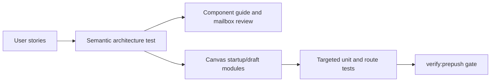

# Canvas Startup And Draft Recovery User Stories

## Purpose

This document captures the user-facing and architecture-facing scenarios
covered by the Canvas startup and draft-recovery component after the static
analysis follow-up branch.

It complements the component guide:

- [Canvas Startup And Draft Recovery Component](./canvas-startup-and-draft-recovery-component.md)

## User Stories

### US-CANVAS-BOOTSTRAP-001: reveal a governed route failure

As an operator opening Canvas, I want the startup gate to complete when Canvas
can render a governed route-local failure, so I see the real recovery surface
instead of a startup card that hides the app.

Acceptance criteria:

- Given the route publishes `failed`, when the bootstrap gate evaluates route
  readiness, then it may complete.
- Given the route publishes `error`, when the bootstrap gate evaluates startup,
  then it keeps the startup failure posture.
- Given the route can render a blocker, then the shell does not reveal unsafe
  editing controls.

### US-CANVAS-BOOTSTRAP-002: keep health failures visible but non-blocking when safe

As an operator, I want platform health failures to be visible without freezing
Canvas when the route has a safe first surface, so I understand the problem and
can still inspect recovery state.

Acceptance criteria:

- Health transport failures publish failed health detail.
- The shell may complete when the active route publishes a governed failure or
  blocker.
- The route owns backend-readiness interaction safety.

### US-CANVAS-BOOTSTRAP-003: load runtime capabilities before unsafe work

As an operator, I want runtime capabilities to settle before Canvas enables
actions, so unavailable features cannot be invoked by accident.

Acceptance criteria:

- Capabilities can be pending, ready, or fallback.
- Fallback capability state is visible.
- Canvas action enablement is derived from route and capability posture, not
  from template-level checks.

### US-CANVAS-BOOTSTRAP-004: preserve localized bootstrap and route copy

As a Spanish-language operator, I want startup and recovery text to resolve
from locale catalogs, so the UI does not mix hardcoded English with Spanish
route state.

Acceptance criteria:

- Bootstrap publishers use command factories and copy catalogs.
- Canvas presenters resolve copy before rendering templates.
- Passive templates do not import copy catalogs.

### US-CANVAS-DRAFT-001: read the protected workspace draft

As an operator opening Canvas, I want the route to read the protected workspace
draft, so Canvas reflects the authoritative draft state.

Acceptance criteria:

- API-mode graph reads use `/workspace/graph/draft`.
- Tenant, project, and environment are always present in the scoped endpoint.
- The route does not call a second graph authority endpoint.

### US-CANVAS-DRAFT-002: project semantic graph truth before viewport rendering

As a developer extending Canvas, I want protected draft data projected into a
canonical semantic graph before DBT-shaped read models or React Flow nodes are
created, so the domain meaning is not coupled to one renderer.

Acceptance criteria:

- `workspaceGraphDraftProjection.ts` owns route-facing draft and canonical
  graph projection.
- `workspaceGraphDraftSnapshotProjection.ts` owns DBT-shaped snapshot output.
- DBT node-type mapping remains a rule table plus matcher.

### US-CANVAS-DRAFT-003: create the first canvas only when no draft exists

As an operator in an empty workspace, I want to create the first Canvas
document only when no authoritative draft exists, so I do not erase work that
already exists remotely.

Acceptance criteria:

- `create_first` fails closed when a draft record exists.
- The command policy owns create-first eligibility.
- The host constructs the create command; templates only render choices.

### US-CANVAS-DRAFT-004: replace the current canvas explicitly

As an operator, I want replacement of the current Canvas to require an explicit
confirmation, so destructive recovery cannot happen by selecting a tab.

Acceptance criteria:

- Replacement uses command mode `replace_current`.
- Replacement stays disabled when effective permissions deny editing.
- The tab-strip presenter dispatches the command only after confirmation.

### US-CANVAS-DRAFT-005: preserve CAS safety during replacement

As an operator, I want replacement to use the current draft revision, so remote
changes are not overwritten silently.

Acceptance criteria:

- `replace_current` fails closed when there is no remote draft.
- Replacement saves a blank draft with `expectedRevision` from the current
  record.
- Save conflict applies remote truth to cache and session state.

### US-CANVAS-DRAFT-006: keep recovery state visible after drift or conflict

As an operator, I want stale, missing, denied, or malformed draft states to
render as governed recovery surfaces, so Canvas explains why editing is not
available.

Acceptance criteria:

- Recovery banner state is resolved in `canvasRecoveryBannerModel.ts`.
- Recovery HTML is rendered in `CanvasRecoveryBanner.templates.tsx`.
- Recovery templates do not import route presentation state or copy catalogs.

### US-CANVAS-PRESENTATION-001: keep first-canvas HTML passive

As a frontend maintainer, I want first-canvas HTML in a passive template, so
command construction stays testable outside JSX.

Acceptance criteria:

- `CanvasPlaygroundHost.tsx` owns command construction.
- `CanvasPlaygroundHost.templates.tsx` renders choices from copy and kind
  registrations.
- The template does not import command DTO types.

### US-CANVAS-PRESENTATION-002: keep tab-strip HTML passive

As a frontend maintainer, I want tab-strip HTML to render only resolved view
state, so replacement policy, i18n, and command dispatch do not recombine in
the template.

Acceptance criteria:

- `CanvasPlaygroundTabStrip.tsx` is a thin mount.
- `useCanvasPlaygroundTabStripPresenter.ts` coordinates callbacks and copy.
- `CanvasPlaygroundTabStrip.templates.tsx` renders labels and actions only.

### US-CANVAS-PRESENTATION-003: keep node drag gesture ownership explicit

As an operator, I want Canvas cards to drag only from the intended surface, so
selecting text or interacting with ports does not accidentally move nodes.

Acceptance criteria:

- Mapped and dropped nodes include `CANVAS_NODE_DRAG_HANDLE_SELECTOR`.
- `DbtNodeComponent.tsx` renders the named drag surface.
- Drag enablement remains governed by `CanvasViewport` permissions.

### US-CANVAS-ARCH-001: validate semantics, not only barrels

As an architect, I want an architecture test that validates route posture,
protected endpoint, CAS policy, passive templates, i18n boundaries, owned
concerns, and documentation traceability, so the branch promises remain
enforced.

Acceptance criteria:

- Architecture tests read the local component guide and this story document.
- Tests check semantic strings such as `/workspace/graph/draft`,
  `replace_current`, and `.canvas-node-drag-surface`.
- Tests reject retired-route shims and duplicated authority paths.

## Scenario Coverage Matrix

| Story                      | Scenario                                        | Primary implementation                                                         | Primary tests                                                                             |
| -------------------------- | ----------------------------------------------- | ------------------------------------------------------------------------------ | ----------------------------------------------------------------------------------------- |
| US-CANVAS-BOOTSTRAP-001    | Governed route failure can reveal route surface | `routeBootstrapContract.ts`                                                    | `canvasStartupAndDraftRecovery.architecture.test.ts`, `Root.bootstrapFlow.test.tsx`       |
| US-CANVAS-BOOTSTRAP-002    | Health failure is visible and route-safe        | `appBootstrapPresentation.ts`, `Root.tsx`                                      | `appBootstrapPresentation.test.ts`, `Root.bootstrapFlow.test.tsx`                         |
| US-CANVAS-BOOTSTRAP-003    | Capabilities settle before unsafe actions       | `Root.tsx`, capability query policy                                            | `Root.bootstrapFlow.test.tsx`, `queryKeyPolicy.architecture.test.ts`                      |
| US-CANVAS-BOOTSTRAP-004    | Locale-backed startup and route copy            | `appBootstrapCopy.ts`, `copy/*`                                                | `appBootstrapCommands.test.ts`, `copy.test.ts`                                            |
| US-CANVAS-DRAFT-001        | Protected draft endpoint                        | `workspaceGraphDraftHttp.ts`                                                   | `canvasStartupAndDraftRecovery.architecture.test.ts`                                      |
| US-CANVAS-DRAFT-002        | Semantic and DBT snapshot projection split      | `workspaceGraphDraftProjection.ts`, `workspaceGraphDraftSnapshotProjection.ts` | `workspaceGraphDraftSnapshotProjection.test.ts`                                           |
| US-CANVAS-DRAFT-003        | Create first Canvas only when empty             | `canvasCreateCanvasDocumentCommandPolicy.ts`                                   | `canvasCreateCanvasDocumentCommand.test.ts`                                               |
| US-CANVAS-DRAFT-004        | Confirmed replacement command                   | `useCanvasPlaygroundTabStripPresenter.ts`                                      | `CanvasPlaygroundTabStrip.test.tsx`                                                       |
| US-CANVAS-DRAFT-005        | CAS-protected replacement                       | `canvasCreateCanvasDocumentCommandPolicy.ts`                                   | `canvasCreateCanvasDocumentCommand.test.ts`                                               |
| US-CANVAS-DRAFT-006        | Recovery banner surfaces                        | `canvasRecoveryBannerModel.ts`, `CanvasRecoveryBanner.templates.tsx`           | `canvasStartupAndDraftRecovery.architecture.test.ts`                                      |
| US-CANVAS-PRESENTATION-001 | Passive host template                           | `CanvasPlaygroundHost.templates.tsx`                                           | `canvasStartupAndDraftRecovery.architecture.test.ts`                                      |
| US-CANVAS-PRESENTATION-002 | Passive tab-strip template                      | `CanvasPlaygroundTabStrip.templates.tsx`                                       | `CanvasPlaygroundTabStrip.test.tsx`, `canvasStartupAndDraftRecovery.architecture.test.ts` |
| US-CANVAS-PRESENTATION-003 | Drag handle is explicit                         | `canvasNodeMapper.ts`, `DbtNodeComponent.tsx`                                  | `canvasStartupAndDraftRecovery.architecture.test.ts`                                      |
| US-CANVAS-ARCH-001         | Semantic architecture guard                     | `canvasStartupAndDraftRecovery.architecture.test.ts`                           | `canvasStartupAndDraftRecovery.architecture.test.ts`                                      |

## TDD Traceability

Red case for this follow-up:

- the architecture guard expected the branch-level Fowler review and
  user-story guide;
- the files did not exist;
- the targeted test failed with `ENOENT`.

Green case for this follow-up:

- add the review and stories;
- link the stories from the component guide;
- rerun the architecture guard and broader validation.

## Branch-Adjacent Scenario Notes

The same branch also hardened nearby non-Canvas scenarios:

- run execution context admission uses a named request object so engine policy
  callers cannot swap positional values;
- traceability compiled-code-ref extraction uses named payload candidates so
  lineage mapping order is visible;
- Temporal adapter activity setup uses named setup options so tests communicate
  intent.

Those scenarios are documented in the branch Fowler review because they belong
to engine, traceability, and adapter component guides rather than this Canvas
local guide.
