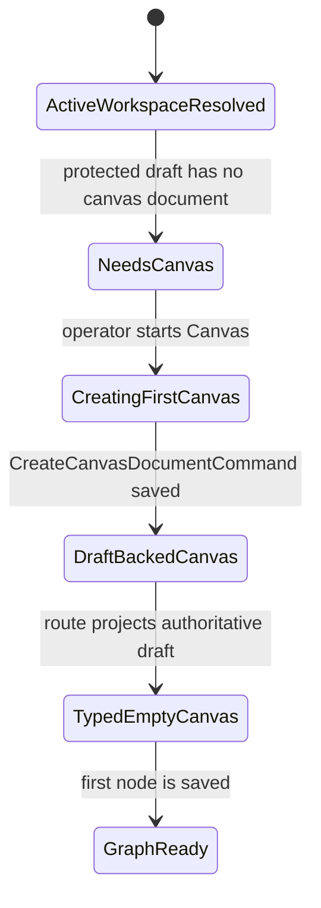
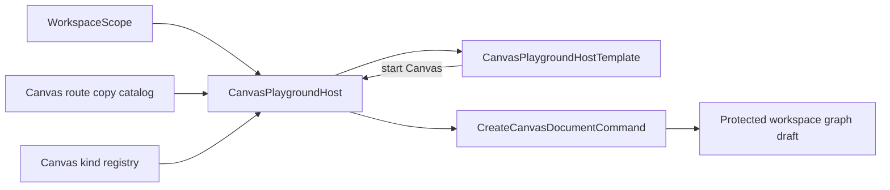
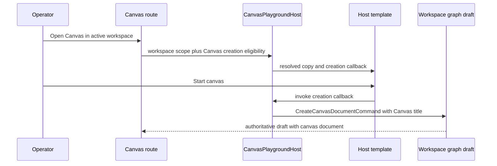
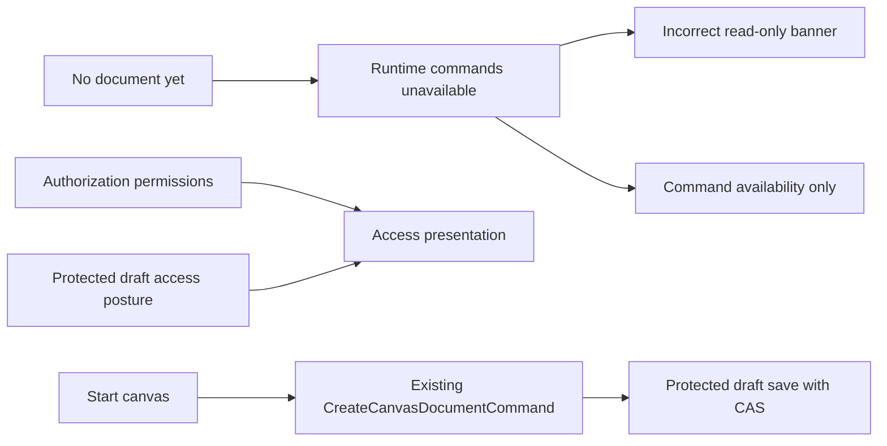

# Canvas Startup Template Selection Component

## Purpose

This component owns entry into the single Canvas inside the active workspace.
There are no user-facing Canvas types or start Canvass.

## Public API

- `CanvasPlaygroundHost`
  - consumes the existing runtime registrations and
    `onCreateCanvasDocument`.
  - owns copy selection and command construction.
- `CanvasPlaygroundHostTemplate`
  - consumes resolved copy, a creation callback and an unavailable reason.
  - renders passive HTML only.
- `CreateCanvasDocumentCommand`
  - existing command rail used to persist the first canvas document.

## Invariants

- Workspace, project, environment, and adapter are resolved before this surface
  renders.
- The shell shows the active workspace. The first-start surface must not duplicate
  raw scope IDs or adapter details.
- One direct Start canvas action replaces the former canvas template chooser.
- The host builds `CreateCanvasDocumentCommand`; the template never imports the
  command DTO or copy catalog.
- The first canvas persists through `/workspace/graph/draft`; no parallel
  startup command or fake local success path is allowed.
- First-canvas creation is a canvas-document transition. Its availability must
  follow draft persistence eligibility and must not reuse `canEditEdges`, which
  belongs to graph/node/edge mutation after a typed document exists.
- Draft persistence eligibility is projected as `canPersistGraphDraft`; graph
  editability remains `canEditEdges`.
- The component does not introduce a workspace/project selector.

## Transitions

## Component Flow

## Sequence

## Consumers

- `canvasControllerViewModel.ts`
- `canvasRouteViewState.ts`
- `canvasShellPropsBuilder.tsx`
- `canvasShellLayoutBuilder.tsx`
- `CanvasCenterSurface.tsx`
- `canvasCenterSurfaceWorkbench.tsx`
- `CanvasPlaygroundHost.tsx`
- `CanvasPlaygroundHost.templates.tsx`

## Drift To Prevent

- Reintroducing project-type copy in the first-start host.
- Hiding active workspace context at the decision point.
- Letting the passive template construct commands or import copy catalogs.
- Adding a second command/query rail for the same first-canvas intent.
- Treating focus lanes or browser visual checks as replacements for the
  semantic architecture guard.

## Single Canvas first-use correction (2026-09-06)

Issue #2268 implements the one-Canvas decision #2902. There are no Canvas
types or templates in the product.
The active workspace is already visible in the shell. First use presents one
Start canvas action and a short explanation; it does not repeat raw scope IDs,
runtime adapter, persistence internals, or a one-option template chooser.

Current defect and required separation:

The host remains the command owner and the template remains passive. Resolve the
shared transformation registration from the existing registry; do not introduce
a second kind or silently choose an unsupported registration. Creation still
requires its existing eligibility callback and must not occur as a read effect.
A successful save opens the existing empty Canvas. Denials and conflicts retain
their existing recovery paths.

Access presentation uses authorizationPermissions and protected draft posture,
never runtime command readiness. A missing document, unavailable execution
projection, or in-flight save cannot manufacture a permission denial. Runtime
commands remain disabled until their own policy admits them. Real write denial
continues to prevent mutation. Existing rails, scope authorization, application
ports and CAS semantics are unchanged.

Acceptance: EN/ES direct action, no redundant scope/adapter/template explanation,
keyboard accessible native button, original command dispatch, no creation when
disallowed, no false restriction before first creation or while execution is
unavailable, and preserved actual draft write denial.
