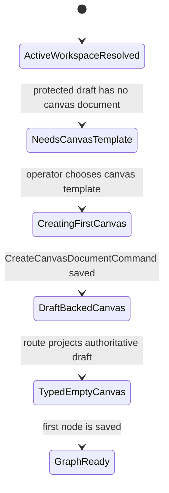
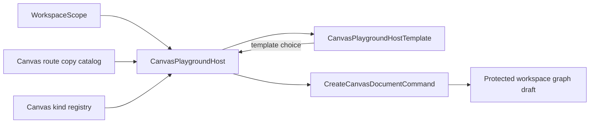
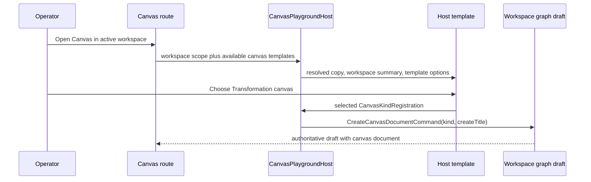

# Canvas Startup Template Selection Component

## Purpose

This component defines the first Canvas authoring decision inside an already
resolved workspace. It prevents `dbt` and `Transformation` from being presented
as project types. They are canvas templates that create the first persisted
Canvas document through the protected workspace graph draft boundary.

## Public API

- `CanvasPlaygroundHost`
  - consumes active `WorkspaceScope`, available `CanvasKindRegistration[]`, and
    `onCreateCanvasDocument`.
  - owns copy selection and command construction.
- `CanvasPlaygroundHostTemplate`
  - consumes resolved copy, active workspace scope, canvas registrations, and a
    template-choice callback.
  - renders passive HTML only.
- `CanvasKindRegistration.createTitle`
  - visible template title for the first-start button.
- `CreateCanvasDocumentCommand`
  - existing command rail used to persist the first canvas document.

## Invariants

- Workspace, project, environment, and adapter are resolved before this surface
  renders.
- The first-start surface must show the active workspace context.
- `dbt` and `Transformation` are presented as canvas templates, not project
  types or route authorities.
- The host builds `CreateCanvasDocumentCommand`; the template never imports the
  command DTO or copy catalog.
- The template title uses `registration.createTitle`; plugin `label` remains an
  internal catalog label or secondary metadata.
- The first canvas persists through `/workspace/graph/draft`; no parallel
  startup command or fake local success path is allowed.
- The component does not introduce a workspace/project selector.

## Transitions

## Component Flow

## Sequence

## Consumers

- `canvasControllerViewModel.ts`
- `canvasRouteViewState.ts`
- `canvasShellPropsBuilder.tsx`
- `canvasShellLayoutBuilder.tsx`
- `CanvasCenterSurface.tsx`
- `canvasCenterSurfaceWorkbench.tsx`
- `CanvasPlaygroundHost.tsx`
- `CanvasPlaygroundHost.templates.tsx`

## Drift To Prevent

- Reintroducing project-type copy in the first-start host.
- Hiding active workspace context at the decision point.
- Letting the passive template construct commands or import copy catalogs.
- Adding a second command/query rail for the same first-canvas intent.
- Treating focus lanes or browser visual checks as replacements for the
  semantic architecture guard.
