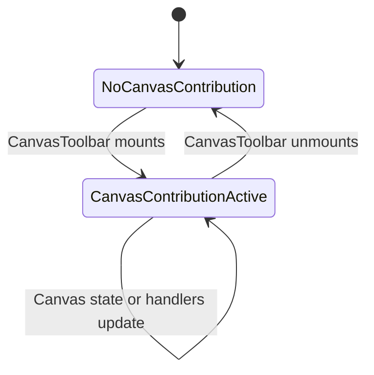
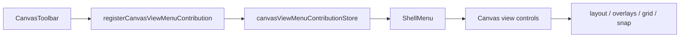

# Canvas View Menu Component

## Purpose

Define the component that contributes Canvas-specific visual controls to the
global `View` menu.

This component owns:

- route-local Canvas view-control registration;
- rendering Canvas presentation toggles inside `ShellMenu`;
- keeping the Canvas top-bar toolbar focused on workflow status and primary
  route commands;
- the semantic boundary between view preferences and graph/run mutations.

It does not own graph truth, draft persistence, execution commands, project
snapshot file semantics, or backend command/query rails.

## Public API

The local public API is:

- `CanvasViewMenuControls`
- `CanvasViewMenuContribution`
- `useCanvasViewMenuContributionStore`
- `registerCanvasViewMenuContribution(...)`
- `clearCanvasViewMenuContribution(...)`

`CanvasToolbar` is the active Canvas-route consumer. It registers one
`CanvasViewMenuContribution` while mounted. `ShellMenu` reads the current
contribution and renders it inside `View`.

## Invariants

- `View` owns Canvas visual toggles: layout, impact overlay, column lineage,
  cost overlay, grid visibility, grid color, and snap-to-grid.
- `CanvasToolbarPrimaryControls` must not render those visual toggles in the
  top-bar toolbar.
- `ShellMenu` must not import Canvas controller hooks or inspect Canvas route
  internals.
- The contribution is transient; unmounting the Canvas route removes the Canvas
  View-menu controls.
- View-menu commands may change local presentation state or request layout, but
  they must not start runs, plan execution, mutate persisted graph structure, or
  fabricate export data.
- Labels come from the Canvas copy catalog so the menu and route stay
  localization-aligned.

## Transitions

## Component Flow

## Consumers

- `CanvasToolbar`
- `CanvasToolbarPrimaryControls`
- `ShellMenu`
- `TopAppBar`
- `CanvasToolbar.test.tsx`
- `CanvasToolbar.architecture.test.tsx`

## User Stories Covered

See [Canvas View Menu User Stories](./canvas-view-menu-user-stories.md).

## Fitness Functions

- `pnpm --filter @dvt/web test -- src/app/views/canvas/CanvasToolbar.test.tsx`
- `pnpm --filter @dvt/web test -- src/app/views/canvas/CanvasToolbar.architecture.test.tsx`
- `pnpm --filter @dvt/web typecheck`

## Drift To Watch

- if Canvas view toggles appear again in `CanvasToolbarPrimaryControls`, the
  command surface has regressed;
- if `ShellMenu` imports `useCanvasController`, the shell has absorbed route
  internals;
- if the component guide loses public API, invariants, transitions, consumers,
  or diagrams, architecture review can no longer verify the boundary;
- if view controls start planning or running workflows, the View menu has
  crossed into command-rail behavior.
