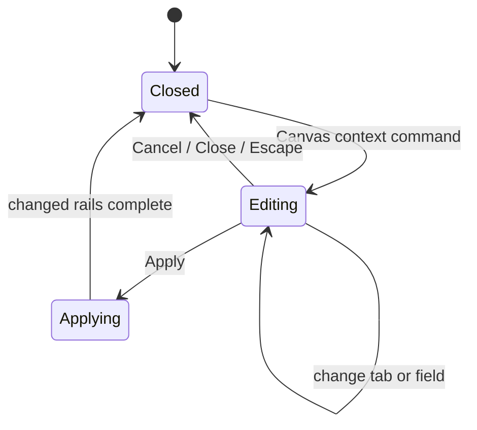
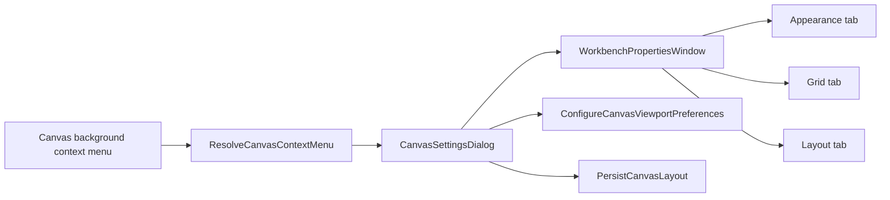

# Canvas Properties Window Component

## Purpose

Define the single contextual surface for editing Canvas presentation properties.
The Canvas background context menu opens a properties window composed from the
shared workbench dialog, tab, field, and command components.

This component owns:

- one buffered edit session for Canvas appearance, grid, and layout properties;
- localized tabs, labels, accessible names, focus return, and keyboard dismissal;
- dispatch to the existing Canvas preference and layout command rails only after
  the user selects `Apply`;
- removal of Canvas-specific properties from the global `View` menu.

It does not own graph truth, protected draft persistence, execution commands,
project snapshots, or backend command/query rails.

## Public API

- `WorkbenchPropertiesWindow`: shared modal shell with header, tabs, scrollable
  content, and `Cancel` / `Apply` footer commands.
- `WorkbenchPropertiesSection`: typed tab contribution contract.
- `CanvasSettingsDialog`: Canvas adapter that builds the edit buffer and maps
  fields to the existing callbacks.
- `ResolveCanvasContextMenu`: query rail that exposes the background
  `Canvas properties` command.
- `ConfigureCanvasViewportPreferences`: command rail for local visual
  preferences.
- `PersistCanvasLayout`: command rail used when automatic layout is applied.

## Invariants

- The background context menu is the only entry point for Canvas properties.
- The global `View` menu contains global view controls only: panels, focus mode,
  and language.
- `CanvasSettingsDialog` composes `WorkbenchPropertiesWindow`; it does not create
  a second modal shell or a parallel settings store.
- Field changes remain in the edit buffer until `Apply`.
- `Cancel`, the close command, and `Escape` discard the edit buffer.
- `Apply` invokes only rails whose values changed.
- Automatic layout is unavailable when graph-edit permission is absent.
- Labels and accessible names resolve through the Canvas copy catalog in English
  and Spanish.
- The shell menu must not import Canvas controller hooks, Canvas property state,
  or Canvas-specific contribution stores.

## Transitions

## Component Flow

## Consumers

- `CanvasShell`
- `CanvasViewport`
- `ShellMenu`
- `CanvasSettingsDialog.test.tsx`
- `WorkbenchPropertiesWindow.test.tsx`
- `CanvasSettingsDialog.architecture.test.tsx`
- `TopAppBar.test.tsx`

## User Stories Covered

See [Canvas View Menu User Stories](./canvas-view-menu-user-stories.md). The
historical story names remain stable; their accepted surface is now the
contextual Canvas properties window.

## Fitness Functions

- `pnpm --filter @dvt/web test:presentation:run -- src/app/components/TopAppBar.test.tsx`
- `pnpm --filter @dvt/web test:canvas-presentation:run -- src/app/views/canvas/CanvasSettingsDialog.test.tsx`
- `pnpm --filter @dvt/web test:canvas-architecture:run -- src/app/views/canvas/CanvasSettingsDialog.architecture.test.tsx`
- `pnpm --filter @dvt/web typecheck`

## Drift To Watch

- Canvas background, grid, layout, or overlay controls reappearing in `View`;
- a route-to-shell contribution store returning for Canvas properties;
- immediate mutation before `Apply`;
- a Canvas-local dialog shell duplicating the shared workbench window;
- unlocalized or inaccessible tab, field, close, or footer commands;
- visual preferences crossing into protected graph or run authority.
