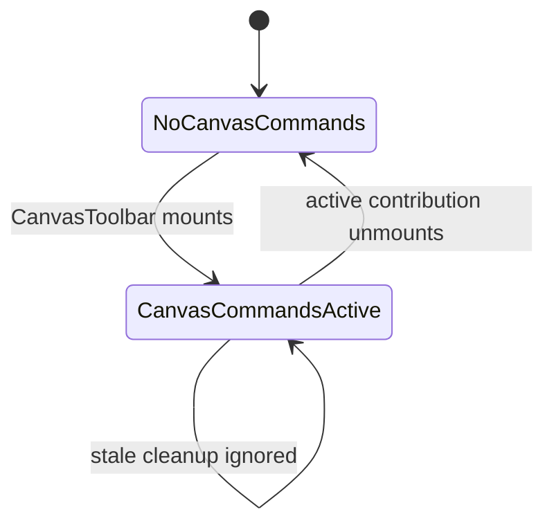
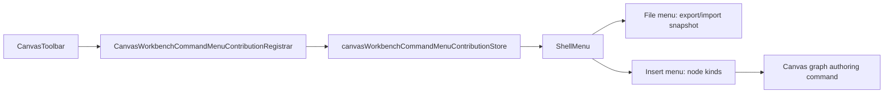

# Canvas Workbench Command Menu Component

## Purpose

Define the transient Canvas contribution that lets the global shell render
Canvas-aware `File` and `Insert` commands without making the shell own Canvas
controller behavior.

This component owns:

- Canvas route registration for active workbench command capabilities;
- shell rendering of Canvas File and Insert menu groups;
- identity-guarded cleanup when the Canvas route unmounts or rerenders;
- keeping project snapshot import/export and node insertion out of the primary
  Canvas workflow toolbar.

It does not own graph truth, draft persistence, execution planning, run start,
project file storage semantics, or backend command/query rails.

## Public API

- `CanvasWorkbenchCommandMenuContribution`
- `useCanvasWorkbenchCommandMenuContributionStore`
- `CanvasWorkbenchCommandMenuContributionRegistrar`
- `CanvasWorkbenchCommandMenus`

`CanvasToolbar` registers one `CanvasWorkbenchCommandMenuContribution` while
mounted. `ShellMenu` renders `CanvasWorkbenchCommandMenus` in the global top bar
when a contribution exists.

## Invariants

- Canvas File and Insert commands are available only while a Canvas route
  contribution is active.
- The shell must consume the contribution through the published interface; it
  must not import Canvas controller hooks.
- The route toolbar must not duplicate project snapshot import/export or node
  insertion once those actions are contributed to the top menu.
- Project snapshot import/export stay under File.
- Node-kind creation stays under Insert.
- Plan and Execute remain visible workflow actions in the route toolbar.
- Cleanup is identity-guarded so a stale route cleanup cannot clear a newer
  contribution.

## Transitions

## Component Flow

## Consumers

- `CanvasToolbar`
- `CanvasToolbarPrimaryControls`
- `ShellMenu`
- `TopAppBar`
- `CanvasToolbar.test.tsx`
- `CanvasToolbar.architecture.test.tsx`
- `TopAppBar.test.tsx`

## User Stories Covered

See [Workbench UX Canon User Stories](../workbench-ux-canon-user-stories.md).

## Fitness Functions

- `pnpm --filter @dvt/web exec vitest run --config vitest.presentation.config.ts src/app/components/TopAppBar.test.tsx src/app/views/canvas/CanvasToolbar.test.tsx src/app/views/canvas/CanvasToolbarPrimaryControls.test.tsx`
- `pnpm --filter @dvt/web exec vitest run --config vitest.unit.config.ts src/app/views/canvas/CanvasToolbar.architecture.test.tsx`
- `pnpm --filter @dvt/web typecheck`
- `pnpm docs:feature-mechanization:implementation`

## Drift To Watch

- if `Insert` or `Project` returns as a loose Canvas toolbar button, the command
  taxonomy has regressed;
- if `ShellMenu` imports Canvas controller hooks, the shell has absorbed route
  behavior;
- if File menu actions start execution or graph mutation, File has crossed into
  Run or Insert ownership;
- if Insert starts importing files, Insert has crossed into File ownership.
