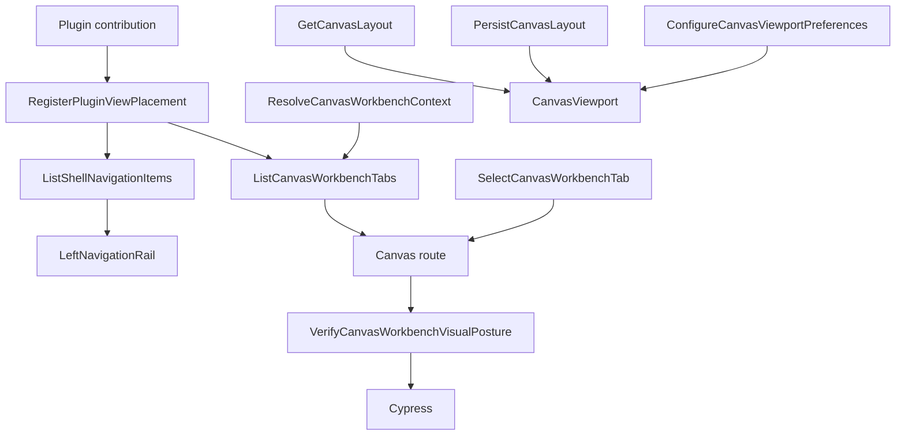

# Canvas Workbench Command And Query Catalog

## Purpose

This catalog is the Web Graph bounded-context C&Q list for the Canvas
workbench, Canvas route placement, and route-local layout preferences.

It exists to keep product intent out of routes, components, plugin manifests,
and Cypress helpers. Those surfaces implement rails; they do not define new
product semantics.

## Governing Sources

- `AGENTS.md`
- `docs/planning/status/governance-document-rule-inventory.md`
- `docs/architecture/command-query-rail-governance.md`
- `docs/architecture/fowler-opportunity-planning-governance.md`
- `docs/architecture/components/web/graph/canvas-workbench-tabs-component.md`
- `docs/architecture/components/web/graph/canvas-layout-persistence-component.md`
- `docs/planning/proposals/mandatory/frontend-and-ux/canvas-workbench-fowler-remediation-plan-20260504.md`

## Bounded Context

Bounded context: Web Graph Canvas Workbench.

DDD ownership rules:

- Shell navigation owns global workbench destinations only.
- Canvas workbench presentation owns Canvas-scoped tab placement and tab
  selection.
- Plugin contribution registry owns static placement registration policy.
- Canvas layout presentation owns viewport and node-coordinate projection.
- Canvas viewport presentation owns route-local visual preferences such as grid
  visibility, grid color, and snap-to-grid.
- Protected authoring draft owns graph meaning. It does not own local layout
  preferences or workbench tab placement.

## C&Q Summary

| Rail                                 | Type    | Status        | Bounded context               | DDD owner                               |
| ------------------------------------ | ------- | ------------- | ----------------------------- | --------------------------------------- |
| `ListShellNavigationItems`           | query   | accepted      | Web shell navigation          | `ShellNavigationReadModel`              |
| `ListCanvasWorkbenchTabs`            | query   | accepted      | Canvas workbench presentation | `CanvasWorkbenchTabsReadModel`          |
| `ResolveCanvasWorkbenchContext`      | query   | accepted      | Canvas workbench presentation | `CanvasWorkbenchContext`                |
| `SelectCanvasWorkbenchTab`           | command | accepted      | Canvas workbench presentation | `CanvasWorkbenchTabSelectionCommand`    |
| `RegisterPluginViewPlacement`        | command | accepted      | Plugin contribution registry  | `PluginViewPlacementRegistration`       |
| `OpenCanvasScopedRunTab`             | command | accepted      | Canvas runtime workbench      | `CanvasScopedRunSelection`              |
| `PersistCanvasLayout`                | command | accepted      | Canvas layout presentation    | `CanvasLayoutProjection`                |
| `GetCanvasLayout`                    | query   | accepted      | Canvas layout presentation    | `CanvasLayoutProjection`                |
| `ConfigureCanvasViewportPreferences` | command | accepted      | Canvas viewport presentation  | `CanvasViewportPreferences`             |
| `VerifyCanvasWorkbenchVisualPosture` | query   | proposed-test | Browser verification          | `CanvasWorkbenchVisualPostureReadModel` |

`VerifyCanvasWorkbenchVisualPosture` is a test-only query rail. It is not a
runtime product API. It lets Cypress prove visible posture without embedding
product semantics in ad hoc DOM assertions.

## Detailed Catalog

| Rail                                 | Intent                                                            | Input value objects                                                         | Output                                                   | Application port                        | Adapter surface                                                             | Scope and auth                                                      | Negative tests                                                                                                                         |
| ------------------------------------ | ----------------------------------------------------------------- | --------------------------------------------------------------------------- | -------------------------------------------------------- | --------------------------------------- | --------------------------------------------------------------------------- | ------------------------------------------------------------------- | -------------------------------------------------------------------------------------------------------------------------------------- |
| `ListShellNavigationItems`           | Return global shell destinations.                                 | enabled runtime capabilities, plugin view placements                        | `ShellNavigationReadModel`                               | Shell runtime query port                | `getShellNavigationViews(...)`, `buildShellNavigationModel(...)`            | plugin availability only; no tenant data                            | workbench-tab placements cannot enter shell nav; disabled plugins omitted                                                              |
| `ListCanvasWorkbenchTabs`            | Return Canvas-local Graph/Code/Lineage/Diff/Artifacts/Runs tabs.  | runtime capabilities, `CanvasWorkbenchRouteState`, `CanvasWorkbenchContext` | `CanvasWorkbenchTabsReadModel`                           | Canvas workbench tab query port         | `getCanvasWorkbenchTabViews(...)`, `buildCanvasWorkbenchTabsReadModel(...)` | active Canvas route and enabled plugins                             | shell-nav placements ignored; duplicate tab IDs fail closed; unavailable context returns recovery                                      |
| `ResolveCanvasWorkbenchContext`      | Determine whether Canvas tab views have usable Canvas context.    | route state, controller ready/unavailable state, canvas document state      | `CanvasWorkbenchContext` or unavailable state            | Canvas route state query port           | `Canvas.tsx`, controller presentation model                                 | current tenant/project/environment comes from route/session context | missing Canvas context cannot synthesize fake tab data                                                                                 |
| `SelectCanvasWorkbenchTab`           | Change active Canvas tab route.                                   | `CanvasWorkbenchTabId`, known tab read model                                | route navigation command result                          | Canvas route command port               | `resolveCanvasWorkbenchTabSelectionCommand(...)`, React Router navigate     | only known Canvas tab IDs                                           | unknown tabs, disabled tabs, and unavailable tabs reject or recover to Graph                                                           |
| `RegisterPluginViewPlacement`        | Register one explicit visual placement for a plugin view.         | `ViewPlacement`, plugin contribution metadata                               | accepted static placement or registration error          | Plugin registry composition port        | static plugin contribution modules                                          | plugin enabled/available state                                      | missing placement, duplicate tab ID, duplicate route ID, and invalid scope fail closed                                                 |
| `OpenCanvasScopedRunTab`             | Open Runs as Canvas-local evidence, not global Runs navigation.   | Canvas route context, optional run selection                                | Canvas Runs tab route state                              | Canvas workbench route command port     | `monitoringContributions.ts`, `CanvasRunsTabView.tsx`                       | active Canvas context; global Runs remains separate                 | Canvas Runs cannot replace global Runs; run tab cannot masquerade as shell route                                                       |
| `PersistCanvasLayout`                | Persist route-local viewport or card coordinates.                 | layout key, node position map, viewport, hydration state                    | updated `CanvasLayoutProjection`                         | Canvas layout command port              | `useCanvasLayoutPersistence(...)`, `canvasInteractionStore`                 | route-local browser persistence, no backend draft write             | pre-hydration writes queued; pending graph query blocks viewport persistence; stale React Flow arrays cannot overwrite dragged payload |
| `GetCanvasLayout`                    | Restore route-local layout projection.                            | layout key, hydrated local store                                            | `CanvasLayoutProjection`                                 | Canvas layout query port                | `canvasInteractionStore` hydration, `useCanvasViewportGraphModel(...)`      | local browser persistence keyed by workspace                        | protected draft reload cannot overwrite existing local positions                                                                       |
| `ConfigureCanvasViewportPreferences` | Change grid visibility, grid color, and snap-to-grid preferences. | `CanvasViewportPreferences` value object                                    | updated visual preference state                          | Canvas viewport preference command port | `uiLayoutStore`, `CanvasToolbar*`, `CanvasViewport`                         | route-local UI preference; no protected draft authority             | invalid colors normalize; hidden grid does not disable dragging; snap changes coordinates only                                         |
| `VerifyCanvasWorkbenchVisualPosture` | Prove the rendered workbench tab posture in the browser.          | DOM rectangles for shell rail, top bar, tab strip, tab labels               | `CanvasWorkbenchVisualPostureReadModel` assertion result | Cypress visual verification query       | `canvas-workbench-tabs.cy.ts`                                               | e2e browser only                                                    | tabs cannot live in left rail; labels cannot be truncated; tabs must be horizontal and inside Canvas outlet                            |

## Fowler / DDD Mapping

| Fowler signal                                                             | Rail response                                                               | Pattern applied                      |
| ------------------------------------------------------------------------- | --------------------------------------------------------------------------- | ------------------------------------ |
| Boundary drift: Canvas views appeared as global shell destinations.       | `ListShellNavigationItems` and `ListCanvasWorkbenchTabs` stay separate.     | Presentation Model plus query split. |
| Primitive obsession: one placement field represented several UI concepts. | `RegisterPluginViewPlacement` uses `ViewPlacement` variants.                | Replace Type Code with Value Object. |
| Duplicate semantics: global Runs and Canvas Runs had one visual meaning.  | `OpenCanvasScopedRunTab` separates Canvas-scoped evidence from global Runs. | Intention-Revealing Interface.       |
| Hidden authority: local layout could look like graph truth.               | `PersistCanvasLayout` and `GetCanvasLayout` own projection only.            | Policy Object and Projection.        |
| Documentation drift: tests proved routes but not visual posture.          | `VerifyCanvasWorkbenchVisualPosture` names the Cypress read model.          | Semantic Fitness Function.           |

## Rail Flow

## Exhaustiveness Rule

Every externally observable Canvas workbench behavior must map to one rail in
this catalog before implementation. This includes route entries, workbench
tabs, toolbar commands, plugin view placements, layout-preference controls, and
browser verification workflows.

Route paths, React components, plugin manifest fields, Cypress helper names,
and local store actions are implementation surfaces. They must not become
parallel command or query names for the same product intent.

Runtime rails and test-only rails must stay explicit:

- product behavior uses accepted runtime command/query rails;
- browser-only visual proof uses `VerifyCanvasWorkbenchVisualPosture`;
- new backend persistence, adapter authority, protected draft behavior, or
  cross-context ownership requires a catalog update and an ADR check before
  implementation.

## Drift Rules

- Do not add a route, tab, toolbar command, Cypress workflow, or plugin view
  placement unless it maps to a rail in this catalog or updates this catalog
  first.
- Do not use route paths as command/query names.
- Do not put Canvas workbench tabs into the shell rail.
- Do not persist Canvas layout or grid preferences into protected authoring
  draft state.
- Do not add Cypress-only assertions that define product semantics without a
  named verification read model.
