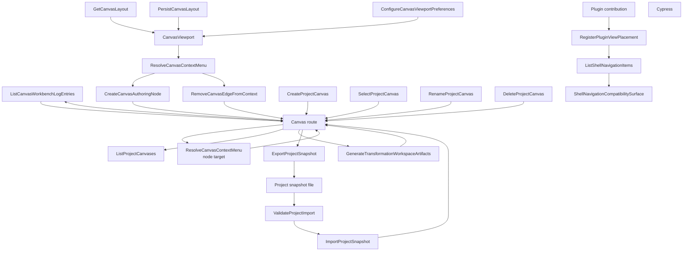

# Canvas Workbench Command And Query Catalog

## Purpose

This catalog is the Web Graph bounded-context C&Q list for the Canvas
workbench, Canvas route placement, project resource discovery, route-local
layout preferences, and project-snapshot file handoff.

It exists to keep product intent out of routes, components, plugin manifests,
and Cypress helpers. Those surfaces implement rails; they do not define new
product semantics.

## Governing Sources

- `AGENTS.md`
- `docs/planning/status/governance-document-rule-inventory.md`
- `docs/architecture/command-query-rail-governance.md`
- `docs/architecture/fowler-opportunity-planning-governance.md`
- `docs/architecture/components/web/graph/canvas-layout-persistence-component.md`
- `docs/architecture/components/web/graph/canvas-project-snapshot-component.md`
- `docs/architecture/components/web/graph/canvas-project-snapshot-user-stories.md`
- `docs/architecture/components/web/appshell/canvas-workbench-screen-composition-component.md`
- `docs/planning/proposals/mandatory/frontend-and-ux/canvas-workbench-fowler-remediation-plan-20260504.md`

## Bounded Context

Bounded context: Web Graph Canvas Workbench.

DDD ownership rules:

- Shell navigation owns global workbench destinations only.
- Canvas graph presentation owns the contextual graph surface and operational
  route-local projections; retired workbench-tab placement no longer defines
  product navigation.
- Plugin contribution registry owns static placement registration policy.
- Canvas layout presentation owns viewport and node-coordinate projection.
- Canvas viewport presentation owns route-local visual preferences such as grid
  visibility, grid color, and snap-to-grid.
- Project workspace I/O owns project snapshot file validation, export read
  models, and import commands before imported data can become workspace draft
  authority.
- Project workspace explorer owns discovery of existing project resources. It
  does not own new node-type creation.
- Project canvas lifecycle owns the worksheet list inside one project draft:
  create, select, rename, property updates, and delete. It does not create
  global shell navigation or replace the active worksheet as a side effect of
  creating another worksheet.
- Canvas resource attachment owns compatibility policy when an existing
  project resource is attached to a graph object or selected card.
- Protected authoring draft owns graph meaning. It does not own local layout
  preferences or workbench tab placement.

<!-- markdownlint-disable MD060 -->

## C&Q Summary

| Rail                                       | Type    | Status   | Bounded context               | DDD owner                                   |
| ------------------------------------------ | ------- | -------- | ----------------------------- | ------------------------------------------- |
| `ListShellNavigationItems`                 | query   | accepted | Web shell navigation          | `ShellNavigationReadModel`                  |
| `ListCanvasWorkbenchLogEntries`            | query   | accepted | Canvas workbench presentation | `CanvasWorkbenchLogEntriesReadModel`        |
| `RequestCanvasExecutionScope`              | command | accepted | Canvas workbench presentation | `CanvasExecutionScopeRequest`               |
| `RegisterPluginViewPlacement`              | command | accepted | Plugin contribution registry  | `PluginViewPlacementRegistration`           |
| `PersistCanvasLayout`                      | command | accepted | Canvas layout presentation    | `CanvasLayoutProjection`                    |
| `GetCanvasLayout`                          | query   | accepted | Canvas layout presentation    | `CanvasLayoutProjection`                    |
| `ConfigureCanvasViewportPreferences`       | command | accepted | Canvas viewport presentation  | `CanvasViewportPreferences`                 |
| `ResolveCanvasContextMenu`                 | query   | accepted | Canvas interaction surface    | `CanvasContextMenuModel`                    |
| `CreateCanvasAuthoringNode`                | command | accepted | Canvas workbench authoring    | `CanvasNodeAdmissionCommand`                |
| `RemoveCanvasEdgeFromContext`              | command | accepted | Canvas graph lifecycle        | `CanvasEdgeRemovalChange`                   |
| `ConfigureCanvasDbtNode`                   | command | accepted | Canvas workbench authoring    | `DbtNodeAuthoringMetadata`                  |
| `ConfigureCanvasDvtNode`                   | command | accepted | Canvas workbench authoring    | `DvtNodeAuthoringMetadata`                  |
| `SelectDbtModelOrigin`                     | command | accepted | Canvas workbench authoring    | `DbtSourceRelationshipSelection`            |
| `ListProjectCanvases`                      | query   | accepted | Project canvas lifecycle      | `ProjectCanvasCatalog`                      |
| `CreateProjectCanvas`                      | command | accepted | Project canvas lifecycle      | `ProjectCanvasLifecycle`                    |
| `SelectProjectCanvas`                      | command | accepted | Project canvas lifecycle      | `ProjectCanvasSelection`                    |
| `RenameProjectCanvas`                      | command | accepted | Project canvas lifecycle      | `ProjectCanvasIdentity`                     |
| `UpdateCanvasProperties`                   | command | accepted | Project canvas lifecycle      | `ProjectCanvasProperties`                   |
| `DeleteProjectCanvas`                      | command | accepted | Project canvas lifecycle      | `ProjectCanvasLifecycle`                    |
| `ListProjectWorkspaceResources`            | query   | accepted | Project workspace explorer    | `ProjectWorkspaceResourceCatalog`           |
| `AttachProjectResourceToCanvasObject`      | command | accepted | Canvas workbench authoring    | `CanvasResourceAttachmentPolicy`            |
| `GenerateTransformationWorkspaceArtifacts` | command | accepted | Project workspace I/O         | `TransformationWorkspaceArtifactProjection` |
| `GenerateDbtWorkspaceArtifacts`            | command | accepted | Project workspace I/O         | `DbtWorkspaceArtifactProjection`            |
| `BuildDbtPlannerGraphSource`               | query   | accepted | Canvas execution projection   | `DbtCanvasGraphSourceProjection`            |
| `RecordCanvasFowlerCanon`                  | command | accepted | Canvas governance             | `CanvasFowlerCanon`                         |
| `ClassifyCanvasFowlerDisposition`          | query   | accepted | Canvas governance             | `CanvasFowlerDisposition`                   |
| `ExportProjectSnapshot`                    | query   | proposed | Project workspace I/O         | `ProjectSnapshot`                           |
| `ValidateProjectImport`                    | query   | proposed | Project workspace I/O         | `ProjectSnapshotImportReadModel`            |
| `ImportProjectSnapshot`                    | command | proposed | Project workspace I/O         | `ProjectSnapshotImport`                     |

## Detailed Catalog

| Rail                                       | Intent                                                                                                                                             | Input value objects                                                                                                       | Output                                                                                | Application port                        | Adapter surface                                                                                                                                                   | Scope and auth                                                                                                               | Negative tests                                                                                                                                                                                                                                                                         |
| ------------------------------------------ | -------------------------------------------------------------------------------------------------------------------------------------------------- | ------------------------------------------------------------------------------------------------------------------------- | ------------------------------------------------------------------------------------- | --------------------------------------- | ----------------------------------------------------------------------------------------------------------------------------------------------------------------- | ---------------------------------------------------------------------------------------------------------------------------- | -------------------------------------------------------------------------------------------------------------------------------------------------------------------------------------------------------------------------------------------------------------------------------------- |
| `ListShellNavigationItems`                 | Return global shell destinations.                                                                                                                  | enabled runtime capabilities, plugin view placements                                                                      | `ShellNavigationReadModel`                                                            | Shell runtime query port                | `getShellNavigationViews(...)`, `buildShellNavigationModel(...)`                                                                                                  | plugin availability only; no tenant data                                                                                     | workbench-tab placements cannot enter shell nav; disabled plugins omitted                                                                                                                                                                                                              |
| `ListCanvasWorkbenchLogEntries`            | Return route-local Canvas operational log entries for readiness, draft, plan/run, permission, and selection posture.                               | `CanvasDraftPresentationState`, `CanvasDraftAccessPosture`, `CanvasShellToolbar`, `CanvasShellPanels`, `CanvasShellGraph` | `CanvasWorkbenchLogEntriesReadModel`                                                  | Canvas workbench log query port         | `buildCanvasWorkbenchLogEntries(...)`, `CanvasWorkbenchLogPanel`                                                                                                  | active Canvas route; no backend or protected-draft mutation                                                                  | empty or duplicate messages are omitted; user-visible blocking states remain warning/error entries; log tab cannot become shell navigation or fake historical event storage                                                                                                            |
| `RequestCanvasExecutionScope`              | Focus scope controls from read-only Canvas.                                                                                                        | `CanvasDraftAccessPosture`, shell scope controls                                                                          | focused scope control or no-op                                                        | Canvas route command seam               | `CanvasReadOnlyBannerView`, `focusWorkspaceScopeControls`                                                                                                         | browser focus only; no graph/run mutation                                                                                    | plan/run stay disabled; absent controls do nothing                                                                                                                                                                                                                                     |
| `RegisterPluginViewPlacement`              | Register one explicit visual placement for a plugin view.                                                                                          | `ViewPlacement`, plugin contribution metadata                                                                             | accepted static placement or registration error                                       | Plugin registry composition port        | static plugin contribution modules                                                                                                                                | plugin enabled/available state                                                                                               | missing placement, duplicate tab ID, duplicate route ID, and invalid scope fail closed                                                                                                                                                                                                 |
| `PersistCanvasLayout`                      | Persist route-local viewport or card coordinates.                                                                                                  | layout key, node position map, viewport, hydration state                                                                  | updated `CanvasLayoutProjection`                                                      | Canvas layout command port              | `useCanvasLayoutPersistence(...)`, `canvasInteractionStore`                                                                                                       | route-local browser persistence, no backend draft write                                                                      | pre-hydration writes queued; pending graph query blocks viewport persistence; stale React Flow arrays cannot overwrite dragged payload                                                                                                                                                 |
| `GetCanvasLayout`                          | Restore route-local layout projection.                                                                                                             | layout key, hydrated local store                                                                                          | `CanvasLayoutProjection`                                                              | Canvas layout query port                | `canvasInteractionStore` hydration, `useCanvasViewportGraphModel(...)`                                                                                            | local browser persistence keyed by workspace                                                                                 | protected draft reload cannot overwrite existing local positions                                                                                                                                                                                                                       |
| `ConfigureCanvasViewportPreferences`       | Change Canvas background, grid visibility, grid size, grid color, snap-to-grid, empty-guide visibility, and impact-overlay visibility preferences. | `CanvasViewportPreferences` value object                                                                                  | updated visual preference state                                                       | Canvas viewport preference command port | `CanvasSettingsDialog`, `WorkbenchPropertiesWindow`, `uiLayoutStore`, `canvasInteractionStore`, `CanvasViewport`, `CanvasEmptyStateView`, `useCanvasOverlayModel` | route-local UI preference; no protected draft authority                                                                      | Cancel, close, and Escape dispatch no changes; invalid colors normalize; hidden grid and hidden empty guide do not disable dragging or node creation; snap changes coordinates only; disabling Impact skips impact traversal and decoration without disabling runtime or cost overlays |
| `ResolveCanvasContextMenu`                 | Return the app-owned contextual action read model for a Canvas background, edge, or node-shell gesture.                                            | `CanvasContextMenuTarget`, `CanvasNodeContextMenuTarget`, active authoring node catalog, effective graph mutation posture | `CanvasContextMenuModel` or `CanvasNodeContextMenuModel`                              | Canvas interaction query seam           | `canvasInteractionCommandSurface.ts`, `CanvasViewport.tsx`, `canvasNodeContextMenuModel.ts`, `DbtNodeComponent.tsx`                                               | route-local presentation only; mutation actions are absent unless graph mutation is allowed; node inspection stays available | read-only posture returns inspect-only node actions and no mutating actions; pane target returns node creation only; edge target returns edge actions only; node target returns node actions only                                                                                      |
| `CreateCanvasAuthoringNode`                | Admit one governed authoring node kind into the Canvas draft graph, optionally at a caller-owned viewport position.                                | `NodeKindRegistration`, optional flow position                                                                            | admitted canonical node and updated draft/session projection                          | Canvas node authoring command seam      | `canvasAuthoringNodeCommand.ts`, `useCanvasAuthoringNodeCreationHandlers.ts`                                                                                      | graph edit permission plus active runtime admission                                                                          | unavailable node kind, read-only posture, duplicate node id, and unsupported runtime catalog reject before draft or viewport effects                                                                                                                                                   |
| `RemoveCanvasEdgeFromContext`              | Remove the edge selected by an edge context-menu gesture through the existing edge-change lifecycle.                                               | edge id from `CanvasContextMenuTarget`                                                                                    | `CanvasEdgeRemovalChange` consumed by `canvasGraphLifecycle.edge`                     | Canvas edge lifecycle command seam      | `canvasInteractionCommandSurface.ts`, `CanvasViewport.tsx`, `useCanvasEdgeChangeHandlers.ts`                                                                      | graph edit permission plus existing edge lifecycle                                                                           | read-only posture has no delete action; unknown edge ids become lifecycle no-op through the existing React Flow edge-change path                                                                                                                                                       |
| `ConfigureCanvasDbtNode`                   | Edit dbt card package, source, table, materialization, and plugin-owned model definition projection metadata.                                      | selected `CanonicalNode`, `DbtNodeAuthoringMetadata`                                                                      | updated Canvas draft node override                                                    | Inspector authoring command seam        | `CanvasInspectorAuthoringSection`, `DbtAuthoringFields`, `canvasInspectorAuthoringModel`                                                                          | current Canvas draft and active runtime policy                                                                               | blank required fields and unsupported materialization reject; read-only posture cannot apply; core Canvas cannot invent plugin-specific model-definition rules                                                                                                                         |
| `ConfigureCanvasDvtNode`                   | Edit DVT source binding, exclusive SQL or visual-recipe transform authority, and sink materialization metadata before preview.                     | selected `CanonicalNode`, `DvtNodeAuthoringMetadata`, optional `VisualTransformRecipeV1`                                  | updated Canvas draft node override                                                    | Inspector authoring command seam        | `CanvasInspectorAuthoringSection`, `DvtAuthoringFields`, `canvasInspectorAuthoringModel`, `canvasDvtAuthoringModel`, `canvasDvtTransformAuthoringAuthority`       | current Canvas draft and active runtime policy                                                                               | blank source/sink bindings, invalid or dual transform authority, unsupported recipe operations, unsupported sink materialization or write mode, and read-only posture reject                                                                                                           |
| `SelectDbtModelOrigin`                     | Select the dbt source/model relation that feeds a model card.                                                                                      | selected model node, visible dbt nodes, visible dbt edges                                                                 | selected origin id or explicit blocker                                                | Inspector authoring command seam        | `canvasDbtAuthoringModel`, `CanvasInspectorAuthoringSection`                                                                                                      | visible connected dbt graph only; no database catalog authority                                                              | missing or disconnected selected origin blocks generated artifacts and preview                                                                                                                                                                                                         |
| `ListProjectCanvases`                      | Return every worksheet/canvas stored in the current project draft.                                                                                 | protected draft canvas workspaces, active canvas id, registered runtime kinds                                             | `ProjectCanvasCatalog` rows with active marker                                        | Canvas lifecycle query seam             | `canvasProjectCanvasLifecycle`, `canvasWorkspaceExplorerModel`, Explorer                                                                                          | current project draft; read-only query                                                                                       | missing draft returns empty catalog; duplicate ids reject; unknown active id rejects                                                                                                                                                                                                   |
| `CreateProjectCanvas`                      | Add a new worksheet without deleting or replacing the current one.                                                                                 | selected runtime template, current active graph payload, draft revision                                                   | saved draft with new active empty canvas                                              | Canvas lifecycle command seam           | `executeCreateCanvasDocumentCommand`, `saveGraphDraft(...)`                                                                                                       | graph edit permission plus protected draft write permission                                                                  | read-only, stale revision, unavailable template, and duplicate generated id reject                                                                                                                                                                                                     |
| `SelectProjectCanvas`                      | Switch active worksheet while preserving the current active graph.                                                                                 | target canvas id, current active graph payload, draft revision                                                            | saved draft with selected active canvas                                               | Canvas lifecycle command seam           | `executeSelectCanvasDocumentCommand`, `saveGraphDraft(...)`                                                                                                       | graph edit permission plus protected draft write permission                                                                  | missing target id, duplicate canvases, stale revision, and read-only reject                                                                                                                                                                                                            |
| `RenameProjectCanvas`                      | Rename the active worksheet from the Inspector.                                                                                                    | active canvas id, non-blank title, draft revision                                                                         | saved draft with updated active canvas title                                          | Canvas lifecycle command seam           | `executeUpdateCanvasDocumentCommand`, Inspector canvas properties                                                                                                 | graph edit permission plus protected draft write permission                                                                  | blank title, missing active canvas, stale revision, and read-only reject                                                                                                                                                                                                               |
| `UpdateCanvasProperties`                   | Update explicit canvas metadata such as execution environment and permission.                                                                      | active canvas id, property patch, draft revision                                                                          | saved draft with updated active canvas properties                                     | Canvas lifecycle command seam           | `executeUpdateCanvasDocumentCommand`, Inspector canvas properties, Plan/Run execution scope                                                                       | graph edit permission plus protected draft write permission                                                                  | invalid environment, unsupported permission, stale revision, read-only reject, and Plan/Run ignoring the active canvas environment                                                                                                                                                     |
| `DeleteProjectCanvas`                      | Remove the active worksheet and activate a remaining worksheet.                                                                                    | active canvas id, fallback selection policy, draft revision                                                               | saved draft without deleted canvas                                                    | Canvas lifecycle command seam           | `executeDeleteCanvasDocumentCommand`, Inspector canvas properties                                                                                                 | graph edit permission plus protected draft write permission                                                                  | deleting the last canvas, missing active id, stale revision, and read-only reject                                                                                                                                                                                                      |
| `ListProjectWorkspaceResources`            | Return existing project resources for the Canvas Workspace Explorer.                                                                               | project/workspace context, canvas catalog, canonical node metadata, connector capability summary                          | grouped `ProjectWorkspaceResourceCatalog` rows for canvases, graph nodes, and schemas | Workspace resource query port           | `canvasWorkspaceExplorerModel`, `DbtExplorer`                                                                                                                     | project scoped; read-only; connector-scoped capabilities                                                                     | missing connector, unauthorized resource group, stale import, and unsupported resource kind cannot fabricate rows                                                                                                                                                                      |
| `AttachProjectResourceToCanvasObject`      | Attach an existing project resource to a graph object or selected card.                                                                            | selected canvas object, schema resource reference, compatibility policy, draft revision                                   | accepted attachment command or typed rejection                                        | Canvas draft command port               | `DbtExplorer`, `DbtNodeComponent`, `useCanvasNodeAuthoringHandlers`, graph drop target                                                                            | graph edit permission plus compatible target kind                                                                            | read-only draft, incompatible resource, stale draft, missing target, and missing resource reject                                                                                                                                                                                       |
| `GenerateTransformationWorkspaceArtifacts` | Persist generated SQL-first transformation artifacts for canvas-authored source -> sql_transform -> sink graphs before plan preview.               | scoped DVT authoring nodes and edges, active workspace scope, optional Git provenance config                              | saved SQL artifact, saved graph artifact, and preview provenance refs                 | Workspace file-content command port     | `canvasPreviewProvenance`, `previewDesignGraphArtifact`, `canvasPlanAction`                                                                                       | current workspace file write authorization; local draft provenance only for authoring nodes without existing workspace paths | non-authoring SQL transforms without workspace paths reject; file-backed paths still require resolvable files; graph or SQL write failure blocks preview; generated paths remain deterministic                                                                                         |
| `GenerateDbtWorkspaceArtifacts`            | Persist dbt project files from authored graph definitions, using the dbt plugin projection to generate visible model SQL from origin.              | scoped dbt nodes and edges, normalized dbt metadata                                                                       | saved `dbt_project.yml`, model SQL, and `schema.yml`                                  | Workspace file-content command port     | `canvasDbtWorkspaceArtifacts`, `SaveWorkspaceFileContent`                                                                                                         | current workspace file write authorization                                                                                   | no model or missing connected origin rejects before plan preview; file write failure blocks preview; generated SQL must be visible in the plugin inspector before Plan                                                                                                                 |
| `BuildDbtPlannerGraphSource`               | Build the `planner-generic-v1` dbt graph source for plan preview from plugin-admitted executable dbt node kinds.                                   | scoped dbt executable nodes and visible edges                                                                             | dbt `GenericGraphSourceV1` plus execution selection                                   | Canvas execution projection query       | `canvasDbtPlannerGraphSource`, `canvasPlanAction`                                                                                                                 | current selected closure or workspace nodes                                                                                  | source, macro, exposure, metric, and seed nodes cannot become executable plan steps; empty executable graph rejects; plugin-specific definition policy must not leak into generic Canvas logic                                                                                         |
| `RecordCanvasFowlerCanon`                  | Record the canonical disposition of a Canvas Fowler proposal or review.                                                                            | review/proposal reference, owning task, component owner, disposition                                                      | accepted canon record or rejection reason                                             | Canvas governance command port          | Planning DB task update, review status board, component guide                                                                                                     | planning governance only; no runtime Canvas mutation                                                                         | review prose cannot become an execution queue; duplicate task ownership rejected                                                                                                                                                                                                       |
| `ClassifyCanvasFowlerDisposition`          | Resolve the owner and proof expectation for a Canvas Fowler input.                                                                                 | review/proposal reference, current component guide set                                                                    | `CanvasFowlerDisposition` read model                                                  | Canvas governance query port            | Canvas Fowler canon component guide and semantic architecture test                                                                                                | planning governance only                                                                                                     | missing owner, missing guide, and missing proof expectation fail semantic architecture tests                                                                                                                                                                                           |
| `ExportProjectSnapshot`                    | Serialize persisted Canvas draft into a versioned snapshot file.                                                                                   | persisted `CanvasAuthoringDraftRecord`, workspace scope, export timestamp                                                 | project snapshot file name and JSON payload                                           | Project snapshot query port             | `canvasProjectSnapshot.ts`, Canvas toolbar export action                                                                                                          | current workspace scope; export reads persisted draft only                                                                   | missing persisted draft, malformed snapshot construction, unsupported draft schema                                                                                                                                                                                                     |
| `ValidateProjectImport`                    | Validate a snapshot before it can become draft authority.                                                                                          | uploaded file text or parsed unknown payload                                                                              | accepted snapshot read model or typed rejection reason                                | Project snapshot validation query port  | `canvasProjectSnapshot.ts`, Canvas toolbar import file action                                                                                                     | current browser session only until import command is accepted                                                                | malformed JSON, unsupported format, version, invalid draft, canvas mismatch, missing project metadata                                                                                                                                                                                  |
| `ImportProjectSnapshot`                    | Import a validated snapshot into the workspace draft.                                                                                              | validated `ProjectSnapshot`, draft revision, idempotency key                                                              | protected draft save receipt or conflict posture                                      | Canvas project snapshot import command  | `canvasProjectSnapshotImportCommand.ts`, `saveGraphDraft(...)`                                                                                                    | current workspace scope and existing `SaveWorkspaceGraphDraft` auth                                                          | invalid file does not save; stale revision conflicts; read-only draft rejects through existing save rail                                                                                                                                                                               |

## Fowler / DDD Mapping

| Fowler signal                                                                                                | Rail response                                                                                                                                                  | Pattern applied                          |
| ------------------------------------------------------------------------------------------------------------ | -------------------------------------------------------------------------------------------------------------------------------------------------------------- | ---------------------------------------- |
| Responsibility overload: transient route messages were scattered across banners, toolbar copy, and toasts.   | `ListCanvasWorkbenchLogEntries` projects the current route posture into one reviewable Canvas log tab without taking write authority.                          | Presentation Model and Read Model.       |
| Primitive obsession: one placement field represented several UI concepts.                                    | `RegisterPluginViewPlacement` uses `ViewPlacement` variants.                                                                                                   | Replace Type Code with Value Object.     |
| Hidden authority: local layout could look like graph truth.                                                  | `PersistCanvasLayout` and `GetCanvasLayout` own projection only.                                                                                               | Policy Object and Projection.            |
| Boundary drift: browser context menus, node gestures, and edge gestures could own graph intent.              | `ResolveCanvasContextMenu`, `CreateCanvasAuthoringNode`, `RemoveCanvasEdgeFromContext`, and existing node commands keep contextual actions behind named seams. | Presentation Model plus Command Gateway. |
| Hidden authority: files could silently become graph truth.                                                   | `ValidateProjectImport` rejects unsupported or incoherent snapshots first.                                                                                     | Anti-corruption Layer.                   |
| Hidden authority: generated dbt code could live only in component memory.                                    | `GenerateDbtWorkspaceArtifacts` writes plugin-generated model SQL through the workspace file command and exposes the generated SQL preview.                    | Gateway and Projection.                  |
| Boundary drift: dbt config lived in passive plugin panels.                                                   | `ConfigureCanvasDbtNode` keeps writable dbt card state in route authoring while model-definition policy remains plugin-owned.                                  | DTO plus Command seam.                   |
| Boundary drift: DVT source, SQL, and sink config could be absent until preview failed.                       | `ConfigureCanvasDvtNode` keeps writable DVT preview metadata in route authoring before artifact generation.                                                    | DTO plus Command seam.                   |
| Primitive obsession: dbt origin was an untyped edge assumption.                                              | `SelectDbtModelOrigin` names the connected-origin policy.                                                                                                      | Value Object and Policy Object.          |
| Hidden authority: a new Canvas replaced the current worksheet.                                               | `CreateProjectCanvas` appends a worksheet and `DeleteProjectCanvas` is the only destructive lifecycle command.                                                 | Aggregate lifecycle command.             |
| Primitive obsession: Canvas title was the only identity.                                                     | `ListProjectCanvases` exposes stable canvas ids and `RenameProjectCanvas` changes display title only.                                                          | Entity identity plus Value Object.       |
| Duplicate semantics: Explorer and Insert could both create node kinds.                                       | `ListProjectWorkspaceResources` keeps Explorer read-only over existing resources while `Insert` owns creation.                                                 | Presentation Model plus Query split.     |
| Boundary drift: existing resources can be dragged into graph/cards.                                          | `AttachProjectResourceToCanvasObject` attaches schema resources to card metadata through one command seam.                                                     | Policy Object plus Command seam.         |
| Hidden authority: visual DVT authoring nodes could look executable while no workspace SQL artifact existed.  | `GenerateTransformationWorkspaceArtifacts` projects authoring nodes into deterministic workspace artifacts before Plan.                                        | Projection plus Gateway.                 |
| Responsibility overload: dbt sources/macros could become runtime steps or Canvas could own plugin semantics. | `BuildDbtPlannerGraphSource` projects only executable dbt node kinds and keeps plugin-specific definition policy outside generic Canvas.                       | Read Model Projection.                   |
| Primitive obsession: snapshot JSON could become an unversioned blob.                                         | `ExportProjectSnapshot` emits a versioned `ProjectSnapshot` value object.                                                                                      | Replace Primitive with Object.           |
| Review-as-queue drift: Fowler reviews looked actionable after closure.                                       | `RecordCanvasFowlerCanon` and `ClassifyCanvasFowlerDisposition` name owner.                                                                                    | Planning Aggregate plus Query Model.     |

<!-- markdownlint-enable MD060 -->

## Retired Rail Disposition

`ResolveLegacyCanvasRouteIntent` is retired by RED1.3. It previously translated
historical peer-workbench paths into a one-shot Canvas query parameter. No
supported caller or independent compatibility lifecycle remained, so its route
adapter, transport token, handler, and propagated request type were deleted
together. No replacement rail exists. Canonical Canvas navigation continues
through `ListShellNavigationItems`, `ResolveShellNavigationDisposition`, and
`RenderCanvasContextualGraphSurface`.

## Rail Flow

## Exhaustiveness Rule

Every externally observable Canvas workbench behavior must map to one rail in
this catalog before implementation. This includes route entries, toolbar
commands, plugin view placements, layout-preference controls, contextual graph
actions, and browser verification workflows.

Route paths, React components, plugin manifest fields, Cypress helper names,
and local store actions are implementation surfaces. They must not become
parallel command or query names for the same product intent.

Runtime rails and test-only rails must stay explicit:

- product behavior uses accepted runtime command/query rails;
- project snapshot file behavior uses the proposed Project workspace I/O rails
  until the format is proven and promoted;
- new backend persistence, adapter authority, protected draft behavior, or
  cross-context ownership requires a catalog update and an ADR check before
  implementation.

## Drift Rules

- Do not add a route, tab, toolbar command, Cypress workflow, or plugin view
  placement unless it maps to a rail in this catalog or updates this catalog
  first.
- Do not use route paths as command/query names.
- Do not put Canvas workbench tabs into fixed shell navigation.
- Do not persist Canvas layout or grid preferences into protected authoring
  draft state.
- Do not persist derived DVT column-lineage edges as another transform
  authority; `ConfigureCanvasDvtNode` owns the visual recipe and later queries
  project the edges from it.
- Do not add Cypress-only assertions that define product semantics without a
  named verification read model.
