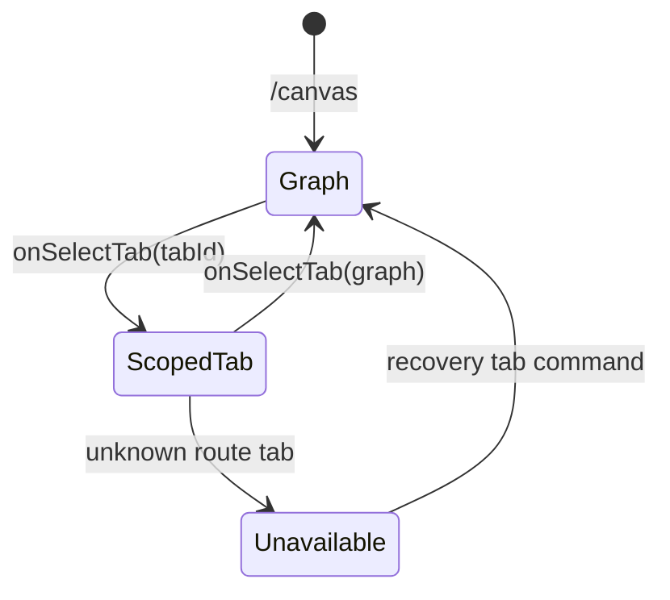
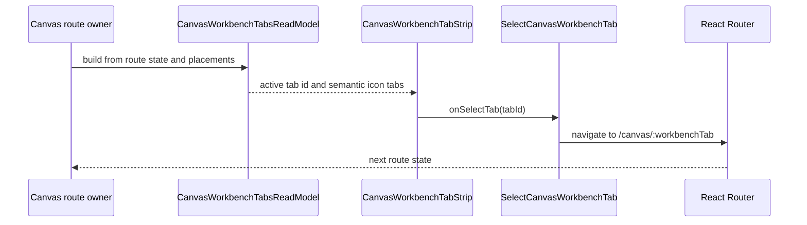
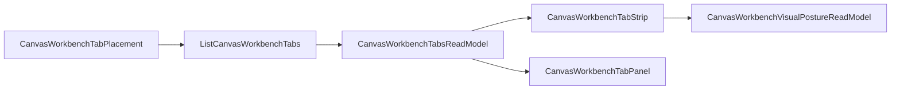

# Canvas Workbench Tab Strip Component

## Purpose

`CanvasWorkbenchTabStrip` is the local Canvas workbench renderer for
route-scoped Graph, Code, Lineage, Diff, Artifacts, and Runs tabs.

It exists to keep the Canvas workbench chrome compact, readable, passive, and
close to mature graph tooling: each tab renders one Canvas-owned semantic icon
plus one visible label. It does not decide plugin placement, route parsing, tab
availability, shell navigation, or the active tab panel.

## Governing Sources

- `AGENTS.md`
- `docs/planning/status/governance-document-rule-inventory.md`
- `docs/guides/ai-work-protocol.md`
- `docs/architecture/command-query-rail-governance.md`
- `docs/architecture/fowler-opportunity-planning-governance.md`
- `docs/architecture/components/web/graph/canvas-workbench-tabs-component.md`
- `docs/architecture/components/web/graph/canvas-workbench-command-query-catalog.md`
- `docs/architecture/components/web/graph/canvas-workbench-tabs-user-stories.md`
- `buzon/20260506-codex-fowler-canvas-workbench-stage-1-text-only-tabs-review.md`
- `docs/planning/proposals/mandatory/frontend-and-ux/canvas-workbench-stage-1-chrome-simplification-implementation-plan-20260506.md`

## Owned Concern

Owned concern: render Canvas workbench tab navigation from the tab read model.

The component owns:

- the tab-list DOM placement inside the Canvas workbench header;
- controlled semantic icon+label rendering for tab labels;
- passive forwarding of selected tab intent through `onSelectTab`;
- stable data slots consumed by Cypress visual-posture proof.

The component does not own:

- plugin placement discovery;
- icon metadata projection;
- tab route parsing;
- shell navigation placement;
- active panel rendering;
- protected draft state, save, export, import, or backend authority.

## Public API

| API                                        | Kind                    | Responsibility                                                            |
| ------------------------------------------ | ----------------------- | ------------------------------------------------------------------------- |
| `CanvasWorkbenchTabStrip`                  | React component         | Passive View for Canvas workbench route-local tabs.                       |
| `CanvasWorkbenchTabStripProps`             | props contract          | Supplies `tabsState` and `onSelectTab`.                                   |
| `tabsState: CanvasWorkbenchTabsReadModel`  | read model input        | Provides active tab id and renderable tab records.                        |
| `onSelectTab(tabId)`                       | command callback        | Delegates `SelectCanvasWorkbenchTab` intent to the route owner.           |
| `CanvasWorkbenchTabsReadModel`             | presentation read model | Carries tab identity, label, route, scope, icon name, and active state.   |
| `CanvasWorkbenchTabReadModel`              | tab record              | Carries one Canvas-owned semantic icon name and no plugin icon component. |
| `data-slot="canvas-workbench-tab-strip"`   | DOM contract            | Lets Cypress locate the route-local strip.                                |
| `data-slot="canvas-workbench-tab-trigger"` | DOM contract            | Lets Cypress verify one semantic SVG icon and one text label per tab.     |

## Invariants

- `CanvasWorkbenchTabStrip` is a Passive View over
  `CanvasWorkbenchTabsReadModel`.
- `CanvasWorkbenchTabReadModel` exposes only Canvas-owned semantic icon names:
  plugin icon components remain outside this route read model.
- The tab strip renders one SVG icon and one label span per trigger.
- The tab strip does not render `tab.icon`, plugin placement icon components, or
  plugin-provided `Icon` values.
- The tab strip stays route-local and header-scoped; it is not a fixed shell
  navigation rail.
- Tab selection is delegated through `onSelectTab` and stays aligned with
  `SelectCanvasWorkbenchTab`.
- Browser proof belongs to `CanvasWorkbenchVisualPostureReadModel` through
  Cypress, not to screenshot-only review.

## Transitions

## Component Flow

## Consumers

- `CanvasShellMainPanel.tsx` places the strip above the Canvas center surface or
  selected workbench tab panel.
- `Canvas.tsx` composes the tab read model and passes tab selection commands
  through route-owned handlers.
- `canvasWorkbenchTabs.test.ts` proves the semantic icon read-model projection.
- `canvasWorkbenchTabs.architecture.test.ts` guards the semantic component
  boundary and documentation traceability.
- `canvas-workbench-tabs.cy.ts` proves controlled-icon DOM posture, horizontal
  geometry, and route-local placement in the browser.

## Story Coverage

- `US-CANVAS-WORKBENCH-009`: readable horizontal labels.
- `US-CANVAS-WORKBENCH-010`: Canvas-owned semantic tab icons.
- `US-CANVAS-WORKBENCH-011`: plugin icon isolation.
- `US-CANVAS-WORKBENCH-012`: semantic component guide.
- `US-CANVAS-WORKBENCH-013`: semantic architecture guard.

## Mature-System Posture

The component matches the mature workbench pattern where a renderer consumes a
presentation model and emits intent without owning domain or route truth. The
plugin registry may still know icon metadata for other surfaces, but this
renderer uses Canvas-owned semantic icon names so the tab strip stays coherent
and cannot become a plugin icon dump.

## Drift Watch

- Do not add plugin component `icon` back to `CanvasWorkbenchTabReadModel`.
- Do not derive tab icons from plugin placement components.
- Do not move tab parsing into JSX.
- Do not reuse shell navigation visual classes that truncate labels.
- Do not let Save, Export, Import, or Project Assets behavior enter this
  renderer.
- Do not introduce a fixed left rail as a workaround for narrow viewports.
