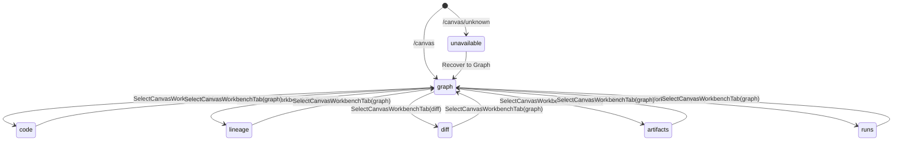
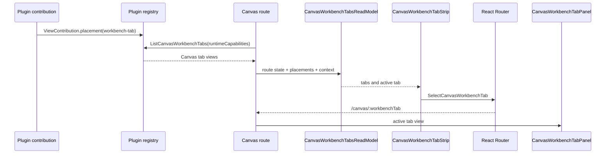
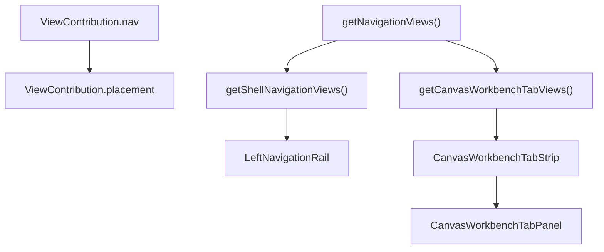

# Canvas Workbench Tabs Component

## Purpose

Canvas Workbench Tabs own the route-local placement of Canvas-scoped views:
Graph, Code, Lineage, Diff, Artifacts, and Runs.

The component exists because shell navigation, route registration, and Canvas
workbench placement are different concerns. A plugin may register a route, but
that does not make the route a global shell destination.

## Governing Sources

- `AGENTS.md`
- `docs/planning/status/governance-document-rule-inventory.md`
- `docs/guides/ai-work-protocol.md`
- `docs/architecture/reference-architecture.md`
- `docs/architecture/command-query-rail-governance.md`
- `docs/architecture/fowler-opportunity-planning-governance.md`
- `docs/planning/proposals/mandatory/frontend-and-ux/canvas-workbench-tabs-placement-design-plan-20260503.md`

## Owned Concern

Owned concern: project plugin-declared Canvas workbench tab placements into a
Canvas route read model and render the active tab inside the Canvas shell.

The component does not own:

- global shell navigation layout;
- Canvas document tabs and canvas replacement actions;
- internals of Code, Lineage, Diff, Artifacts, or Runs views;
- backend routes, contracts, adapters, or storage;
- Project Assets persistence or source import provider expansion.

## Public API

| API                                               | Owner                          | Responsibility                                                         |
| ------------------------------------------------- | ------------------------------ | ---------------------------------------------------------------------- |
| `ViewPlacement`                                   | `PluginManifest.ts`            | Closed value object for shell or Canvas workbench placement.           |
| `ShellNavigationPlacement`                        | `PluginManifest.ts`            | Placement variant allowed to become a left-rail shell item.            |
| `CanvasWorkbenchTabPlacement`                     | `PluginManifest.ts`            | Placement variant allowed to become a Canvas tab.                      |
| `getShellNavigationViews(capabilities)`           | `registry.ts`                  | Query rail for shell navigation views only.                            |
| `getCanvasWorkbenchTabViews(capabilities)`        | `registry.ts`                  | Query rail for Canvas workbench tab views only.                        |
| `CanvasWorkbenchRouteState`                       | `canvasWorkbenchRouteState.ts` | Parsed `/canvas/:workbenchTab?` route state.                           |
| `parseCanvasWorkbenchRouteState(value)`           | `canvasWorkbenchRouteState.ts` | Fails closed for unknown tab route segments.                           |
| `resolveCanvasWorkbenchTabSelectionCommand(args)` | `canvasWorkbenchRouteState.ts` | Command result for tab selection navigation.                           |
| `CanvasWorkbenchTabsReadModel`                    | `canvasWorkbenchTabs.ts`       | Render-ready tab model for the Canvas route.                           |
| `buildCanvasWorkbenchTabsReadModel(args)`         | `canvasWorkbenchTabs.ts`       | Projects Graph plus enabled plugin tabs with active/unavailable state. |
| `CanvasWorkbenchTabStrip`                         | `CanvasWorkbenchTabStrip.tsx`  | Passive tab-list renderer.                                             |
| `CanvasWorkbenchTabPanel`                         | `CanvasWorkbenchTabPanel.tsx`  | Renders the selected Canvas tab view or unavailable recovery surface.  |

## Command And Query Rails

| Rail                            | Type    | DDD owner or read model              | Application port                          | Adapter surface                           | Negative tests                                                            |
| ------------------------------- | ------- | ------------------------------------ | ----------------------------------------- | ----------------------------------------- | ------------------------------------------------------------------------- |
| `ListShellNavigationItems`      | query   | `ShellNavigationReadModel`           | Shell runtime query port                  | Plugin registry projection                | Canvas workbench placements cannot enter shell nav.                       |
| `ListCanvasWorkbenchTabs`       | query   | `CanvasWorkbenchTabsReadModel`       | Canvas workbench tab query port           | Plugin registry projection                | Shell placements cannot enter Canvas tabs; duplicate tab IDs fail closed. |
| `ResolveCanvasWorkbenchContext` | query   | `CanvasWorkbenchContext`             | Canvas route state query port             | React Router and controller runtime state | Missing Canvas context returns unavailable state.                         |
| `SelectCanvasWorkbenchTab`      | command | `CanvasWorkbenchTabSelectionCommand` | Canvas route state command port           | React Router navigation adapter           | Unknown or disabled tabs are rejected.                                    |
| `RegisterPluginViewPlacement`   | command | `PluginViewPlacementRegistration`    | Plugin registry composition port          | Static plugin contribution adapter        | Missing placement, duplicate tab ID, and invalid scope fail closed.       |
| `OpenCanvasScopedRunTab`        | command | `CanvasScopedRunSelection`           | Canvas workbench route state command port | React Router navigation adapter           | Run tab cannot masquerade as global Runs.                                 |

## DDD Objects

| Object                               | Kind                 | Invariants                                                                     |
| ------------------------------------ | -------------------- | ------------------------------------------------------------------------------ |
| `ViewPlacement`                      | value object         | A view has exactly one visual placement.                                       |
| `ShellNavigationPlacement`           | value object         | Only `kind: 'shell-nav'` can become a shell navigation item.                   |
| `CanvasWorkbenchTabPlacement`        | value object         | Only `kind: 'workbench-tab'` and `workbench: 'canvas'` can become Canvas tabs. |
| `ShellNavigationReadModel`           | read model           | Contains only shell placements sorted by placement order.                      |
| `CanvasWorkbenchTabsReadModel`       | read model           | Contains Graph plus enabled Canvas tab placements sorted by order.             |
| `CanvasWorkbenchContext`             | value object         | Canvas context is either ready or explicitly unavailable.                      |
| `CanvasWorkbenchTabSelectionCommand` | command value object | Selected tab ID must exist in the read model.                                  |

## Invariants

- `ViewContribution.nav` is removed. New code must use `ViewContribution.placement`.
- `getNavigationViews()` is removed. Callers must use a placement-specific query.
- Shell navigation cannot render Code, Lineage, Diff, or Artifacts as global
  siblings of Canvas.
- Global Runs and Canvas-scoped Runs are separate placements and separate
  product intents.
- `CanvasPlaygroundTabStrip` owns Canvas document tabs only.
- `CanvasWorkbenchTabStrip` owns Graph/Code/Lineage/Diff/Artifacts/Runs view
  tabs only.
- `/canvas` resolves to Graph.
- `/canvas/:workbenchTab` resolves only known Canvas tab IDs.
- Unknown tab route segments render unavailable state with a Graph recovery
  command.
- Duplicate Canvas tab IDs across enabled plugins fail closed.
- A Canvas route harness must not require shell navigation runtime providers
  just to project workbench tabs; the Canvas controller provides runtime
  capabilities to this route-owned projection.
- Canvas-scoped tab view components must publish bootstrap posture directly through
  `/canvas/:workbenchTab`, not through retired global Code, Lineage, Diff, or
  Artifacts route IDs or alias mappings.

## Transitions

## Consumers

- `Canvas.tsx` composes the tab read model from route params, controller state,
  runtime capabilities, and plugin placements.
- `CanvasShellMainPanel.tsx` renders the workbench tab strip above the Canvas
  viewport or active tab panel.
- `routes.ts` registers `/canvas/:workbenchTab?` under the Canvas route owner.
- `dbtContributions.ts` contributes Code, Lineage, Diff, and Artifacts as
  Canvas workbench tabs.
- `monitoringContributions.ts` contributes global Runs as shell navigation and
  Canvas-scoped Runs as a separate workbench tab.
- `CanvasRunsTabView.tsx` separates Canvas-scoped Runs bootstrap ownership from
  the global Runs route component.
- `shellRuntimeModel.ts` and `shellNavigationModel.ts` consume only shell
  placement query results.
- `canvas-workbench-tabs.cy.ts` proves the user-visible route and shell
  placement behavior.

## User Stories

- `US-CANVAS-WORKBENCH-001`: as a Canvas user, I open `/canvas` and start on
  Graph. Graph is active, the Canvas document tab strip remains separate, and
  `/canvas` does not select Code, Lineage, Diff, Artifacts, or Runs by default.
- `US-CANVAS-WORKBENCH-002`: as a Canvas user, I select the Code tab from the
  Canvas workbench. The route becomes `/canvas/code`, Code renders inside the
  Canvas shell, and Code cannot appear as a global left-rail sibling of Canvas.
- `US-CANVAS-WORKBENCH-003`: as a Canvas user, I select Lineage, Diff, and
  Artifacts from the same workbench rail. Each scoped view uses the same Canvas
  context and retired global route IDs or bootstrap aliases must not return.
- `US-CANVAS-WORKBENCH-004`: as an operator, I open global Runs from the shell.
  Global Runs remains a shell navigation item and Canvas-scoped Runs cannot
  replace the global Runs route.
- `US-CANVAS-WORKBENCH-005`: as a Canvas user, I open Runs inside the Canvas
  workbench. Canvas Runs renders as a route-local tab with Canvas bootstrap
  ownership and cannot masquerade as the shell-owned Runs destination.
- `US-CANVAS-WORKBENCH-006`: as a user following a stale link, I open
  `/canvas/unknown`. The route fails closed, offers Graph recovery, and does not
  silently coerce unknown tab IDs to a plugin tab.
- `US-CANVAS-WORKBENCH-007`: as a plugin author, I register a Canvas workbench
  tab. The registry accepts one Canvas placement, projects it through
  `ListCanvasWorkbenchTabs`, and rejects duplicate tab IDs or shell placements
  in Canvas tab queries.

## Scenario Coverage Matrix

- Default Graph entry:
  `ListCanvasWorkbenchTabs`, `buildCanvasWorkbenchTabsReadModel()`,
  `canvasWorkbenchTabs.test.ts`.
- Scoped tab selection:
  `SelectCanvasWorkbenchTab`, `resolveCanvasWorkbenchTabSelectionCommand()`,
  `canvasWorkbenchRouteState.test.ts`.
- Unknown tab recovery:
  `ResolveCanvasWorkbenchContext`, `parseCanvasWorkbenchRouteState()`,
  `canvasWorkbenchRouteState.test.ts`.
- Shell/workbench split:
  `ListShellNavigationItems`, `ListCanvasWorkbenchTabs`,
  `getShellNavigationViews()`, `getCanvasWorkbenchTabViews()`,
  `pluginRuntimeProjection.architecture.test.ts`.
- User-visible scoped tabs:
  `SelectCanvasWorkbenchTab`, `CanvasWorkbenchTabStrip`,
  `CanvasWorkbenchTabPanel`, `canvas-workbench-tabs.cy.ts`.
- Semantic documentation guard:
  architecture governance, this component guide, owned-concern docblocks, and
  `canvasWorkbenchTabs.architecture.test.ts`.

## TDD Traceability

The semantic architecture test was written red before this guide gained local
user-story and scenario coverage. The expected failure was:
`expected component guide to contain ## User Stories`. The green step added
this section and owned-concern docblocks to the modules that own placement,
registry projection, shell navigation normalization, route state, read-model
projection, tab rendering, and Canvas-scoped Runs.

## Test Coverage

- `shellNavigationModel.test.ts` proves Canvas tab placements do not enter the
  shell nav read model.
- `pluginRuntimeProjection.architecture.test.ts` proves registry query rails
  remain split by placement.
- `canvasWorkbenchRouteState.test.ts` proves default, accepted, unknown, and
  disabled tab command results.
- `canvasWorkbenchTabs.test.ts` proves sorted tabs, duplicate rejection, missing
  context, and unknown route unavailable state.
- `canvasWorkbenchTabs.architecture.test.ts` guards semantic separation from
  shell nav and `CanvasPlaygroundTabStrip`.
- `routes.test.tsx` proves `/canvas/:workbenchTab` is registered and retired
  global Canvas-dependent paths are absent.
- `canvas-workbench-tabs.cy.ts` proves the browser user flow for scoped tabs.

## Negative Coverage

- Workbench-tab placement passed into shell navigation is rejected at the shell
  model boundary.
- Shell-nav placement passed into Canvas tabs is ignored by the Canvas tab
  query.
- Duplicate Canvas tab IDs fail with a deterministic error.
- Unknown `/canvas/:workbenchTab` fails closed.
- Unavailable Canvas context renders Graph recovery rather than fake tab data.
- Cypress verifies the shell does not expose retired global Code, Lineage,
  Diff, or Artifacts links.

## Current-To-Target Map

## Fowler And SOLID Notes

- SRP: plugin placement, shell nav projection, Canvas tab read model, and tab
  rendering are separate modules.
- Open/Closed: new Canvas workbench tabs are added through plugin placement
  records, not by editing the shell sidebar.
- Dependency inversion: Canvas consumes registry query results and route
  command results, not shell navigation internals.
- Hexagonal boundary: plugin registry and React Router are adapters around the
  Canvas workbench presentation model.
- Fowler Presentation Model: `CanvasWorkbenchTabsReadModel` owns UI state
  without React or router side effects.

## Drift Watch

- Do not reintroduce global `/code`, `/lineage`, `/diff`, or `/artifacts`
  shell entries for Canvas-dependent views.
- Do not use `CanvasPlaygroundTabStrip` for workbench view tabs.
- Do not put tab selection parsing inline in JSX.
- Do not add external plugin views with `nav`.
- Do not collapse global Runs and Canvas Runs into one ambiguous contribution.
- Do not seed Code/Lineage/Diff/Artifacts panels with stale or fake Canvas
  context to make unavailable states look ready.
- Do not fix Canvas tab bootstrap by restoring old global routes or aliasing old
  route IDs; each Canvas-scoped tab publishes directly through the Canvas
  workbench route.
