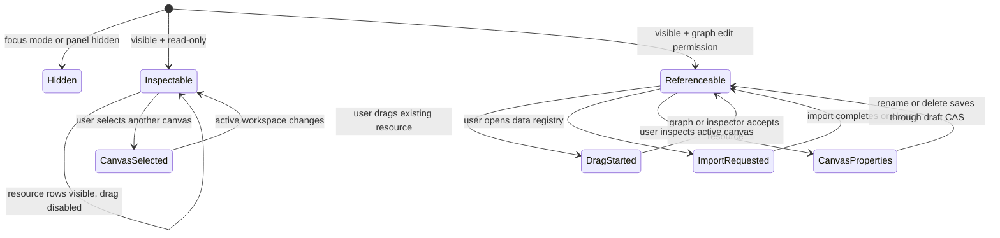
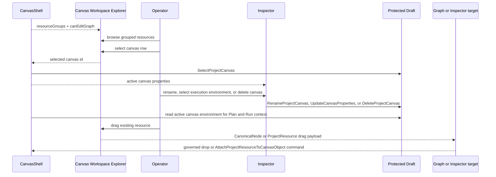

# Canvas Workspace Explorer Component

## Purpose

The Canvas Workspace Explorer renders existing project resources available to
the active Canvas route. It is the left contextual panel for discovery and
reference actions. It also exposes the project canvas worksheet catalog: users
can see every canvas stored in the draft, select the active worksheet, and send
canvas lifecycle edits to the Inspector and protected draft command rails.

It does not create new node kinds. Fresh graph object creation belongs to the
top-menu or toolbar `Insert` command.

## Governing Sources

- [Canvas Shell Component](./canvas-shell-component.md)
- [Canvas Ready Node Authoring Entrypoint Component](./canvas-ready-node-authoring-entrypoint-component.md)
- [Canvas Workbench Command Query Catalog](./canvas-workbench-command-query-catalog.md)
- [Canvas Workspace Explorer Fowler Review](../../../../planning/reviews/architecture-and-governance/20260527-canvas-workspace-explorer-fowler-review.md)
- `docs/planning/proposals/mandatory/frontend-and-ux/canvas-workspace-explorer-console-theme-modeling-plan-20260527.md`

## Public API

The implementation currently lives in `DbtExplorer.tsx`. The semantic component
is the Canvas Workspace Explorer.

```ts
type DbtExplorerProps = {
  resourceGroups: readonly CanvasWorkspaceResourceGroup[];
  canEditGraph?: boolean;
  selectedResourceId?: string | null;
  onResourceSelect?: (resource: CanvasWorkspaceResource) => void;
  onResourceDragStart?: (resource: CanvasWorkspaceResource) => void;
  onHide?: () => void;
  onOpenDataRegistry?: () => void;
};
```

The local read model currently supports:

- `canvas`: the active Canvas document as a non-draggable project resource;
- `canvas`: all project canvas worksheets as non-draggable project resources,
  with an active marker and selection command;
- `canvas_node`: existing graph resources backed by canonical node drag
  payloads;
- `schema`: project schema resources inferred from canonical node metadata and
  backed by `CanvasWorkspaceResourceDragPayload` values for card attachment.

## Owned Concern

Render existing project resources and expose governed reference interactions
for those resources.

## Non-Goals

- render node-type creation buttons;
- own `NodeKindRegistration` catalogs;
- call `onCreateAuthoringNode`;
- mutate draft state directly;
- decide connector availability;
- persist canvas identity outside the protected draft CAS rail;
- persist theme preferences, Git state, or table design.
- edit canvas properties directly; the Inspector owns that form.

## Invariants

- The shell converts route/controller `CanonicalNode` rows into
  `CanvasWorkspaceResourceGroup` values before rendering the explorer.
- The explorer receives resource groups, not a node-kind creation catalog.
- The explorer never renders an `Add node` creation section.
- The explorer never calls `onCreateAuthoringNode`.
- Existing resource drag is enabled only when `canEditGraph` is true and the
  resource has either a canonical node payload or a project-resource payload.
- Schema resources use `AttachProjectResourceToCanvasObject` and update the
  target node metadata (`metadata.schema`, `metadata.config.schema`, and dbt
  `metadata.dbt.schemaName` when applicable).
- Import or registry actions are disabled in read-only mode.
- Resource kind labels come from the node kind registry only for display.
- New graph object creation remains in `Insert`.
- Multiple canvases are listed from `ListProjectCanvases`; `CreateProjectCanvas`
  appends a worksheet instead of replacing the active one.
- Selecting a canvas uses `SelectProjectCanvas`, which first preserves the
  current active graph workspace in the protected draft.
- Canvas rename, execution-environment selection, and delete controls are shown
  in the Inspector. Deleting the last remaining canvas is disabled.
- The active canvas `environmentId` is executable metadata: Plan and Run use it
  as the environment override when present, with the session environment as the
  fallback.

## Transitions



## Interaction Flow



## Consumers

- `CanvasShell.tsx` composes the panel.
- `canvasShellPanelsBuilder.ts` supplies `explorerResourceGroups`.
- `canvasWorkspaceExplorerModel.ts` maps existing resources into explorer
  groups, including schema resources inferred from node metadata.
- `DbtNodeComponent.tsx` accepts schema resource drops on a card and forwards
  them to the graph command handler.
- `useCanvasNodeAuthoringHandlers.ts` applies schema attachments to the local
  draft working set.
- `useCanvasViewportGraphModel.ts` refreshes projected node data when metadata
  changes so card and Inspector state remain current.
- `canvasProjectCanvasLifecycle.ts` owns canvas id normalization, selection,
  rename, property patch, and delete transitions.
- `canvasProjectCanvasLifecycleCommand.ts` persists canvas lifecycle
  transitions through protected draft CAS.
- `CanvasInspectorPanel.tsx` renders active canvas properties when no node is
  selected, including the execution environment selector.
- `useCanvasExecutionActions.ts` applies the active canvas environment to Plan
  preview and Run start scope when the canvas defines one.
- `DbtExplorer.test.tsx` proves explorer behavior.
- `CanvasShell.test.tsx` proves shell wiring.
- `canvasProjectCanvasLifecycle.test.ts` proves worksheet transitions.
- `CanvasShell.architecture.test.tsx` proves node creation cannot drift back
  into the explorer.

## Future Extension Points

- `ListProjectWorkspaceResources` should widen the current resource model
  beyond `canvas`, `canvas_node`, and `schema` resources as the catalog is
  promoted.
- Resource families should include artifacts, annotations, dbt files, tables,
  columns, users, roles, grants, REST sources, and generated source artifacts.
- Compatibility policy for dropping a resource onto a selected card belongs to
  `AttachProjectResourceToCanvasObject`, not the explorer renderer.

## Drift Guards

- If the explorer imports `NodeKindRegistration`, ownership has regressed.
- If the explorer exposes `nodeKinds`, ownership has regressed.
- If the explorer contains `onCreateAuthoringNode`, ownership has regressed.
- If the side panel and `Insert` both show the same creation list, product
  language has regressed.
- If schema resources create graph nodes instead of attaching metadata to an
  existing card, resource attachment has regressed.
- If `New canvas` replaces or deletes the active worksheet without an explicit
  delete command, canvas lifecycle has regressed.
- If canvas rename or delete uses route-local state instead of protected draft
  CAS, authority has drifted.
- If Plan or Run ignores the active canvas execution environment and silently
  uses only the shell session environment, execution authority has drifted.
