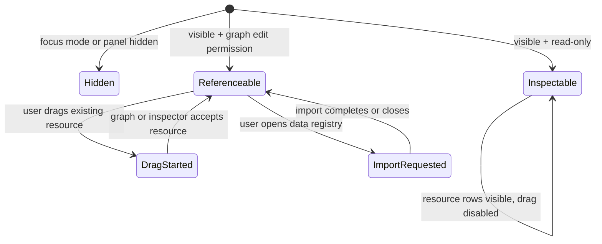
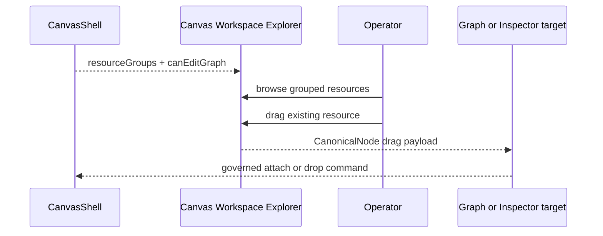

# Canvas Workspace Explorer Component

## Purpose

The Canvas Workspace Explorer renders existing project resources available to
the active Canvas route. It is the left contextual panel for discovery and
reference actions.

It does not create new node kinds. Fresh graph object creation belongs to the
top-menu or toolbar `Insert` command.

## Governing Sources

- [Canvas Shell Component](./canvas-shell-component.md)
- [Canvas Ready Node Authoring Entrypoint Component](./canvas-ready-node-authoring-entrypoint-component.md)
- [Canvas Workbench Command Query Catalog](./canvas-workbench-command-query-catalog.md)
- [Canvas Workspace Explorer Fowler Review](../../../../planning/reviews/architecture-and-governance/20260527-canvas-workspace-explorer-fowler-review.md)
- `docs/planning/proposals/mandatory/frontend-and-ux/canvas-workspace-explorer-console-theme-modeling-plan-20260527.md`

## Public API

The implementation currently lives in `DbtExplorer.tsx`. The semantic component
is the Canvas Workspace Explorer.

```ts
type DbtExplorerProps = {
  resourceGroups: readonly CanvasWorkspaceResourceGroup[];
  canEditGraph?: boolean;
  onResourceDragStart?: (resource: CanvasWorkspaceResource) => void;
  onHide?: () => void;
  onOpenDataRegistry?: () => void;
};
```

The local read model currently supports:

- `canvas`: the active Canvas document as a non-draggable project resource;
- `canvas_node`: existing graph resources backed by canonical node drag
  payloads.

## Owned Concern

Render existing project resources and expose governed reference interactions
for those resources.

## Non-Goals

- render node-type creation buttons;
- own `NodeKindRegistration` catalogs;
- call `onCreateAuthoringNode`;
- mutate draft state directly;
- decide connector availability;
- persist canvas identity, theme preferences, Git state, or table design.

## Invariants

- The shell converts route/controller `CanonicalNode` rows into
  `CanvasWorkspaceResourceGroup` values before rendering the explorer.
- The explorer receives resource groups, not a node-kind creation catalog.
- The explorer never renders an `Add node` creation section.
- The explorer never calls `onCreateAuthoringNode`.
- Existing resource drag is enabled only when `canEditGraph` is true and the
  resource has a drag payload.
- Import or registry actions are disabled in read-only mode.
- Resource kind labels come from the node kind registry only for display.
- New graph object creation remains in `Insert`.

## Transitions



## Interaction Flow



## Consumers

- `CanvasShell.tsx` composes the panel.
- `canvasShellPanelsBuilder.ts` supplies `explorerResourceGroups`.
- `canvasWorkspaceExplorerModel.ts` maps existing resources into explorer
  groups.
- `DbtExplorer.test.tsx` proves explorer behavior.
- `CanvasShell.test.tsx` proves shell wiring.
- `CanvasShell.architecture.test.tsx` proves node creation cannot drift back
  into the explorer.

## Future Extension Points

- `ListProjectWorkspaceResources` should widen the current resource model
  beyond `canvas` and `canvas_node` resources when the catalog is promoted.
- Resource families should include canvases, artifacts, annotations, dbt files,
  schemas, tables, columns, users, roles, grants, REST sources, and generated
  source artifacts.
- Compatibility policy for dropping a resource onto a selected card belongs to
  `AttachProjectResourceToCanvasObject`, not the explorer renderer.

## Drift Guards

- If the explorer imports `NodeKindRegistration`, ownership has regressed.
- If the explorer exposes `nodeKinds`, ownership has regressed.
- If the explorer contains `onCreateAuthoringNode`, ownership has regressed.
- If the side panel and `Insert` both show the same creation list, product
  language has regressed.
