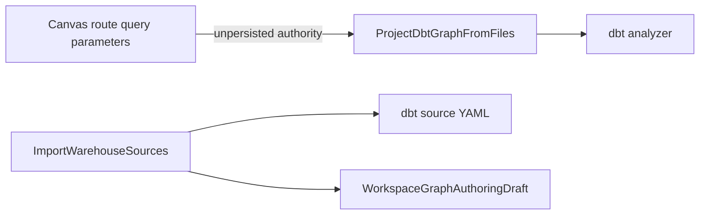
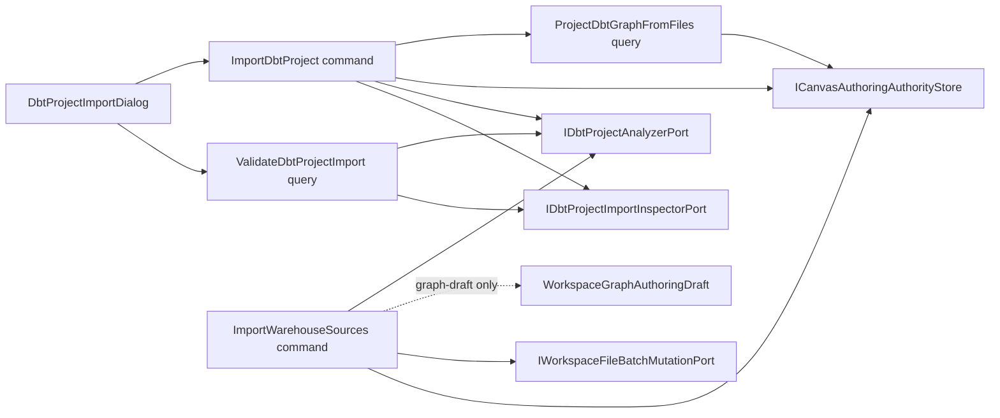
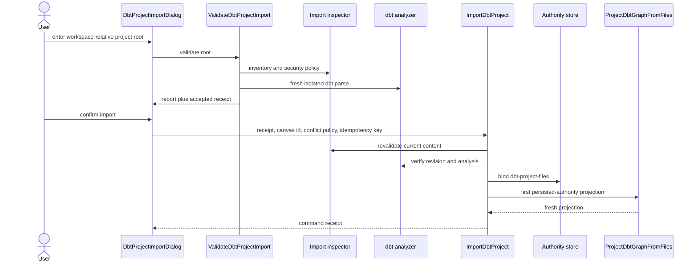
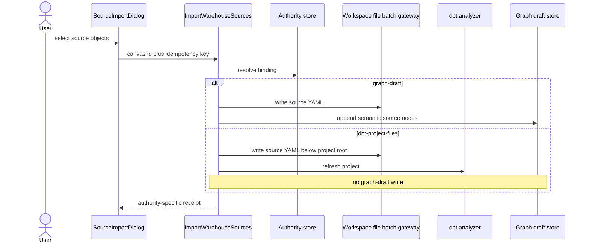

# dbt Project Import And Source Authority Component

## Purpose

This component closes phase 3 of file-backed dbt authoring. A demanding user
can validate an existing dbt project inside the authorized workspace, bind a
new Canvas to that project, and add warehouse sources without creating a
second semantic authority.

The implementation keeps exactly two mutually exclusive modes:

- `graph-draft`: Source Import writes dbt source YAML and the authoritative
  graph draft;
- `dbt-project-files`: Source Import writes dbt source YAML, refreshes the
  server analyzer, and never appends semantic draft nodes.

## Governing Sources

- `AGENTS.md`
- `docs/adr/ADR-0060-dbt-project-authoring-authority.md`
- `docs/architecture/command-query-rail-governance.md`
- `docs/architecture/fowler-opportunity-planning-governance.md`
- `docs/planning/proposals/mandatory/frontend-and-ux/dbt-project-roundtrip-product-plan-20260527.md`

## Current-State Drift

The route currently trusts a client-supplied project root. Source Import
always writes YAML and draft semantics, even when project files should be the
only authority. Multi-file YAML writes are coordinated one file at a time and
then compensated by application code.

## Target Components

| Component                            | Owned concern                                                                      | Reason to change                                            |
| ------------------------------------ | ---------------------------------------------------------------------------------- | ----------------------------------------------------------- |
| `DbtProjectImportContract`           | Version validation reports, accepted receipts, import commands, and receipts.      | The cross-process import vocabulary changes.                |
| `DbtProjectImportApplicationService` | Orchestrate validation and explicit authority binding.                             | Import policy or command/query orchestration changes.       |
| `DbtProjectImportInspector`          | Inspect one existing workspace project under security and compatibility limits.    | Filesystem compatibility or import security policy changes. |
| `CanvasAuthoringAuthorityStore`      | Persist and compare one Canvas authority binding.                                  | Authority persistence or conflict semantics change.         |
| `WorkspaceFileBatchMutation`         | Apply one scoped multi-file mutation with CAS, idempotency, staging, and rollback. | Local batch publication mechanics change.                   |
| `DbtProjectImportDialog`             | Present validation, diagnostics, and explicit import confirmation.                 | The import interaction or presentation model changes.       |

`ImportWarehouseSources` remains the existing command rail. Its application
service resolves the active authority and delegates only the mode-specific
semantic mutation.

## Target Boundary

## Command And Query Rails

| Rail                       | Type            | DDD owner                          | Application port                          | Authorization                                              | Required negative evidence                                                                                       |
| -------------------------- | --------------- | ---------------------------------- | ----------------------------------------- | ---------------------------------------------------------- | ---------------------------------------------------------------------------------------------------------------- |
| `ValidateDbtProjectImport` | query           | `DbtProjectImportValidationReport` | `ValidateDbtProjectImportUseCase.execute` | `workspace:files:view` in tenant/project/environment scope | unauthenticated, forbidden, traversal, symlink, unsupported/binary file, profiles/secrets, limits, invalid dbt   |
| `ImportDbtProject`         | command         | `CanvasAuthoringAuthorityBinding`  | `ImportDbtProjectUseCase.execute`         | `workspace:files:save` in tenant/project/environment scope | rejected/tampered/stale receipt, occupied Canvas, authority conflict, reused idempotency key, projection failure |
| `ImportWarehouseSources`   | command, reused | authority-aware source import      | `ImportWarehouseSourcesUseCase.execute`   | `workspace:source-import:import`                           | file mode never writes draft; graph mode preserves existing behavior; batch conflict and rollback                |

`IWorkspaceFileBatchMutationPort` is an outbound Gateway. It is not a product
command or query rail.

## Validation And Import Sequence

## File-Backed Source Import Sequence

## Invariants

- The server resolves authority from persisted state; URL parameters cannot
  establish authority.
- An unbound Canvas is graph-draft by default. `ImportDbtProject` may bind only
  a Canvas id that is not already present in the graph-draft aggregate.
- Importing an existing directory does not copy or normalize project files.
- Validation is a query and performs no persistent write.
- Import requires a validation receipt whose project revision and validation
  hash still match a fresh inspection.
- A successful import persists authority before reporting success and proves
  the first projection through that persisted authority.
- File-backed Source Import writes only beneath the bound `projectRoot`.
- File-backed Source Import never calls the graph-draft save port.
- Graph-draft Source Import retains its current semantic behavior.
- Multi-file writes use one scoped batch gateway with preflight CAS,
  deterministic ordering, staging, rollback, and idempotency.
- `profiles.yml`, credentials, binary files, traversal, absolute paths,
  symbolic links, excessive files, and excessive bytes fail closed.
- Runtime artifacts are diagnosed explicitly; no project files are silently
  omitted from compatibility reporting.
- Browser components consume typed ports and presentation models; they do not
  parse dbt, mutate files directly, or synthesize success.

## Definition Of Done

1. Planning DB lists every component, owned file, relation, rail, test, and
   remaining gap for this slice.
2. `ValidateDbtProjectImport` and `ImportDbtProject` are implemented once in
   the canonical rail catalog; no synonyms remain active.
3. Contract tests reject malformed, stale, cross-root, duplicate, and
   graph-draft-shaped import payloads.
4. The local batch adapter proves no partial publication under injected
   failure and rejects stale expected revisions before mutation.
5. The authority store proves scope isolation, compare-and-swap, and
   idempotency-key mismatch behavior.
6. API tests prove validation is read-only, import is explicit, and the first
   graph projection resolves persisted authority.
7. Source Import tests prove both modes and prove zero graph-draft writes in
   file-backed mode.
8. Presentation tests prove validate-before-import, actionable diagnostics,
   disabled confirmation on rejection, and navigation from the real receipt.
9. A strict Cypress flow uses the protected API and real workspace files to
   import a dbt project, add a source, refresh the projection, and verify the
   graph draft did not gain that source.
10. Contracts, API, web, architecture, lint, typecheck, governance,
    feature-mechanization, and `pnpm verify:prepush` pass with no disabled rule,
    stub, fake adapter, placeholder, or hidden skipped check.

## Explicit Non-Goals

- ZIP, Git, and dbt Cloud import adapters.
- File-backed Preview or Run; those belong to phase 4.
- General visual mutation of imported SQL or YAML.
- Graph-draft adoption or authority conversion; that belongs to phase 7.
- A second Source Import command.
