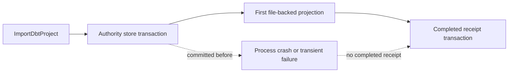
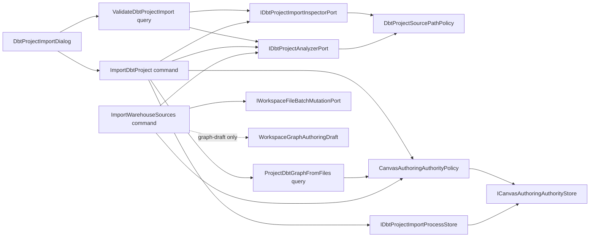
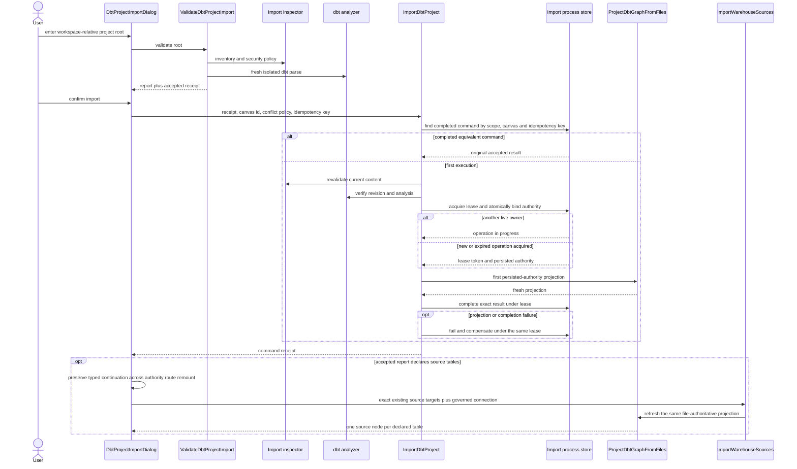
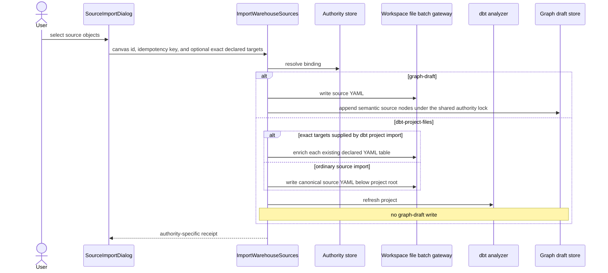

# dbt Project Import And Source Authority Component

## Purpose

This component closes phase 3 of file-backed dbt authoring. A demanding user
can validate an existing dbt project inside the authorized workspace, bind a
new Canvas to that project, and add warehouse sources without creating a
second semantic authority. The import command is a durable process: a crash
between authority binding, first projection, and result persistence can be
recovered without stranding the Canvas or inventing another product rail.

The implementation keeps exactly two mutually exclusive modes:

- `graph-draft`: Source Import writes dbt source YAML and the authoritative
  graph draft;
- `dbt-project-files`: Source Import writes dbt source YAML, refreshes the
  server analyzer, and never appends semantic draft nodes.

## Governing Sources

- `AGENTS.md`
- `docs/adr/ADR-0060-dbt-project-authoring-authority.md`
- `docs/architecture/command-query-rail-governance.md`
- `docs/architecture/fowler-opportunity-planning-governance.md`
- `docs/planning/proposals/mandatory/frontend-and-ux/dbt-project-roundtrip-product-plan-20260527.md`

## Recovery Drift Being Removed

Authority binding and completed-result persistence were previously separate
repository transactions with no durable owner for the work between them. A
retry could observe a deduplicated authority binding and no completed receipt;
if projection then failed, application compensation skipped the binding and
left an unrecoverable file-authoritative Canvas. A boolean deduplication check
cannot resolve that race. The command therefore requires one explicit process
store with durable state, an expiring ownership lease, exact replay, and
lease-guarded completion or compensation.

## Target Components

| Component                            | Owned concern                                                                                            | Reason to change                                                                |
| ------------------------------------ | -------------------------------------------------------------------------------------------------------- | ------------------------------------------------------------------------------- |
| `DbtProjectImportContract`           | Version validation reports, accepted receipts, import commands, and receipts.                            | The cross-process import vocabulary changes.                                    |
| `DbtProjectImportApplicationService` | Orchestrate validation and explicit authority binding.                                                   | Import policy or command/query orchestration changes.                           |
| `DbtProjectImportInspector`          | Inspect one existing workspace project under security and compatibility limits.                          | Filesystem compatibility or import security policy changes.                     |
| `DbtProjectSourcePathPolicy`         | Partition project source from configured dbt runtime-artifact directories.                               | dbt path configuration or source-selection policy changes.                      |
| `CanvasAuthoringAuthorityPolicy`     | Resolve the stored authority or the canonical graph-draft default.                                       | Authority transition or default-resolution policy changes.                      |
| `CanvasAuthoringAuthorityStore`      | Persist and compare one Canvas authority binding.                                                        | PostgreSQL persistence or conflict mechanics change.                            |
| `CanvasAuthoringAuthorityRuntime`    | Compose the policy port with its production store adapter.                                               | Protected runtime dependency wiring changes.                                    |
| `DbtProjectImportProcessStore`       | Own the durable import operation, lease, authority transition, compensation, and exact completed replay. | Import recovery, process ownership, or PostgreSQL transaction semantics change. |
| `WorkspaceFileBatchMutation`         | Apply one scoped multi-file mutation with CAS, idempotency, staging, and rollback.                       | Local batch publication mechanics change.                                       |
| `DbtProjectImportDialog`             | Present validation, diagnostics, and explicit import confirmation.                                       | The import interaction or presentation model changes.                           |

`ImportWarehouseSources` remains the existing command rail. Its application
service resolves the active authority and delegates only the mode-specific
semantic mutation.

When project validation reports dbt source-table declarations, the route-level
Canvas composition carries those typed declarations across the authority
change. The file-authoritative Canvas then opens the existing Source Import
dialog. Selecting one governed connection matches each declaration to one live
warehouse object by database, schema, and table. The command enriches the same
declared YAML table with non-secret `dvt_source_identity` metadata; it does not
generate a parallel source file or a second logical source.

## Target Boundary

## Command And Query Rails

| Rail                       | Type            | DDD owner                          | Application port                          | Authorization                                              | Required negative evidence                                                                                                                                                                             |
| -------------------------- | --------------- | ---------------------------------- | ----------------------------------------- | ---------------------------------------------------------- | ------------------------------------------------------------------------------------------------------------------------------------------------------------------------------------------------------ |
| `ValidateDbtProjectImport` | query           | `DbtProjectImportValidationReport` | `ValidateDbtProjectImportUseCase.execute` | `workspace:files:view` in tenant/project/environment scope | unauthenticated, forbidden, traversal, symlink, unsupported/binary file, profiles/secrets, source limits, invalid dbt, runtime-artifact mutation, unsafe or source-shadowing runtime paths             |
| `ImportDbtProject`         | command         | `CanvasAuthoringAuthorityBinding`  | `ImportDbtProjectUseCase.execute`         | `workspace:files:save` in tenant/project/environment scope | rejected/tampered/stale receipt, occupied Canvas, concurrent graph-draft claim, authority conflict, reused idempotency key, replay after later file changes, projection or receipt-persistence failure |
| `ImportWarehouseSources`   | command, reused | authority-aware source import      | `ImportWarehouseSourcesUseCase.execute`   | `workspace:source-import:import`                           | file mode never writes draft; graph mode rejects file authority; equivalent post-publication retry deduplicates; batch conflict and rollback                                                           |
| `SaveWorkspaceGraphDraft`  | command, reused | `WorkspaceGraphAuthoringDraft`     | `SaveWorkspaceGraphDraftUseCase.execute`  | `workspace:graph-draft:save`                               | stale revision, idempotency mismatch, file-authority conflict, concurrent file-authority claim                                                                                                         |

`IWorkspaceFileBatchMutationPort` is an outbound Gateway. It is not a product
command or query rail.

## Validation And Import Sequence

## File-Backed Source Import Sequence

## Invariants

- The server resolves authority from persisted state; URL parameters cannot
  establish authority.
- An unbound Canvas is graph-draft by default. `ImportDbtProject` may bind only
  a Canvas id that is not already present in the graph-draft aggregate.
- The two persistence paths enforce that rule symmetrically: file-authority
  binding and graph-draft save acquire the same scoped transaction lock and
  revalidate the competing store before commit. A concurrent claim has exactly
  one winner.
- Importing an existing directory does not copy or normalize project files.
- Validation is a query and performs no persistent write.
- Import requires a validation receipt whose project revision and validation
  hash still match a fresh inspection.
- A successful import persists authority before reporting success and proves
  the first projection through that persisted authority.
- A completed import persists its exact command result before responding. An
  equivalent retry replays that result before inspecting mutable project files;
  reuse of the same idempotency key for another command fails closed.
- One durable import operation owns the interval between authority binding and
  completed-result persistence. Starting the operation and binding authority
  happen in one PostgreSQL transaction.
- An active lease admits at most one projection/completion owner for an import
  operation. A retry may recover only after lease expiry; the previous owner
  can no longer complete or compensate after recovery changes the lease token.
- Completion wins over compensation. Compensation removes only the authority
  revision owned by the same operation and leaves a recoverable failed process
  record; a new attempt can bind the Canvas again without manual database work.
- File-backed Source Import writes only beneath the bound `projectRoot`.
- File-backed Source Import never calls the graph-draft save port.
- Graph-draft Source Import retains its current semantic behavior.
- Multi-file writes use one scoped batch gateway with preflight CAS,
  deterministic ordering, staging, rollback, and idempotency.
- The batch command identity describes the desired file mutation and expected
  path set. Expected revision values remain first-application CAS preconditions,
  so an equivalent retry after successful publication replays its receipt
  instead of conflicting with its own post-write revisions.
- `profiles.yml`, credentials, binary files, traversal, absolute paths,
  symbolic links, excessive files, and excessive bytes fail closed.
- One `DbtProjectSourcePathPolicy` resolves a typed directory partition for
  both inspection and analysis. Generated artifacts (`target-path` and
  `log-path`) are distinct from installed dependencies
  (`packages-install-path`).
- Non-source paths cannot resolve to the project root or shadow a
  configured source/resource path. Such projects fail validation rather than
  silently omitting source. Generated-artifact and installed-dependency paths
  also cannot overlap because one directory cannot have both lifecycle roles.
- Generated artifacts and installed dependencies are diagnosed explicitly in
  the compatibility inventory and excluded from imported project source and
  its source file/byte budgets. A separate inspected-file budget plus directory
  and depth limits still bound inventory traversal.
- The analyzer excludes generated artifacts but preserves materialized
  dependencies because `dbt parse` consumes package macros, tests, and models.
  It hashes and parses exactly that same isolated snapshot, so dependency
  changes affect project revision while generated output changes do not.
- Browser components consume typed ports and presentation models; they do not
  parse dbt, mutate files directly, or synthesize success.
- A dbt import source-binding continuation is session-scoped route-composition
  state keyed by Canvas id and project root. Its versioned `sessionStorage`
  projection carries declarations but no credential, survives route remount and
  browser reload, and is consumed only after file-authoritative Source Import
  succeeds. Cancelling or a failed import therefore preserves the exact retry.
- Exact binding requires complete and unique coverage of the validation report.
  Missing, ambiguous, duplicate, cross-database, stale, or userless connection
  matches fail closed before file mutation.
- Exact binding preserves the imported source name, table name, path, columns,
  tests, descriptions, tags, freshness, and unrelated metadata. It adds only
  the governed non-secret identity needed by later projection.

## Observability Ownership

The authority policy, PostgreSQL store, and runtime builder do not create an
independent telemetry vocabulary. They return typed command outcomes or fail
the protected-runtime startup. The owning import and graph-draft command
boundaries record those outcomes, while protected-runtime readiness owns
composition and migration failures. This delegation is explicit in Planning DB
rather than represented by duplicate adapter-level logs.

## Definition Of Done

1. Planning DB lists every component, owned file, relation, rail, test, and
   remaining gap for this slice.
2. `ValidateDbtProjectImport` and `ImportDbtProject` are implemented once in
   the canonical rail catalog; no synonyms remain active.
3. Contract tests reject malformed, stale, cross-root, duplicate, and
   graph-draft-shaped import payloads.
4. The local batch adapter proves no partial publication under injected
   failure and rejects stale expected revisions before mutation.
5. The authority and graph-draft stores prove scope isolation,
   compare-and-swap, idempotency-key mismatch behavior, and one-winner
   ownership under concurrent claims.
6. API tests prove validation is read-only, import is explicit, the first
   graph projection resolves persisted authority, and a completed command
   replays its original result after later project-file changes.
7. PostgreSQL process-store tests prove one active lease owner, expired-lease
   recovery, stale-owner rejection, completed-result precedence, mismatch
   rejection, and safe authority compensation after injected projection or
   result-persistence failure.
8. Analyzer and inspector tests prove the shared source/runtime partition,
   custom runtime paths, source-shadowing rejection, invariant hashes under
   runtime mutation, and explicit runtime inventory without source-byte charge.
9. Source Import tests prove both modes and prove zero graph-draft writes in
   file-backed mode.
10. Presentation tests prove validate-before-import, actionable diagnostics,
    disabled confirmation on rejection, and navigation from the real receipt.
11. A strict Cypress flow uses the protected API and real workspace files to
    import a dbt project, add a source, refresh the projection, and verify the
    graph draft did not gain that source.
12. Contracts, API, web, architecture, lint, typecheck, governance,
    feature-mechanization, and `pnpm verify:prepush` pass with no disabled rule,
    stub, fake adapter, placeholder, or hidden skipped check.

## Explicit Non-Goals

- ZIP, Git, and dbt Cloud import adapters.
- File-backed Preview or Run; those belong to phase 4.
- General visual mutation of imported SQL or YAML.
- Graph-draft adoption or authority conversion; that belongs to phase 7.
- A second Source Import command.
