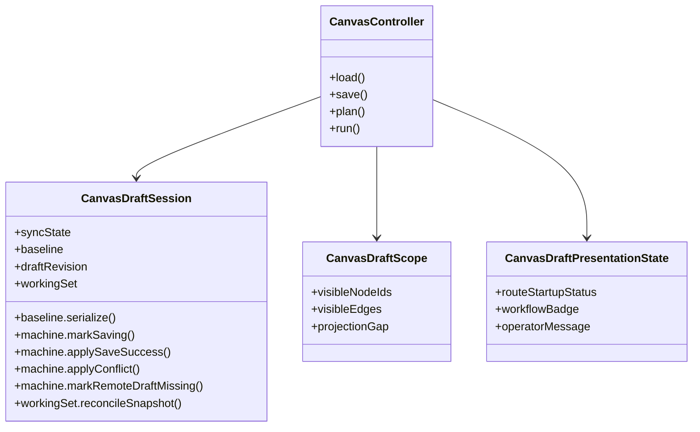

# Graph Canvas Runtime Model

## Intent

Define the route-local runtime model for Canvas authoring so rendering remains
projection-only and product truth stays explicit.

For the local authoring-runtime component contract, API, invariants, and
consumers, use
[Canvas Authoring Runtime Component](./canvas-authoring-runtime-component.md).

## Runtime Seams

| Seam                           | Responsibility                                                             |
| ------------------------------ | -------------------------------------------------------------------------- |
| `CanvasDraftSession`           | Authoritative route-local draft aggregate component API.                   |
| `CanvasDraftScope`             | Project visible working set and projection-gap posture.                    |
| `CanvasDraftPresentationState` | Route read model for startup/recovery/workbench posture.                   |
| `useCanvasController`          | Application composition seam; orchestrates queries, commands, and handoff. |

## Domain Model

## Runtime Rules

- React Flow state is a projection, never the semantic source of truth.
- conflict and `missing_remote` are first-class route states, not incidental
  exceptions.
- recovery from conflict, `missing_remote`, or projection-gap posture must come
  from authoritative remote reload, not route-local adoption of projected
  state.
- plan/run actions must consume canonical route scope, not visual-only state.
- read-only and forbidden posture must be explicit in route behavior.

## Current State

- Session/scope/presentation seams are active.
- hardening for conflict, missing-remote, and projection-gap posture exists.
- route-owned Inspector authoring now exists for governed node details, backed
  by local node overrides in the same draft aggregate used by preview and run.
- duplicate-node and reconnect-edge now route through adjacent command seams
  that preserve the draft aggregate as semantic truth instead of pushing policy
  down into passive React Flow adapters.
- parent TF-E2 still remains open only for the residual operability and
  long-horizon compatibility proof around governed persisted draft versions.

## Future Evolution

- complete end-to-end deterministic reload coverage across supported draft
  versions.
