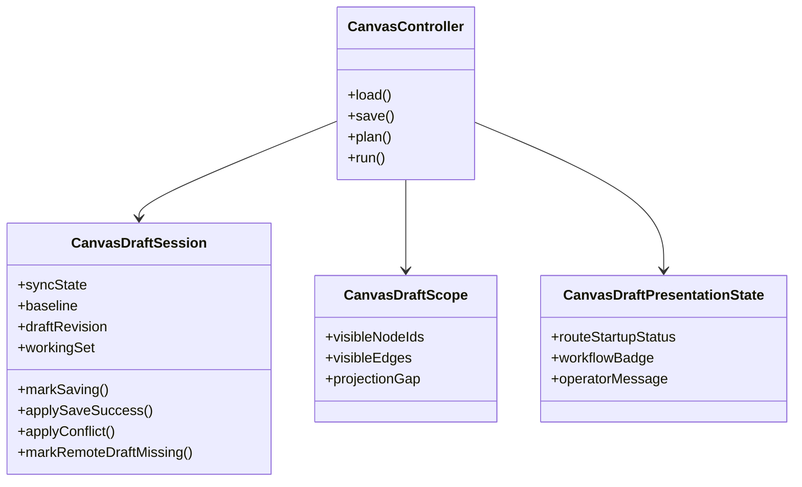

# Graph Canvas Runtime Model

## Intent

Define the route-local runtime model for Canvas authoring so rendering remains
projection-only and product truth stays explicit.

## Runtime Seams

| Seam                           | Responsibility                                                                |
| ------------------------------ | ----------------------------------------------------------------------------- |
| `CanvasDraftSession`           | Authoritative route-local draft aggregate for lifecycle and save transitions. |
| `CanvasDraftScope`             | Project visible working set and projection-gap posture.                       |
| `CanvasDraftPresentationState` | Route read model for startup/recovery/workbench posture.                      |
| `useCanvasController`          | Application composition seam; orchestrates queries, commands, and handoff.    |

## Domain Model

## Runtime Rules

- React Flow state is a projection, never the semantic source of truth.
- conflict and `missing_remote` are first-class route states, not incidental
  exceptions.
- plan/run actions must consume canonical route scope, not visual-only state.
- read-only and forbidden posture must be explicit in route behavior.

## Current State

- Session/scope/presentation seams are active.
- hardening for conflict, missing-remote, and projection-gap posture exists.
- parent TF-E2 still has pending closure for full node/edge/Inspector
  productization and complete proof matrix.

## Future Evolution

- close Inspector property lifecycle under the same aggregate transitions.
- finish command model closure for edge reconnect and mutation guards.
- complete end-to-end deterministic reload coverage across supported draft
  versions.
