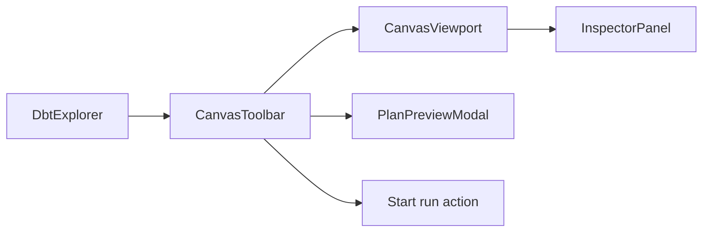
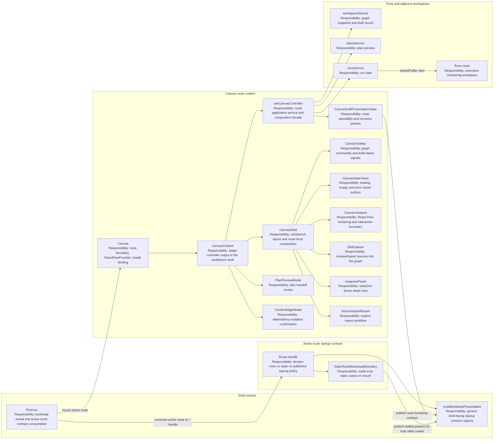
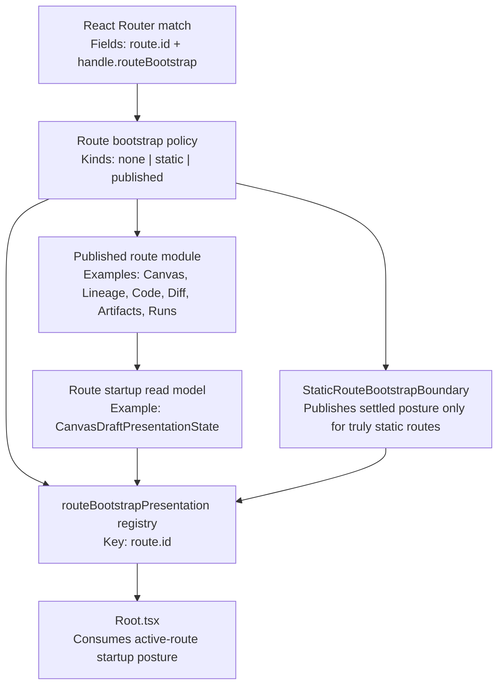
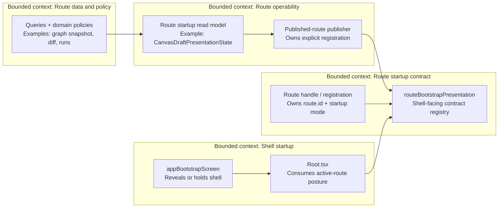
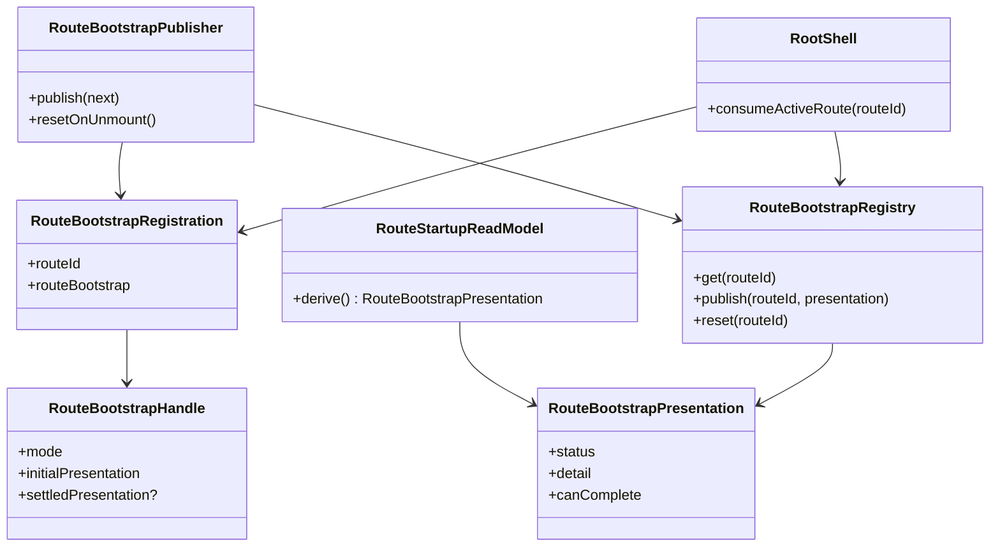
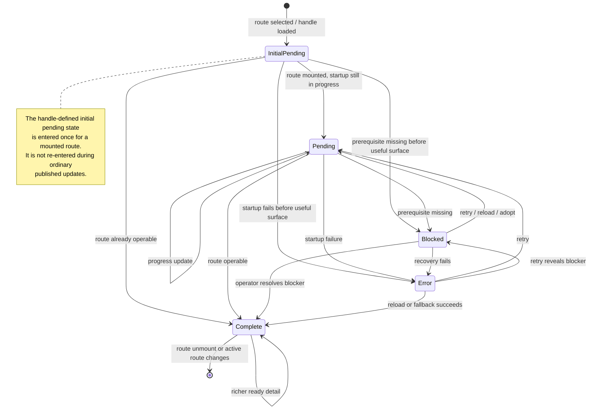
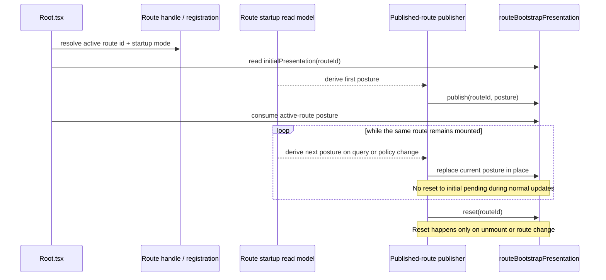

# Graph Frontend Architecture

## Purpose

The Graph surface is the main authoring and structural analysis workspace of the
DVT frontend.

Its current responsibility is to present workflow topology, overlays, and
selection-driven interaction without becoming the source of execution truth.

## Current Implementation

Primary code anchors:

- [Root.tsx](../../../../../apps/web/src/app/Root.tsx)
- [routeBootstrapPresentation.ts](../../../../../apps/web/src/app/bootstrap/routeBootstrapPresentation.ts)
- [StaticRouteBootstrapBoundary.tsx](../../../../../apps/web/src/app/bootstrap/StaticRouteBootstrapBoundary.tsx)
- [usePublishedRouteBootstrap.ts](../../../../../apps/web/src/app/bootstrap/usePublishedRouteBootstrap.ts)
- [Canvas.tsx](../../../../../apps/web/src/app/views/Canvas.tsx)
- [CanvasShell.tsx](../../../../../apps/web/src/app/views/canvas/CanvasShell.tsx)
- [CanvasViewport.tsx](../../../../../apps/web/src/app/views/canvas/CanvasViewport.tsx)
- [CanvasToolbar.tsx](../../../../../apps/web/src/app/views/canvas/CanvasToolbar.tsx)
- [useCanvasController.ts](../../../../../apps/web/src/app/views/canvas/useCanvasController.ts)
- [canvasDraftSession.ts](../../../../../apps/web/src/app/views/canvas/canvasDraftSession.ts)
- [canvasDraftScope.ts](../../../../../apps/web/src/app/views/canvas/canvasDraftScope.ts)
- [canvasNodeMapper.ts](../../../../../apps/web/src/app/views/canvas/canvasNodeMapper.ts)
- [graphStrategyRegistry.ts](../../../../../apps/web/src/app/plugins/graphStrategyRegistry.ts)

Current route: `/canvas`

Focused controller remediation and extraction planning is documented in
[Canvas Controller Current To Target Architecture](./canvas-controller-current-to-target-architecture.md).

Current composition:

## Canonical Component Responsibilities

The route now needs one component-level diagram that makes ownership explicit
from shell handoff down to the graph surface.

Component responsibilities in the mature-workbench reading:

- `Root.tsx` owns shell bootstrap, but not Canvas operability semantics.
- `Canvas` and `CanvasContent` are route-boundary components, not domain logic.
- `useCanvasController` composes route behavior, but domain truth is delegated
  to draft and projection models.
- `CanvasDraftPresentationState` is the Canvas route read model.
- `routeBootstrapPresentation` is the shell-facing startup contract registry
  that `Root.tsx` should consume for the active route.
- `usePublishedRouteBootstrap` is an adapter seam, not startup truth; its
  target role is to publish a route read model against an explicit
  registration and reset only when the route unmounts or changes identity.
- `StaticRouteBootstrapBoundary` is the generic bridge only for routes whose
  first useful surface is already correct immediately after mount.
- `CanvasShell`, `CanvasToolbar`, `CanvasViewport`, `DbtExplorer`, and
  `InspectorPanel` are view components over published route state, not
  competing sources of readiness.

## Route Bootstrap Contract Diagram

The generalized startup design needs one explicit diagram for the route
bootstrap contract itself.

## DDD Context Map For Route Startup

The route-startup seam is a small context map, not just a helper hook.

Context-map reading:

- shell startup owns reveal and waiting policy;
- route startup contract owns route identity and startup mode;
- route operability owns the read model that derives `pending`, `blocked`,
  `error`, or `complete`;
- route data and route-specific domain policy feed the read model but do not
  talk directly to `Root.tsx`.

## Published Route Bootstrap Domain Model

Canonical domain-model invariants:

- a published-route publisher owns one explicit `RouteBootstrapRegistration`;
- the registry is passive storage keyed by router `route.id`;
- `Root.tsx` consumes the active-route contract but does not derive route
  operability itself;
- `initialPresentation` seeds startup once per mounted route and is not a
  reusable fallback during ordinary updates.

## Published Route Lifecycle State Machine

## Canonical Published Route Sequence

## Canonical Startup Classification

`mount != settled`.

A mounted route is not automatically operable. The startup contract must be
classified explicitly per route and must describe when the shell is allowed to
dismiss Raven.

Canonical taxonomy:

- `none`: the route does not participate in startup gating.
- `static`: the route becomes operable immediately after mount and has no
  startup query, validation, reconciliation, or recovery posture that can still
  block first useful interaction.
- `published`: the route owns a read model that publishes
  `pending | blocked | error | complete` based on its real startup semantics.

Hard classification rule:

- if the route has route-local `loading`, `error`, `empty`, `blocked`,
  `recovery`, or equivalent startup states, it cannot be `static`;
- if the route needs asynchronous data before its first useful surface is
  correct, it must be `published`;
- a published route must publish against its explicit router registration
  keyed by `route.id`; discovery by "deepest active match" is implementation
  drift, not architecture;
- a published route must update startup posture in place; returning to
  `initialPresentation` during ordinary updates is not valid behavior;
- an unclassified route is an architectural defect, not an implicit `complete`
  fallback.

Canonical route classification for the current workbench:

| Route id                      | Path           | Startup mode | Why                                                                 |
| ----------------------------- | -------------- | ------------ | ------------------------------------------------------------------- |
| `dbt.canvas`                  | `/canvas`      | `published`  | Draft recovery, CAS conflict handling, graph snapshot and scope     |
| `dbt.lineage`                 | `/lineage`     | `published`  | Snapshot load plus `loading`/`error`/`empty` workbench states       |
| `dbt.code`                    | `/code`        | `published`  | File-tree and file-content queries gate first useful surface        |
| `dbt.diff`                    | `/diff`        | `published`  | Diff, graph, and SQL context queries gate first useful surface      |
| `dbt.artifacts`               | `/artifacts`   | `published`  | Artifact loading and import validation affect route operability     |
| `monitoring.runs`             | `/runs`        | `published`  | Run-summary query drives `loading`/`empty`/`error` route posture    |
| `monitoring.run-detail`       | `/runs/:runId` | `published`  | Run workspace load, missing-run detection, and error states         |
| `shell.plugins`               | `/plugins`     | `static`     | Shell surface is useful immediately after mount                     |
| `shell.admin`                 | `/admin`       | `static`     | Shell surface is useful immediately after mount                     |
| `shell.default-core-redirect` | `/` index      | `published`  | Redirect route still owns startup progress until the target settles |

## Current Responsibilities

- render the graph through `@xyflow/react`;
- map canonical graph data into canvas nodes and edges;
- keep viewport and node positions persistent per workspace context;
- expose graph overlays such as impact, runtime, and column-level lineage;
- drive selection into the Inspector panel;
- expose explicit degraded and recovery posture when authoritative draft state
  cannot be safely projected;
- allow plan and run actions from the current graph context.

In the final workbench, Canvas remains the graph-authoring route. It may hand
off context to Runs, Lineage, Diff, Artifacts, and the future Templates route,
but it should not absorb their review-heavy, artifact-heavy, or
source-generation responsibilities into the graph workspace itself.

## UX Rules

- explorer and inspector are optional side surfaces, not required blockers for
  graph interaction;
- graph actions should be available even when side panels are hidden;
- overlays are visual projections over canonical graph state;
- runtime and cost overlays must not mutate topology;
- route readiness, center-surface state, and toolbar draft signals must derive
  from one presentation posture rather than from separate local heuristics;
- shell startup handoff remains a shell concern, but `Root.tsx` must consume
  the active route bootstrap contract from route metadata plus the published
  presentation seam rather than inferring it from pathname or graph-query
  shortcuts;
- only routes whose first useful surface is correct immediately after mount may
  use the generic static boundary;
- routes with startup queries or route-local loading/error/recovery must
  publish their own startup read model and must not inherit an implicit
  `complete` fallback;
- fit, pan, zoom, minimap, and grid are graph affordances, not product-domain
  state.

## Mature Libraries And References

- rendering primitive:
  [React Flow](https://reactflow.dev/)
- workbench precedent:
  [VS Code](https://github.com/microsoft/vscode)

Use React Flow as a rendering and interaction primitive only. Keep DVT graph
concepts behind canonical types and mappers.

## Current Constraints

- the app store still leaks too much shell and run state into the same global
  store;
- `useCapabilitiesQuery` still bypasses the governed service boundary and
  should align with the frontend data-boundary model;
- `useCanvasController` still concentrates graph query, overlay policy,
  persistence rules, and route side effects in one hook and is being hardened
  as an `F-05` controller-boundary slice;
- `canvasWorkbenchStateModel` is now only a base workbench-state classifier;
  the route still needs one canonical presentation-state seam for recovery and
  toolbar coherence;
- shell startup is now routed through generic route-bootstrap metadata plus a
  published route contract; future routes must opt in through that seam rather
  than by adding pathname branches in `Root.tsx`;
- the current helper path that assigns `static` startup handles by default is a
  transitional implementation drift, not the target architecture; the canonical
  design requires explicit route classification;
- the legacy `GraphCanvas` path still exists in the codebase and should be
  retired so the active graph stack is singular;
- current graph maturity is strongest for dbt topology; broader multi-domain
  graph semantics remain planned.

## Architectural Reading

- Fowler:
  the graph route should expose a presentation read model to the shell instead
  of making the shell inspect controller internals.
- DDD:
  graph authoring and shell bootstrap are adjacent contexts with an explicit
  handoff seam.
- Hexagonal:
  startup reveal should depend on a route-facing presenter output, not on
  infrastructure details such as query state or component-local branches.
- SOLID:
  the shell owns startup, the graph owns operability, and the handoff should
  respect dependency inversion.

Comparison with mature systems:

- mature workbench modules do not dismiss the splash screen from inside leaf
  view heuristics;
- the shell waits on an explicit readiness posture published by the module;
- simpler routes use a shared mount boundary, while richer routes publish their
  own operability posture;
- `static` is valid only for routes that are already useful at mount; it is not
  shorthand for "lazy-loaded but probably fine";
- degraded or blocked route posture remains visible as a shell-level startup
  truth until the route is actually operable.

## Related Pages

- [Main Workspace Views And UX](../main-workspace-views-and-ux.md)
- [UX Implementation Guide](../ux-implementation-guide.md)
- [Library And Open-Source Reference Stack](../library-and-open-source-reference-stack.md)
- [Canvas Controller Current To Target Architecture](./canvas-controller-current-to-target-architecture.md)
- [Canvas Component Map And Modernization Review](./canvas-component-map-and-modernization-review.md)
- [Unified Raven Startup Bootstrap Closeout](../../../../planning/closeouts/20260414-unified-raven-startup-bootstrap-closeout.md)
