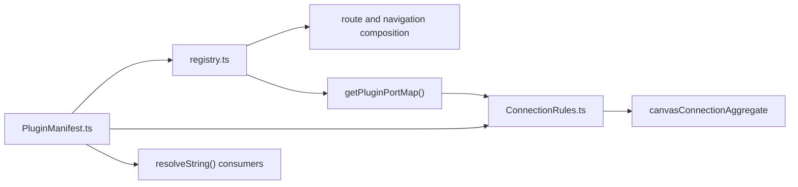

# Graph Frontend Architecture

## Purpose

The Graph surface is the main authoring workspace of the DVT frontend.

Its role is to provide operator-facing graph authoring and route operability
without becoming the source of execution truth.

## Scope

In scope:

- Canvas route composition and operability posture.
- Route startup contract handoff from route context to shell context.
- Draft session and scope projection behavior in the route.
- Plan/run handoff from canonical route scope.

Out of scope:

- backend persistence ownership (`TF-A2`, `TF-C4`).
- planner profile redesign.
- shell-wide navigation and non-graph route architecture.

## Canonical Code Anchors

- [Root.tsx](../../../../../apps/web/src/app/Root.tsx)
- [routes.ts](../../../../../apps/web/src/app/routes.ts)
- [routeBootstrapContract.ts](../../../../../apps/web/src/app/bootstrap/routeBootstrapContract.ts)
- [routeBootstrapRegistration.ts](../../../../../apps/web/src/app/bootstrap/routeBootstrapRegistration.ts)
- [routeBootstrapRegistry.ts](../../../../../apps/web/src/app/bootstrap/routeBootstrapRegistry.ts)
- [useActiveRouteBootstrapRegistration.ts](../../../../../apps/web/src/app/bootstrap/useActiveRouteBootstrapRegistration.ts)
- [usePublishedRouteBootstrap.ts](../../../../../apps/web/src/app/bootstrap/usePublishedRouteBootstrap.ts)
- [routeBootstrapErrors.ts](../../../../../apps/web/src/app/bootstrap/routeBootstrapErrors.ts)
- [routeBootstrapErrorCopy.ts](../../../../../apps/web/src/app/bootstrap/routeBootstrapErrorCopy.ts)
- [Canvas.tsx](../../../../../apps/web/src/app/views/Canvas.tsx)
- [useCanvasController.ts](../../../../../apps/web/src/app/views/canvas/useCanvasController.ts)
- [PluginManifest.ts](../../../../../apps/web/src/app/plugins/contracts/PluginManifest.ts)
- [ConnectionRules.ts](../../../../../apps/web/src/app/plugins/contracts/ConnectionRules.ts)
- [registry.ts](../../../../../apps/web/src/app/plugins/registry.ts)
- [copy.ts](../../../../../apps/web/src/app/views/canvas/copy.ts)
- [canvasDraftSession.ts](../../../../../apps/web/src/app/views/canvas/canvasDraftSession.ts)
- [canvasDraftScope.ts](../../../../../apps/web/src/app/views/canvas/canvasDraftScope.ts)
- [canvasConnectionAggregate.ts](../../../../../apps/web/src/app/views/canvas/canvasConnectionAggregate.ts)
- [canvasInteractionCommands.ts](../../../../../apps/web/src/app/views/canvas/canvasInteractionCommands.ts)
- [canvasNodeDropAggregate.ts](../../../../../apps/web/src/app/views/canvas/canvasNodeDropAggregate.ts)

## Current Point (2026-04-19)

- route startup is now generalized by explicit route metadata and route IDs,
  not pathname branching in `Root.tsx`.
- bootstrap responsibilities are split by SRP:
  - contract (`routeBootstrapContract.ts`)
  - registration parsing (`routeBootstrapRegistration.ts`)
  - registry state (`routeBootstrapRegistry.ts`)
  - active registration resolution (`useActiveRouteBootstrapRegistration.ts`)
- bootstrap hardening is active:
  - typed bootstrap errors (`routeBootstrapErrors.ts`) with stable error codes
  - locale-resolved bootstrap copy via runtime locale detection
    (`routeBootstrapErrorCopy.ts`)
  - non-router runtime exceptions are rethrown instead of being remapped as
    missing Data Router context
- Canvas draft lifecycle has explicit session, scope, and presentation seams;
  the wider TF-E2 productization remains in progress.
- Canvas working-set mutations now flow through one local command catalog
  (`canvasInteractionCommands.ts`) for remove-node, visible-edge replacement,
  explicit-node admission, and source-import queueing. The previous
  compatibility-style write paths inside several adapter hooks were removed.
- Edge proposal/confirmation and canonical-node drop admission now sit behind
  narrow pure policy seams (`canvasConnectionAggregate.ts`,
  `canvasNodeDropAggregate.ts`) instead of one mixed helper module.
- the plugin surface now has a clearer contract split:
  - `PluginManifest.ts` owns the plugin vocabulary and declaration contract
  - `registry.ts` owns static composition and runtime availability filtering
  - `ConnectionRules.ts` consumes manifest declarations but owns graph-policy
    evaluation
- The local authoring-policy and execution-presentation slice is now explicit:
  - `ConnectionRules.ts` owns shell-level connection policy over graph
    invariants, plugin rules, and cross-plugin bridges
  - `canvasNodeDropPayload.ts` owns canonical drag payload normalization before
    admission policy runs
  - `transformationGraphValidation.ts` owns stable validation summary codes and
    scoped transformation-graph invariants
  - `canvasPreviewProvenance.ts` owns preview provenance resolution over
    workspace artifacts and Git readiness
  - `canvasPlanAction.ts` and `canvasRunStartAction.ts` own explicit command
    execution for preview and run start
  - `canvasExecutionState.ts` and `CanvasToolbar.tsx` form the route-local
    execution presentation seam
- Connection and transformation validation failures now stay typed until the
  presentation edge:
  - `canvasConnectionAggregate.ts` returns typed rejection codes and metadata
    instead of Canvas-visible strings
  - `transformationGraphValidation.ts` returns stable validation summary codes
    instead of locale-bound summary text
  - `copy.ts` is the single owner that formats those outcomes for toasts,
    toolbar titles, and plan-action failures
- Canvas-visible operator copy now flows through one locale-resolved copy
  surface (`copy.ts`) instead of being repeated across handlers, validation
  helpers, and route-state presenters.

## Plugin Contract Boundary

`PluginManifest.ts` is the canonical contract module for frontend plugin
declarations in the Graph surface.

It currently owns:

- plugin identity and capability vocabulary
- localizable string shape and shared contribution DTOs for views, toolbar, and
  inspector panels
- plugin-declared node and connection metadata:
  `nodeKinds`, `connectionRules`, `produces`, and `consumes`
- lifecycle-aware manifest shape for plugins that expose `onMount`,
  `onUnmount`, `onError`, and `createServices`

It does not own:

- static registry composition or environment gating:
  that belongs to `registry.ts`
- actual graph-policy evaluation:
  that belongs to `ConnectionRules.ts` and the Canvas aggregates
- route copy formatting:
  that belongs to `copy.ts`

Current implementation truth:

- the shell already treats `PluginManifest.ts` as the owner of the shared
  declaration vocabulary
- `registry.ts` still composes static `PluginContributions` as the current
  registration format
- this means `PluginManifest.ts` is the contract owner, but not yet the only
  runtime composition object

Reading rule:

- read `PluginManifest.ts` when the question is "what may a plugin declare?"
- read `registry.ts` when the question is "which plugins are active and how are
  declarations composed?"
- read `ConnectionRules.ts` when the question is "how do declared rules affect
  graph authoring semantics?"

## Architecture Pack

Use this reading order:

1. [Graph Route Bootstrap Architecture](./graph-route-bootstrap-architecture.md)
2. [Graph Canvas Runtime Model](./graph-canvas-runtime-model.md)
3. [Graph Sequences And State Machines](./graph-sequences-and-state-machines.md)
4. [Graph Decision Rationale And Patterns](./graph-decision-rationale-and-patterns.md)
5. supporting deep reviews:
   [Canvas Controller Current To Target Architecture](./canvas-controller-current-to-target-architecture.md),
   [Canvas Component Map And Modernization Review](./canvas-component-map-and-modernization-review.md)

For the detailed authoring-policy diagrams and the explicit comparison against
the canonical Fowler frontend pattern, use
[Canvas Controller Current To Target Architecture](./canvas-controller-current-to-target-architecture.md).

## Evolution Direction

Near-term evolution:

- close full TF-E2 node/edge/Inspector lifecycle under one canonical draft
  authority.
- converge the Canvas authoring slice on one bounded local write authority,
  explicit command seams, and route-local query models instead of mixed
  widget-driven mutation paths.
- keep remaining selection and inspector UI commands from turning back into a
  second write-authority path as TF-E2 continues.
- complete operability and proof matrix closure (unit/integration/Cypress).
- keep route startup contract explicit for all graph-adjacent routes.

Long-term posture:

- Graph remains one bounded frontend authoring context.
- the Graph authoring context follows a DDD plus tactical CQRS plus hexagonal
  posture:
  - one authoritative local aggregate for in-flight authoring truth
  - command seams for working-set mutations
  - query seams for projections, validation, overlays, and startup posture
  - inbound adapters for React Flow and route UI events
  - outbound ports for workspace snapshot and draft persistence
- the Graph route also follows Fowler at the route edge:
  - command facades and presentation-model seams are explicit
  - pure local authoring policies stay outside the generic gateway/facade split
    instead of being hidden inside UI hooks
- shell startup consumes route contracts but does not own route domain rules.
- route-local read models remain the only source for startup and recovery
  posture.

## Related Pages

- [Graph Architecture Docs](./index.md)
- [web component](../index.md)
- [UX Implementation Guide](../ux-implementation-guide.md)
- [System Delivery Status](../../../../system-delivery-status.md)
