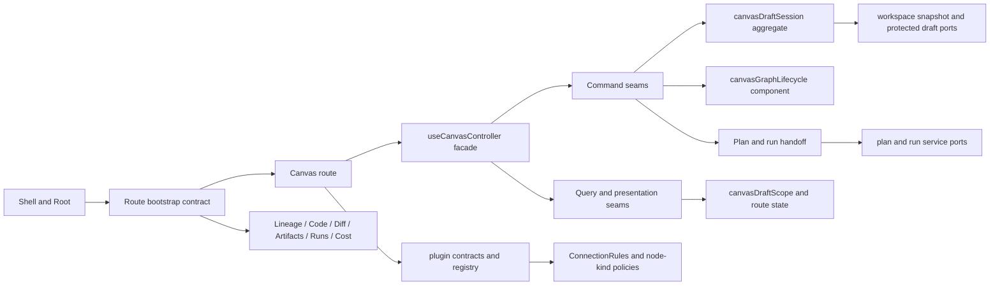
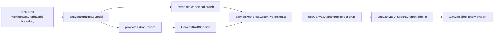
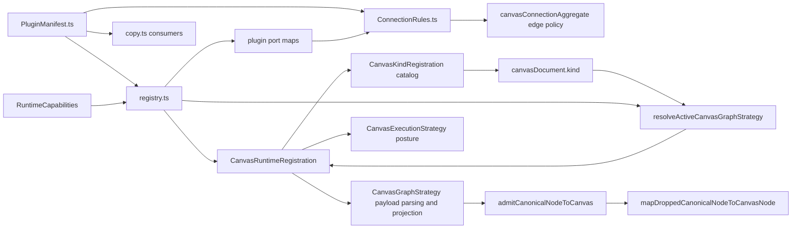
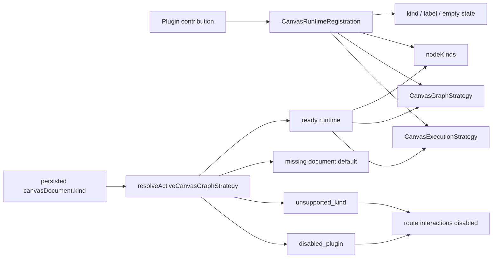
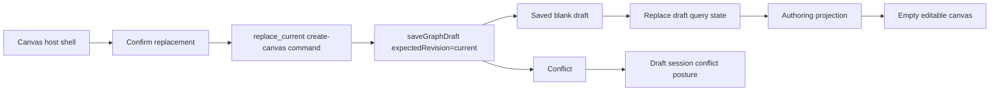
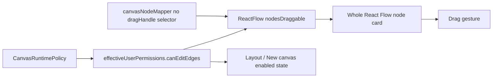
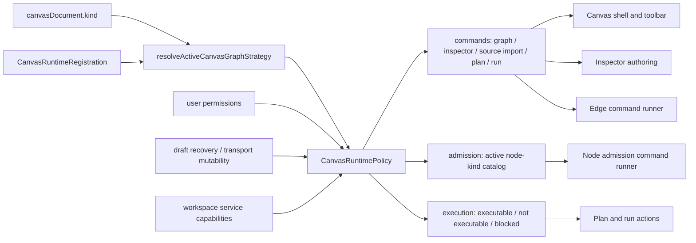
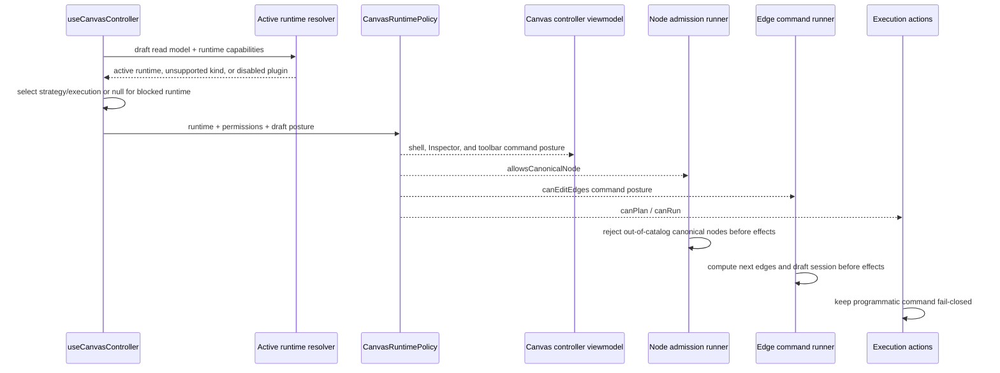
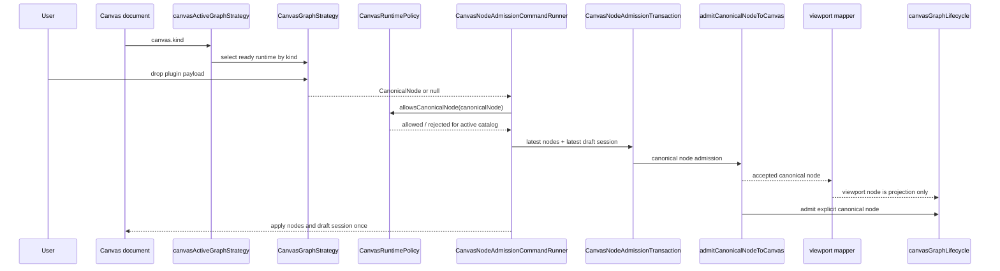
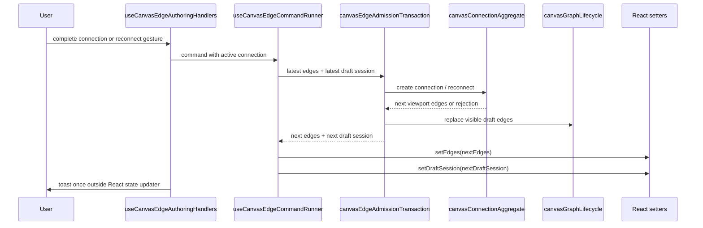

# Graph Frontend Architecture

## Purpose

The Graph surface is the bounded frontend authoring context of DVT+. It hosts
heterogeneous plugin-qualified nodes and edges; dbt is the current native
transformation vertical, not a closed product ontology.

Its job is to expose graph authoring, route operability, preview, and run
handoff without becoming the source of execution truth or shell truth.

## Governing Sources

- [Graph Route Bootstrap Architecture](./graph-route-bootstrap-architecture.md)
- [Canvas Controller Current To Target Architecture](./canvas-controller-current-to-target-architecture.md)
- [Canvas Component Map And Modernization Review](./canvas-component-map-and-modernization-review.md)
- [Canvas Route Composition Component](./canvas-route-composition-component.md)
- [Canvas Authoring Runtime Component](./canvas-authoring-runtime-component.md)
- [Canvas Authoring Projection Component](./canvas-authoring-projection-component.md)
- [Canvas Draft Session Component](./canvas-draft-session-component.md)
- [Canvas Startup And Draft Recovery Component](./canvas-startup-and-draft-recovery-component.md)
- [Canvas Graph Lifecycle Component](./canvas-graph-lifecycle-component.md)
- [Graph Sequences And State Machines](./graph-sequences-and-state-machines.md)
- [Frontend Fowler Implementation Pattern](../frontend-fowler-implementation-pattern.md)
- [Frontend Data Boundary Architecture](../frontend-data-boundary-architecture.md)
- [US-F10.1 contextual Process Map correction](https://github.com/dunay2/dvt/issues/2102)

Reading rule:

- use this page for pack-level frontend posture
- use the controller and component docs for Canvas-local detail
- use the route-bootstrap doc for shell contract and startup rules

## Scope

In scope:

- Canvas route composition and operability
- route startup handoff from route context to shell context
- draft aggregate, scope projection, and route-local command seams
- plugin declaration boundary for graph behavior

Out of scope:

- backend persistence ownership
- planner redesign
- shell-wide navigation outside graph-facing routes

## Canonical Anchors

| Concern                     | Primary anchors                                                                                                                                                                                                                                                                       |
| --------------------------- | ------------------------------------------------------------------------------------------------------------------------------------------------------------------------------------------------------------------------------------------------------------------------------------- |
| Shell handoff               | [Root.tsx](../../../../../apps/web/src/app/Root.tsx), [routes.ts](../../../../../apps/web/src/app/routes.ts), [usePublishedRouteBootstrap.ts](../../../../../apps/web/src/app/bootstrap/usePublishedRouteBootstrap.ts)                                                                |
| Canvas route facade         | [Canvas.tsx](../../../../../apps/web/src/app/views/Canvas.tsx), [useCanvasController.ts](../../../../../apps/web/src/app/views/canvas/useCanvasController.ts), [canvasRouteViewState.ts](../../../../../apps/web/src/app/views/canvas/canvasRouteViewState.ts)                        |
| Draft authoring core        | [canvasDraftSession.ts](../../../../../apps/web/src/app/views/canvas/canvasDraftSession.ts), [canvasDraftScope.ts](../../../../../apps/web/src/app/views/canvas/canvasDraftScope.ts), [canvasGraphLifecycle.ts](../../../../../apps/web/src/app/views/canvas/canvasGraphLifecycle.ts) |
| Plugin boundary             | [PluginManifest.ts](../../../../../apps/web/src/app/plugins/contracts/PluginManifest.ts), [ConnectionRules.ts](../../../../../apps/web/src/app/plugins/contracts/ConnectionRules.ts), [registry.ts](../../../../../apps/web/src/app/plugins/registry.ts)                              |
| Canvas runtime policy       | [canvasRuntimePolicy.ts](../../../../../apps/web/src/app/views/canvas/canvasRuntimePolicy.ts), [useCanvasController.ts](../../../../../apps/web/src/app/views/canvas/useCanvasController.ts)                                                                                          |
| Canvas runtime registration | [registry.ts](../../../../../apps/web/src/app/plugins/registry.ts), [graphStrategyRegistry.ts](../../../../../apps/web/src/app/plugins/graphStrategyRegistry.ts), [canvasExecutionStrategyContracts.ts](../../../../../apps/web/src/app/plugins/canvasExecutionStrategyContracts.ts)  |
| Route copy and presentation | [copy.ts](../../../../../apps/web/src/app/views/canvas/copy.ts), [CanvasToolbar.tsx](../../../../../apps/web/src/app/views/canvas/CanvasToolbar.tsx), [canvasExecutionState.ts](../../../../../apps/web/src/app/views/canvas/canvasExecutionState.ts)                                 |

Node admission command anchors:

- [canvasNodeAdmissionTransaction.ts](../../../../../apps/web/src/app/views/canvas/canvasNodeAdmissionTransaction.ts)
- [useCanvasNodeAdmissionCommandRunner.ts](../../../../../apps/web/src/app/views/canvas/useCanvasNodeAdmissionCommandRunner.ts)

Edge command anchors:

- [canvasEdgeAdmissionTransaction.ts](../../../../../apps/web/src/app/views/canvas/canvasEdgeAdmissionTransaction.ts)
- [useCanvasEdgeCommandRunner.ts](../../../../../apps/web/src/app/views/canvas/useCanvasEdgeCommandRunner.ts)

## Frontend Topology

Current posture:

- shell startup is contract-driven, not pathname-driven
- Canvas owns authoring truth, not execution truth
- command and query seams are becoming explicit instead of widget-driven
- plugin declarations are separated from runtime composition and policy

## Current Architecture Point

As of release `0.5.3` on 2026-08-02:

- route startup is generalized by `route.id` plus explicit bootstrap metadata
- Canvas graph mutation now flows through one local lifecycle component
- edge admission lives behind a narrow pure policy seam; node drop, duplicate,
  and first-node creation use canonical admission before any viewport
  projection, while plugin graph strategies only parse or project
  plugin-owned payloads
- connection admission separates topology invariants from plugin policy:
  `proposeConnection` owns endpoint, duplicate, direction, and cycle checks,
  then delegates to `evaluateConnectionPolicy`; passive compatibility hints
  precompute graph topology once and reuse that same policy object instead of
  rebuilding the command aggregate for every possible node pair
- node create/drop handlers delegate node admission to
  `useCanvasNodeAdmissionCommandRunner`, and edge creation/reconnect
  delegates to `useCanvasEdgeCommandRunner`; both runners serialize local
  command effects over the latest viewport graph and draft session before a
  React rerender can refresh hook inputs
- the `Insert` surface exposes the active canvas kind's node-kind creation
  catalog while a canvas is ready, not only during the typed empty state; those
  buttons call the same governed node admission command as empty-state
  first-node creation and drag/drop
- connection and transformation validation stay typed until presentation
- route-visible operator copy is centralized instead of repeated across handlers
- protected draft reads now project a semantic canonical graph,
  `canvasAuthoringGraphProjection.ts` derives active authoring semantics from
  that protected graph plus scoped local working-set additions only, and
  `useCanvasViewportGraphModel.ts` projects those semantics into React Flow
  state
- API-mode `WorkspaceGraphSnapshot` consumers now receive a read-model
  projection from `GET /workspace/graph/draft` instead of calling a retired
  `/workspace/graph` endpoint; the snapshot remains projection-only and does
  not regain aggregate authority
- Canvas source-import affordances are capability-gated instead of being
  implied by mock-era empty states; the active `api` path uses the implemented
  protected connection list/create/test, source-object discovery, and import
  rails, while `mock` is not a substitute active-authoring runtime
- DVT+ treats the graph as a heterogeneous plugin-qualified topology. The
  `dvt:source -> dvt:sql_transform -> dvt:sink` sequence remains one supported
  transformation example, not the whole product ontology or a fixed graph
  shape
- Canvas is the single primary Process Map. Code, source import, project
  exploration, and node work open contextually; Log, Problems, Runs, and
  Preview retain their existing bottom-drawer owners rather than becoming peer
  graph routes or fixed side rails
- active Canvas runtime composition is now registered once per canvas kind:
  `CanvasRuntimeRegistration` binds product kind, graph strategy, execution
  posture, and first-node catalog
- plugin projections are capability-aware: disabled runtime plugins no longer
  contribute port maps, overlays, badges, renderers, or run adapters to Canvas
  consumers
- `CanvasRuntimePolicy` is the route-level application policy. It resolves the
  active document state, command availability, execution posture, and
  node-kind admission from the same runtime snapshot before any shell,
  inspector, execution, or graph command consumes those decisions
- unsupported persisted canvas kinds fail closed as invalid documents;
  registered canvas kinds whose plugin is disabled fail closed as
  `disabled_plugin` with separate operator copy; only a missing document may
  use the default transformation creation posture
- `transformation` retains its canonical authoring catalog but registers a
  `not_executable` posture: selection-for-execution, Preview, and Run are not
  exposed while the retired SQL-first path has no replacement. `dbt` keeps the
  TF-C3-backed `planner-generic-v1` posture. DBT preview/run is available only
  through generated workspace artifacts, a dbt `GenericGraphSourceV1`, and a
  persisted `PlanRef`; API-mode warehouse source import is available only when
  the workspace port advertises the implemented protected-runtime source-import
  rails.
- Preview publishes exactly one of `accepted`, `selection-rejected`, or
  `plan-invalid`. An accepted or invalid built plan keeps its exact persisted
  `PlanRef`; later project or graph changes may require a new Preview but do not
  mutate or invalidate that stored execution identity. `StartRun(planRef)`
  executes the referenced stored artifact.
- route shell composition applies the effective fail-closed route posture to
  Inspector authoring, so an unsupported or blocked canvas cannot reopen
  side-panel mutation even if a lower-level controller value drifts
- canonical graph vocabularies are exported as runtime arrays and TypeScript
  unions derive from those arrays, so runtime guards cannot drift from types
- persisted draft recovery now has an explicit replacement command from the
  host tab strip: the action creates a blank canvas through the protected draft
  save boundary with the current revision as the compare-and-swap guard, so
  stale local demo data does not require manual database cleanup
- React Flow node drag uses the whole node card when effective mutation
  permission allows it, keeping the expected operator gesture simple while
  preserving the same fail-closed permission gate
- Canvas viewport preferences now have a named route-local command rail:
  `ConfigureCanvasViewportPreferences` owns grid visibility, grid color, and
  snap-to-grid state in `uiLayoutStore`, while `PersistCanvasLayout` continues
  to own renderer coordinates and protected draft rails remain graph-authority
  only
- newly authored catalog nodes start from a visible first authoring slot instead
  of the React Flow origin, and auto-layout preserves node drag capability while
  optionally snapping computed coordinates to the configured grid

## Protected Draft Semantic Projection

The current single-authority projection point is explicit:

- `canvasDraftReadModel.ts` is the route-facing read-model seam for protected
  draft outcomes
- `workspaceGraphDraftProjection.ts` projects both the lossy persisted draft
  record and the semantic canonical graph used by Canvas authoring
- `canvasAuthoringGraphProjection.ts` treats protected semantic graph as first
  authority and supplements it only with route-local explicit additions that
  are not yet persisted remotely
- `useCanvasAuthoringProjection.ts` composes semantic authoring projection and
  viewport projection without turning React Flow into semantic authority
- `useCanvasViewportGraphModel.ts` owns viewport-ready node and edge state only

Interpretation rule:

- semantic graph owns visible authoring semantics when a protected draft is
  present
- route-local canonical-node supplementation may cover only pending or
  locally-added working-set members that are not yet persisted in the
  protected draft
- viewport node and edge state is a downstream projection of that semantic
  authoring graph, never a second semantic merge point
- projected record still owns persisted working-set membership and positions
- the retired workspace-snapshot path is no longer allowed to override or
  supplement active route semantics
- capability-gated authoring actions such as source import must be derived from
  explicit service seams plus route posture, never from fallback copy

## Plugin Contract Boundary

`PluginManifest.ts` is the canonical declaration contract for graph-facing
plugins.

| Module               | Owns                                                                 | Must not own                                |
| -------------------- | -------------------------------------------------------------------- | ------------------------------------------- |
| `PluginManifest.ts`  | vocabulary, contribution DTOs, node-kind and connection declarations | runtime composition, graph-policy execution |
| `registry.ts`        | static plugin composition, availability filtering, port maps         | declaration semantics                       |
| `ConnectionRules.ts` | graph-policy evaluation over manifest declarations                   | plugin registration and route copy          |
| `copy.ts`            | locale-resolved operator copy                                        | plugin declaration semantics                |

Runtime projection rule:

- every registry helper that contributes route-visible behavior must accept
  `RuntimeCapabilities`;
- unavailable plugins must not contribute canvas kinds, node kinds, renderers,
  badges, overlays, run adapters, or connection port maps;
- route bootstrap handles for plugin-contributed views are plugin-owned
  contribution data, not route-view implementation details consumed by
  `registry.ts`;
- plugin node-kind parsing must use
  `parsePluginNodeKind` from `types/canonicalGuards.ts`; inline
  `split(':')` or `slice(0, indexOf(':'))` extraction is drift;
- Canvas consumers may forward capability-filtered projections, but must not
  read port maps, badges, or overlays from `PLUGIN_REGISTRY` directly.

Reading rule:

- ask `PluginManifest.ts` what a plugin may declare
- ask `registry.ts` which plugins are active
- ask `ConnectionRules.ts` how those declarations affect graph semantics
- ask the active canvas document which graph strategy and authoring catalog are
  in force; do not ask the graph strategy for canvas-kind posture

## Canvas Runtime Registration

Canvas kind, graph strategy, execution posture, and first-node catalog are one
runtime registration. This prevents the mature-system failure mode where a new
document kind becomes visible in the UX before its parser, catalog, or
execution posture is explicitly declared.

Runtime invariants:

- every visible canvas kind must have one graph strategy;
- every graph strategy used by Canvas must be reachable through a runtime
  registration;
- every runtime must declare whether it is executable;
- unsupported persisted kinds disable mutation, plan, and run instead of
  falling back to transformation semantics.
- a persisted kind that is statically registered but filtered out by runtime
  capabilities is `disabled_plugin`, not `unsupported_kind`; this preserves the
  distinction between operator-disabled plugins and corrupt or unknown stored
  canvas documents.
- `unsupported_kind` and `disabled_plugin` do not have an active
  `CanvasGraphStrategy` or `CanvasExecutionStrategy`; selectors must return
  absence instead of defaulting to `transformation`.

## Persisted Draft Replacement Recovery

Canvas has a singular workspace draft canvas document. It does not model
multiple canvases in one workspace draft yet. When a persisted local or remote
draft already exists, the first-canvas empty state is therefore intentionally
hidden.

The mature recovery path is an explicit replacement transition from the
host-owned graph-first Canvas shell. This is not a local reset and not a
frontend mock escape hatch: it writes a new blank draft through the same
protected draft repository used by normal authoring saves.

Invariants:

- first-canvas creation remains fail-closed when a draft record already exists;
- replacement is allowed only when the command carries `replace_current`;
- replacement uses the existing draft revision as the CAS guard;
- the replacement payload clears node ids, positions, and edges in one
  authoritative save;
- read-only, backend-blocked, runtime-blocked, or recovery-blocked postures keep
  the replacement action disabled through effective route permissions.

## Node Drag Surface

Graph mutation remains governed by `CanvasRuntimePolicy` and the effective route
permissions. When mutation is allowed, the viewport passes
`nodesDraggable=true`; projected React Flow nodes do not declare a `dragHandle`
selector, so the whole node card is draggable except for React Flow connection
handles and other controls that own their own gesture.

This keeps drag behavior explicit while preserving the fail-closed rule: if the
route is read-only or blocked, React Flow receives no node-change handler and
nodes are not draggable.

## Canvas Runtime Policy

`CanvasRuntimePolicy` is the route-level application boundary for active Canvas
posture. It is intentionally separate from plugin declarations and UI panels:
plugins declare runtime facts; the policy decides what the active route may do
with those facts.

Policy invariants:

- unsupported persisted canvas kinds deny graph mutation, Inspector authoring,
  source import, plan, and run from one policy object;
- disabled registered canvas plugins deny the same mutation and execution
  commands as unsupported kinds, but retain their own `disabled_plugin`
  document state and route copy;
- DBT authoring remains mutable when permissions and draft posture allow it;
  DBT plan/run availability comes from the registered
  `planner_generic_preview` execution posture and still fails closed when the
  graph has no executable dbt model, test, or snapshot node;
- node create/drop commands must call
  `CanvasRuntimePolicy.admission.allowsCanonicalNode` before a viewport node or
  draft-session mutation is produced;
- runtime admission validates `kind`, `pluginId`, and catalog-owned `role`
  together; matching a node-kind string alone is not semantic admission;
- controller and viewmodel surfaces may forward policy decisions, but must not
  recompute Inspector, source-import, plan, or run availability from lower-level
  booleans.
- route shell composition must additionally intersect forwarded Inspector
  editability with effective route permissions before rendering panels; this
  protects the shell boundary from stale or bypassed controller posture.

### Policy Sequence

## Active Strategy And Canonical Admission

The active Canvas document owns the authoring kind. Graph strategies are now
payload/projection adapters only. The active runtime policy owns whether the
parsed canonical node may be admitted for the active canvas kind.

Invariant:

- `admitCanonicalNodeToCanvas` must not import React Flow or produce viewport
  nodes.
- `CanvasGraphStrategy` must not expose canvas-kind policy.
- node create/drop handlers apply a pure `CanvasNodeAdmissionTransaction`
  result once; semantic draft mutation and viewport projection are computed
  before React effects are applied.
- node create/drop handlers must reject canonical nodes that are outside the
  active runtime catalog or whose `pluginId` does not match the catalog-owned
  node-kind prefix or role.
- the command runner must advance its local `nodes` and `draftSession`
  snapshots after every accepted command, so two create/drop commands in the
  same event turn cannot lose the first semantic admission.

## Edge Command Admission

Edge creation and reconnect use the same command-runner discipline as node
admission. The completed compatible gesture is the `CreateCanvasEdge` command
intent; the handler owns gesture routing and rejection presentation, the
transaction owns graph admission semantics, and the runner owns effect
serialization. No intermediate confirmation state or modal is created.

Invariants:

- edge creation and reconnect must compute next viewport edges and next
  draft-session visible edges before React effects are applied;
- `setEdges` must receive concrete edge arrays, not updater callbacks that
  also mutate draft state;
- `setDraftSession` and user notifications must not run inside a `setEdges`
  updater callback;
- the runner must advance local `edges` and `draftSession` snapshots after an
  accepted command, so consecutive edge commands cannot replay stale semantic
  state before rerender.

## Architecture Fitness Tests

The architecture tests now prefer behavior-level fitness functions over broad
string checks. Current semantic coverage includes:

- runtime registration parity between canvas kind, strategy, execution posture,
  and authoring catalog;
- `CanvasRuntimePolicy` command posture over real DBT and transformation
  runtime registrations;
- controller, viewmodel, and node command handlers consuming the policy
  boundary instead of recomputing active route posture locally;
- unsupported persisted canvas kinds blocking mutation and execution posture;
- disabled registered plugin posture remaining distinct from unsupported kind
  across active runtime resolution, route interaction state, and route-visible
  copy;
- plugin-owned route bootstrap handle ownership for Cost route composition;
- canonical `PluginNodeKind` parsing through one helper instead of duplicated
  string extraction;
- active graph and execution selectors returning `null` instead of
  transformation fallback for unsupported or disabled runtime states;
- pure node-admission transaction results for add and duplicate-noop paths;
- pure edge-admission transaction results for creation and reconnect paths;
- edge admission rejection for missing endpoints, self-loops, invalid
  transformation direction, and idempotent same-target reconnect;
- node admission projection of column-level lineage posture into viewport node
  data;
- capability-filtered graph strategy registration, including fail-closed
  default strategy resolution when the owning plugin is disabled;
- transformation connection guard behavior for empty, partial, and
  non-transformation three-node graphs;
- active runtime catalog rejection before node create/drop side effects;
- consecutive node create/drop commands preserving both viewport nodes and
  draft-session membership before rerender;
- edge creation and reconnect applying direct `edges` and `draftSession`
  values instead of updater callbacks with nested side effects;
- plugin runtime projections filtering port maps, overlays, badges, and node
  renderers through `RuntimeCapabilities`;
- route shell composition closing graph, Inspector authoring, Plan, and Run for
  unsupported persisted canvas kinds;
- route coverage proving DBT first-node authoring stays available, dbt card
  config can be applied through Inspector, generated dbt workspace files are
  written before preview, and run start uses only a persisted `PlanRef`;
- Cypress preview/run status assertions consuming resolved Canvas copy instead
  of hardcoded fallback text, so locale does not hide policy regressions;
- typed empty-state catalog and copy derivation from the active runtime;
- first-node authoring remains available even when source import capability is
  unavailable.
- ready-canvas authoring exposes active node-kind creation through `Insert`, so
  users can add more nodes after the first graph already exists without turning
  the Workspace Explorer into a second creation palette;
- explicit persisted-draft replacement through CAS saves, including the
  negative path that existing drafts are not overwritten without
  `replace_current`;
- explicit whole node drag surface wiring between React Flow and the rendered
  node shell.

Source-text assertions are retained only as narrow import-boundary tripwires
where runtime behavior cannot observe ownership directly.

## Architecture Pack

Recommended reading order:

1. [Graph Route Bootstrap Architecture](./graph-route-bootstrap-architecture.md)
2. [Canvas Controller Current To Target Architecture](./canvas-controller-current-to-target-architecture.md)
3. [Canvas Component Map And Modernization Review](./canvas-component-map-and-modernization-review.md)
4. [Canvas Route Composition Component](./canvas-route-composition-component.md)
5. [Canvas Authoring Runtime Component](./canvas-authoring-runtime-component.md)
6. [Canvas Authoring Projection Component](./canvas-authoring-projection-component.md)
7. [Canvas Draft Session Component](./canvas-draft-session-component.md)
8. [Canvas Graph Lifecycle Component](./canvas-graph-lifecycle-component.md)
9. [Graph Sequences And State Machines](./graph-sequences-and-state-machines.md)
10. [Graph Canvas Runtime Model](./graph-canvas-runtime-model.md)
11. [Graph Decision Rationale And Patterns](./graph-decision-rationale-and-patterns.md)

## Evolution Direction

Near-term:

- finish the TF-E2 authoring lifecycle under one draft authority
- keep shared write semantics inside command seams, not adapter hooks
- keep route startup explicit for every graph-adjacent route
- close proof and operability coverage for the graph pack

Long-term:

- Graph remains one bounded frontend authoring context
- the authoring core follows DDD plus tactical CQRS plus hexagonal layering
- the route edge remains Fowler-aligned through explicit facades and
  presentation models
- the shell consumes graph route contracts but does not own graph domain rules

## Related Pages

- [Graph Architecture Docs](./index.md)
- [web component](../index.md)
- [UX Implementation Guide](../ux-implementation-guide.md)
- [System Delivery Status](../../../../system-delivery-status.md)
