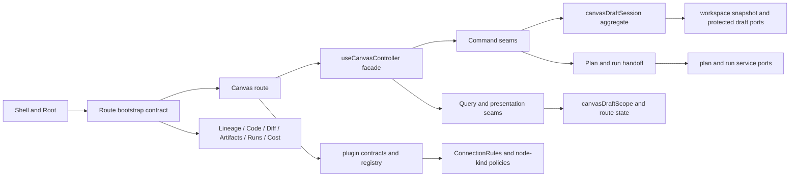
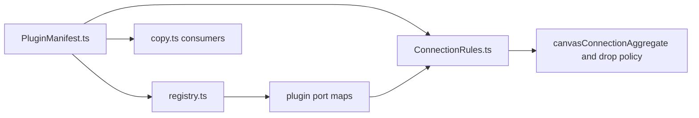

# Graph Frontend Architecture

## Purpose

The Graph surface is the bounded frontend authoring context of DVT.

Its job is to expose graph authoring, route operability, preview, and run
handoff without becoming the source of execution truth or shell truth.

## Governing Sources

- [Graph Route Bootstrap Architecture](./graph-route-bootstrap-architecture.md)
- [Canvas Controller Current To Target Architecture](./canvas-controller-current-to-target-architecture.md)
- [Canvas Component Map And Modernization Review](./canvas-component-map-and-modernization-review.md)
- [Canvas Draft Session Component](./canvas-draft-session-component.md)
- [Graph Sequences And State Machines](./graph-sequences-and-state-machines.md)
- [Frontend Fowler Implementation Pattern](../frontend-fowler-implementation-pattern.md)
- [Frontend Data Boundary Architecture](../frontend-data-boundary-architecture.md)

Reading rule:

- use this page for pack-level frontend posture
- use the controller and component docs for Canvas-local detail
- use the route-bootstrap doc for shell contract and startup rules

## Scope

In scope:

- Canvas route composition and operability
- route startup handoff from route context to shell context
- draft aggregate, scope projection, and route-local command seams
- plugin declaration boundary for graph behavior

Out of scope:

- backend persistence ownership
- planner redesign
- shell-wide navigation outside graph-facing routes

## Canonical Anchors

| Concern                     | Primary anchors                                                                                                                                                                                                                                                                                 |
| --------------------------- | ----------------------------------------------------------------------------------------------------------------------------------------------------------------------------------------------------------------------------------------------------------------------------------------------- |
| Shell handoff               | [Root.tsx](../../../../../apps/web/src/app/Root.tsx), [routes.ts](../../../../../apps/web/src/app/routes.ts), [usePublishedRouteBootstrap.ts](../../../../../apps/web/src/app/bootstrap/usePublishedRouteBootstrap.ts)                                                                          |
| Canvas route facade         | [Canvas.tsx](../../../../../apps/web/src/app/views/Canvas.tsx), [useCanvasController.ts](../../../../../apps/web/src/app/views/canvas/useCanvasController.ts), [canvasRouteViewState.ts](../../../../../apps/web/src/app/views/canvas/canvasRouteViewState.ts)                                  |
| Draft authoring core        | [canvasDraftSession.ts](../../../../../apps/web/src/app/views/canvas/canvasDraftSession.ts), [canvasDraftScope.ts](../../../../../apps/web/src/app/views/canvas/canvasDraftScope.ts), [canvasInteractionCommands.ts](../../../../../apps/web/src/app/views/canvas/canvasInteractionCommands.ts) |
| Plugin boundary             | [PluginManifest.ts](../../../../../apps/web/src/app/plugins/contracts/PluginManifest.ts), [ConnectionRules.ts](../../../../../apps/web/src/app/plugins/contracts/ConnectionRules.ts), [registry.ts](../../../../../apps/web/src/app/plugins/registry.ts)                                        |
| Route copy and presentation | [copy.ts](../../../../../apps/web/src/app/views/canvas/copy.ts), [CanvasToolbar.tsx](../../../../../apps/web/src/app/views/canvas/CanvasToolbar.tsx), [canvasExecutionState.ts](../../../../../apps/web/src/app/views/canvas/canvasExecutionState.ts)                                           |

## Frontend Topology

Current posture:

- shell startup is contract-driven, not pathname-driven
- Canvas owns authoring truth, not execution truth
- command and query seams are becoming explicit instead of widget-driven
- plugin declarations are separated from runtime composition and policy

## Current Architecture Point

As of 2026-04-21:

- route startup is generalized by `route.id` plus explicit bootstrap metadata
- Canvas working-set mutation flows through one local command catalog
- edge admission and node-drop policy live behind narrow pure policy seams
- connection and transformation validation stay typed until presentation
- route-visible operator copy is centralized instead of repeated across handlers

## Plugin Contract Boundary

`PluginManifest.ts` is the canonical declaration contract for graph-facing
plugins.

| Module               | Owns                                                                 | Must not own                                |
| -------------------- | -------------------------------------------------------------------- | ------------------------------------------- |
| `PluginManifest.ts`  | vocabulary, contribution DTOs, node-kind and connection declarations | runtime composition, graph-policy execution |
| `registry.ts`        | static plugin composition, availability filtering, port maps         | declaration semantics                       |
| `ConnectionRules.ts` | graph-policy evaluation over manifest declarations                   | plugin registration and route copy          |
| `copy.ts`            | locale-resolved operator copy                                        | plugin declaration semantics                |

Reading rule:

- ask `PluginManifest.ts` what a plugin may declare
- ask `registry.ts` which plugins are active
- ask `ConnectionRules.ts` how those declarations affect graph semantics

## Architecture Pack

Recommended reading order:

1. [Graph Route Bootstrap Architecture](./graph-route-bootstrap-architecture.md)
2. [Canvas Controller Current To Target Architecture](./canvas-controller-current-to-target-architecture.md)
3. [Canvas Component Map And Modernization Review](./canvas-component-map-and-modernization-review.md)
4. [Canvas Draft Session Component](./canvas-draft-session-component.md)
5. [Graph Sequences And State Machines](./graph-sequences-and-state-machines.md)
6. [Graph Canvas Runtime Model](./graph-canvas-runtime-model.md)
7. [Graph Decision Rationale And Patterns](./graph-decision-rationale-and-patterns.md)

## Evolution Direction

Near-term:

- finish the TF-E2 authoring lifecycle under one draft authority
- keep shared write semantics inside command seams, not adapter hooks
- keep route startup explicit for every graph-adjacent route
- close proof and operability coverage for the graph pack

Long-term:

- Graph remains one bounded frontend authoring context
- the authoring core follows DDD plus tactical CQRS plus hexagonal layering
- the route edge remains Fowler-compatible through explicit facades and
  presentation models
- the shell consumes graph route contracts but does not own graph domain rules

## Related Pages

- [Graph Architecture Docs](./index.md)
- [web component](../index.md)
- [UX Implementation Guide](../ux-implementation-guide.md)
- [System Delivery Status](../../../../system-delivery-status.md)
